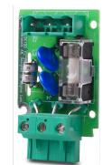

# PRODUKTBLAD - STRÖMFÖRSÖRJNING FRÅN MILLETEKNIK

| Namn     | Artikelnummer | E-nummer |
|----------|---------------|----------|
| Åskskydd | T-SPD L       | 5270098  |

Produktbild

# Benämning

T-SPD L - åskskydd.

Användningsområde

Åskskydd, T-SPD L är ett tillval som skyddar batteribackup mot åsk- / överspänningsskydd.

Spänning, ström och effekt

Spänning in: 27,3 V DC, (24 V).

Kontinuerlig AC-spänning fas - PE: 275 V

Begränsningsspänning fas - PE: 700 V

Begränsningsspänning neutral - PE: 700 V

Energi 2 ms: 71 J

Strömpuls 8 / 20us: 4500 A

Spänning vid 1mA fas - PE: 430 V DC

Larm

Larmfunktioner saknas.

Säkringar

T2,5H250

Vikt

| Namn    | Nettovikt | Vikt m förp. |
|---------|-----------|--------------|
| T SPD L | 0,1 kg    | 0,2 kg       |

Installationskrav

Produkten skall installeras i kompatibel produkt från Milleteknik.

| Tillvalet passar i   |                        |                                                                                                                        |
|----------------------|------------------------|------------------------------------------------------------------------------------------------------------------------|
| Pro duktse rie | Kapslings storlek   | Kommentar                                                                                                              |
| ECO                  | M, FLX S               | Kortet får inte fysiskt plats i S-kapslingen.                                                                       |
| NEO                  | FLX S, FLX M, FLX L | -                                                                                                                      |
| NOVA                 | FLX S, FLX M, FLX L | Kortet är inte samcertiferat med batteribackup och kan inte användas om system skall upprätthålla certifikat. |
| EN54                 | FLX M                  | Kortet är inte samcertiferat med batteribackup och kan inte användas om system skall upprätthålla certifikat. |
| PoE                  | M, FLX S, FLX M     | -                                                                                                                      |

## Krav som produkten uppfyller

| EMC:  | EMC Direktivet 2014/30EU                                                                                                |
|-------|-------------------------------------------------------------------------------------------------------------------------|
| El:   | Lågspänningsdirektivet: 2014/35/EU                                                                                      |
| CE:   | CE direktivet enligt:765/2008                                                                                           |
| Miljö | REACH Regulation: Directive 1907/2006, WEEE Regulation: Directive 20021961E, RoHS Regula tion: Directive 2015/863 |
|       |                                                                                                                         |

### Garanti

Produkten har två års garanti för tillverkningsfel.

Tillverkning, livslängd, miljöpåverkan och återvinning

Tillverkad av Milleteknik i Partille, Sverige.

Produkten konstrueras för lång livslängd vilket minskar miljöpåverkan. Uttjänta produkter lämnas till närmaste återvinningscentral.

### Om dessa uppgifter

Alla uppgifter publiceras med reservation för eventuella fel. Uppdateras utan föregående meddelande.