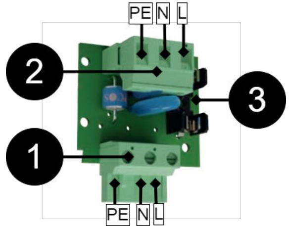

# OM

Åskskydd, T-SPD L, är ett kretskort med funktionen åsk- / överspänningsskydd. Kortet monteras i serie med inkommande elnätets matning. Vid onaturligt hög spänning på matningen, leds spänningen ner i denna i skyddsjord och glassäkringenlöser ut. T-SPD L skyddar komponenter i batteribackupen och säkerställer därmed hög driftsäkerhet.

## Montering och inkoppling

Koppla Fas, Noll och Jord som bilden visar.

| Nr | Förklaring                                |  |
|----|-------------------------------------------|--|
| 1  | Plint som möter moderkort i batteribackup |  |
| 2  | Plint för inkommande elnät.               |  |
| 3  | Säkring                                   |  |

**Varning** Korsa inte kablar - risk för skada på utrustning.

#### Tekniska data

|  | Artikelnummer                     | T-SPD-L                                                                   |
|--|-----------------------------------|---------------------------------------------------------------------------|
|  | Produkbeskrivning                 | Åskskydd och överspänningsskydd, ansluts påmoder kortets 230 V ingång. |
|  | Mått                              | 28 x 58 x 36 mm                                                           |
|  | Egenförbrukning                   | N/A                                                                       |
|  | Spänning, in                      | 27,3 V DC                                                                 |
|  | Kontinuerlig AC-spänning fas - PE | 275 V                                                                     |
|  | Begränsningsspänning fas - PE     | 700 V                                                                     |
|  | Begränsningsspänning neutral - PE | 700 V                                                                     |
|  | Energi 2 ms                       | 71 J                                                                      |
|  | Strömpuls 8 / 20us                | 4500 A                                                                    |
|  | Spänning vid 1mA fas - PE         | 430 V DC                                                                  |
|  | Säkring:                          | T2.5H250                                                                  |

| Tekniska data                      |                                                                                                                                                                                                                                                               |  |
|------------------------------------|---------------------------------------------------------------------------------------------------------------------------------------------------------------------------------------------------------------------------------------------------------------|--|
| Rekommenderad miljö                | Miljöklass 1, Inomhus, 20% ~ 90% relativ fuktighet                                                                                                                                                                                                            |  |
| Produkterna möter kraven enligt | EMC Directive 2014/30EU, Low Voltage directive: 2014/35/EU CE directive according to 765/2008, Emis sion: EN61000-6-:2001, EN55022:1998:-A1:2000, A2:2003 Klass B, EN61000-3-2:2001. Immunity: EN61000-6-2:2005, EN61000-4-2, -3, 4, -5, -6, -11. |  |
| Garanti                            | 2 år                                                                                                                                                                                                                                                          |  |
| Tillverkare                        | Milleteknik AB                                                                                                                                                                                                                                                |  |
| Ursprungsland                      | Sverige                                                                                                                                                                                                                                                       |  |

Manualens artikelnummer: 350-020

Detta dokument kan ändras utan föregående meddelande.

Alla uppgifter publiceras med reservation för tryckfel.

### Adress och kontaktuppgifter

Milleteknik AB Ögärdesvägen 8 B 433 30 Partille 031-340 02 30

www.milleteknik.se

# ABOUT

Lightning protection, T-SPD L, is a circuit board with the lightning / surge protection function. The card is mounted in series with the incoming mains supply. In the event of an unnaturally high voltage on the supply, the voltage is led down into the protective ground and the glass fuse trips. T-SPD L protects components in the battery backup and thus ensures high operational reliability.

## Installation and connection

Connect Phase, Neutral and Ground as the picture shows.

| No | Explanation                                       |  |
|----|---------------------------------------------------|--|
| 1  | Terminal that meets motherboard in battery backup |  |
| 2  | Terminal for incoming mains.                      |  |
| 3  | Fuse                                              |  |

**Warning**

Do not cross cables - risk of equipment damage.

### Technical data

| Item number                      | T-SPD-L                                                                                 |
|----------------------------------|-----------------------------------------------------------------------------------------|
| Product description              | Lightning protection and surge protection, connect to the motherboard's 230 V input. |
| Measure                          | 28 x 58 x 36 mm                                                                         |
| Card consumption                 | N/A                                                                                     |
| Tension, in                      | 27.3V DC                                                                                |
| Continuous AC voltage phase - PE | 275 V                                                                                   |
| Limiting voltage phase - PE      | 700V                                                                                    |
| Limiting voltage neutral - PE    | 700V                                                                                    |
| Energy 2 ms                      | 71 J                                                                                    |
| Current pulse 8 / 20us           | 4500 A                                                                                  |
| Voltage at 1mA phase - PE        | 430V DC                                                                                 |
| Fuse:                            | T2.5H250                                                                                |
|                                  |                                                                                         |

|                                                     | Technical data                                                                                                                                                                                                                                                 |
|-----------------------------------------------------|----------------------------------------------------------------------------------------------------------------------------------------------------------------------------------------------------------------------------------------------------------------|
| Recommended environment                             | Environmental class 1, Indoor, 20% ~ 90% relative humidity                                                                                                                                                                                                     |
| The products meet the re quirements according to | EMC Directive 2014/30EU, Low Voltage directive: 2014/35/EU CE directive according to 765/2008, Emis sion: EN61000-6-:2001, EN55022:1998:-A1:2000, A2:2003 Class B, EN61000-3 -2:2001. Immunity: EN61000-6-2:2005, EN61000-4-2, -3, 4, -5, -6, -11. |
| Guarantee                                           | 2 years                                                                                                                                                                                                                                                        |
| Manufacturer                                        | Milleteknik AB                                                                                                                                                                                                                                                 |
| Country of origin                                   | Sweden                                                                                                                                                                                                                                                         |

Manual article number: 350-020

This document is subject to change without notice.

All information is published subject to typographical errors.

# Address and contact details

Milleteknik AB Ögärdesvägen 8 B S-433 30 Partille +46 31 340 02 30