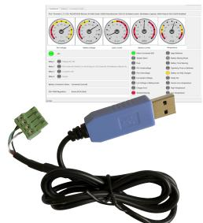
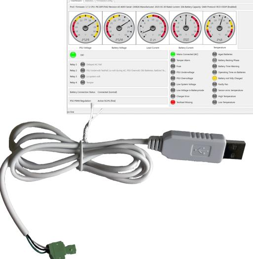

# PRODUKTBLAD - STRÖMFÖRSÖRJNING FRÅN MILLETEKNIK

#### Namn, artikelnummer och e-nummer

| Namn                   | Artikelnummer       | E-nummer  |
|------------------------|---------------------|-----------|
| Power Watch         | A-OT0000UPG02P2V3P3 | 52 137 06 |
| Power Watch RACK | A-OT0000UPG03P2V3P3 | 52 137 07 |

# Produktbild

## Benämning

PowerWatch är en mjukvara, med tillhörande adapterkabel, från Milleteknik som gör det möjligt att uppdatera mjukvara i batteribackup, läsa status, ställa vissa parametrar och statistik.

## Användningsområde

PowerWatch kan användas för att enkelt uppdatera en produkt eller för diagnostik vid dimensionering och felsökning.

## Larm

Larm som visas i batteribackup visas i Power-Watch.

Indikeringar och kommunikation

Kommunikation över adapterkablage till PC. PC behöver kunna ansluta till USB-A.

# Kapsling, utförande

Produkten monteras som tillval/tillbehör i existerande kapsling.

| Mått, höjd x bredd x djup | IP-klass |
|---------------------------|----------|
| Produkten saknar kapsling |          |

Vikt

| Namn             | Nettovikt | Vikt m förp. |
|------------------|-----------|--------------|
| PowerWatch       | 0,1 kg    | 0,1 kg       |
| PowerWatch RS485 | 0,1 kg    | 0,1 kg       |

# Installationskrav

Batteribackup med PRO1-, PRO2- eller PRO3 kort. För mjukvara krävs Windows 7 eller senare och internetuppkoppling vid aktivering. Internetuppkopppling krävs ej vid användning.

Batteribackup med 1HE- kort. För mjukvara krävs Windows 7 eller senare och internetuppkoppling vid aktivering. Internetuppkopppling krävs ej vid användning.

#### Krav som produkten uppfyller

| EMC:  | EMC Direktivet 2014/30EU                                                                                                |
|-------|-------------------------------------------------------------------------------------------------------------------------|
| El:   | Lågspänningsdirektivet: 2014/35/EU                                                                                      |
| CE:   | CE direktivet enligt:765/2008                                                                                           |
| Miljö | REACH Regulation: Directive 1907/2006, WEEE Regulation: Directive 20021961E, RoHS Regula tion: Directive 2015/863 |
|       |                                                                                                                         |

## Begränsningar

Firmware: Uppdatering kan endast göras till samma kommunikationsprotokoll. Det går alltså inte att uppdatera till ett annat kommunikationsprotokoll. Konfiguration: Det går bara att uppdatera till samma enhetstyp, ström, spänning. All mjukvara används på egen risk. Mjukvara omfattas inte av garanti. Felaktigt användande kan resultera i obrukbar produkt. Garanti gäller inte för fel som uppstår i samband med felaktigt utnyttjande av mjukvara. Det är alltid Milleteknik som avgör om eventuella fel och eller skador som uppkommer i samband med användande av mjukvara skall omfattas av garanti eller kan ersättas.

Det går att ställa batterikapacietet men det är inte möjligt inte att ändra på typ av produkt utan produkten är vad märkskylten anger. Exempel: byter du batterier från 14 Ah batterier till 20 Ah batterier i en NOVA 24V 15A FLX M så ställer du ny batterikapaciet. Det går aldrig att ändra spänning, amperetal på last eller kommunikationsprotokoll.

## Garanti

Adapterkablage har två års garanti. Mjukvara har inte garanti.

Tillverkning, livslängd, miljöpåverkan och återvinning

Tillverkad av Milleteknik i Partille, Sverige.

## Länk till senaste informationen

Produkter är föremål för uppdateringar, du hittar alltid den senaste informationen på [www.milletek](https://www.milleteknik.se/)[nik.se.](https://www.milleteknik.se/)

## [PowerWatch](https://www.milleteknik.se/powerwatch/)

#### Om dessa uppgifter

Alla uppgifter publiceras med reservation för eventuella fel. Uppdateras utan föregående meddelande.