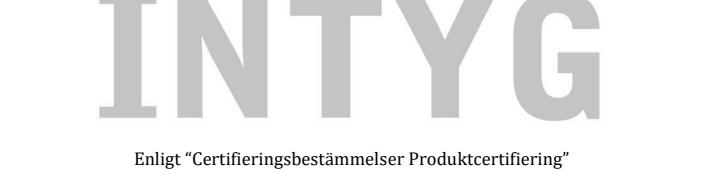
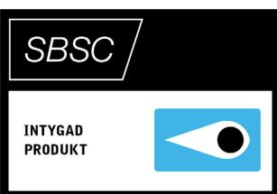

## Nr 20-117

Svensk Brand- och Säkerhetscertifiering AB, Tegeluddsvägen 100, 115 28 Stockholm, Sweden

Strömförsörjningsutrustning NOVA 27 50-FLX S • NOVA 27 100-FLX S • NOVA 27 50- FLX M • NOVA 27 100-FLX M • NOVA 27 150-FLX M • NOVA 27 250-FLX M • NOVA 27 50-FLX L • NOVA 27 100- FLX L • NOVA 27 150-FLX L • NOVA 27 250-FLX L

> uppfyller kraven i Larmklass 4 enligt SSF 1014, utgåva 5

> > Intygsinnehavare är

Milleteknik AB Ögärdesvägen 8B , Partille

Intyget gäller 2020-03-09 till och med 2025-03-08

Stockholm den 2020-03-09

Mårten Wallén Verkställande direktör

