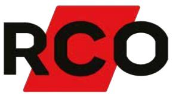
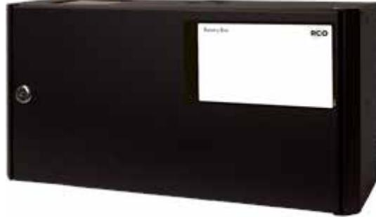
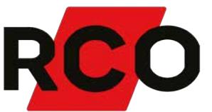

## BT-BOX FLX SMALL

Artikelnummer: 28160160, E-nummer: 5257453

För utbyggnad av 24V RCO FLX S Batteribackuper för att erhålla möjlighet till längre reservdrifttid alt. högre medellast i en klassad anläggning.

- •Plats för 4 st. 14Ah batterier
- •Snabbanslutningskabel
- •Larmklass 3/4

Ansluts enkelt till huvudenheten via en snabbanslutningskabel. Max. 2 st. batteriboxar kan anslutas till BT-FLX S-serien.

Batterilåda BT-Box FLX S kan användas tillsammans med:

- •BT-5 FLX S
- •BT-10 FLX S

## Möjliga medellaster:

- Larmklass 1-2: •
	- 1x BT-Box FLX S inkl. 1x (tillval) BT-5 FLX S: 3,4A
		- 2x BT-Box FLX S inkl. 1x (tillval) BT-10 FLX S: 5,7A
- Larmklass 3-4: •

1x BT-Box FLX S inkl. 1x (tillval) BT-5 FLX S: 1,4A 2x BT-Box FLX S inkl. 1x (tillval) BT-10 FLX S: 2,3A

| Utförande:                  | Svart                              |
|-----------------------------|------------------------------------|
| Miljöklass:                 | Klass 1                            |
| Kapslingsklassning:         | IP32                               |
| Temperaturområde:           | 5 °C - 40 °C (optimalt 15 - 20 °C) |
| Montering:                  | Under aggregaten                   |
| Mått (BxHxD):               | 215x430x220mm                      |
| Vikt:                       | 3kg                                |
| Antal kabelgenomföringar:   | 9 st                               |
| Inbygd fläkt:               | Yes                                |
| Utgångsspänning:            | 27,3VDC                            |
| Batterikombination:         | 4x 7,2Ah / 4x 14Ah                 |
| Batterityp:                 | 12V AGM-batteri                    |
| SBSC Certifierad:           | SSF 1014 Larmklass 3/4             |
| Benämning producent (SBSC): | Batterybox 24V-XS2                 |