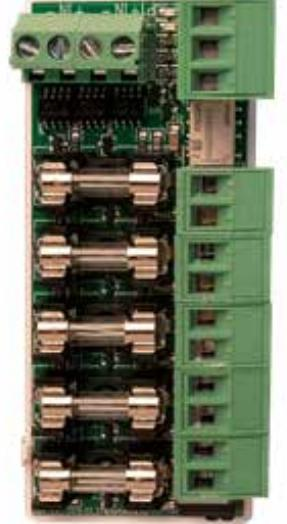

BT-FUSE-5

Artikelnummer: 28160194, E-nummer: 6310037

BT Fuse 5 är ett avsäkringskort 5 utgångar. 5 st 1-poligt avsäkrade utgångar som standard med F2A.

Max. totalström är 10A. Kan användas till alla batteribackupper upp till 10A.

Larm för utlöst lastsäkring via växlande larmrelä. Jackas kortet på moderkortet i BT-FLX SMALL, M/L fås larmet för utlöst lastsäkring via R-CARD M5. Dubbla ingångar förenklar vid service (endast om kortet jackas).

| Miljöklass:                 | MIljöklass 1    |
|-----------------------------|-----------------|
| Temperaturområde:           | 5 °C - 40 °C    |
| Mått (BxHxD):               | 30x40x89mm      |
| Utgångsspänning:            | 24V             |
| Benämning producent (SBSC): | 5 output module |