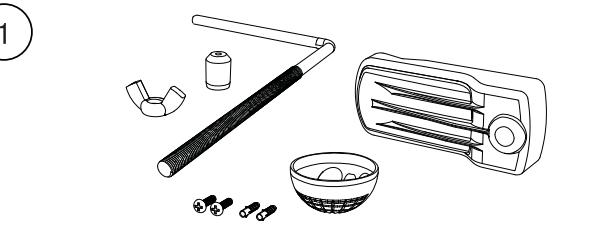

# Uso previsto del prodotto

Specifica

Si prega di leggere interamente le istruzioni prima di utilizzare il prodotto. Questo prodotto deve essere utilizzato come luce di sicurezza con sensore di movimento cordless, come indicato nell istruzioni

·

•

• Per uso interno ed esterno

Opzioni multiple di montaggio

| Tensione di esercizio                   | 4.5V                                                             | 4.5V                                                             |
|-----------------------------------------|------------------------------------------------------------------|------------------------------------------------------------------|
| Wattagqio massimo                       | 1.0W                                                             | 1.0W                                                             |
| Batterie                                | 3 x AA                                                           | 3 x AA                                                           |
| Lumen                                   | 60 Im                                                            | 120 İm                                                           |
| Temperatura di esercizio                | Da -20°C fino a +50°C                                            | Da -20°C fino a +50°C                                            |
| Classificazione IP                      | Ib 55                                                            | Ib 55                                                            |
| Sensore                                 | Rilevamento automatico con sensore fotografico e di movimento | Rilevamento automatico con sensore fotografico e di movimento |
| Intervallo di rilevamento de sensore | 8 metri e 110 gradi                                              | 8 metri e 110 gradi                                              |
| Modalità Juminose                       | On / Off / Auto                                                  | On / Off / Auto                                                  |
| Temno di rilevamento                    | Modalità automatica: 10 secondi                                  | Modalità automatica: 10 secondi                                  |

#### Caratteristiche del prodotto

- · Luce LED di sicurezza cordless a sensore
- Pulsante di rilascio automatico per una facile
- sostituzione della batteria Regolazione orizzontale e verticale della luce
- •
- 1 La confezione include
- Luce a sensore cordless GP SafeGuarc
- 3 batterie alcaline Ultra GP15AU 1,5 V
- Accessori per l'installazione
- Angolare, morsetto terminale, maschere sensore, viti, tasselli, coperchio per angolare e gallette
- 2 Installazione del prodotto
- 2.1 Metodo 1: Installazione permanent
- 2.1a Spingere il pulsante di blocco in posizione 'OPEN' (aperto) su SafeGuard.
- 2.1b Staccare la piastra di montaggio a parete dalla base di SafeGuard
- 2.1c Usare la piastra di montaggio a parete come dima e contrassegnare la posizione delle viti. 2.1d Praticare dei fori e inserirvi i tasselli (se necessario). Fissare la piastra di montaggio a parete
- con le viti
- 2 1e Riagganciare SafeGuard a la piastra di montaggi
- 2.1f Spingere il pulsante di blocco sulla posizione 'CLOSE' (chiuso)

#### 2.2 Metodo 2: Installazione amovibile quando il Metodo 1 non è fattibile

- 2.2a Inserire l'angolare nella base di SafeGuard.
- 2.2b Posizionare SafeGuard su un trave o una struttura simile.

2.2c Inserire il morsetto terminale attraverso l'angolare e stringere il galletto per fissare SafeGuard 2.2d Spingere il coperchio dell'angolare sull'estremità di quest'ultimo 2.2e Lo spessore del trave deve essere di almeno 4,5 cm

- 3 Installazione della batteria
- 4 Regolazioni dell'angolazione

# 5 Istruzioni operative

#### 5a Modalità luminose

- ON
- OFF : SafeGuard è spento
- AUTO : SafeGuard si attiva quando rileva un movimento, dal tramonto all'alba. Si accende per circa 10 secondi a meno che non continui a rilevare moviment

#### 5b Area di rilevamento del movimento

L'area di rilevamento del movimento del sensore può essere ridotta coprendo il sensore corn un'apposita maschera.

#### Attenzione

- 1
- Istruzioni di sicurezza
- Mantenere il prodotto in un luogo sicuro, lontano dai bambini picole. Questo prodot
adatto ai bambini e le istuzioni estudio somente per evitare lesioni.
1 Non usare in a
- Non immergere in liquidi, incenerire né sm
Non cortocircuitare il prodotto in alcun mo

#### Manutenzione e riparazione

- 1
- 
- 
- 
- Non utilizzare insieme batterie nuove e batterie scariche o parzialmente usate.
Se il prodotto non viene utilizzato per un periodo di tempo prolungato, rimuovere le batterie

Lees de handleiding in zijn geheel door alvorens u het product gaat gebruiken. Dit product is edoeld om te gebruiken als een draadloze veiligheidslamp met bewegingssenso

#### J RF1 1 J RF2.1 Specificaties Voltage 4.5V 4 5V Maximum wattage 1.0W 1.0W Batterijen 3 x AA 3 x AA 60 İm 120 Im Lumen Gebruikstemperatuur -20°C tot +50°C -20°C tot +50°C IP waardering IP 55 IP 55 Automatische
bewegingsdetectie Automatische bewegingsdetectie Sensor Sensor detectiebereik 8 meter & 110 grader 8 meter & 110 grade Licht modi Aan / Uit / Auto Aan / Uit / Auto Detectietijd Auto modus: 10 seconden Auto modus: 10 seconder

#### Product kenmerken

- Draadloze LED veiligheidslamp met
- beweainassensor
	- Gemakkelijk en snel batterijen vervangen Permanente of tijdelijke bevestiging •
	- middels de "quick release button" Horizontaal en verticaal te verstellen lichtrichting
	- · Verstelbare sensorhoek

#### 1 In de verpakking · GP SafeGuard draadloze sensorlamp

- •
- · Montagemateriaal

# - L-staaf, eindklem, sensor maskers, schroeven, pluggen, L-staaf dop en vleugelmoe

Werkt op batterijen

· Gemakkeliik te installeren

# 2 Productmontage

- 2.1 Methode 1: Permanente installatie 2.1a Druk de afsluitknop in de OPEN positie
- 2 1b Haal de bevestingsplaat los van de acherkant van de SafeGuard
- 2.1c Gebruik de bevestigingsplaat als mal en markeer de locaties voor de schroeven
- 2.1d Boor gaten en breng de pluggen in (indien nodig). Monteer de bevestigingsplaat met de schroeven. 2.1e Herbevestig de SafeGuard op de bevestigingsplaa
- 2.1f Druk de afsluitknop in de CLOSE positie

### 2.2 Methode 2: Tijdelijke installatie als method 1 niet haalbaar of wenselijk is

- 2.2a Haal de L-staaf door het gat in de achterziide van de SafeGuard
- 2.2b Plaats de SafeGuard op een paal of vergelijkbaar object
- 2.2c Schuif de eindklem aan de L-staaf en draai vast door midddel van de vleugelmoer 2.2d Druk de dop op het uiteinde van de L-staaf
- 2.2e De paal of balk moet een dikte hebben van minimal 4,5 cm

#### 3 Plaatsen van de batterijer

- 4 Verstellen van de hoek
- 5 Gebruiksinstructies

# 5a Licht modi

- ON (Aan) : SafeGuard brand permanent
- OFF (Uit) : SafeGuard staat uit
- ALITO : SafeGuard activeert wanneer beweging wordt gedetecteerd tussen zonsondergang en zonsopgang. Blijft gedurende 10 seconden branden (AUTO) gaat opnieuw aan als er nog steeds beweging wordt gedetecteerd.

#### 5b Sensorbereik

Het sensorbereik kan gereduceerd worden door de sensor gedeeltelijk aft e dekken met het masker

#### Let op

- De PIB sensor detecteert vera r detecteert veranderingen i
o de reactie van de sensor kan nebben op de feache van de School
 Plaatsing van de SafeGuard te dicht bij een hele felle lichtbron kan de sensor beïnvloed.
 De SafeGuard is het meest gevoelig als mens
# Veiligheidsinstructies

- Bevar et broom en en en en en en en en en sink leine onderden niet in Dit product is
niet geschit voor kinden meten stilt topevolg worden am letsel to vorkomen.
1 1 Beruik n
#### Adviezen voor onderhoud en beware

- 
- 
- 
- 
- 

Tiltenkt bruk av produktet

Vennligst les alle instruksjonene før du bruker produktet. Dette produktet skal brukes som et trådløst sikkerhetslys med bevegelsess ensor som angitt i instruksjonene

| Spesifikasjone |  |  |
|----------------|--|--|
|----------------|--|--|

| avvullinuv vilvi               |                                                     |                                                     |
|--------------------------------|-----------------------------------------------------|-----------------------------------------------------|
| Driftsspenning                 | 4,5V                                                | 4,5V                                                |
| Maksimalt wattforbruk          | 1,0W                                                | 1.0W                                                |
| Batterier                      | 3 x AA                                              | 3 x AA                                              |
| Lumen                          | 60 Im                                               | 120 İm                                              |
| Driftstemperatur               | -20°C til +50°C                                     | -20°C til +50°C                                     |
| IP-klassifisering              | Ib 25                                               | Ib 25                                               |
| Sensor                         | Automatisk bevegelses- og fotosensorregistrerina | Automatisk bevegelses- og fotosensorregistrering |
| Registreringsområde for sensor | 8 meter og 110 grader                               | 8 meter og 110 grader                               |
| Lysmoduser                     | På/Av/Auto                                          | På/Av/Auto                                          |
| Registrerinastid               | Automodus: 10 sekunder                              | Automodus: 10 sekunder                              |

# Produktfunksjoner:

- Trådløst trygghets- og sikkerhets-LED-lys med sensor
- . Enkelt og raskt å installere Hurtigutløsningsknapp for enkel utskiftning
	- · For bruk innendørs og utendørs

Batteridrevet

- av batteri Horisontal og vertikal lysjustering
- Justerbar sensorvinkel
- 1 Pakken inneholder
- GP SafeGuard trådløst sensorlys
- •
- L-krok, endeklemme, sensormasker, skruer, veggplugger, hette til L-krok og vingemutter

# 2 Produktinstallasjon

- 2.1 Metode 1: Permanent installasjon
- 2.1a Trykk låseknappen til «OPEN»-stilling på SafeGuard.
- 2.1b Løsne vegamonteringsplaten fra bunnen på SafeGuard.
- 2.1c Bruk veggmonteringsplaten som en mal til å merke av plasseringen av skruene.
- 2.1d Bor hull og sett inn veggplugger (etter behov). Fest veggmonteringsplaten med skruene 2.1e Fest SafeGuard på monteringsplaten på nytt
- 2. 1f Trykk låseknappen til «CLOSE»-stilling
- 

#### 2.2 Metode 2: Flyttbar installasjon når Metode 1 ikke er muligt 2 2a. Sett inn I -kroken i basen til SafeGuard

- 2.2b Plasser SafeGuard på en bielke eller en liknende gjenstand
- 2.2c Sett inn endeklemmen gjennom L-kroken og stram til vinqemutteren for å sikre
- SafeGuard 2.2d Trykk hetten til L-kroken på enden av L-kroken
- 2.2e Tykkelsen på bjelken må være minst 4,5 cm

#### 3 Batteriinstallasjon

- 4 Vinkeliusteringer
# 5 Driftsinstruksjoner

- 5a Lysmoduser
- ON (PÅ)
- OFF (AV) : SafeGuard er slått av
- AUTO (AUTO): SafeGuard aktiveres når bevegelse registreres fra solnedgang til soloppgang Slår seg på i ca. ti sekunder hvis den ikke fortsetter å registrere bevegelser

### 5b Registreringsområde for sensor

- Registreringsområde for sensor kan reduseres ved å dekke til sensoren med en sensormask
- PlR-sensorer registrerer endringer i infrarødt lys (varme) derfor kan omgivelsere kan omgivelser
Plassering av Safeguard for nært sterkt lys fra omgivelsene kan påvirke so Sikkerhetsinstruksione Dpbevar produktet på et trygt stød, utligjengelig for barn. Små deler må ikke svelges. Dette produk
parn, og instruksjonene ber å unngå skade.
 Må ikke brukes i eksplosj
#### Vedlikehold og reparasjon

- Ikke forsek å modifisere eller repares produktet. Alle reparsoner må utføres av autorisert prsonell.
 Bruk riktige batterier for data i akalskefikke-oppladbare batterier opp
- 
- 
- Batteriene må ikke kortsluttes
Bruk ikke nye batterier med delvis brukte eller utladede batterier
Hvis produktet ikke blir brukt i en lengre tidsperiode, må batterien
Kast b
- 

# Produktens avsedda användning

Läs hela handboken innan du börjar använda produkt är avsedd att användas som en trådlös rörelsesensor med säkert ljus enligt anvisningarna.

| Driftspänning                  | 4.5 V                                                    | 4.5 V                                                    |
|--------------------------------|----------------------------------------------------------|----------------------------------------------------------|
| Max effekt (W)                 | 1,0W                                                     | 1.0W                                                     |
| Batterier                      | 3 x AA                                                   | 3 x AA                                                   |
| Lumen                          | 60 Im                                                    | 120 İm                                                   |
| Drifttemperatur                | -20 °C till +50 °C                                       | -20 °C till +50 °C                                       |
| IP-klass                       | Ib 55                                                    | Ib 55                                                    |
| Sensor                         | Automatisk sensor för detektering av röre se och bild | Automatisk sensor för detektering av rörelse och bild |
| Sensorns detekteringsområde | 8 meter, 110 grader                                      | 8 meter, 110 grader                                      |
| Ljuslägen                      | På/Av/Auto                                               | På/Av/Auto                                               |
| Detekteringstid                | Autoläge: 10 sekunder                                    | Autoläge: 10 sekunder                                    |

#### Produktegenskaper

Specifikation

- Trådlös LED-sensorlampa för trygghet och
- säkerhet
- Snabbknapp för batteribyte •
- · Justerbar sensorvinkel
- 
- 1 Förpackningens innehåll · GP SafeGuard trådlös sensorlampa
- · 3 x GP15AU 1,5 V Ultra Alkaline-batteri
- Tillbehör för montering - L-stång med ändklämma, vingmutter och ändskydd, sensormaskering, skruvar betongpluggar
- 2
- 2.1 Metod 1: Permanent montering
- 2.1a Skjut låsknappen till läget "OPEN" på SafeGuard
- 2.1b Lossa plåten för väggmontering från SafeGuards sockel.
- 2.1c Använd plåten för väggmontering som mall och märk ut placeringen av fästskruvarna 2.1d Borra hålen och sätt i betongpluggarna (om sådana behövs). Sätt fast plåten för
- väggmontering med fästskruvarna
- 2.1e Sätt tillbaka SafeGuard på monteringsplåte
- 2.1f Skjut låsknappen till läget "CLOSE"

#### 2.2 Metod 2: Flyttbar montering när Metod 1 inte är lämplig

- 2.2a För in L-stången i SafeGuards sockel
- 2.2b Placera SafeGuard på en stolpe eller annat lämpligt fäste
- 2.2c Träd på ändklämman på L-stångens gängade del och skruva sedan på vingmuttern. Dra åt vingmuttern så att SafeGuard sitter ordentligt fast
- 2 2d Tryck på L-stångens ändskydd utanför vingmuttern
- 2.2e Stolpens tjocklek måste vara minst 4,5 cm

### 3 Insättning av batteri

- 4 Justering av vinkel
- 5 Användarinstruktioner

#### 5a Lius-lägen

- on (På) : SafeGuard är permanent PÅ
- : SafeGuard stängs av OFF (AV)
- AUTO (AUTO) : SafeGuard aktiveras när en rörelse detekteras från skymning till gryning. Inaktiveras efter cirka 10 sekunder om inte rörelser fortsätter detekteras under tiden
- 5b Sensorns detekteringsområde
- Sensorns detekteringsområde kan begränsas genom att sensorn delvis täcks med en mask

Obs!

nsorer detekterar ändringar i det infraröda ljuset (värme). Därför kan omg
feGuard placeras alltför nära starka ljuskällor (värmekällor) kan detta pår m SafeGuard placeras alltför nära star
afeGuard är mest känslig när personer

# Säkerhetsinstruktioner

- örvara produkten på säker plats utom räckhåll för barn. Svälj inga små delar. Denna produkt är inte l nstruktionerna måste noga föjas för att undvika skador
Får inte användas i explosiva miljöer eller andra områden där det kan finnas flyktiga gase
Produkten får inte sänkas i
- 

# Underhåll och reparationer

- Försök inte ändra eller reparer produkten. Alla reparationer måste utföras av auktoingar
 Använd rätt batteriar i produkten. Blanda inte olikaliska ladoingar
 Förvara bat
- 
- 
- Kortslut aldrig batterierna.
Använd aldrig nya batterier tillsammans med delvis eller helt unladdade batterierna tas ur
Om produkten inte ska användas under en längre tid ska
- 

# Instruction Manual RF1.1 and RF2.1

- Flera alternativ för montering • Kan användas både inomhus oc
	-

•

utomhus

# Intended Use of Product

Please read the full instructions before operating the product. This product is to be used as a cordless motion sensor safety light as directed by the instructions.

Battery operated

•

·

| Operating voltage      | 4 5V                                         | 4 5V                                         |
|------------------------|----------------------------------------------|----------------------------------------------|
| Maximum wattage        | 1 OW                                         | 1 OW                                         |
| Batteries              | 3 x AA                                       | 3 x AA                                       |
| Lumens                 | 60 Im                                        | 120 İm                                       |
| Operating temperature  | -20°C to +50°C                               | -20°C to +50°C                               |
| IP rating              | Ib 55                                        | IP 55                                        |
| Sensor                 | Automatic motion & Photo sensor detection | Automatic motion & Photo sensor detection |
| Sensor detection range | 8 meters & 110 degrees                       | 8 meters & 110 degrees                       |
| Light modes            | On / Off / Auto                              | On / Off / Auto                              |
| Detection time         | Auto mode: 10 seconds                        | Auto mode: 10 seconds                        |

### Product Features

Specification

- Cordless safety and security LED sensor light
- •
- · Horizontal and vertical light adjustment
- For use indoors and outdoor · Adiustable sensor angle
	-
- 1 Package Includes
- GP SafeGuard cordless sensor light · 3 x GP15AU 1 5V Ultra Alkaline battery
- · Accessories for installation
- L-bar, end clamp, sensor masks, screws, raw plugs, L-bar cap and wing nut
- 2 Product Installation
- 2.1 Method 1: Permanent installation
- 2.1a Push the lock button to the "OPEN" position on the SafeGuard.
- 2.1b Detach the wall mounting plate from the base of the SafeGuard
- 2.1c Use the wall mounting plate as a template and mark the location for the screws.
- 2.1d Drill holes and insert the raw plugs (if necessary). Attach the wall mounting plate with the
- screws
- 2.1e Reattach the SafeGuard on the mounting plate.
- 2.1f Push the lock button to the "CLOSE" position.
- 2.2 Method 2: Removable installation when Method 1 is not feasible
- 2.2a Insert the L-bar in the SafeGuard base.
- 2.2b Place the SafeGuard on a beam or similar object
- 2.2c Insert end clamp through the L-bar and tighten the wing nut to secure the SafeGuard.
- 2.2d Push L-bar cap on the end of the L-bar
- 2.2e The beam thickness must be a minimum of 4.5cm
- 3 Battery Installation
- 4 Angle Adjustments
- 5 Operating Instructions
- 
- 5a Light Modes
- ON : SafeGuard turned on permanently OFF : SafeGuard turned off
- AUTO : SafeGuard activates when movement is detected from dusk till dawn. Switches on for approx. 10 seconds unless it continues to detect movement
- 5b Sensor Detection Area

lensor detection area can be reduced by covering the sensor with a sensor mask

# Attention

1 PIR sensors de changes in infra-red light (heat) therefore the surrounding temp resportsivelies.
Placing the SafeGuard too close to strong ambient light may affect the sensor's response.
The SafeGuard is most sensitive when people cross its sensor's dete

#### Safety Instructions

- Keep product in safe location away from children. Do not swallow small parts. This product is not suitable for children
 and the instructions should be for the reas where th
- 

#### Maintenance and Repair

- 
- 
- 
- ove the batteries from the device the product is not being used for an extended period
ispose of batteries according to national guidelines

- Verwendungszweck des Produkts
Bitte lesen Sie die Anweisungen vollständig durch, bevor Sie das Produkt in Betrieb nehmen. Dieses Produkt ist als schnurlose Sicherheitsleuchte mit Bewegungssensor zu verwenden, wie

#### in dieser Anleitung beschrieben RF1.1 RF2.1 Spezifikation Betriebsspannung 4 5V 4 5V Maximale Wattleistung 1 0W 1.0W Batterien 3 x AA 3 x AA Lumen 60 Im 120 Im Betriebstemperatur -20°C bis +50°C -20°C bis +50°C IP-Bewertung IP 55 IP 55 utomatische Bewegungs Fotosensorerkennung atische Bewegungs-Sensor Fotosensorerkennung Sensorerfassungsbereich 8 Meter & 110 Grac 8 Meter & 110 Grad

Ein / Aus / Auto

Auto-Modus: 10 Sekunden

#### Produkteigenschaften

Lichtmodi

Erkennungszeit

- Schnurlose Sicherheits-LED-Sensorleuchte • •
- Batteriewechsel
- Horizontale und vertikale Lichteinstellung
- Außenbereichen

· Mehrere Montagemöglichkeiten

Batteriebetrieber

Ein / Aus / Auto

Auto-Modus: 10 Sekunde

# 1 Inhalt der Verpackung

- GP SafeGuard Schnurlose Sensorleuchte
- · 3 x GP15AU 1,5 V Ultra-Alkali-Batterie

•

- •
- L-Winkel, Endklemme. Sensormasken, Schrauben, Dübel, L-Winkel-Kappe und Flügelmutter

#### 2

- 2.1 Methode 1: Dauerhafte Montage
- 2.1a. Bringen Sie den Verriegelungsknopf am SafeGuard in die Position "OPEN".
- 2 1b Lösen Sie die Wandmontageplatte vom Sockel des SafeGuard 2.1c Verwenden Sie die Wandmontageplatte als Vorlage und markieren Sie die Stellen für die Schrauben.
- 2.1d Bohren Sie die Löcher und setzen Sie die Dübel ein (falls erforderlich). Befestigen Sie die Wandmontageplatte mit den Schrauben
- 2 1e Bringen Sie den SafeGuard wieder an der Wandmontageplatte an
- 2.1f Bringen Sie den Verriegelungsknopf in die Position "CLOSE".

# 2.2 Methode 2: Abnehmbare Montage, wenn Methode 1 nicht möglich ist

- 2.2a Bringen Sie den L-Winkel am Sockel des SafeGuard an
- 2.2b Platzieren Sie den SafeGuard auf einem Balken oder ähnlichen Gegenstand 2.2c Führen Sie die Endklemme durch den L-Winkel und ziehen Sie die Flügelmutter fest, um den SafeGuard zu befestigen.
- 2.2d Drücken Sie die L-Winkel-Kappe am Ende des L-Winkels fest
- 2.2e Die Balkendicke muss mindestens 4,5 cm betragen

# 3 Einlegen der Batterien

- 4 Einstellung des Winkels
# 5 Betriebsanweisungen

- 5a Lichtmodi
- · SafeGuard permanent eingeschaltet ON
- SafeGuard ausgeschaltet AUTO: SafeGuard aktiviert sich, wenn zwischen Abenddämmerung und Morgengrauen
- eine Bewegung erfasst wird. Er leuchtet ca. 10 Sekunden lang, außer er erfasst eine länger anhaltende Bewegung

# 5b Sensorerfassungsbereich

Der Sensorerfassungsbereich kann durch Abdecken des Sensors mit einer Sensormaske reduziert

|   | Vorsicht                                                                                                                                                                                                                                                                                                                                                         |
|---|------------------------------------------------------------------------------------------------------------------------------------------------------------------------------------------------------------------------------------------------------------------------------------------------------------------------------------------------------------------|
|   | PIR-Sensoren erkennen Anderungen des Infrarotlichts (Wärme). Daher kann die Umgebungstemperatur die Reaktion der Sensoren beeinflussen.                                                                                                                                                                                                                       |
| 2 | Wird der SafeGuard zu nahe an einem starken Umgebungslicht angebracht. kann dies die Reaktion des Sensors beeinträchtigen                                                                                                                                                                                                                                     |
| 3 | Der SafeGuard ist am empfindlichsten, wenn Personen seinen Sensorerfassungsbereich durchgueren,                                                                                                                                                                                                                                                                  |
|   | Sicherheitshinweise                                                                                                                                                                                                                                                                                                                                              |
|   | Verwahren Sie das Produkt an einem sicheren Ort, außerhalb der Reichweite von Kindern. Vorsicht von dem Verschlucken von Kleinteilen. Dieses Produkt eianet sich nicht für Kinder und die Anweisungen strikt befolgt werden, um Vermeid Nicht in explosionsgefährdeten Umgebungen oder anderen Bereichen, in denen es flüchtine Gase geben kann, verwerden |

- telent Deses Produkt in hirds und die Almeish in denen Bereichts being weden, in verezungen zu v
lich in explosiongefanden Ungebugen oder anderen Bereichtige dase geben kann,
# Instandhaltung und Reparatur

- Versuchen Sie nicht, das Produkt umzubauen oder zu reparaturen müssen von autorisierten Personalis
- 
- zusammen
Servan Se Batterien under Oor Knolen auf
Serem Se Batterien von über 60°C aus (2. direktem Sonnenlicht oder offeren Feuer).
Batterier niemal Parterion mi tailwasen b

#### Tilsigtet anvendelse af produktet

Læs alle instruktionerne før betjening af produktet. Dette produkt er tiltænkt anvendelse som er trådløs sikkerhedslampe med bevægelsessensor som anvist i vejledningen.

• •

·

Til brug indendørs og udendørs

# Specifikationer

Driftsspænding

Maksimal effekt 1.0W 1.0W 3 x AA 3 x Ar Batterier Lumen 60 Im 120 In Driftstemperatur -20°C til +50°C -20°C til +50°C Tæthedsgrad IP 55 IP 55 Automatisk registrering med
 bevægelses- og fotosensor Automatisk registrering med
 bevægelses- og fotosenso Sensor Registreringsområde for 8 m og 110 grader 8 m og 110 grader sensor Lysfunktioner Til/fra/auto Til/fra/auto Registreringstic Autofunktion: 10 sekunder

#### Produktfunktioner

- •
- • Knap til hurtig åbning for nem udskiftning af batteri • Enkel og hurtig at montere
- Vandret og lodret lampeiustering
- •
- 1 Pakken indeholder
- GP SafeGuard trådløs lampe med senso
- • Tilbehør til montering
- L-stang, endeklemme, sensorafskærmninger, skruer, rawlplugs, hætte til L-stang og vingemøtrik
- Montering af produktet
- 2.1 Metode 1: Permanent monterin
- 2.1a Skub låseknappen til "OPEN"-positionen på SafeGuard
- 2.1b Afmontér vægmonteringspladen fra bunden af SafeGuard 2.1c Brug vægmonteringspladen som skabelon, og marker skruernes placering.
- 2.1d Bor huller, og sæt rawlplugs i (hvis nødvendigt). Fastgør vægmonteringspladen med
- 2.1e Sæt SafeGuard tilbage på monteringsplade
- 2.1f Skub låseknappen til "CLOSE"-positionen.

# 2.2 Metode 2: Flytbar montering, når Metode 1 ikke er mulig

- 2.2a Sæt L-stangen i bunden af SafeGuard
- 2.2b Placer SafeGuard på en biælke eller lignende genstand.
- 2.2c Før endeklemmen gennem L-stangen, og spænd vingemøtrikken for at fastgøre SafeGuard.
- 2.2d Tryk L-stangens hætte fast for enden af L-stangen
- 2.2e Bjælkens tykkelse skal være mindst 4,5 cm
- 3 Montering af batter

# 4 Vinkeljustering

- 5 Betjeningsvejledning
- 5a Lysfunktioner

#### on (Til SafeGuard tændt permanent OFF (FRA) SafeGuard slukket AUTÓ (A

| og daggry. Tænder i ca. 10 sekunder, medmindre den fortsætter me at registrere bevægelse |  | AUTO) : SafeGuard aktiveres, når der registreres bevægelse mellem skumrir |  |
|---------------------------------------------------------------------------------------------|--|---------------------------------------------------------------------------|--|
|---------------------------------------------------------------------------------------------|--|---------------------------------------------------------------------------|--|

# 5b Registreringsområde for sensor

Sensorens registreringsområde kan reduceres ved at dække sensoren med en sensorafskærmning

# Bemærk

- Pri-sensorer registrerer ændringer i infrarøtt lys, (varme). Derfor kan den omgivende temperat
 Hvis SafeGuard placeres for tæt på stærkt ongivende lys, kan det påvirke sens
# Sikkerhedsanvisninger

- Opevar produktet på et sikkert sted uden for borns rækkevidde. Slug ikke små dele Dette produkt
- Vedligeholdelse og reparation
- Forsog ikke at ændre eller reparel produktet. Alle reparationers af autoriseret personale.
 Brug de korekte batteria til produktet. Brug aldrig alkaliner og genopladelige ba
- 
- 
- 
- Undekt along batterier 
 Under synte batterier 
 Brugikte hye batterier 
 Brugikke nye batterier 
 Brugikke nye batterier 
 Hus produtes ikke arvendes i en længere periode,

# Tuotteen käyttötarkoitus

Tekniset tiedot

Ole hyvä ja tutustu huolellisesti tuotteen käyttöohjeisiin ennen käyttöä. Tätä tuotetta on tarkoitus käyttää langattomana liikeilmaisimella toimivana turvavalona ohjeiden mukaan.

• Yksinkertainen ja nopea asentaa

• •

• Sisä- ia ulkokävttöön

Utilisation prévue du produit

instructions

Spécifications

Piles

Lumens

Capteur

Protection IF

du capteur

Plage de détectio

Modes d'éclairage

Temps de détection

de sécurité

Caractéristiques du produit

remplacement facile des piles

•

•

· Accessoires d'installation

L et vis papillon

sur le SafeGuard

SafeGuard

3 Installation des piles

4 Réglages d'angle

5a Modes d'éclairage

ALITC

Attention

Instructions de sécurité

Maintenance et réparation

2 Installation du produit

2.1 Méthode 1 : Installation permanent

1 Le coffret inclut

de seounte
Bouton de déclenchement rapide pour un

Un capteur de lumière sans fil GP SafeGuard

2.1b Détachez la plaque de fixation murale de la base du SafeGuard

2.1e Fixez à nouveau SafeGuard sur la plaque de fixation

2.2a Insérez la barre en L dans la base du SafeGuard.

2.2b Placez le SafeGuard sur une poutre ou un objet similaire

2.2e L'épaisseur de la poutre doit être de 4.5 cm minimum.

ON (ALLUMÉ) : SafeGuard allumé en permanence

à détecter des mouvements

Les capteurs PIR détectent des changements dans la lumière infrarouge (chaleur) ; ainsi. Ja température

oeut affecter le délai de réponse des capteurs.
Placer le SafeGuard trop près d'une source importante de lumière ambiante peut affecter la répons
e SafeGuard est plus sensib

Conserver le produit en lieu sûr, hors de portes des avaler les petites petites petites petites pelocuit n
 pas aux enfants et les instructions doivent être suivies attentiv

Ranger les boreads entants.
 Ne jamas exposed es binante and eliende a lointer direct du soleil ou un feu ouvert. 
 Ne pas outer de si des benever ent ullieses ou decharges.

5 Instructions de fonctionnement

OFF (ÉTEINT) : SafeGuard éteint

5b Zone de détection du capteur

Ne pas uniser dans des atmospheres explosives ou d'aut.
 Ne pas immerger, incinérer ou désassembler le produit.
 Ne pas court-circuiter le produit d'une quellonque manière

2.2d Enfoncez le bouchon de la barre en L à l'extrémité de la barre en l

Réglage lumineux horizontal et vertical

Tension de fonctionnemen

Température de fonctionnement

Puissance maximale

Veuillez lire l'ensemble des instructions avant de mettre le produit en marche. Ce produit doit

RF1.1

4.5V

1,0W

3 x AA

60 Im

-20˚C à +50˚C

IP 55

mouvements et photo-détection

8 mètres et 110 degrés

Allumé / Éteint / Auto

- Barre en L, pince d'ancrage, masques de détection, vis, chevilles, bouchon de barre en

2.1d Percez des trous et insérez les chevilles. Eixez la plaque de fixation murale avec les vis.

2.1f Appuyez sur le bouton de déverrouillage pour qu'il soit en position « CLOSE» (FERMÉE).

2.2c Insérez la pince d'ancrage dans la barre en L et resserrez la vis papillon pour maintenir le

2.2 Méthode 2 : Installation amovible Iorsque la Méthode 1 n'est pas réalisable

· Capteur lumineux LED sans fil de sûreté et · · · Fonctionne avec des piles

être utilisé en tant que détecteur de mouvement et de lumière sans fil, tel que décrit dans les

| Kävttöjännite            | 4.5V                                          | 4.5V                                          |
|--------------------------|-----------------------------------------------|-----------------------------------------------|
| Enimmäisteho             | 1.0W                                          | 1.0W                                          |
| Virtalähde               | 3 kpl AA-paristoja                            | 3 kpl AA-paristoja                            |
| Valovirta (Juumenia)     | 60 Im                                         | 120 Im                                        |
| Kävttölämpötila          | -20°C - +50°C                                 | -20°C - +50°C                                 |
| IP-luokitus              | Ib 55                                         | IP 55                                         |
| Ilmaisin                 | Automaattinen liikkeen- ja hahmontunnistus | Automaattinen liikkeen- ja hahmontunnistus |
| limaisimen tunnistusalue | 8 metriä ja 110 astetta                       | 8 metriä ja 110 astetta                       |
| Valotilat                | Päällä / Pois päältä / Autom.                 | Päällä / Pois päältä / Autom.                 |
| Tunnistusaika            | Autom. tila: 10 sekuntia                      | Autom, tila: 10 sekuntia                      |

# Tuotteen ominaisuudet

- •
- •
- Vaaka- ja pystysuuntainen valonsäätö

# • Säädettävä ilmaisimen kulma

- Pakkauksen sisältö
- · Langaton GP SafeGuard -ilmaisinvalo
- · 3 kpl GP15AU 1.5V Ultra Alkaline -paristoja
- •
- L-tanko, päätypuristin, ilmaisimen peitepalat, ruuvitulpat, L-tangon tulppa ja siipimutteri

### 2

- 2.1 Menetelmä 1: Pysyvä asennus
- 2.1a Aseta SafeGuard-laitteen lukituspainike "OPEN" (AUKI) -asentoon
- 2.1b Irrota seinäkiinnityslevy SafeGuard-laitteen pohjasta. 2.1c. Käytä seinäkiinnityslevyä kaavaimena ja merkitse ruuveille kiinnityskohdat.

#### 2.1d Poraa reiät ia kiinnitä ruuvitulpat (jos tarpeen). Kiinnitä seinäkiinnityslevy ruuveilla

- 2 1e Kiinnitä SafeGuard-laite takaisin kiinnityslevyyn
- 2.1f Aseta lukituspainike "CLOSE" (KIINNI) -asentoo

- 2.2 Menetelmä 2: Irrotettava asennus, kun Menetelmä 1 ei ole mahdollinen j
- 2 2a Kiinnitä L-tanko SafeGuard-laitteen pohjaan
- 2.2b Aseta SafeGuard putkelle tai vastaavalle kappaleelle
- 2.2c Työnnä päätypuristin L-tangon läpi ja kiristä SafeGuard paikoilleen siipimutterilla
- 2.2d Aseta L-tangon tulppa tangon päähän
- 2.2e Putken on oltava vähintään 4,5 cm paksu
- 3 Paristojen asennus

# 4 Kulman säätö

- 
# 5 Laitteen käyttö

# 5a Valotilat

- on (Päällä) SafeGuard kytketty päälle pysyväst
- OFF (POIS PÄÄLTÄ) : SafeGuard kytketty pois päältä
- : SafeGuard aktivoituu, kun se tunnistaa liikettä hämärän aikaan AUTO (AUTOM)
- ja kytkeytyy päälle noin 10 sekunniksi, ellei se jatka liikkeen

5b Ilmaisimen tunnistusalue llmaisimen tunnistusaluetta voidaan pienentää peittämällä ilmaisinta sen peitepaloilla

#### Huomioitavaa

- Passiiviset infrapunailmaisimet tunnistavat muutokset infrapunasäteilyssä (lämpösäteilyssä), minkä
 vaikuttaa ilmaisimen reagoivuuteen r dəstifision in tanınata və madendən mədəni yox qurğuda mərədən yoxlu mərədən ən
valkutlar ilmaisimen lilian libellə vahvaz taustavaloa saattar vakuttaalıma ilk məl
SafeGua
- 

# Turvallisuusohjeet

- Pidä tuote poissa lasten ulottuvilta. Pieniä osia ei saa niellä. Tämä tuote ei sovi lapsille, ja ohjeita t
tarkoin, jotta vältytään loukkaantumisilta.
 1 Älä käytä räjä
- Älä upota, polta tai pura tuotetta.
Älä aiheuta tuotteelle millään tavalla oikosulkua

# Kunnossapito ja korjaus

- 
- 
- Alay Kiamuska tatangala Kalikanin korjaminan tulos jiliila valuktuku kashililla.
- 
- 
- 

RF2.1

4.5V

1.0W

3 x AA

120 Im

-20˚C à +50˚C

IP 55

mouvements et photo-détection

8 mètres et 110 degré

Allumé / Éteint / Auto

0étection par capteur automatique des | Détection par capteur automatique d

Mode automatique : 10 secondes | Mode automatique : 10 second

extérieur

•

Pour une utilisation en intérieur et en