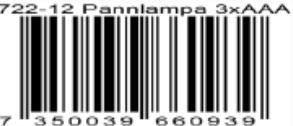

## *SafeE Pannlampa 3xAAA*

Superlätt pannlampa med COB diod som ger mycket lång brinntid och god ljusspridning i vidvinkel. Lampan har två effektlägen 100% eller 30%. Lätt att ta med och idealisk när du vill ha händerna fria.

## **Funktion tryckknapp**

- 1. Effektläge hög
- 2. Effektläge låg
- 3. Av

**-Kraftfull -Superlätt -Extra lång brinntid**

**Användningsområden:** Arbetsbelysning hemmet, bil, båt, camping eller friluftsliv.

## **Specifikation**

Ljuskälla:COB-diod, mkt energisnål, utökad brinntid. Färg: Mattsvart Batterikälla: 3xAAA (medföljer ej) Dimension: H41xB56xD38. Ställbar ljusvinkel: Ja Ljusstyrka: Hög ca 130 lumen, låg ca 40 lumen Brinntid: Mer än 50 timmar Vattenskydd: Stänktålig

**www.SafeE.se** *Tillverkad i Kina för SafeE AB*