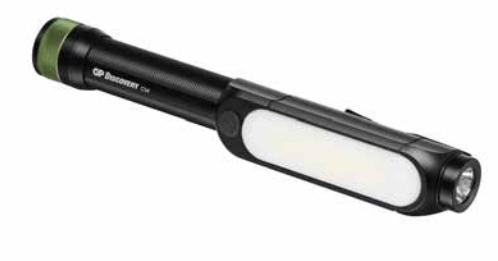
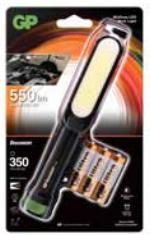
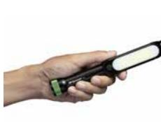
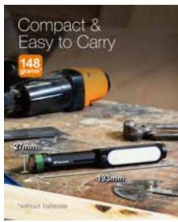
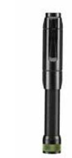

## GP Discovery ficklampa, C34

Mycket ljusstark arbetsficklampa med två ljuskällor: kortändan och långsidan. Variabelt ficklampsljus. Läsoch arbetsljus på långsidan. Magnetfäste på kortändan. 

- Storlek: M
- Räckvidd: 110 m
- Styrka fram: 350 lumen
- Styrka sidoljus: 550 lumen
- Batteritid 20 h
- • Ljuslägen: Hög, låg, COB sidljus
- Striltät (IPX4)

#### **ARTICLE INFORMATION:**

Art.no: 450058 EAN: 4891199190223 E-nummer: 9451781

**CONTACT US** Call 031-799 16 00 or E-mail: kundservice@gpbmnordic.se https:www.gpbmnordic.se

**Page 1/2**

# GP Discovery ficklampa, C34

### **Technical specifikation**

| Tillverkningsland  | Kina       |  |
|--------------------|------------|--|
| Statistiskt nummer | 8513100000 |  |
| E-nummer           | 9451781    |  |

## **Packaging information**

|                 | EXKRT          | 1-P           | ST      |
|-----------------|----------------|---------------|---------|
| EAN kod         | 04891199190247 | 4891199190223 |         |
| Längd (mm)      | 406.000        | 134.000       | 27.500  |
| Höjd (mm)       | 157.000        | 185.000       | 193.400 |
| Bredd (mm)      | 230.000        | 35.000        | 0.000   |
| Bruttovikt (kg) | 2.50000        | 0.20833       | 0.21750 |
| Net Weight (kg) | 1.80000        | 0.15000       | 0.15000 |
| Gross Volume    | 0.01467        | 0.00087       | 0.00122 |
| Net Volume      | 0.00000        | 0.00000       | 0.00000 |
| Antal ST        | 12             | 1             | 1       |

**Page 2/2**