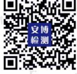

Report No.: 18270BC30186504 报告编号

# **MSDS REPORT MSDS** 报告

## **Client Name**

委托单位 **: GP Battery Marketing (HK) Limited**

**7/F Building 16W, 16 Science Park West Avenue, Hong Kong Science Park, New** 

**Address** 地址 **:**

**Product Name** 产品名称 **:** **Lithium Ion Battery** 锂离子电池

**Territories, Hong Kong**

**Effective Date** 生效日期 **:** **Jul. 03, 2023 2023** 年 **07** 月 **03** 日

## **Shenzhen Anbotek Compliance Laboratory Limited** 深圳安博检测股份有限公司

Report No.: 18270BC30186504 Page 2 of 11 报告编号 第 2 页 共 11 页

### **MATERIAL SAFETY DATA SHEET** 材料安全数据清单

#### **1. Chemical Product and Company Identification**产品及申请公司信息

| Sample name: 样品名称      | Lithium Ion Battery                                                                                                               |
|---------------------------|-----------------------------------------------------------------------------------------------------------------------------------|
| Sample model: 样品型号     | 锂离子电池 ICR14500                                                                                                                 |
| Rating: 规格             | 标称电压: 3.7V Nominal Voltage 额定容量: 800mAh, Rated Capacity 2.96Wh 重量: 22.4g Weight                                 |
| Manufacturer: 制造商      | Shenzhou Star Battery Technology (Shandong) Co., Ltd 神州恒星电池科技(山东)有限公司                                                          |
| Address: 制造商地址         | Floor 2-4, Building 2, No.218, Fuyuan 4th Road, Thailand Industrial Park, High-tech Zone, Zaozhuang city, Shandong Province |
|                           | 山东省枣庄高新区泰国工业园复元四路 218 号第二幢厂房 2—4 层                                                                                       |
| Factory: 工厂            | Shenzhou Star Battery Technology (Shandong) Co., Ltd 神州恒星电池科技(山东)有限公司                                                          |
| Address: 工厂地址          | Floor 2-4, Building 2, No.218, Fuyuan 4th Road, Thailand Industrial Park, High-tech Zone, Zaozhuang city, Shandong Province |
|                           | 山东省枣庄高新区泰国工业园复元四路 218 号第二幢厂房 2—4 层                                                                                       |
| Telephone no: 联系电话     | +852 2484 3111                                                                                                                    |
| Fax: 传真                | +852 2420 3450                                                                                                                    |
| E-mail: 邮箱             | terry_tse@goldpeak.com                                                                                                            |
| Date of received: 接收日期 | Jul. 03, 2023 年 月 日 2023 07 03                                                                               |
| Date of report: 报告日期   | Jul. 03, 2023 年 月 日 2023 07 03                                                                               |
|                           |                                                                                                                                   |

Written by: Approved by: 编写 批准

#### Report No.: 18270BC30186504 Page 3 of 11 报告编号 第 3 页 共 11 页

### **2. Composition/Information on Ingredients**原料成分信息

| Chemical Name 化学名称                          | Percent of Content 含量百分比 | CAS No. 编号 CAS |
|------------------------------------------------|-----------------------------|-------------------------|
| 镍钴锰酸锂 Li(NiCoMn)O2                          | 25%~35%                     | 182442-95-1             |
| 石墨(C) Graphite                              | 15%~20%                     | 7782-42-5               |
| Polyvinylidene Fluoride 聚偏氟乙烯(PVDF)         | 1%~5%                       | 24937-79-9              |
| 乙炔黑(SP) Acetylene Black                     | 0.5%~3%                     | 1333-86-4               |
| 铝(Al) Aluminum                              | 21%~23%                     | 7429-90-5               |
| 铜(Cu) Copper                                | 10%~11%                     | 7440-50-8               |
| Lithium hexafluorophosphate 六氟磷酸锂(LiPF6) | 10%~15%                     | 21324-40-3              |

### **3. Hazards Summarizing** 危险概述

#### **Danger sort** 危险类别**:** N/A **Routes of entry**进入途径**:**

- 1. Eyes and Skin When leaking, the electrolyte solution contained in the battery irritates to ocular tissues and the skin.
	- 眼睛和皮肤 当电池泄漏时,电池内部的电解液会刺激眼膜和皮肤,甚至有疼痛感。
- 2. Inhalation-Respiratory (and eye) irritation may occur if fumes are released due heat or an abundance of leaking batteries.
	- 吸入 电池大量泄漏产生热量导致冒烟,吸入会刺激呼吸系统。
- 3. Ingestion The ingestion of the battery can be harmful. Content of open battery can cause serious chemical burns of mouth, esophagus and gastrointestinal tract. 吞食 – 吞食电池对身体有很大伤害。电池里含的物质会引起嘴、食道和胃肠道 化 学灼伤。

#### **Health harm** 健康损害**:**

Exposure to leaking electrolyte from ruptured or leaking battery can cause电池破裂导 致电解液外漏会导致以下伤害:

- 1. Inhalation-Burns and irritation of the respiratory system, coughing, wheezing, and shortness of breath.
	- 吸入-灼伤或刺激呼吸系统,可能会产生咳嗽、喘息和呼吸浅短等现象。
- 2. Eyes-Redness, tearing, burns. The electrolyte is corrosive to all ocular tissues. 眼睛-红肿,疼痛,灼伤。电解液会腐蚀视网膜。
- 3. Skin-The electrolyte is corrosive and causes skin irritation and burns.

#### Report No.: 18270BC30186504 Page 4 of 11 报告编号 第 4 页 共 11 页

- 皮肤-电解液有腐蚀性,会刺激皮肤甚至灼伤皮肤。
- 4. Ingestion-The electrolyte solution causes tissue damage to throat and gastrointestinal track.
	- 吞食-电解液会导致咽喉组织损伤和胃肠道损伤。

**Environment harm** 环境危害**:** Not necessary under conditions of normal use.正常使用 条件下没有危害。

**Explosion danger**爆炸危险**:** The battery may be explosive at high temperature (above 60C) or exposing to the fire.电池在高温条件下(大于 60C)或者置于火中会导致爆炸。

#### **4. First Aid Measures** 急救措施

**Skin contact:** Not anticipated. If the battery is leaking and the contained material contacts the skin, flush with copious amounts of clear water for at least 15 minutes. **Eye contact:** Not anticipated. If the battery is leaking and the contained material contacts eyes, flush with copious amounts of clear water for at least 15 minutes. Get medical attention at once.

**Inhalation:** Not anticipated. If the battery is leaking, remove to fresh air. If irritation persists, consult a physician.

**Ingestion:** Not anticipated. If the battery is leaking and the contained material is ingested, rinse mouth and surrounding area with clear water at once. Consult a physician immediately for treatment.

皮肤接触**:** 没有事先预料的,如果电池漏液接触到皮肤上,立即用大量的清水冲洗至少 15 分钟。

眼睛接触**:** 没有事先预料的,如果电池漏液接触到眼睛上,立即用大量的清水冲洗至少 15 分钟,并立即就医。

吸入**:** 没有事先预料的电池泄漏,转移到空气新鲜的地方,如果刺激性还存在,请咨询医 生。

吞食**:** 没有事先预料的,如果电池漏液并且吞食了电池原料,立即用清水冲洗嘴部及周围 部位,并就医治疗。

#### **5. Fire Fighting Measures** 消防措施

**Unusual Fire and Explosion Hazards:** Battery may explode or leak potentially hazardous vapors subject to: exposed to excessive heat (above the maximum rated temperature as specified by the manufacturer) or fire, over-charged, short circuit, punctured and crushed.

**Hazardous Combustion Products:** Fire, excessive heat, or over voltage conditions may produce hazardous decomposition products. Damaged batteries can result in rapid heating and the release of flammable vapors.

**Extinguishing Media:** Dry chemical type extinguishers are the most effective means

Report No.: 18270BC30186504 Page 5 of 11 报告编号 第 5 页 共 11 页

to extinguish a battery fire. A CO2 extinguisher will also work effectively. **Fire Fighting Procedures:** Use a positive pressure self-contained breathing apparatus if batteries are involved in a fire. Full protective clothing is necessary. During water application, caution is advised as burning pieces of flammable particles may be ejected from the fire.

异常着火和爆炸危险**:** 电池爆炸或漏液可能是由以下原因导致: 暴露于高温环境 (超过 制造商规定的最大额定温度) 或者火中,电池过充电,短路,刺穿和挤压。

产品烧毁危害**:** 着火,过热或者过压条件可能会导致产品分解。损坏的电池会导致快速升 温和释放可燃性气体。

灭火仪器**:** 对于电池着火灭火最有效的是干燥的化学型灭火器,二氧化碳灭火器也可。 消防程序**:** 如果火灾中有电池,要使用正压呼吸装置,全防护服是必不可缺的,在使用水 设备时要小心谨慎,因为燃烧的一些可燃性颗粒会从火中喷射出。

#### **6. Accidental Release Measures** 意外泄漏措施

The material contained within the battery would only be released under abusive conditions. In the event of battery rupture and leakage, collect all the released materials that are not hot or burning in an appropriate waste disposal container while wearing proper protective clothing and ventilate the area. Placed in approved container and disposed according to the local regulations.

电池内部的原料只会在恶劣条件下释放。万一电池破裂和泄漏,收集所有不热和燃烧后 的残渣置于废料处理箱,要穿上防护服和在通风的地方进行。放置在被批准的容器并 按照规程处理废料。

### **7. Handling and Storage** 操作和贮存

#### **Handling** 操作**:**

- 1. Batteries are designed to be recharged. However, improperly charging a battery may cause the battery to flame. When charging the battery, use dedicated chargers and follow the specified conditions.
电池被设计为可充电的,然而不正确的充电方式可能会导致电池着火。当给电池充电 时,要使用专用的充电器并按照指定的充电条件进行。

- 2. Never disassemble or modify a battery.不拆解电池。
- 3. Do not immerse, throw, and wet a battery in water.不浸没、投掷和用水弄湿电池。
- 4. Should a battery unintentionally be crushed, thus releasing its contents, rubber gloves must be used to handle all battery components. Avoid the inhalation of any vapors that may be emitted.如果电池被无意挤压而导致内部物质释放,必须带上橡胶 手套处理所有的电池成分,避免吸入释放的任何气体。
- 5. Short circuit causes heating. In addition, short circuit reduces the life of the battery and can lead to ignition of surrounding materials. Physical contact with to

#### Report No.: 18270BC30186504 Page 6 of 11 报告编号 第 6 页 共 11 页

short-circuited battery can cause skin burn.短路会引起电池过热。此外,短路会使电 池寿命大大减少,甚至会导致周围材料着火。 身体接触短路的电池会导致皮肤灼伤。

- 6. Avoid reversing the battery polarity, which can cause the battery to be damaged or flame.避免颠倒电池极性,可能会引起电池损坏或者燃烧。
- 7. In the event of skin or eye exposure to the electrolyte, refer to Section 4, First Aid Measures.如果皮肤或者眼睛接触到电解液,参考第四项并立即采取急救措施。

#### **Storage** 贮存**:**

- 1. Batteries should be separated from other materials and stored in a noncombustible, well ventilated, sprinkler-protected structure with sufficient clearance between walls and battery stacks. Do not place batteries near heating equipment, nor expose to direct sunlight for long periods.电池应该和其他材料分开 并且贮存在通风且不易燃烧的地方。自动灭火装置应与墙和电池组保持足够的间隙。 不要把电池靠近加热装置,或者直接长时间的暴露于阳光直射的区域。
- 2. Do not store batteries above 35℃ or below –20℃. Store batteries in a cool (about 20±5℃) in a long time, dry and ventilated area that is subject to little temperature change. Elevated temperatures can result in reduced battery cycle life. Battery exposure to temperatures in excess of 60℃ will result in the battery venting flammable liquid and gases.不要在35℃以上和-20℃以下的环境贮存电池。电池应 该贮存在干燥的、通风良好的阴凉区域(大约20±5℃)。升高温度会导致电池循环 寿命减少。电池暴露于60℃以上的温度可能会导致电池泄漏可燃性液体和气体。
- 3. Keep batteries in original package until use and do not jumble them.保持电池最原 始的包装直到使用时,不要把电池弄混乱。

### **8. Exposure Controls/Personal Protection** 暴露控制**/**自我防护

**Engineering Controls:** Keep away from heat and open flame.

**Ventilation:** Not necessary under conditions of normal use. In case of abuse, use adequate mechanical ventilation (local exhaust) for the battery that vent gas or fumes.

**Respiratory Protection:** Not necessary under conditions of normal use. If battery is burning, leave the area immediately. During fire fighting fireman should use self-contained breathing, full-face respiratory equipment. Fires may be fought but only from safe fire fighting distance, evacuate all persons from the area of fire immediately. **Eye Protection:** Not necessary under conditions of normal use. Use safety glasses with side shields if handling a leaking or ruptured battery.

Code: AB-AB-11-c **Body Protection:** Not necessary under conditions of normal use. Use rubber apron and protective working in case of handling a leaking of ruptured battery.

Report No.: 18270BC30186504 Page 7 of 11 报告编号 第 7 页 共 11 页

**Protective Gloves:** Not necessary under conditions of normal use. Use chemical resistant rubber gloves if handling a leaking or ruptured battery.

**Others:** Use good chemical hygiene practice. Wash hands thoroughly after cleaning-up a battery spill caused by leaking battery. No eating, drinking, or smoking in battery storage area.

工程控制**:** 远离高温和明火。

通风设备**:** 正常使用条件下是不必要的。为了防止不合理的滥用,要使用合适的机械 通风设备排出电池产生的气体和黑烟。

呼吸防护**:** 正常使用条件下是不必要的。如果电池着火,立即远离着火区域。在灭火期间 要使用自给自足的全脸防护的呼吸装置。要保持安全的灭火距离并立即疏散着火区域的所 有人员。

眼睛防护**:** 正常使用条件下是不必要的。处理泄漏或者破裂的电池时要戴上有边罩的防护 眼镜。

身体防护**:** 正常使用条件下是不必要的。处理泄漏或者破裂的电池时要穿上有橡胶围裙或 者安全工作服。

防护手套**:** 正常使用条件下是不必要的。处理泄漏或者破裂的电池时要戴上抗化学腐蚀的 橡胶手套。

其他**:** 保持良好的化学卫生习惯。清理完泄漏电池的漏液后要彻底地清洗手。在贮存电池 的区域不吃东西,不喝酒,不吸烟。

#### **9. Physical and Chemical Properties** 物理和化学特性

| 状态: State                    | 固体 Solid     |
|---------------------------------|-----------------|
| 气味: Odor                     | N/A             |
| 值: PH                        | N/A             |
| 气压: Vapor pressure           | N/A             |
| 气体密度: Vapor density          | N/A             |
| 沸点: Boiling point            | N/A             |
| 在水中的溶解度: Solubility in water | 不溶 Insoluble |
| 比重: Specific gravity         | N/A             |
| 密度: Density                  | N/A             |

#### **10. Stability and Reactivity** 稳定性和反应活性

**Stability:** Stable

**Conditions to Avoid:** Do not heat, throw into fire, disassemble, short circuit, immerse in water or overcharge, etc.

**Incompatibility:** None during normal operation. Avoid exposure heat, open flame and corrosives.

Report No.: 18270BC30186504 Page 8 of 11 报告编号 第 8 页 共 11 页

#### **Hazardous Polymerization:** Will not occur.

**Hazardous Decomposition Products:** The battery may release irritative gas once the electrolyte leakage.

稳定性**:** 稳定

避免条件**:** 不能加热,不要置于火中,不随便拆解,不短路,不浸入水中,不过充等。 不适用性**:** 正常操作条件下没有。避免暴露在高温、明火和腐蚀性物质环境中。 聚合物危害**:**不会发生。 拆解产品危害**:** 一旦电解液泄漏,电池会挥发出刺激性气体。

### **11. Toxicological Information**有害物质信息

The battery does not elicit toxicological properties during routine handling and use. If the battery is opened through misuse or damage, discard immediately. Internal components of cell are irritant and sensitization.

**Irritancy:** The electrolytes contained in this battery can irritate eyes with any contact. Prolonged contact with the skin or mucous membranes may cause irritation. **Sensitization:** No information is available.

**Teratogenicity:** No information is available.

**Carcinogenicity:** No information is available.

**Mutagenicity:** No information is available.

**Reproductive toxicity:** No information is available.

电池在正常的操作和使用中不能有发出有毒物质。如果由于不正确的使用或破坏导致 电池裂开,立即丢掉。电芯内部成分有刺激性甚至诱发过敏。

刺激性**:** 电池内部的电解液会刺激眼睛。皮肤或黏膜长时间接触或产生刺激效应。 过敏**:** 没有可用的信息。

致畸胎性**:** 没有可用的信息。 致癌性**:** 没有可用的信息。

诱变性**:** 没有可用的信息。

生殖毒性**:** 没有可用的信息

### **12. Ecological Information**生态信息

- 1. When properly used and disposed, the battery does not present environmental hazard.
正确使用电池时不会造成环境损害。

- 2. The battery does not contain mercury, cadmium, or lead. 电池不能含有汞、镉、铅。
- 3. Do not let internal components enter marine environment. Avoid releasing to water ways, wastewater or ground water.

Report No.: 18270BC30186504 Page 9 of 11 报告编号 第 9 页 共 11 页

不要让电池内部成分进入水生态。避免排入水路系统、废水和地下水中。

### **13. Disposal Considerations**废弃处理

- 1. Disposal of the battery should be performed by permitted, professional disposal firms knowledgeable in Federal, State or Local requirements of hazardous waste treatment and hazardous waste transportation.处理电池要有许可,在联邦、国家或 者当地危害物质处理部门和危害物质运输部门要求的专业处理知识。
- 2. The battery should be completely discharged prior to disposal and/or the terminals taped or capped to prevent short circuit. When completely discharged it is not considered hazardous.处理电池之前要完全放电或者把电池末端用胶带粘上防止短 路。完全放电的电池被认为是没有危害的。
- 3. The battery contains recyclable materials. Recycling options available in your local area should be considered when disposing of this product, through licensed waste Carrier.

电池包含可循环利用的材料。在当地回收利用这些处理掉的产品时,要取得废弃物处 理的授权。

### **14. Transport Information**运输信息

According to PACKING INSTRUCTION 965 ~ 967 of IATA DGR 64th Edition for transportation, the special provision 188 of IMDG (inc Amdt 40-20). The batteries should be securely packed and protected against short-circuits. Examine whether the package of the containers are integrate and tighten closed before transport. Take in a cargo of them without falling, dropping, and breakage. Prevent collapse of cargo piles. Don't put the goods together with oxidizer and chief food chemicals. The transport vehicle and ship should be cleaned and sterilized before transport. During transport, the vehicle should prevent exposure, rain and high temperature. For stopovers, the vehicle should be away from fire and heat sources. When transported by sea, the assemble place should keep away from bedroom and kitchen, and isolated from the engine room, power and fire source. Under the condition of Road Transportation, the driver should drive in accordance with regulated route, don't stop over in the residential area and congested area.

Code: AB-AB-11-c 根据包装说明的 IATA DGR 第 64 期 965 ~ 967 运输、IMDG 的特殊条款 188 (inc Amdt 40-20)。电池应牢固地填充,防止短路。检查集装箱的包装是否在运输前整合并拧紧。 确定没有一个货物掉落,跌落,和破损,防止货物堆崩溃。不要把货物与氧化剂,食品放在 一起。运输车辆和船舶在运输前应清洗和消毒,运输车辆应避免接触雨水和高温。停留时, 车辆应远离火和热源。海运时,装配位置应远离卧室和厨房,并从机舱、电源和火源处隔离。

Report No.: 18270BC30186504 Page 10 of 11 报告编号 第 10 页 共 11 页

公路运输情况下,司机开车应该按照规定路线,不要在居民区和人口稠密区停留。

- **(a) UN number UN** 编号 3480&3481
- **(b) UN Proper shipping name UN** 适当的运输名称 LITHIUM ION BATTERIES (including lithium ion polymer batteries) or; LITHIUM ION BATTERIES CONTAINED IN EQUIPMENT or LITHIUM ION BATTERIES PACKED WITH EQUIPMENT (including lithium ion polymer batteries) 锂离子电池(包括锂离子聚合物电池);或内置在设备中的锂离子电池或与设备包装在 一起的锂离子电池(包括锂离子聚合物电池)。
- **(c) Packing Instruction (if applicable)**包装方式(如果适用) 965 IB, 966 II, 967 II
- **(d) Marine pollutant** 海洋污染物**(Yes/No)** No
- **(e) Transport in bulk (according to Annex II of MARPOL 73/78 and the IBC Code)** 散装运输

No information available.无可用信息。

- **(f) Special precautions** 特别预防措施 No information available.无可用信息。
### **15. Regulatory Information**监管信息

The transport of rechargeable lithium-ion batteries regulated by the united nations as detailed in the "model Regulations on the transport of dangerous Goods Ref. ST/SG/AC.10/1 Revision 22 2021".

Defined by UN in the "Recommendations on the transport of Dangerous Goods Chapter 38.3 Manual of Tests and Criteria Ref. ST/SG/AC.10/11 Rev.7/Amend.1 2021". The Lithium-ion Cells and the battery Packs may or may not be assigned to the UN No. 3480 Class-9 that is restricted for transport.

可充电锂离子电池的运输受联合国的统一监管,详见"关于危险货物运输的新型法规参考 ST / SG / AC.10/1 22版本 2021"。

联合国在"关于危险货物第38.3章试验和标准手册参考ST / SG / AC.10 / 11第七修订版 修正1 2021"里明确规定,锂离子电芯和电池组有可能或可能不被划分到UN3480 第九类 危险品(运输受限)。

Report No.: 18270BC30186504 Page 11 of 11 报告编号 第 11 页 共 11 页

### **16. Other Information**其他信息

**Prepared Department** 申请商**:** GP Battery Marketing (HK) Limited

-- End of report -- -- 报告结束 --

