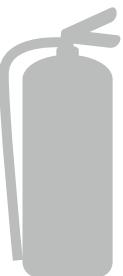
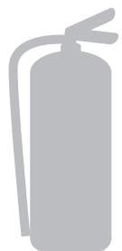
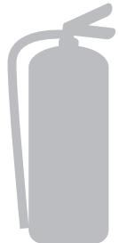
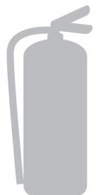

User manual Powder extinguishers Ver: 210705

# **USERMANUAL** Powder extinguishers

2

For more information visit **www.housegard.com**

- » BRUKSANVISNING
- » BRUGSVEJLEDNING
- » BRUKSANVISNING
- » KÄYTTÖOHJE
- » USER MANUAL
- » MANUEL D'UTILISATION
- » GEBRAUCHSANWEISUNG

DANSK

# **BRUKSANVISNING**

VIKTIG: Les hele denne bruksanvisning nøye før du installerer produktet. Spar den for framtidig bruk.

Din nye brannslokker inneholder et ABC-pulver som er egnet til slokking av branner i en rekke materialer som tre, papir, fiberstoffer, ildsfarlige væsker og kjemikalier.

Brannslokkeren kan også benyttes ved branner i elektriske anlegg inntil 1000 Volt.

#### FORPAKNINGEN INNEHOLDER

- » Brannslokker
- » Veggfeste
- » Slange (Gjelder ikke 2 kg)

#### EGENKONTROLL

Ved utpakking av produktet kontroller at manometer-pilen står i grønt felt. Kontroller at sikringsplinten er montert og plombert. Kontroller at slangen er montert. Dersom ikke, monter slangen. (Gjelder ikke 2 kg)

VIKTIG: Visuell kontroll av brannslokkeren er brukerens ansvar, eksempelvis at det er tilfredsstillende trykk på brannslokkeren.

#### SLIK FUNGERER PULVERET SOM SLOKKEMIDDEL

ABC-pulveret slokker brannen ved å hindre kjemiske kjedereaksjoner som brannen er avhengig av. Pulveret bidrar også til å kjøle brannen. Ved branner i treverk, papir og fiberstoffer er det viktig å foreta etterslokking med vann for å hindre gjenoppblussing av brannen.

#### BRANNKLASSER

Brannklassen angir hvilken type av branner man kan slokke. Klassene er angitt med piktogram;

- **A Klassen -** Organiske materialer som tre, papir, tekstiler mm.
- **B Klassen -** Væskebranner som motor olje, bensin, maling mm.
- **C Klassen -** Gassbranner

#### VIKTIG VED SLOKKING AV BRANN

Vær alltid forsiktig når du nærmer deg en brann. Gå ikke for nære, men hold en sikkerhetsavstand på minimum 1 meter. Se alltid etter mulige rømningsveier først. Forsøk ikke å nærme deg brannen dersom det er risiko for at brannen kan spre seg slik at rømmningsveien blokkeres.

DANSK

SVENSKA

SUOMI

ENGLISH

FRANCAIS

DEUTSCH

# HANDLING VED BRUK AV BRANNSLOKKEREN

- » Dra ut sikringen.
- » Hold slangen med ett fast grep og sikt i underkant av brannen.
- » Trykk ned utløserhåndtaket.
- » Beveg munnstykket frem og tilbake mot underkant av flammene inntil brannen er slokket.

# ETTERSYN OG KONTROLL

I private boliger skal autorisert kontroll gjennomføres hvert 5. år, full service hvert 10. år. For næringsvirksomhet gjelder egne regler iht. NS 3910 samt Housegards serviceinstruksjoner.

# JEVNLIG EGENKONTROLL

- » Kontroller at brannslokkeren er på plass og rett plassert.
- » Kontroller at brannslokkeren er hel og uten synlige skader.
- » Kontroller at manometerpilen står i det grønne feltet.
- » Kontroller at sikringspinnen er på plass og plombert.

VIKTIG: Apparatet må alltid refylles etter at det har vært utløst. Refylling krever spesialutstyr. Lever apparatet til et autorisert serviceverksted. Bruk bare Housegardspesifisert slokkemiddel og reservedeler.

#### **TEKNISKE SPESIFIKASJONER:**

#### **2 KG PE2HR-A BLACK, WHITE**

**Modell:** Housegard PE2HR-A **Type:** 2 kg ABC pulver, trykkladet **Brannklasse:** ABC **Effektklasse:** 13A 89B C **Vekt:** 3,6 kg **Arbeidstrykk:** 15 Bar **Drivgass:** Nitrogen N₂ **Slokkemiddel:** SUN ABC Standard **Godkjenninger:** CE **Temperaturområde:** -30 °C til +60 °C

#### **6 KG PE6HR-A BLACK, WHITE**

**Modell:** Housegard PE6HR-A **Type:** 6 kg ABC pulver, trykkladet **Brannklasse:** ABC **Effektklasse:** 55A 233B C **Vekt:** 9,2 kg **Arbeidstrykk:** 15 Bar **Drivgass:** Nitrogen N₂ **Slokkemiddel:** SUN ABC Super **Godkjenninger:** CE **Temperaturområde:** -30 °C til +60 °C

#### **2 KG PE2HR-B STEEL**

**Modell:** Housegard PE2HR-B **Type:** 2 kg ABC pulver, trykkladet **Brannklasse:** ABC **Effektklasse:** 13A 89B C **Vekt:** 3,5 kg **Arbeidstrykk:** 15 Bar **Drivgass:** Nitrogen N₂ **Slokkemiddel:** SUN ABC Standard **Godkjenninger:** CE **Temperaturområde:** -30 °C til +60 °C

**6 KG PE6HR-B STEEL Modell:** Housegard PE6HR-B **Type:** 6 kg ABC pulver, trykkladet **Brannklasse:** ABC **Effektklasse:** 55A 233B C **Vekt:** 8,6 kg **Arbeidstrykk:** 15 Bar **Drivgass:** Nitrogen N₂ **Slokkemiddel:** SUN ABC Super **Godkjenninger:** CE **Temperaturområde:** -30 °C til +60 °C

DANSK

SVENSKA

SUOMI

ENGLISH

FRANCAIS

DEUTSCH

# VIKTIG SIKKERHETSINFORMASJON

- » Beholderen er under trykk, benytt derfor aldri fysisk makt for å åpne beholder eller demontere ventil.
- » Bytt alltid ut skadede eller korroderte deler, benytt autorisert personell.
- » Sjekk at brannslokkeren passer til ditt bruksområde iht. informasjonen på brannslokkerens frontetikett.
- » Rett aldri brannslokkerens munnstykke direkte mot mennesker eller dyr. Sikkerhetsavstand minimum 1 meter ved slokking av branner i klær.
- » Hold brannslokkeren ren, unngå bruk av korroderende rengjøringsmidler.
- » Ved bruk på bil, lastevogn; sørg for tilstrekkelig festeanordning som sikrer brannslokkeren.
- » Brannslokkeren skal oppbevares utenfor rekkevidde for små barn.
- » Brannslokkeren inneholder et finkornet pulver. Dette er ikke giftig, men kan virke irriterende på øyne og luftveier. Unngå derfor å puste inn pulveret. Luft ut etter bruk.
- » Pulveret er finkornet og vil ved bruk spre seg utover et stort område ved små pulvermengder. Samle sammen, eller støvsug opp så mye som mulig av pulveret. Tørk deretter opp resterende pulver med en fuktig klut. Ved større pulvermengder kontakt ditt forsikringsselskap for spesialrenhold.
- » Ved kassasjon, lever brannslokkeren til godkjent oppsamlingsplass for søppel.

# GARANTIVILKÅR

5 års garanti mot trykkfall regnet fra produksjonsmåned. Garantien forutsetter at originalplombe er inntakt, samt at produktet ikke er åpnet, brukt, refylt, eller undergått service som innebærer fysisk inngrep på produktet.

Garantien forutsetter at produktet er brukt og oppbevart under normale forhold, og i normale miljø. Garantien er ikke gyldig dersom produktet er oppbevart i korrosive eller på andre måter ugunstige eller belastende miljøer, eller på annen måte åpenbart er skadet av kundens oppbevaring og bruk.

For ytterligere informasjon **www.housegard.com**

# **BRUGSVEJLEDNING**

**Viktigt:** Læs denne brugervejledning nøje igennem, før du monterer produktet. Gem brugervejledningen til fremtidig brug.

Din nye brandslukker indeholder et ABC-pulver, som er egnet til slukning af brande i en lang række materialer, såsom træ, papir, fiberstoffer, brandfarlige væsker og kemikalier.

Brandslukkeren kan også benyttes ved brande i elektriske anlæg op til 1000 Volt.

# PAKKEN INDEHOLDER

- » Brandslukker
- » Vægbeslag
- » Slange (Gælder ikke 2 kg)

# EGENKONTROL

Ved udpakning af produktet kontroller, at manometernålen står i det grønne felt. Kontroller at sikringsplinten er monteret og plomberet. Kontroller at slangen er monteret. Hvis ikke, monter slangen. (Gælder ikke 2 kg)

VIKTIGT: Visuel kontrol af brandslukkeren er brugerens ansvar, kontroller jævnligt, at der er tilfredsstillende tryk på brandslukkeren.

# SÅDAN FUNGERER PULVERET SOM SLUKKEMIDDEL.

ABC-pulveret slukker branden ved at hindre den kemiske kædereaktion, som branden er afhængig af. Pulveret bidrager desuden til at nedkøle branden. Ved brande i træværk, papir og fiberstoffer er det vigtigt at foretage efterslukning med vand, dette for at hindre en genantændelse af branden.

# BRANDKLASSER

Brandklassen angiver hvilken type af brande man kan slukke. Klasserne er angivet i piktogram:

**A Klassen -** Organiske materialer som træ, papir, tekstiler m.m. **B Klassen -** Væskebrande såsom motorolie, benzin, maling m.m.

**C Klassen -** Gasbrande.

# VIGTIGT VED SLUKNING AF EN BRAND

Vær altid forsigtig når du nærmer dig branden. Gå ikke for tæt på, og hold en sikkerhedsafstand på minimum 1 meter. Se altid efter mulige flugtveje først. Forsøg aldrig at nærme dig branden, hvis der er risiko for at branden kan sprede sig, og blokere flugtvejen.

SVENSKA

SUOMI

ENGLISH

FRANCAIS

DEUTSCH

NORSK

# SÅDAN ANVENDES BRANDSLUKKEREN

- » Træk sikringen ud.
- » Hold på slangen med et fast greb og sigt i underkanten af branden.
- » Tryk håndtaget ned.
- » Bevæg mundstykket på slangen frem og tilbage, mod underkanten af flammerne indtil branden er slukket.

# EFTERSYN SERVICE OG KONTROL

I private boliger bør der jævnligt udføres egenkontrol af brandslukkerens funktionsduelighed, manometer og korrekt placering.

Egenkontrol kan udføres løbende mindst en gang årligt jf. DS2320 pkt. 8. Brandslukkeren skal have udført årlig Serviceeftersyn jf. DS2320:2020 pkt. 4, for at opretholde sin funktionsgaranti. Serviceeftersyn udføres af DS2320 Certificeret virksomhed.

Hvert 5. år skal brandslukkeren igennem en periodisk undersøgelse af trykbeholder og armaturer. Denne skal udføres af et DS-certificeret værksted jf. DS2320:2020 pkt. 5. samt Housegard serviceinstruktioner.

# DEN JÆVNLIG EGENKONTROL

- » Kontroller at brandslukkeren er placeret korrekt, at den er placeret på rette sted.
- » Kontroller at brandslukkeren er hel og ikke har defekter eller synlige skader.
- » Kontroller at manometer-nålen står i det grønne felt.
- » Kontroller at sikrings-splitten sidder korrekt og er plomberet.

VIKTIGT: Apparatet skal altid genopfyldes hvis det har været udløst. Genopfyldning kræver specialudstyr. Apparatet indleveres til en autoriseret forhandler/ serviceværksted. Brug kun Housegard specificeret slukkemiddel og reservedele.

# **TEKNISKE SPECIFIKATIONER:**

# **2 KG PE2HR-A BLACK, WHITE**

**Model:** Housegard PE2HR-A **Type:** 2 kg ABC pulver, trykladet. **Brandklasse:** ABC **Effektklasse:** 13A 89B C **Vægt:** 3,6 kg **Arbejdstryk:** 15 Bar **Drivgas:** Nitrogen N₂ **Slukkemiddel:** SUN ABC Standard **Godkendelser:** CE **Driftstemperatur:** -30 °C til +60 °C

# **6 KG PE6HR-A BLACK, WHITE**

**Model:** Housegard PE6HR-A **Type:** 6 kg ABC pulver, trykladet. **Brandklasse:** ABC **Effektklasse:** 55A 233B C **Vægt:** 9,2 kg **Arbejdstryk:** 15 Bar **Drivgas:** Nitrogen N₂ **Slukkemiddel:** SUN ABC Super **Godkendelser:** CE **Driftstemperatur** -30 °C til +60 °C

# **2 KG PE2HR-B STEEL**

**Model:** Housegard PE2HR-B **Type:** 2 kg ABC pulver, trykladet. **Brandklasse:** ABC **Effektklasse:** 13A 89B C **Vægt:** 3,5 kg **Arbejdstryk:** 15 Bar **Drivgas:** Nitrogen N₂ **Slukkemiddel:** SUN ABC Standard **Godkendelser:** CE **Driftstemperatur:** -30 °C til +60 °C

# **6 KG PE6HR-B STEEL**

**Model:** Housegard PE6HR-B **Type:** 6 kg ABC pulver, trykladet. **Brandklasse:** ABC **Effektklasse:** 55A 233B C **Vægt:** 8,6 kg **Arbejdstryk:** 15 Bar **Drivgas:** Nitrogen N₂ **Slukkemiddel:** SUN ABC Super **Godkendelser:** CE **Driftstemperatur** -30 °C til +60 °C

SVENSKA

SUOMI

ENGLISH

FRANCAIS

DEUTSCH

NORSK

# VIKTIG SIKKERHEDS INFORMATION

- » Beholderen er under tryk, prøv derfor aldrig med fysisk magt, at åbne beholderen eller demontere ventilen.
- » Udskift altid skadede eller korroderede dele, benyt en autoriseret forhandler.
- » Tjek at brandslukkeren passer til brugsområdet iht. informationen på brandslukkerens frontetiket.
- » Ret aldrig brandslukkerens mundstykke direkte mod mennesker eller dyr. Sikkerhedsafstand, altid minimum 1 meter ved slukning.
- » Hold brandslukkeren ren, undgå brug af ætsende rengøringsmidler.
- » Ved montering på køretøj. Brug et egnet beslag, der sikrer at brandslukkeren sidder forsvarligt fast.
- » Brandslukkeren skal opbevares udenfor rækkevidde af små børn.
- » Brandslukkeren indeholder et finkornet pulver. Dette er ikke giftigt, men kan virke irriterende på øjne og luftveje. Undgå derfor at indånde pulveret. Sørg for at lufte godt ud efter brug.
- » Pulveret er meget finkornet, og vil ved brug sprede sig over et stort område, selv ved små pulvermængder. Brug en støvsuger, og fjern så meget af pulveret som muligt. Tør efterfølgende det resterende pulver bort med en fugtig klud. Ved større pulvermængder, kontakt dit forsikringsselskab for særlig rengøring.
- » Ved kassering, leveres brandslukkeren til en autoriseret forhandler eller godkendt genbrugsstation.

#### GARANTI

Der ydes 5 års garanti mod trykfald på beholderen, beregnet fra produktionsmåned. Garantien forudsætter, at original-plumpen er intakt, samt at produktet ikke har været åbnet, brugt, genopfyldt, eller har gennemgået service, hvilket indebærer fysisk indgreb i produktet.

Garantien forudsætter, at produktet er i brug under normale forhold og i normalt miljø. Der ydes ikke garanti, hvis produktet er tæret, eller på andre måder har været placeret i ekstremt hårdt miljø, eller på anden måde er blevet skadet i forbindelse med opbevaring eller brug.

For yderligere information **www.housegard.com**

# **BRUKSANVISNING**

**Viktigt:** Läs hela denna bruksanvisning noggrant innan du installerar produkten och spara den för framtida bruk.

Denna brandsläckare innehåller ett ABC-pulver som är avsett för släckning av bränder i olika material såsom trä, papper, tyg, brandfarliga vätskor, kemikalier och gas.

Brandsläckaren kan också användas vid bränder i elektriska installationer som uppgår till 1000 Volt.

# DENNA FÖRPACKNING INNEHÅLLER:

- » Brandsläckare
- » Väggfäste
- » Slang (Gäller inte 2 kg)

# EGENKONTROLL

Vid uppackning av produkten kontrollera att manometerpilen står i det gröna fältet. Kontrollera att säkringsanordningen är monterad och plomberad. Kontrollera att slangen är monterad. Om inte, montera slangen. (Gäller inte 2 kg)

VIKTIGT: Visuell kontroll av brandsläckaren är användarens ansvar, t.ex. att det är tillfredsställande tryck på handsläckaren.

# SÅ FUNGERAR PULVRET SOM SLÄCKMEDEL

ABC-pulvret reagerar kemiskt med branden. Pulvret förhindrar kemiska kedjereaktioner som branden är beroende av. Pulvret bidrar också till att kväva branden, då syret trängs bort. För att förhindra att elden återuppstår vid bränder i t.ex. trä, papper och tyg kan det vara nödvändigt att eftersläcka med vatten.

# BRANDKLASSER

Brandklassen anger vilken typ av bränder man kan släcka. Klasserna är angivna med piktogram.

**A Klassen -** Organiska material som trä, papper, textiler mm.

- **B Klassen -** Vätskebränder som motorolja, bensin, målarfärg mm.
- **C Klassen -** Gasbränder

# VIKTIGT VID SLÄCKNING AV BRAND

Var alltid försiktig när du närmar dig en brand. Gå inte för nära branden utan håll ett säkerhetsavstånd på minst 1 meter. Kontrollera alltid möjliga utrymningsvägar först. Försök inte att närma dig branden om det finns risk att den kan spridas så att utrymningsvägen blockeras.

SUOMI

ENGLISH

FRANCAIS

DEUTSCH

NORSK

DANSK

# HUR DU ANVÄNDER BRANDSLÄCKARE

- » Dra ur säkringen.
- » Håll slangen med ett fast grepp och sikta mot lågornas bas.
- » Tryck ner handtaget.
- » Flytta munstycket fram och tillbaka mot lågornas bas tills branden är släckt.

#### UNDERHÅLL OCH KONTROLL

I privata bostäder rekommenderas en auktoriserad kontroll vart 5:e år och full service vart 10:e år. För näringsverksamhet gäller servicestandard SS 3656 och Housegards serviceinstruktioner. Standard SS 3656 omfattar handbrandsläckares funktionsduglighet, oavsett placering.

#### REGELBUNDEN EGENKONTROLL

- » Kontrollera att brandsläckare finns på plats och är rätt placerad.
- » Kontrollera att brandsläckare är intakt och utan synliga skador.
- » Kontrollera att manometerpilen står i det gröna fältet.
- » Kontrollera att säkerhetssprint är på plats och plomberad.

VIKTIGT: Brandsläckaren måste alltid laddas om efter användning även om bara delar av innehållet använts. Omladdning kräver specialutrustning. Kontakta en auktoriserad serviceverkstad. Använd endast Housegards specificerade släckmedel och reservdelar.

#### **TEKNISKA SPECIFIKATIONER:**

# **2 KG PE2HR-A BLACK, WHITE**

**Modell:** Housegard PE2HR-A **Typ:** 2 kg ABC pulver, tryckladdad. **Brandklass:** ABC **Effektklass:** 13A 89B C **Vikt:** 3,6 kg **Arbetstryck:** 15 Bar **Drivgas:** Nitrogen gas N₂ **Släckmedel:** SUN ABC Standard **Godkännanden:** CE **Temperaturområde:** -30 °C till +60 °CC

# **6 KG PE6HR-A BLACK, WHITE**

**Modell:** Housegard PE6HR-A **Typ:** 6 kg ABC pulver, tryckladdad. **Brandklass:** ABC **Effektklass:** 55A 233B C **Vikt:** 9,2 kg **Arbetstryck:** 15 Bar **Drivgas:** Nitrogen gas N₂ **Släckmedel:** SUN ABC Super **Godkännanden:** CE **Temperaturområde:** -30 °C till +60 °CC

#### **2 KG PE2HR-B STEEL**

**Modell:** Housegard PE2HR-B **Typ:** 2 kg ABC pulver, tryckladdad. **Brandklass:** ABC **Effektklass:** 13A 89B C **Vikt:** 3,5 kg **Arbetstryck:** 15 Bar **Drivgas:** Nitrogen gas N₂ **Släckmedel:** SUN ABC Standard **Godkännanden:** CE **Temperaturområde:** -30 °C till +60 °CC

#### **6 KG PE6HR-B STEEL**

**Modell:** Housegard PE6HR-B **Typ:** 6 kg ABC pulver, tryckladdad. **Brandklass:** ABC **Effektklass:** 55A 233B C **Vikt:** 8,6 kg **Arbetstryck:** 15 Bar **Drivgas:** Nitrogen gas N₂ **Släckmedel:** SUN ABC Super **Godkännanden:** CE **Temperaturområde:** -30 °C till +60 °CC

SUOMI

ENGLISH

FRANCAIS

DEUTSCH

NORSK

DANSK

# VIKTIG SÄKERHETSINFORMATION

- » Behållaren är under tryck. Använd aldrig fysisk kraft för att öppna behållaren eller demontera ventilen.
- » Byt alltid ut skadade eller korroderade delar. Service skall endast utföras av auktoriserad personal.
- » Kontrollera att brandsläckaren passar till ditt bruksområde enligt informationen på brandsläckarens etikett.
- » Rikta aldrig brandsläckarens munstycke mot människor eller djur. Säkerhetsavstånd minimum 1 meter vid släckning av brand i kläder.
- » Håll brandsläckaren ren. Använd inte frätande rengöringsmedel.
- » Vid användning i fordon skall lämpliga fästelement/fordonshållare användas.
- » Brandsläckaren skall förvaras utom räckhåll för små barn.
- » Brandsläckaren innehåller ett pulver. Detta är inte miljöfarligt, men kan irritera ögon och andningsorgan. Undvik därför att andas in pulvret. Vädra ut väl efter användning.
- » Pulvret är finkornigt och kommer att spridas över ett stort område vid bruk av brandsläckaren. Efter att ha använt brandsläckaren, sopa ihop eller dammsug upp så mycket som möjligt av pulvret. Torka sedan upp resterande pulver med en fuktig trasa. För större mängder pulver kontakta ditt försäkringsbolag för speciell rengöring.
- » Vid avyttring, lämna brandsläckaren till din återvinningscentral.

#### GARANTIVILLKOR

5 års garanti gäller för tryckfall räknat från produktens produktionsmånad. Garantin förutsätter att originalplomben är intakt och att produkten inte är öppnad, använd, återfylld eller har genomgått service som inneburit fysiskt ingrepp på produkten.

Garantin förutsätter att produkten används och förvaras under normala förhållanden och i normal miljö. Garantin gäller inte om produkten lagras i korrosiva eller på annat sätt ogynnsamma eller belastande miljöer, eller på annat sätt kan anses ta skada av dess lagring eller användning.

För ytterligare information **www.housegard.com**

# **KÄYTTÖOHJE**

**TÄRKEÄÄ!** Lue ohjeet huolellisesti ennen käyttöä. Säilytä käyttöohjeet – saatat tarvita niitä myöhemmin.

Uusi sammuttimesi sisältää erittäin tehokasta ABC-jauhetta, joka sopii erilaisten palojen sammuttamiseen, esim. puu, paperi, tekstiilit, palavat nesteet ja kemikaalit. Tämä sammutin soveltuu myös sähköpalojen sammuttamiseen 1000V saakka.

# **PAKKAUS SISÄLTÄÄ**

- » Sammutin
- » Seinäkiinnike
- » Lanssi (Ei koske 2 kg)

# **KUN OTAT SAMMUTTIMEN PAKKAUKSESTA, KÄY LÄPI SEURAAVAT ASIAT:**

Tarkista, että painemittarin neula on vihreällä alueella. Tarkista myös, että sokka on ehjä ja paikallaan sekä sinetöity. Kiinnitä letku sammuttimeen, jos se on pakkauksessa irtonaisena. (Ei koske 2 kg)

**TÄRKEÄÄ:** Sammuttimen visuaalinen tarkastus on käyttäjän vastuulla. Tämä tarkoittaa esimerkiksi sitä, että käyttäjä tarkistaa sammuttimen paineen, jonka pitää olla hyväksyttävällä tasolla.

# **MITEN ABC-JAUHE SAMMUTTAA TULIPALOJA**

ABC-jauhe reagoi tulipaloon kemiallisesti. Jauhe estää kemiallisen ketjureaktion, joka tulipalossa syntyy. Jauhe myös syrjäyttää happea estäen palon jatkumista. Mahdollinen jälkisammutus vedellä saattaa olla tarpeellinen puu-, paperi- tai tekstiilipaloissa.

# **PALOLUOKAT:**

Sammuttimet ovat luokiteltu kirjaimella, joka ilmaisee palojen tyypit, joihin sammutin soveltuu.

- **A luokka -** Orgaaniset aineet, kuten puu, paperi, tekstiilit jne.
- **B luokka -** Nestepalot, kuten moottoriöljy, bensiini, lakka, maali.
- **C luokka -** Kaasupalot, kuten propaani, butaani ja metaani.

# **TÄRKEÄÄ TIETOA**

Ole erityisen varovainen, kun sammutat tulipaloa. Pidä aina vähintään 1 metrin turvaetäisyys. Tarkista aina ensin poistumistiet. Älä lähesty tulta jos on riski, että tuli leviää tukkien poistumistien.

ENGLISH

FRANCAIS

DEUTSCH

NORSK

DANSK

SVENSKA

# **MITEN KÄYTÄT SAMMUTINTA**

- » Vedä sokka pois.
- » Pidä letkusta tukevasti kiinni, tähtää palon juureen.
- » Paina kahvaa.
- » Liikuta letkua edestakaisin palon juureen suunnattuna kunnes palo on sammutettu.

# **YLLÄPITO JA TARKISTUS**

Tarkista säännöllisesti, että painemittarin nuoli on vihreällä alueella. Yksityisasunnoissa suosittelemme sammuttimen tarkistusta viiden (5) vuoden välein. Sammutin on huollettava valtuutetussa sammutinhuoltoliikkeessä kymmenen (10) vuoden välein.

# **SÄÄNNÖLLINEN TARKISTUS**

- » Tarkista, että sammutin on määrätyssä paikassa.
- » Tarkista, että sammutin on koskematon ja vahingoittumaton.
- » Tarkista, että painemittarin neula on vihreällä alueella.
- » Tarkista, että sokka on paikoillaan ja sinetöity.

**TÄRKEÄÄ:** Sammutin on aina huollettava käytön jälkeen, vaikka vain osa tehoaineesta olisi käytetty. Huoltaminen ja sammuttimen täyttö vaatii erikoistyökaluja ja koulutusta; ota yhteyttä valtuutettuun käsisammutinhuoltoliikkee-seen. Käytettävä vain Housegardin hyväksymiä tehoaineita ja varaosia.

#### TEKNISET OMINAISUUDET:

# **2 KG PE2HR-A BLACK, WHITE**

**Malli:** Housegard PE2HR-A **Tyyppi:** 2 kg ABC jauhe, paineistettu. **Paloluokat:** ABC **Sammutusteho:** 13A 89B C **Kokonaispaino:** 3,6 kg **Paine:** 15 Bar **Ponneaine:** Typpi N₂ **Jauhe:** SUN ABC Standard **Hyväksynnät:** CE **Käyttölämpötila:** -30 °C ... +60 °C

#### **6 KG PE6HR-A BLACK, WHITE**

**Malli:** Housegard PE6HR-A **Tyyppi:** 6 kg ABC jauhe, paineistettu. **Paloluokat:** ABC **Sammutusteho:** 55A 233B C **Kokonaispaino:** 9,2 kg **Paine:** 15 Bar **Ponneaine:** Typpi N₂ **Jauhe:** SUN ABC Super **Hyväksynnät:** CE **Käyttölämpötila:** -30 °C ... +60 °C

# **2 KG PE2HR-B STEEL**

**Malli:** Housegard PE2HR-B **Tyyppi:** 2 kg ABC jauhe, paineistettu. **Paloluokat:** ABC **Sammutusteho:** 13A 89B C **Kokonaispaino:** 3,5 kg **Paine:** 15 Bar **Ponneaine:** Typpi N₂ **Jauhe:** SUN ABC Standard **Hyväksynnät:** CE **Käyttölämpötila:** -30 °C ... +60 °C

# **6 KG PE6HR-B STEEL**

**Malli:** Housegard PE6HR-B **Tyyppi:** 6 kg ABC jauhe, paineistettu. **Paloluokat:** ABC **Sammutusteho:** 55A 233B C **Kokonaispaino:** 8,6 kg **Paine:** 15 Bar **Ponneaine:** Typpi N₂ **Jauhe:** SUN ABC Super **Hyväksynnät:** CE **Käyttölämpötila:** -30 °C ... +60 °C

ENGLISH

FRANCAIS

DEUTSCH

NORSK

DANSK

SVENSKA

# **TÄRKEÄÄ TURVALLISUUSTIETOA**

- » Sammutin on paineistettu. ÄLÄ pura sitä. Älä alitista sammutinta ulkoiselle vahinkoa aiheuttavalle voimalle, älä käytä väkisin.
- » Vioittununeet tai korroosioituneet sammuttimet on tyhjennettävä ennen kierrätystä. Huolto ja täyttö voidaan suorittaa vain valtuutetussa käsisammutinhuoltoliikkees-sä.
- » Tarkista, että sammutin soveltuu paikkaan, johon se asennetaan. Katso sammuttimen etiketistä lisätietoja.
- » Ihmisiin ja eläimiin suuntaaminen on kielletty. Pidä vaatteita sammutettaessa yhden (1) metrin turvaetäisyys.
- » Pidä sammutin puhtaana. Älä käytä syövyttäviä pesuaineita.
- » Kulkuneuvoihin asennettavat sammuttimet on kiinnitettävä turvallisesti sopivalla telineellä.
- » Sammutin olisi pidettävä pienten lasten saavuttamattomissa.
- » Tämä sammutin sisältää kuivajauhe-sammutinainetta. Jauhe on myrkytöntä, muttaa saattaa aiheuttaa ihoärsytystä. Sammutinta käytettäessä on vältettävä jauheen sisäänhengittämistä. Tuuleta aina tila käytön jälkeen.
- » Sammuttimen jauhe saattaa levitä laajalle alueelle. Pyyhi ja imuroi mahdollisimman huolellisesti jauhe pois, pyyhi lopuksi kostealla rätillä. Mikäli jauhetta on paljon ja tarvitaan erikoissiivousta, ota yhteys vakuutusyhtiöösi.
- » Sammutinta ei saa hävittää kotitalousjätteiden mukana. Vie sammutin hävitettäessä kierrätyskeskukseen.

#### TAKUUEHDOT

5 vuoden takuu paineenlaskulle alkaen valmistuspäivästä. Takuu edellyttää, että alkuperäinen plommaus on ehjä ja että tuotetta ei ole avattu, käytetty, täytetty tai huollettu siten, että tuotetta on fyysisesti muutettu.

Takuu edellyttää, että tuotetta käytetään ja säilytetään normaaleissa olosuhteissa ja ympäristössä. Takuu ei ole voimassa, mikäli tuotetta on säilytetty syövyttävässä, epäsuotuisassa ympäristössä tai muutoin vahinkoa aiheuttavissa olosuhteissa.

Lisätietoja: **www.housegard.com**

# **USER MANUAL**

**IMPORTANT!** Read these instructions carefully before using the device. Keep it for future reference.

Your new powder extinguisher contains a highly effective ABC powder intended for extinguishing fires in various materials such as wood, paper, cloth, flammable liquids and chemicals. This fire extinguisher can also be used on fires in electrical installations up to 1000 Volts.

#### **THIS PACKAGING CONTAINS**

» Fire extinguisher

- » Wall bracket
- » Hose (Does not apply on 2 kg model)

# **CHECKING AND INSPECTING THE FIRE EXTINGUISHER**

When unpacking the extinguisher, please check that the manometer needle points in the green sector. Check that the safety pin is mounted and sealed. Make sure that the hose is mounted. If not, attach the hose. (Does not apply on 2 kg model)

**IMPORTANT:** Visual inspection of the fire extinguisher is the user's responsibility, for example, that the pressure of the extinguisher is at a satisfactory level.

#### **HOW ABC POWDER EXTINGUISHES WORK**

ABC powder reacts chemically with the fire. The powder prevents the chemical chain reactions that the fire is dependent on. The powder also helps extinguish the fire by pushing out the oxygen. To prevent the flames from re-igniting in fires involving materials like wood, paper or fabric, it may be necessary to extinguish afterwards with water.

#### **FIRE CLASSES:**

Fire extinguishers are classed using a letter-symbol system which denotes the type of fire they are suitable to extinguish..

- **Class A -** Organic materials such as wood, paper, textiles etc.
- **Class B -** Liquid fires such as engine oil, gasoline, varnish, paint etc.
- **Class C -** Gas fires such as propane, methane, or butane gases etc.

#### **IMPORTANT INFORMATION**

Always use caution when approaching a fire. Do not go too close to the fire and keep a safety distance of at least 1 meter. Always check the possible escape routes first. Do not try to approach the fire in case there is a risk that it can spread so that your escape route is blocked.

# **HOW TO OPERATE YOUR FIRE EXTINGUISHER**

- » Pull out the safety pin, to free the lever.
- » Aim the nozzle or hose at the base of the fire.
- » Squeeze the handle.
- » Sweep the nozzle or hose across the base of the fire until it is fully extinguished.

# **MAINTENANCE AND INSPECTION**

All maintenance must be done according to national standards. In private households Housegard recommends, an authorized inspection every 5 years, and a full service every 10 years.

#### **REGULAR SELF-MONITORING**

- » Check that the extinguisher is correctly located in the designated place.
- » Make sure the fire extinguisher is intact and without visible damage.
- » Check that the manometer needle points in the green sector.
- » Check that the safety pin is in place and sealed.

**IMPORTANT:** The extinguisher must always be recharged after any use, even if only parts of the contents have been used. Recharging requires special equipment and training, Contact an authorized service centre. Use only Housegard specified extinguishing agents and spare parts.

FRANCAIS

DEUTSCH

NORSK

DANSK

SVENSKA

SUOMI

# TECHNICAL SPECIFICATIONS:

#### **2 KG PE2HR-A BLACK, WHITE**

**Model**: Housegard PE2HR-A **Type**: 2 kg ABC Powder, stored pressured **Fire class**: ABC **Fire rating**: 13A 89B C **Total weight**: 3,6 kg **Pressurization**: 15 Bar **Propellant**: Nitrogen gas **Powder type**: SUN ABC Standard **Approvals**: CE **Operating temperature:** -30 °C to +60 °C

#### **6 KG PE6HR-A BLACK, WHITE**

**Model**: Housegard PE6HR-A **Type**: 6 kg ABC Powder, stored pressured **Fire class**: ABC **Fire rating**: 55A 233B C **Total weight**: 9,2 kg **Pressurization**: 15 Bar **Propellant**: Nitrogen gas **Powder type**: SUN ABC Super **Approvals**: CE **Operating temperature:** -30 °C to +60 °C

# **2 KG PE2HR-B STEEL**

**Model**: Housegard PE2HR-B **Type**: 2 kg ABC Powder, stored pressured **Fire class**: ABC **Fire rating**: 13A 89B C **Total weight**: 3,5 kg **Pressurization**: 15 Bar **Propellant**: Nitrogen gas **Powder type**: SUN ABC Standard **Approvals**: CE **Operating temperature:** -30 °C to +60 °C

# **6 KG PE6HR-B STEEL**

**Model**: Housegard PE6HR-B **Type**: 6 kg ABC Powder, stored pressured **Fire class**: ABC **Fire rating**: 55A 233B C **Total weight**: 8,6 kg **Pressurization**: 15 Bar **Propellant**: Nitrogen gas **Powder type**: SUN ABC Super **Approvals**: CE **Operating temperature:** -30 °C to +60 °C

# **IMPORTANT SAFETY INFORMATION**

- » The extinguisher is pressurized. Do not incinerate. Do not subject to external force or open forcibly.
- » Damaged or corroded extinguishers must be depressurized before disposal. Service should only be performed by authorized personnel.
- » Make sure the fire extinguisher is suitable for the intended area of use. For more information, see label of extinguisher.
- » Never aim the extinguisher's nozzle at people or animals. Keep a minimum safety distance of 1 meter when fighting fire in clothes.
- » Keep the extinguisher clean. Do not use corrosive cleaning agents.
- » Fire extinguishers in vehicles must be securely fastened using a suitable bracket.
- » The fire extinguisher should be kept out of reach for young children.
- » This extinguisher contains a dry powder agent. The powder is not environmentally hazardous, but can irritate skin. When using the extinguisher, avoid breathing the powder. Always ventilate the area after use.
- » The powder from the extinguisher may spread over a wide area. After use, sweep/ vacuum up as much of the powder as possible. Then use a damp cloth to wipe off the remaining powder. For larger amounts of powder, contact your insurance company for special cleaning.
- » Must not be discarded in the normal household waste. On disposal, provide fireextinguishers to your recycling centre.

#### **WARRANTY**

A 5 year warranty applies to pressure drop. The warranty is valid for 5 years calculated from the product's month of production. The warranty requires that the original seal is intact and that the product has not been opened, used, refilled or gone through service that has resulted in physical intervention of the product.

The warranty applies only when the product is used and stored under normal conditions and environment. The warranty does not apply if the product is stored in corrosive or otherwise unfavourable or stressful environments, or otherwise considered to be damaged by its storage or use.

For more information, please visit **www.housegard.com**

FRANCAIS

DEUTSCH

NORSK

DANSK

SVENSKA

SUOMI

# **MANUEL D'UTILISATION**

**IMPORTANT !** Nous vous recommandons de lire attentivement les instructions ci-dessous avant l'utilisation de votre appareil. Gardez également la notice pour références ultérieures.

Votre nouvel extincteur à poudre contient une poudre ABC de très haute efficacité pour éteindre les feux provenant des matériaux tels que le bois, le papier, le tissu, de liquides inflammables et chimiques. Cet extincteur est utilisable sur tension électrique sous tension jusqu'à 1000 V.

# **CET EMBALLAGE CONTIENT:**

- » Extincteur
- » Support mural
- » Tuyau (Ne s'applique pas à 2 kg)

# **CONTRÔLE ET INSPECTION DE L'EXTINCTEUR**

Lors du déballage de l'extincteur, vérifier que la flèche du manomètre se situe dans la zone verte. Assurez-vous également que la goupille de sécurité est en place et scellée. Vérifier également que le tuyau est monté. Le cas échéant, attachez-le. (Ne s'applique pas à 2 kg)

**IMPORTANT:** L'inspection visuelle de l'extincteur est de la responsabilité de l'utilisateur – par exemple, la pression de l'extincteur doit se trouver à un niveau satisfaisant d'utilisation.

# **COMMENT LA POUDRE ABC ÉTEINT-ELLE LES INCENDIES?**

La poudre ABC réagit chimiquement avec le feu. La poudre aide à éteindre le feu en évacuant l'oxygène dont le feu dépend et évite ainsi les réactions en chaîne. Afin d'éviter une éventuelle reprise de feu sur des matériaux tels que le bois, le papier ou du tissu – il est recommandé de les arroser d'eau.

# **CLASSE DE FEUX**

Nos types d'extincteurs sont identifiés par une lettre-symbole indiquant leur classe de feux – et signifie ainsi quel type de feux il est possible d'éteindre.

**Classe A -** Matériaux organiques tels que le bois, le papier ou les textiles etc…

**Classe B -** Feux de liquides tels que l'huile de moteur, l'essence, le vernis, la peinture etc…

**Classe C -** Les feux de gaz tels le propane, le méthane ou encore le gaz butane etc…

# **INFORMATION IMPORTANTE**

Faire preuve de vigilance lorsque vous vous approchez d'un feu. Ne vous en approcher pas trop et garder une distance minimale de sécurité d'un mètre. Dans un premier temps, penser aux possibilités d'évacuation et rester à distance du feu. Il faut que vous soyez en mesure d'évacuer les lieux, même en risque de propagation de feu.

# **COMMENT FAIRE FONCTIONNER VOTRE EXTINCTEUR?**

- » Enlever la goupille de sécurité en tirant sur l'anneau.
- » Viser la base des flammes et diriger la buse dans cette direction.
- » Presser la gâchette.
- » Effectuer un mouvement de balayage avec le jet à la base des flammes jusqu'à l'extinction complète du feu.

# **MAINTENANCE ET INSPECTION**

Tout maintanence doit être effectuée conformément à la réglementation nationale. En résidence privée, Housegard recommande une inspection autorisé tous les 5 ans et une maintenance complète de l'extincteur tous les 10 ans.

# **AUTO SURVEILLANCE RÉGULIÈRE**

- » Vérifier que l'extincteur est bien installé et à sa place désignée.
- » S'assurer que l'extincteur est intact et en état de marche et qu'il ne présente pas de signe de détérioration visible.
- » Vérifier que la flèche du manomètre se situe dans la zone verte.
- » Vérifier que la goupille de sécurité est en place et scellée.

# **IMPORTANT:**

Recharger après utilisation, même partielle – et ce, même si seule une petite quantité de produit ou des éléments ont été utilisés. Utiliser uniquement pour l'entretien et la recharge que des produits et des pièces de rechange conformes au modèle certifié. La recharge nécessite l'intervention d'un personnel qualifié compétent. Contacter un centre de service agréé. Utiliser uniquement de l'agent d'extinction et des pièces de rechange Housegard.

DEUTSCH

NORSK

DANSK

SVENSKA

SUOMI

ENGLISH

# CARACTÉRISTIQUES TECHNIQUES

# **2 KG PE2HR-A BLACK, WHITE**

**Modèle :** Housegard PE2HR-A **Type :** 2 kg Poudre ABC – stocké sous pression **Classes de feux :** ABC **Résistance au feu :** 13A 89B C **Poids total :** 3,6 kg **Pression interne :** 15 Bar **Gaz propulseur :** Nitrogène N₂ **Poudre :** SUN ABC Standard **Certifications :** CE **Températures de fonctionnement:** de -30 °C à +60 °C

# **6 KG PE6HR-A BLACK, WHITE**

**Modèle :** Housegard PE6HR-A **Type :** 6 kg Poudre ABC – stocké sous pression **Classes de feux :** ABC **Résistance au feu :** 55A 233B C **Poids total :** 9,2 kg **Pression interne :** 15 Bar **Gaz propulseur :** Nitrogène N₂ **Poudre :** SUN ABC Super **Certifications :** CE **Températures de fonctionnement:** de -30 °C à +60 °C

# **2 KG PE2HR-B STEEL**

**Modèle :** Housegard PE2HR-B **Type :** 2 kg Poudre ABC – stocké sous pression **Classes de feux :** ABC **Résistance au feu :** 13A 89B C **Poids total :** 3,5 kg **Pression interne :** 15 Bar **Gaz propulseur :** Nitrogène N₂ **Poudre :** SUN ABC Standard **Certifications :** CE **Températures de fonctionnement:** de -30 °C à +60 °C

# **6 KG PE6HR-B STEEL**

**Modèle :** Housegard PE6HR-B **Type :** 6 kg Poudre ABC – stocké sous pression **Classes de feux :** ABC **Résistance au feu :** 55A 233B C **Poids total :** 8,6 kg **Pression interne :** 15 Bar **Gaz propulseur :** Nitrogène N₂ **Poudre :** SUN ABC Super **Certifications :** CE **Températures de fonctionnement:** de -30 °C à +60 °C

# **INFORMATION IMPORTANTE DE SÉCURITÉ**

- » L'extincteur est un appareil sous pression. Il ne doit pas être incinéré. ne pas démonter ou soumettre à une force ou pression externe.
- » Les extincteurs endommagés ou corrodés doivent être dépressurisés avant d'être jetés. Ce service ne peut être effectué que par du personnelcompétent.
- » Assurez-vous que l'extincteur est adapté à la zone d'utilisation prévue. Pour plus d'information, se référer à l'étiquette avant de l'extincteur.
- » Ne jamais diriger la buse en direction de personnes ou d'animaux. Garder une distance de sécurité minimale d'un mètre lorsque vous éteignez un feu de tissu
- » Garder l'extincteur propre. Ne pas utiliser de produits nettoyants contenant un agent corrosif.
- » Les extincteurs dans les véhicules doivent être solidement fixés à l'aide d'un support adapté.
- » L'extincteur doit être tenu hors de portée des jeunes enfants.
- » Cet extincteur contient un agent de poudre sèche: La poudre n'est pas pas dangereuse pour l'environnement, mais peut irriter la peau. Lors de l'utilisation de l'extincteur, éviter d'en respirer la poudre. Aérer toujours bien la surface après usage.
- » La poudre de l'extincteur peut se répandre sur une vaste zone. Aspirer et nettoyer après utilisation, afin d'en enlever un maximum. Ensuite, prendre un chiffon humide pour enlever la poudre restante. En cas de quantité de poudre plus importante, contacter votre assurance pour obtenir l'intervention d'une entreprise de nettoyage spécialisée.
- » Ne se jette pas dans les ordures ménagères. Il doit être déposé dans un point de collecte approprié afin d'être recyclé.

# **GARANTIE**

Une garantie de 5 ans s'applique contre la chute de pression. La garantie court à partir du mois de fabrication du produit.

La garantie exige que le sceau original soit intact et que le produit n'ait pas été ouvert, utilisé, réutilisé ou qu'il n'ait pas subi d'intervention physique.

La garantie s'applique uniquement si le produit est utilisé et stocké dans des conditions et dans un environnement normal. La garantie ne s'applique pas si le produit est stocké dans des environnements corrosifs ou autrement défavorables, ou si le produit est considéré avoir été endommagé par son stockage ou son utilisation.

DEUTSCH

NORSK

DANSK

SVENSKA

SUOMI

ENGLISH

# **GEBRAUCHSANWEISUNG**

**WICHTIG:** Gebrauchsanweisung sorgfältig durchlesen, bevor das Produkt installiert wird. Für künftige Verwendung aufbewahren.

Ihr neuer Feuerlöscher enthält ein ABC-Pulver zum Löschen von Bränden verschiedener Materialien, wie Holz, Papier, Stoff, von brennbaren Flüssigkeiten und Chemikalien. Der Feuerlöscher ist auch einsetzbar bei Bränden in elektrischen Installationen mit Spannung von bis zu 1000 Volt.

# **DIESE VERPACKUNG ENTHÄLT:**

- » Feuerlöscher
- » Wandhalterung
- » Schlauch (Gilt nicht für 2 kg)

# **EIGENKONTROLLE**

Beim Auspacken des Produktes kontrollieren, dass die Sicherheitsvorrichtung montiert und plombiert ist. Kontrollieren Sie auch, dass der Schlauch montiert ist, gegebenenfalls selbst montieren. (Gilt nicht für 2 kg)

**WICHTIG:** Für Sichtkontrolle des Feuerlöschers ist der Benutzer verantwortlich, um zu sehen, dass z. B. ausreichender Druck im Handlöscher vorhanden ist.

# **SO FUNKTIONIERT DAS PULVER ALS LÖSCHMITTEL**

ABC-Pulver reagiert chemisch mit dem Feuer. Das Pulver verhindert chemische Kettenreaktionen, von denen Feuer abhängt. Das Pulver trägt auch dazu bei, das Feuer zu ersticken, da es den Sauerstoff verdrängt. Um zu verhindern, dass das Feuer z. B. bei Bränden von Holz, Papier und Stoff erneut entfacht, kann ein Nachlöschen mit Wasser erforderlich sein.

# **BRANDSCHUTZKLASSEN**

Die Brandschutzklasse gibt an, welchen Typ von Bränden man löschen kann. Die Klassen sind durch Pikto-gramme angegeben.

**Klasse A -** Organische Materialien, wie Holz, Papier, Textilien usw. **Klasse B -** Brände von Flüssigkeiten, wie Motoröl, Benzin, Anstreichfarbe usw. **Klasse C -** Gasbrände

# **WICHTIG BEIM LÖSCHEN VON BRAND**

Einem Brand nähert man sich stets mit äußerster Vorsicht. Gehen Sie nicht zu nahe an den Brand, sondern halten Sie einen Sicherheitsabstand von mindestens 1 Meter. Kontrollieren Sie zuerst mögliche Fluchtwege. Versuchen Sie nicht, sich dem Brand zu näheren, wenn Gefahr besteht, dass er sich ausbreitet und Fluchtwege blockieren kann.

# **ANWENDUNG DES FEUERLÖSCHERS**

- » Sicherung herausziehen.
- » Schlauch mit festem Griff auf den Brandherd richten
- » Zum Auslösen des Feuerlöschers den Griff herunterdrücken.
- » Düse hin und her über den Brandherd bewegen, bis das Feuer gelöscht ist.

### **WARTUNG UND KONTROLLE**

Alle Wartungsarbeiten müssen gemäß den nationalen Normen durchgeführt werden. In Privatwohnungen empfehlen sich eine autorisierte Prüfung alle 5 Jahre und ein kompletter Service alle 10 Jahre. (DIN 14406).

# **REGELMÄSSIGE EIGENKONTROLLE**

- » Kontrollieren, dass der Feuerlöscher vorhanden und vorschriftsmäßig angebracht ist.
- » Kontrollieren, dass der Feuerlöscher intakt und frei von sichtbaren Schäden ist.
- » Kontrollieren, dass die Manometernadel im grünen Bereich steht.
- » Kontrollieren, dass der Sicherheitsstift vorhanden und plombiert ist.

**WICHTIG:** Der Feuerlöscher muss nach jedem Einsatz immer neu aufgefüllt werden, auch wenn der Inhalt nur teilweise verbraucht wurde. Das Auffüllen erfordert besondere Ausrüstung. Wenden Sie sich an eine autorisierte Werkstatt. Verwenden Sie nur von Housegard spezifizierte Ersatzteile.

NORSK

DANSK

SVENSKA

SUOMI

ENGLISH

FRANCAIS

#### TECHNISCHE SPEZIFIKATIONEN

# **2 KG PE2HR-A BLACK, WHITE**

**Modell:** Housegard PE2HR-A **Typ:** 2 kg ABC-Pulver, Druckladung **Brandschutzklasse:** ABC **Löschvermögen-Klasse:** 13A 89B C **Gewicht:** 3,6 kg **Druck:** 15 Bar **Treibgas:** Nitrogen N₂ **Löschmittel:** SUN ABC Standard **Zulassungen:** CE **Temperaturbereich:** -30 °C bis +60 °C

#### **6 KG PE6HR-A BLACK, WHITE**

**Modell:** Housegard PE6HR-A **Typ:** 6 kg ABC-Pulver, Druckladung **Brandschutzklasse:** ABC **Löschvermögen-Klasse:** 55A 233B C **Gewicht:** 9,2 kg **Druck:** 15 Bar **Treibgas:** Nitrogen N₂ **Löschmittel:** SUN ABC Super **Zulassungen:** CE **Temperaturbereich:** -30 °C bis +60 °C

# **2 KG PE2HR-B STEEL**

**Modell:** Housegard PE2HR-B **Typ:** 2 kg ABC-Pulver, Druckladung **Brandschutzklasse:** ABC **Löschvermögen-Klasse:** 13A 89B C **Gewicht:** 3,5 kg **Druck:** 15 Bar **Treibgas:** Nitrogen N₂ **Löschmittel:** SUN ABC Standard **Zulassungen:** CE **Temperaturbereich:** -30 °C bis +60 °C

# **6 KG PE6HR-B STEEL**

**Modell:** Housegard PE6HR-B **Typ:** 6 kg ABC-Pulver, Druckladung **Brandschutzklasse:** ABC **Löschvermögen-Klasse:** 55A 233B C **Gewicht:** 8,6 kg **Druck:** 15 Bar **Treibgas:** Nitrogen N₂ **Löschmittel:** SUN ABC Super **Zulassungen:** CE **Temperaturbereich:** -30 °C bis +60 °C

# **WICHTIGE SICHERHEITSINFORMATION**

- » Der Behälter steht unter Druck. Er darf nie mit Gewalt geöffnet oder das Ventil gewaltsam entfernt werden.
- » Beschädigte oder korrodierte Teile sind stets auszutauschen. Servicearbeiten dürfen nur von autorisiertem Personal durchgeführt werden.
- » Kontrollieren Sie auf dem Etikett, dass der Feuerlöscher sich für Ihren Anwendungsbereich eignet.
- » Richten Sie die Düse niemals direkt auf Personen oder Tiere. Sicherheitsabstand von mindestens 1 Meter beim Löschen von Brand in Kleidung.
- » Feuerlöscher sauber halten. Keine ätzenden Reinigungsmittel verwenden.
- » Bei Anwendung im Fahrzeug sind geeignete Halteelemente / Halterungen zu verwenden.
- » Der Feuerlöscher ist außer Reichweite von kleinen Kindern zu verwahren.
- » Der Feuerlöscher enthält ein Pulver. Das Pulver ist nicht umweltgefährdend, kann aber Augen und Atemwege reizen. Das Pulver möglichst nicht einatmen. Nach Anwendung alle Räume gut lüften.
- » Das Pulver ist feinkörnig und verteilt sich bei Anwendung des Feuerlöschers über einen großen Bereich. Nach Anwendung des Feuerlöschers möglichst viel von dem Pulver zusammenkehren oder aufsaugen. Das restliche Pulver wird mit einem feuchten Tuch aufgewischt. Bei größeren Pulvermengen wenden Sie sich zur Durchführung einer speziellen Reinigung an Ihre Versicherung.
- » Entsorgen Sie den Feuerlöscher bei einer offiziellen Recyclingstelle.

#### **GARANTIEBEDINGUNGEN**

5 Jahre Garantie auf Druckhaltung ab Herstellungsmonat des Produktes. Die Garantie setzt voraus, dass die Originalplombe intakt und das Produkt weder geöffnet, angewendet oder aufgefüllt noch einem Service unterzogen wurde, der mit physischem Eingriff am Produkt verbunden war.

Die Garantie setzt die Anwendung und Verwahrung des Produkts unter üblichen Umständen in normaler Umgebung voraus. Die Garantie gilt nicht, wenn das Produkt in korrosiver oder auf andere Art ungünstiger oder belastender Umgebung bzw. so aufbewahrt wird, dass es durch die Art der Aufbewahrung oder Anwendung zu Schaden kommen kann.

Weitere Informationen erteilt Ihnen **www.housegard.com**

NORSK

DANSK

SVENSKA

SUOMI

ENGLISH

FRANCAIS

#### GPBM Nordic AB

Argongatan 2B SE-431 53, Mölndal Sweden

info@housegard.com www.housegard.com