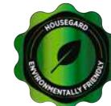

# **PRODUKTDATABLAD FDV**

Modell: K2

## **Bruksområde**

Er nya Housegard CO2 brandsläckare innehåller Koldioxid som ger apparaten brandklass B. B-apparater är avsedda för släckning av bränder i brandfarliga vätskor som t.ex bensin, olja, lack och färg. Koldioxid ger en ren släckning utan restprodukter och är därför också lämplig i rum med dyr mekanisk utrustning eller mot bränder i elektriska installationer som uppgår till 1000 Volt.

## **Användningsområde**

Industri, offentliga miljöer, livsmedelsindustri, storkök, datacentra, laboratorier, sjukhus, färghandel och kemisk industri. Koldioxid släcker utan restprodukter och är därför särskilt lämplig i lokaler med kostbar mekanisk eller elektronisk utrustning. Lämpar sig även i offentliga miljöer där efterskador i form av pulver eller skum bör undvikas.

## **Släckmedlets funktion**

CO2 är en färglös, giftfri gas som är tyngre än luft, kokpunkt -56 °C / fryspunkt -78 °C. CO2 verkar genom att kväva branden. CO2 -gasen tränger undan syret och lägger sig som en "filt" över brandområdet.

#### **Placering**

Släckaren levereras med en upphängningsanordning för montering på väggen. Om släckaren skall stå utomhus, eller i en starkt förorenad miljö bör den placeras i ett specialskåp för brandsläckare. Brandsläckaren bör placeras väl synlig och lättillgänglig.

#### **Underhåll och kontroll**

Visuell kontroll av brandsläckaren är användarens ansvar, tex att det är tillfredsställande tryck på handsläckaren. Underhåll av handsläckare skall utföras enligt SS 3656 och Housegard's serviceinstruktioner.

I privata bostäder rekommenderas en auktoriserad kontroll vart 5:e år och full service vart 10:e år. För näringsverksamhet gäller servicestandard SS 3656 och Housegards serviceinstruktioner. Standard SS 3656 omfattar handbrandsläckares funktionsduglighet, oavsett placering.

# **TEKNISK SPECIFIKATION**

| Brandklass:                       | B        | Modell:       | K2                              |
|-----------------------------------|----------|---------------|---------------------------------|
| Effektivitetsklass:               | 34B      | Artikel:      | 600066-60                       |
| Temperaturområde: -30 °C / +60 °C |          | EAN:          | 7320890066607                   |
| Släckmedel:                       | CO2      |               | EN3 Testrapport: 20180791/OX 61 |
| Storlek släckare:                 | 2 kg     | MED cert:     | 16/CN/4001-1-Rev 0              |
| Tömningstid:                      | 8 s      | Certifiering: | EN3-7, CE, Wheelmark            |
| Arbetstryck:                      | 220 Bar  |               |                                 |
| Arbetstryck:                      | 220 Bar  |               |                                 |
| Cylindermaterial:                 | Stål     |               |                                 |
| Drivgas:                          | Nitrogen |               |                                 |
| Bruttovikt (kg):                  | 6.95     |               |                                 |
| Höjd (mm):                        | 570      |               |                                 |
| Bredd (mm):                       | 114      |               |                                 |

*VIKTIGT: Brandsla*̈*ckaren ma*̊*ste alltid laddas om efter anva*̈*ndning a*̈*ven om bara delar av inneha*̊*llet anva*̈*nts. Omladdning kra*̈*ver specialutrustning. Kontakta en auktoriserad serviceverkstad. Anva*̈*nd endast specificerade sla*̈*ckmedel och reservdelar.*

För mer information, kontakta: GPBM Nordic AB Telefon: +46 (0)31 799 16 00

www.gpbmnordic.se

