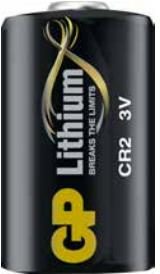

## GP fotobatteri, Lithium, CR 2-C1, 1-pack

GP fotobatteri ett lithiumbatteri speciellt anpassat för strömkrävande fotoutrustning används även till vissa ficklampor.

- Utmärkt prestanda
- Inbyggd säkerhetsmekanism
- Fungerar i -40° C till 60° C

**ARTICLE INFORMATION:** Art.no: 3703 EAN: 4891199006999

## GP fotobatteri, Lithium, CR 2-C1, 1-pack

## **Technical specifikation**

| Spänning (Volt)    | 3.000                     |  |  |
|--------------------|---------------------------|--|--|
| Tillverkningsland  | Kina                      |  |  |
| Statistiskt nummer | 8506503000                |  |  |
| EL-nr              | 62 093 42                 |  |  |
| Snro               | 8743012                   |  |  |
| Batterityp         | Lithium Manganese dioxide |  |  |
| Nobb number        | 40763161                  |  |  |
| Batteristorlek     | Button cells              |  |  |

## **Packaging information**

|                 | 1-P           | DISP          | EXKRT         | ST      |
|-----------------|---------------|---------------|---------------|---------|
| EAN kod         | 4891199006999 | 4891199007002 | 4891199007057 |         |
| Längd (mm)      | 120.000       | 122.000       | 392.000       | 0.000   |
| Höjd (mm)       | 16.000        | 87.000        | 292.000       | 27.000  |
| Bredd (mm)      | 84.000        | 88.000        | 472.000       | 15.600  |
| Bruttovikt (kg) | 0.02110       | 0.21100       | 8.85000       | 0.02000 |
| Net Weight (kg) | 0.01000       | 0.15000       | 4.50000       | 0.01000 |
| Gross Volume    | 0.00000       | 0.00000       | 0.05403       | 0.00012 |
| Net Volume      | 0.00000       | 0.00000       | 0.00000       | 0.00000 |
| Antal ST        | 1             | 10            | 450           | 1       |

**Page 2/2**