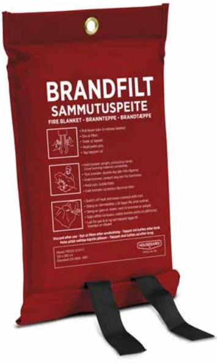
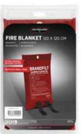

## Housegard brandfilt, 120x120 cm, röd

Brandfilten är ett bra komplement till brandsläckaren och då främst för att släcka mindre bränder på spisen, sängen, i möbler eller kläder. Att kväva eld med en brandfilt är väldigt effektivt, och kräver minimalt saneringsarbete. Placeras på ett sätt som gör den lättillgänglig på de platser en brand kan tänkas uppstå, tex i närheten av kök.
Housegard brandfilt 120 x 120 cm är ett bra budgetalternativ för hem och kontor. Placeras på ett sätt som gör den lättillgänglig på platser där en brand kan tänkas uppstå, tex i närheten av kök. 

- Silikonbeläggning
- 5 års garanti
- • Certifiering: EN 1869:1997

**ARTICLE INFORMATION:** Art.no: 602024 EAN: 7320896020245

E-nummer: 1693830

**Page 1/2**

## Housegard brandfilt, 120x120 cm, röd

## **Technical specifikation**

| Tillverkningsland  | Kina       |
|--------------------|------------|
| Statistiskt nummer | 7019900085 |
| E-nummer           | 1693830    |
| Nobb-nr            | 53109314   |

## **Packaging information**

|                    | PALL      | EXKRT          | 6-P            | 1-P           | ST      |
|--------------------|-----------|----------------|----------------|---------------|---------|
| EAN kod            |           | 27320896020249 | 17320896020242 | 7320896020245 |         |
| Längd (mm)         | 1200.000  | 0.000          | 210.000        | 35.000        | 0.000   |
| Höjd (mm)          | 1200.000  | 0.000          | 205.000        | 345.000       | 0.000   |
| Bredd (mm)         | 800.000   | 0.000          | 338.000        | 215.000       | 0.000   |
| Bruttovikt (kg)    | 167.50000 | 0.00000        | 4.80000        | 1.00000       | 1.00000 |
| Net Weight (kg)    |           | 9.60000        | 4.50000        | 0.80000       | 0.80000 |
| Volym              | 0.00000   | 0.00000        | 0.00000        | 0.00000       | 0.00292 |
| Net Volume         |           | 0.00000        | 0.00000        | 0.00000       | 0.00000 |
| Number LAV         | 2         |                |                |               |         |
| Nr of units on LAV | 5         |                |                |               |         |
| Antal ST           | 120       | 12             | 6              | 1             | 1       |

**Page 2/2**