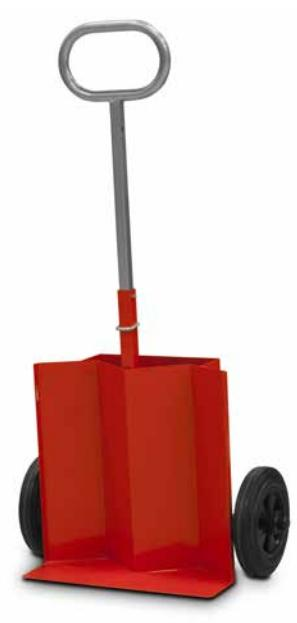
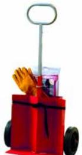

## Housegard Heta Arbeten släckkärra inklusive brandfilt & svetshandskar

1 st Kärra
1 st Brandfilt 120 x 180 cm
1 par Svetshandskar

**ARTICLE INFORMATION:** Art.no: 617004

EAN: 7320896170049 E-nummer: 1695152

**Page 1/2**

## Housegard Heta Arbeten släckkärra inklusive brandfilt & svetshandskar

## **Technical specifikation**

| Tillverkningsland  | Sverige    |
|--------------------|------------|
| Statistiskt nummer | 8716400000 |
| E-nummer           | 1695152    |
| Nobb-nr            | 43819542   |

## **Packaging information**

|                 | ST            |
|-----------------|---------------|
| EAN kod         | 7320896170049 |
| Längd (mm)      | 560.000       |
| Höjd (mm)       | 300.000       |
| Bredd (mm)      | 715.000       |
| Bruttovikt (kg) | 10.20000      |
| Net Weight (kg) | 9.15000       |
| Gross Volume    | 0.12010       |
| Net Volume      | 0.00000       |
| Antal ST        | 1             |

**Page 2/2**