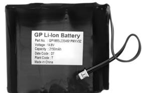

| nr. art. | montering i MC1. Ett batteri för MC1-Batteri 10-121-80 | Två batterier inkl. monteringskit för dubbel montage. MC1-Batteri x 2 90-900-130 | Ett batteri inkl. MC1-Batteri x 1 monteringskit. 90-900-115 |
|-------------|-----------------------------------------------------------------|----------------------------------------------------------------------------------------------|----------------------------------------------------------------------|
|             |                                                                 |                                                                                              |                                                                      |

| SPECIFIKATIONER | MC1-Batteri |
|-----------------|-------------|
| Mått (hxbxd)    | 72x78x19 mm |
| Nettovikt i kg  | 0,2         |
|                 |             |
|                 |             |

## **MC1-Batteri Batteribackup för MC1**

**EGENSKAPER OCH FÖRDELAR**

- Bygg in batteribackup i MC1.
- Upp till fyra batteripaket i en central.
- Batteripaket ger en reservtid på knappt ett dygn.

| DATA                 | MC1 Batteri |                                                                      |
|----------------------|-------------|----------------------------------------------------------------------|
| Batteriteknik        | Li-Ion      |                                                                      |
| Energiinnehåll mAh   | 2 000       |                                                                      |
| Livslängd            | 7 år        |                                                                      |
| OMGIVNING            |             |                                                                      |
| Temperatur 0 C | 0 till 40   |                                                                      |
| Luftfuktighet % Rh   | 10 till 90  |                                                                      |
| MÅTT I MM            |             |                                                                      |
| Höjd                 | 72          |                                                                      |
| Bredd                | 78          |                                                                      |
| Djup                 | 19          |                                                                      |
| Nettovikt kg         | 0,2         |                                                                      |
|                      |             |                                                                      |
|                      |             | 2011-03-18 Vi reserverrar oss för tryckfel och eventuella ändringar. |
|                      |             |                                                                      |
|                      |             |                                                                      |
|                      |             |                                                                      |
|                      |             |                                                                      |
|                      |             |                                                                      |
|                      |             |                                                                      |
|                      |             |                                                                      |
|                      |             |                                                                      |
|                      |             |                                                                      |
|                      |             |                                                                      |
|                      |             |                                                                      |
|                      |             |                                                                      |
|                      |             |                                                                      |
|                      |             | Aptus Elektronik AB aptus@aptus.se                                |

**ENERGI LARM PASSAGE**

## **www.aptus.se**

. Ekonomivägen 3-5, 436 33 Askim . telefon **växel:** 031 68 97 00 **försäljning:** 031 68 97 10 **fax:** 031 68 97 99 aptus@aptus.se www.aptus.se