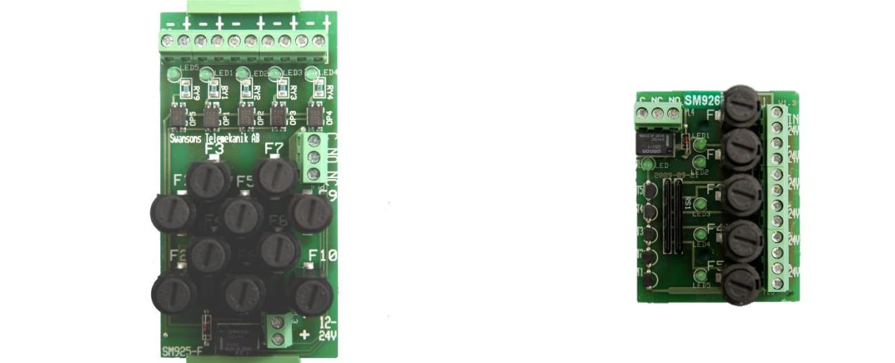
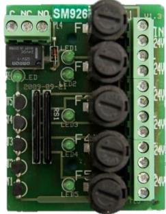
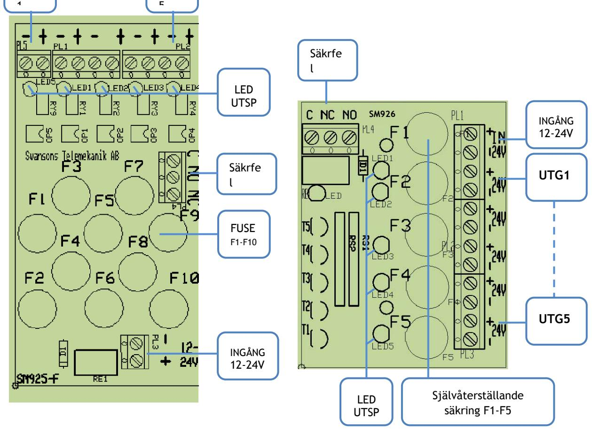

# **SM925/926 SÄKRINGSKORT FÖR INBYGGNAD**

 **SM40** 

### **BESKRIVNING SM925**

Säkringskort avsedda att fästas på DIN-skena i strömförsörjningsaggregatet.

SM925 har 5st grupper, som är försedda med 2A säkringar. Kan vid behov bytas till max 6,3 A säkringar , dock får det totala strömuttag på kortet ej överstiga 10A.

Varje säkrningsgrupp har separat LED-indikering av utspänningen. Utlöst säkring indikeras med att lysdioden för gruppen slocknar och ett summalarmsrelä aktiveras.

CE-märkt enligt EN61000-1-2 och EN61000-3-4

| TEKNISKA DATA   |         |
|-----------------|---------|
| Inspänning DC   | 9-32VDC |
| Max ström/grupp | 6,3A    |
| Max ström/kort  | 10A     |

#### **BESKRIVNING SM926**

Säkringskort avsedda att fästas på DIN-skena i strömförsörjningsaggregatet.

Kortet har 5st 1 poliga grupper som är försedda med 2A säkringa.

Max strömuttag på kortet är 6.

Säkringarna är av autofuse som återställer sig själv när felet försvinner.

Varje säkringsgrupp har separat LED-indikering av utspänningen. Utlöst säkring indikeras med att lysdioden för gruppen slocknar och ett summalarmsrelä aktiveras. CE-märkt enligt EN61000-1-2 och EN61000-3-4

## **TEKNISKA DATA**

| Inspänning DC   | 9-32VDC |  |
|-----------------|---------|--|
| Avsäkring grupp | 2A      |  |
| Max ström/kort  | 6A      |  |

| E-Nummer Typ |       | Beskrivning                                | Mått H x B x D (mm) |
|--------------|-------|--------------------------------------------|---------------------|
| 5257065      | SM925 | AVSÄKRINGSKORT 5 GRUPPER 2-POL LARM 12-24V | 115 x 57 x 73       |
| 5257066      | SM926 | AVSÄKRINGSKORT 5 GRUPPER 1-POL LARM 12-24V | 83 x 58 x 42        |

Postadress/Postal address **Swansons Telemekanik AB** Hålstensvägen 4 SE-446 37 Älvängen

Telefon nr/Telephone no +46(0)303-746 320 Hemsida/Webb www.swtm.se

Telefax nr/Telefax no +46(0)303-748 490 e-post info@swtm.se

VAT.NO SE556289017701  **SM40** 

#### **INKOPPLINGSANVISNING SM925 Strömförsörjning med plats för batteri**

- Anslut först kablarna mellan gruppsäkringskortet och spänningskällan.
- Kontrollera att utspänningen är riktig och att den gröna lysdioderna tänds.
- Om lysdiod för spänningsindikering ej tänds kontrollera inspänning och ingångssäkringarna.
- Löser säkringarna, kontrollera inkoppling och inkopplade apparater.

UTG

- Anslut lasten
UTG

### **INKOPPLINGSANVISNING SM926**

- Anslut först kablarna mellan gruppsäkringskortet och spänningskällan.
- Kontrollera att utspänningen är riktig och att den gröna lysdioderna tänds.
- Om lysdiod för spänningsindikering ej tänds kontrollera inspänning och ingångssäkringarna.
- Löser säkringarna, kontrollera inkoppling och inkopplade apparater. När felet är borta återställer sig säkringen automatiskt.
- Anslut lasten

Postadress/Postal address **Swansons Telemekanik AB** Hålstensvägen 4 SE-446 37 Älvängen

Telefon nr/Telephone no +46(0)303-746 320 Hemsida/Webb www.swtm.se

Telefax nr/Telefax no +46(0)303-748 490 e-post info@swtm.se

VAT.NO SE556289017701