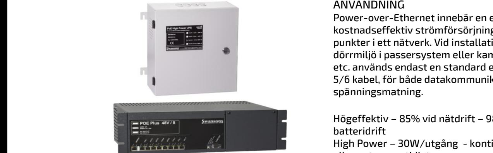
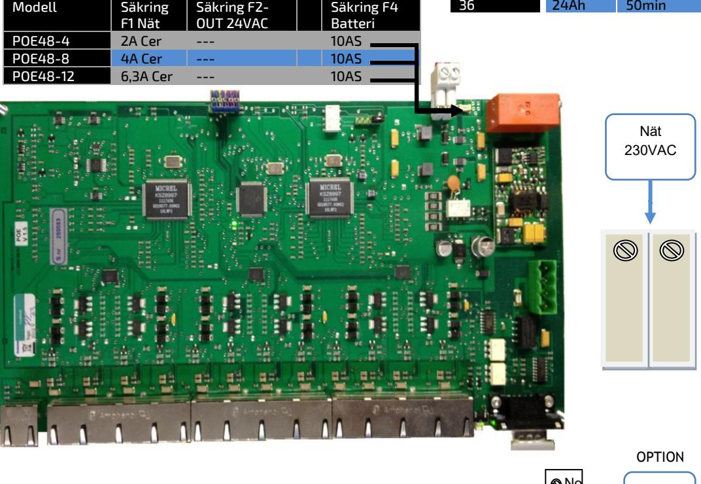
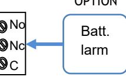

# POE-48

# POWER OVER ETHERNET MED BATTERIBACKUP

#### Skydd:

Aggregatet är skyddad mot överbelastning och kortslutning. Inbyggt skydd mot djup-urladdning av batterierna. Nät, last och batteri skyddas av säkringar.

#### Indikeringar och larm:

Nätspänning indikeras med grön lysdiod på fronten och larm med röd lysdiod. Kan kompletteras med larmrelä för nät och batterifel.

#### TEKNISKA DATA

Inspänning 88-265VAC +/- 15% 1 fas 50-60Hz Reglering max 0,6 % Batterispänn. 48VDC (54,6V) Temp.omr- -10 – +30 C

IEEE 802.3at/ IEEE802.3af 100 MBIT/ kanal TCP-IP PROTOKOLL: kommande funktion

#### ANVÄNDNING

Power-over-Ethernet innebär en enkelt och kostnadseffektiv strömförsörjning till accesspunkter i ett nätverk. Vid installation av en dörrmiljö i passersystem eller kamerautrustning etc. används endast en standard ethernet, CAT 5/6 kabel, för både datakommunikation och spänningsmatning.

Högeffektiv – 85% vid nätdrift – 98% vid batteridrift High Power – 30W/utgång - kontinuerlig drift på alla portar samtidigt. Övervakad batteriladdare – hög säkerhet. Batterier, nät och utgångar övervakade med larmrelä, LED indikering.

#### UTFÖRANDE:

POE-48/xx 30W/port, IEEE802.3at, PoE Plus är en switch med strömförsörjning, batteriladdare och batterier i en enhet. Aggregatet uppfyller både IEEE802.3af och IEEE802.3at. och kan för närvarande tillåta upp till 30W/port. Finns för 19" rack, väggmontage och med 4-36 portar med inbyggd batteribackup.

Bestyckad med ett RJ45 8-pol uttag utöver det ordinarie portantalet som är avsett att användas som ingång (utan POE). Övriga portar är RJ45 8 pol som är försedda med led för datatrafik och status.

POE48-24/R-UPS har växelriktare - 150W 230VAC uttag med batteribackup. (Offline)

CE-märkt enligt EN61000-6-3:2001 EN61000-6- 2:2005.

| E-Nummer | Typ                       | Beskrivning                                                                  | HxBxD mm    |
|----------|---------------------------|------------------------------------------------------------------------------|-------------|
| 5172434  | POE48- 4/R                | POE 48V 150W 4 PORTAR 19" max 4x 9Ah                                   | 132x480x320 |
| 5172435  | POE48- 8/R                | POE 48V 320W 8 PORTAR 19" max 4x 9Ah                                   | 132x480x320 |
| 5172436  | POE48- 12/R               | POE 48V 500W 12 PORTAR 19" max 4x9Ah                                      | 132x480x320 |
| 5172437  | POE48- 24/R               | POE 48V 600W 24 PORTAR 19" max 4x9Ah                                      | 132x480x320 |
|          | POE48- 24/R UPS        | POE 48V 1000W 24 PORTAR 19" 230V 150W uttag på sidan - externa batteri | 132x480x320 |
| 5172431  | POE48- 4/V                | POE 48V 150W 4 PORTAR VÄGGMONTAGE max 4x9Ah                               | 320x390x160 |
| 5172432  | POE48- 8/V                | POE 48V 320W 8 PORTAR VÄGGMONTAGE max 4x9Ah                               | 320x390x160 |
| 5172433  | POE48- 12/V               | POE 48V 500W 12 PORTAR VÄGGMONTAGE max 4x9Ah                              | 320x390x160 |
|          | SBX197                    | Batteribox 3 19" max 8x 7-9Ah m säkring o kablage                            | 132x480x320 |
|          | Postadress/Postal address | Telefon nr/Telephone no e-post                                            | VAT.NO      |

**Swansons Telemekanik AB** Hålstensvägen 4 SE-446 37 Älvängen

+46(0)303-746 320 Hemsida/Webb www.swtm.se

info@swtm.se

SE556289017701

# POE-48 POWER OVER ETHERNET MED BATTERIBACKUP

### SÄKERHET

Denna instruktion skall läsas igenom grundligt och förstås av all handhavande personal. Vid minsta tveksamhet om systemets uppbyggnad, funktion, komponenter samt säkerhet skall leverantören kontaktas. Endast auktoriserad och erfaren personal inom AC och DC får använda, arbeta, serva/underhålla, installera denna enhet.  **SM40 Strömförsörjning med plats för batteri**

Endast isolerade verktyg får användas i enheten. Observera att farliga spänningar och strömmar förekommer i apparaten både när interna säkringarna är av eller på.

Kontrollera att kretskort sitter fast och inga delar är transportskadade.

Om batterier används är dessa alltid elektrokemiskt aktiva. Kortslut inte batteripolerna.

## INKOPPLING

- Montera aggregatet fritt. Minst 100mm på varje sida.
- Anslut först 230V AC.
- Lysdiod för nätspänning tänds. Kontrollera att utspänningen är den önskade.
- Spänningsjustering görs direkt på likriktaren.
- Om lysdiod för nätindikering ej tänds kontrollera inspänning och ingångssäkringarna.
- Anslut batterierna och därefter lasten.
- Löser utgångssäkringarna, kontrollera inkoppling och inkopplade apparater.

| Utgångar | Batteri | 30W/utg | 15W/utg | 6W/utg |
|----------|---------|---------|---------|--------|
| 4        | 7Ah     | 2tim    | 5,3tim  | 14tim  |
|          |         |         |         |        |
| 8        | 7Ah     | 60min   | 2,5tim  | 6,3tim |
|          |         |         |         |        |
| 12       | 9Ah     | 55min   | 1,8tim  | 4,9tim |
|          |         |         |         |        |
| 24       | 12Ah    | 40min   | 1,4tim  | 4tim   |
| 36       | 24Ah    | 50min   | 1,7tim  | 4,5tim |

Postadress/Postal address **Swansons Telemekanik AB** Hålstensvägen 4 SE-446 37 Älvängen

Telefon nr/Telephone no +46(0)303-746 320 Hemsida/Webb www.swtm.se e-post info@swtm.se

VAT.NO SE556289017701