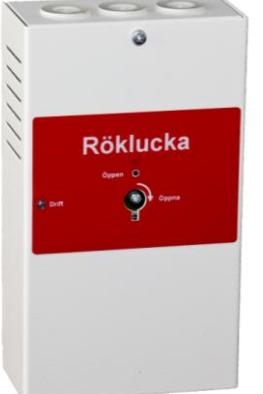
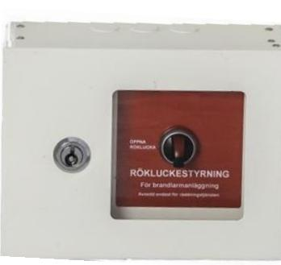
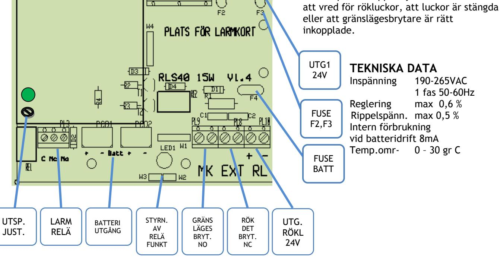
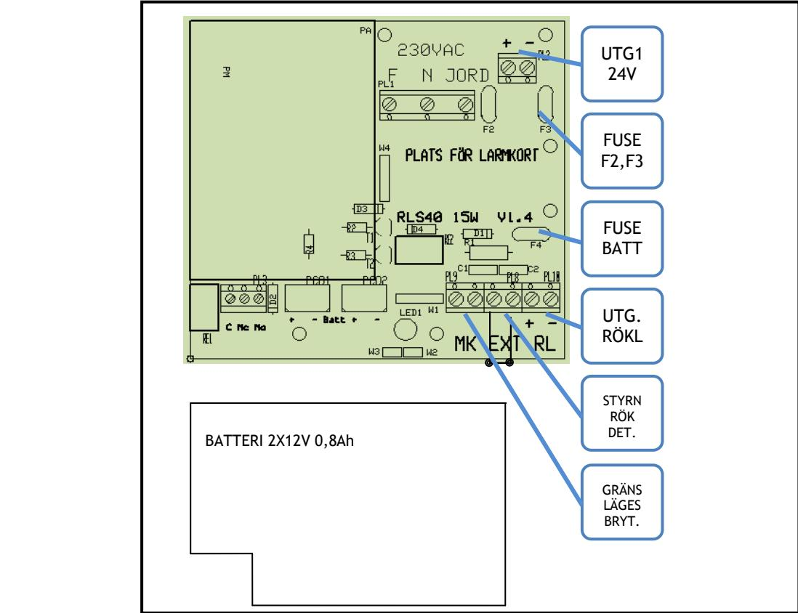
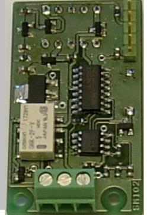
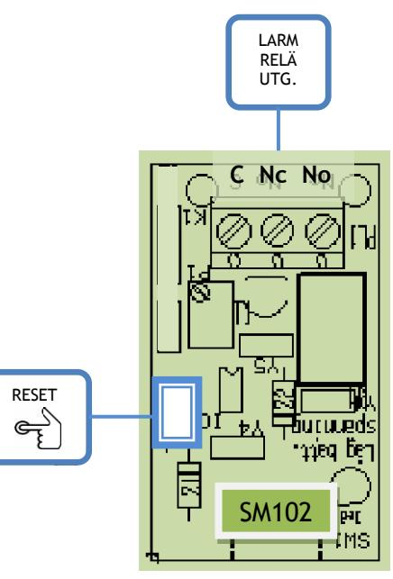
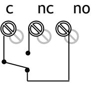

# **RLS40-100-500-600 RÖKLUCKESTYRNING**

 **SM40** 

**RLS40 med batteri RLS100-1** 

**RLS500-1 med batteri RLS600-1** 

**Skydd:** Aggregatet är skyddad mot överbelastning och kortslutning. Inbyggt skydd mot djupurladdning av batterierna. Nät, last och batteri skyddas av säkringar.

**Indikeringar och larm:** Summalarmrelä för vidarekoppling av larm.

## **STYRNINGAR**

**Utgångar-** 

- 1st grupp av rökluckor
- Summalarmrelä
**Ingångar-** 

- Gränslägesbrytare för indikering öppen röklucka

- Styrning av rökluckor från brandlarmcentral eller rökdetektor.

#### **BESKRIVNING**

Styrenheter manövrering av rökluckor med omkopplare och elektronik för styrning från brandlarmcentral eller liknande. Är utförd i vit pulverlackad välventilerad plåtkapsling med 3st genomförningar uppåt.  **Strömförsörjning med plats för batteri**

> **RLS40** med inbyggd strömförsörjning och batterier och manövreras med brandkårsnyckeln.

Nätaggregatet är primärswitchad och levereras med 2st 12V 0,8Ah batterier. Grön driftindikering och röd LED visar öppen lucka. Kan förses med larmkort SM102 för batterilarm och likriktarfel.

**RLS40K** som ovan, men manövreras med via en plomberbar, återfjädrande strömbrytare på locket.

**RLS500-1** styrenhet med samma funktioner som RLS40 men med öppningsbar lucka med vred. Luckan öppnas med brandkårsnyckeln och luckorna manövreras med vredet.

**RLS600-1** kapsling med vred och indikering. För yttre strömförsörjning.

**RLS100-1/12** Obestyckade kapslingar. Finns med hålbild för 1-12vred. 22,5mm hål.

*CE-märkt enligt* **EN61000-6-3:2001 EN61000-6- 2:2005.** 

| E-Nummer | Typ       | Utsp. och ström           |          | Batteriplats                                          | HxBxD mm    |
|----------|-----------|---------------------------|----------|-------------------------------------------------------|-------------|
| 6300999  | RLS40     | 24V 0,5A                  | 1 utgång | 2x0,8Ah                                               | 200x110x60  |
|          |           | RLS40K (m knapp) 24V 0,5A | 1 utgång | 2x0,8Ah                                               | 200x110x60  |
| 6301000  | RLS500-1  | 24V 0,5A                  | 1 utgång | 2x0,8Ah                                               | 160x220x80  |
| 6301001  | RLS600-1  | - -                    | 1 utgång |                                                       | 160x220x80  |
| 6301002  | RLS100-1  |                           |          | Tom kapsling med monteringsplåt med hål för ett vred  | 160x220x80  |
| 6305002  | RLS100-2  |                           |          | Tom kapsling med monteringsplåt med hål för två vred  | 160x220x80  |
| 6305003  | RLS100-6  |                           |          | Tom kapsling med monteringsplåt med hål för sex vred  | 350x360x100 |
| 6305004  | RLS100-12 |                           |          | Tom kapsling med monteringsplåt med hål för tolv vred | 465x360x115 |
|          |           |                           |          |                                                       |             |

Postadress/Postal address **Swansons Telemekanik AB** Hålstensvägen 4 SE-446 37 Älvängen

Telefon nr/Telephone no +46(0)303-746 320 Hemsida/Webb www.swtm.se

Telefax nr/Telefax no +46(0)303-748 490 e-post info@swtm.se

## **SÄKERHET**

Endast auktoriserad och erfaren personal inom AC och DC får använda, arbeta,  **SM40** 

serva/underhålla, installera denna enhet. Endast isolerade verktyg får användas i enheten. Observera att farliga spänningar och strömmar förekommer i apparaten både när interna säkringarna är av eller på.  **Strömförsörjning med plats för batteri**

Denna instruktion skall läsas igenom grundligt och förstås av all handhavande personal. Vid minsta tveksamhet om systemets uppbyggnad, funktion, komponenter samt säkerhet skall leverantören kontaktas.

Kontrollera att kretskort sitter fast och inte är transportskadade.

Om batterier används är dessa alltid elektrokemiskt aktiva. Kortslut inte batteripolerna.

## **INKOPPLING**

## **FUNKTION**

- När knapp för öppning av röklucka aktiverats, försvinner spänning på utg. plint RL, rökluckorna öppnas och knappen lyser rött om gränslägesbrytare är inkopplad. När knappen återställs kommer spänningen tillbaka på plinten. Lampan i knappen släcks när rökluckorna är stängda.
- Styrning från brandlarmcentral eller rökdetektor kopplas till EXT plinten. Rökdetektorn spänningsmatas från Utg.1
- Är någon lucka öppen indikeras fel med att lampan i knappen tänds och larmreläet växlar.
- Larmrelä kan programmeras så att det växlar antingen i tillsammans med utgången eller med lampan.
	- W3 Relä växlar med gränslägesbr/lampa
	- W2 Relä växlar med utgång

### **INKOPPLING**

- Montera aggregatet fritt.
- Anslut först 230V AC.
- Lysdiod för nätspänning tänds. Kontrollera att utspänningen är riktig.
- Vid behov justera utspänningen med P1.
- Om lampan i knappen lyser rött kontrollera att vred för rökluckor, att luckor är stängda eller att gränslägesbrytare är rätt inkopplade.

Postadress/Postal address **Swansons Telemekanik AB** Hålstensvägen 4 SE-446 37 Älvängen

Telefon nr/Telephone no +46(0)303-746 320 Hemsida/Webb www.swtm.se

Telefax nr/Telefax no +46(0)303-748 490 e-post info@swtm.se

# **RLS 500-600**

## **BATTERIINKOPPLING RLS 40/500 SM40 Strömförsörjning med plats för batteri**

**RÖKLUCKESTYRNING**

in under drift.

Kontrollera att kretskort sitter fast och inte är transportskadade. Om batterier används är dessa alltid elektrokemiskt aktiva. Kortslut inte batteripolerna. Batteri monteras enligt bild nedan och ansluts till batterikontakt PC01 och PC02. Kan kopplas

#### **INKOPPLING**

- Montera aggregatet fritt.
- Anslut först 230V AC.
- Lysdiod för nätspänning tänds. Kontrollera att utspänningen är riktig.
- Vid behov justera utspänningen med P1.
- Funktion enligt generell inkopplingsanvisning

Postadress/Postal address **Swansons Telemekanik AB** Hålstensvägen 4 SE-446 37 Älvängen

Telefon nr/Telephone no +46(0)303-746 320 Hemsida/Webb www.swtm.se

Telefax nr/Telefax no +46(0)303-748 490 e-post info@swtm.se

## **SM102 LARMKORT**

### **BESKRIVNING**

Mikroprocessorstyrt larmkort avsedda att fästas på hållare i strömförsörjningsaggregat SM40 och SM3100. Utlösta larm indikeras på fronten och summalarmrelä med potentialfria växlingskontakter för vidaresändning. **SM102 -** Övervakar laddningsspänningen och batterikretsen samt lågbatterispänningslarm vid batteridrift.

**LÅGBATTERISPÄNNING:** Övervakar batterispänningen. Larmar när det vid batteridrift är för låg batterispänning. Larmgräns när det finns ca 30% kvar i batterikapaciteten. Röd lysdiod på fronten blinkar sakta (0,5Hz) och larmreläet aktiveras. Larmet återställs automatiskt när batteriet uppladdas.  **SM40 Strömförsörjning med plats för batteri**

> **LADDSPÄNNINGSLARM:** Övervakar laddningsspänningen för att säkerställa att batterierna får rätt laddningsspänning. Larmar när laddningsspänningen är 2% över eller under nominellt värde. Lysdiod på fronten blinkar sakta grönt/rött **(0,5Hz)**  och larmreläet aktiveras. Laddningsspänningslarmet är fördröjt och börjar inte mäta förrän efter 4 timmars drifttid och larm återställs automatiskt när spänningen är justerad.

**BATTERIÖVERVAKNING:** Mäter batterispänningen var 15 minut. Faller batterispänningen under larmnivån, aktiveras larmkretsen. Lysdiod på fronten blinkar snabbt grönt/rött (2Hz) och larmreläet aktiveras. Larmet kan återställas när batterierna är kontrollerade eller utbytta.

CE-märkt enligt EN61000-1-2 och EN61000-3-4

| E-Nummer Typ |     | Beskrivning                                                           |
|--------------|-----|-----------------------------------------------------------------------|
| 5256993      | 102 | LARMKORT Laddspänningslarm - Batteriövervakning - Låg batterispänning |
|              |     |                                                                       |

Postadress/Postal address **Swansons Telemekanik AB** Hålstensvägen 4 SE-446 37 Älvängen

Telefon nr/Telephone no +46(0)303-746 320 Hemsida/Webb www.swtm.se

Telefax nr/Telefax no +46(0)303-748 490 e-post info@swtm.se

## **INKOPPLINGSANVISNING AV LARMKORT SM40 Strömförsörjning med plats för batteri**

- **Larmkortet monteras på likriktarens huvudkort på plats märkt "larmkort".**
- **Tryck dit kortet på stiftlisten och pressa ner kretskortshållarna i hålen.**
- **Spänning behöver inte brytas när kortet monteras.**
- **Larmkortet ställer automatiskt in sig på den spänning som ska övervakas - 24V system eller 12V system. Detta görs under kortets uppstart.**
- **NÄR DETTA ÄR KLART BLINKAR RÖD LYSDIOD. ÅTERSTÄLL MED ATT HÅLLA ÅTERSTÄLLNINGKNAPPEN INTRYCKT I 2 SEKUNDER. KORTET ÄR NU DRIFTSATT.**
- **Anslut ledningar från övervakningsenhet till plinten på larmkortet.**
- **Larmreläet växlar vid larm och led i locket lyser för aktuellt larm.**

## **INSTÄLLNINGAR**

Larmnivåer ställer automatiskt in sig på standardvärde enligt nedanstående tabell.

För att kontrollera larmnivåer, koppla loss batterier och bryt bort last, om det behövs, för att inte skada utrustning och få rätt funktion.

Därefter ställs likriktaraggregatet in på den spänning som är larmnivå**.** 

Vid larm tänds indikering och larmreläet klickar.

När kontrollen är klar, justeras laddningsspänningen till rätt nivå på likriktaren. Koppla in last och batterier igen. Systemet är nu i driftläge igen.

## **LARMRELÄ**

#### LARMNIVÅER STANDARDVÄRDEN

| LARMTYP SYSTEMSPÄNNING | 13,7V | 27,4V |
|---------------------------|-------|-------|
| LADDSPÄNNINGSFEL          | +/-2% | +/-2% |
| LÅG BATTERISPÄNNING       | 12    | 24    |
| BATTERIKRETSFEL           | 12,2  | 24,5  |

Postadress/Postal address **Swansons Telemekanik AB** Hålstensvägen 4 SE-446 37 Älvängen

Telefon nr/Telephone no +46(0)303-746 320 Hemsida/Webb www.swtm.se

Telefax nr/Telefax no +46(0)303-748 490 e-post info@swtm.se