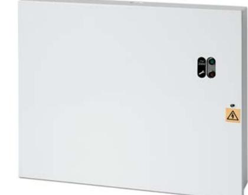

## Strömförsörjning switchat 24 V, 3 A

PM863

## Strömförsörjning switchat 24 V, 3 A Denna effektiva strömförsörjning är idealisk för användning i

CCTV-, passer- och icke godkända brandlarmanläggningar.

Med en reglerad 27,6 VDC utgång levereras kontinuerlig full märkström 2 A, plus ytterligare 1 A för laddning av två stycken 12 V backup batterier.

Den högeffektiva switchade konstruktionen garanterar låga driftskostnader, genererar mindre värme och med ett litet kretskort ökar utrymmet för ytterligare PCB eller kablar i kapslingen. Den modulära konstruktionen förenklar underhållet.

## Tekniska data

| Inspänning                       | 230 VAC 50 Hz ±10%         |
|----------------------------------|----------------------------|
| Utspänning                       | 27,6 VDC                   |
| Kontinuerlig last                | 2 A                        |
| Total belastning                 | 3 A                        |
| Rippel ut                        | Max. 100 mVrms             |
| Ackumulator(er)-max              | 2 st 7,2 Ah                |
| Batteri laddningstid (tim.)      | 20                         |
| Batterinivå bortkoppling         | 19,6 ±0,2 VDC              |
| Öppen kollektorutgång            | Öppen vid fel eller nätfel |
|                                  | - 0 V - 100 mA             |
| Säkring 24 VDC                   | 3 A                        |
| Säkring 230 VAC                  | 2 A                        |
| Arbetsemperatur                  | -10 till +40 °C            |
| Relativ luftfuktighet            | 95%                        |
| Kapsling (metall) pulverlackerad | 1,2 mm                     |
| Dimension (B x H x D)            | 330 x 275 x 80 mm          |

## Order data

PM861 PM862 PM863 PM865

Strömförsörjning switchat 24 V, 1 A Strömförsörjning switchat 24 V, 2 A Strömförsörjning switchat 24 V, 3 A Strömförsörjning switchat 24 V, 5 A

ENät- och felindikeringar

- EUrladdningsskydd
- E Sabotageskyddad
- E Felutgång

- E Säkringar för nät- och utspänning
- E Kapsling av pulverlackerad metall