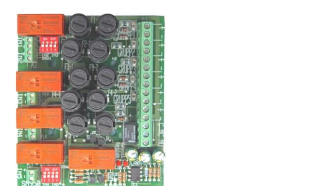
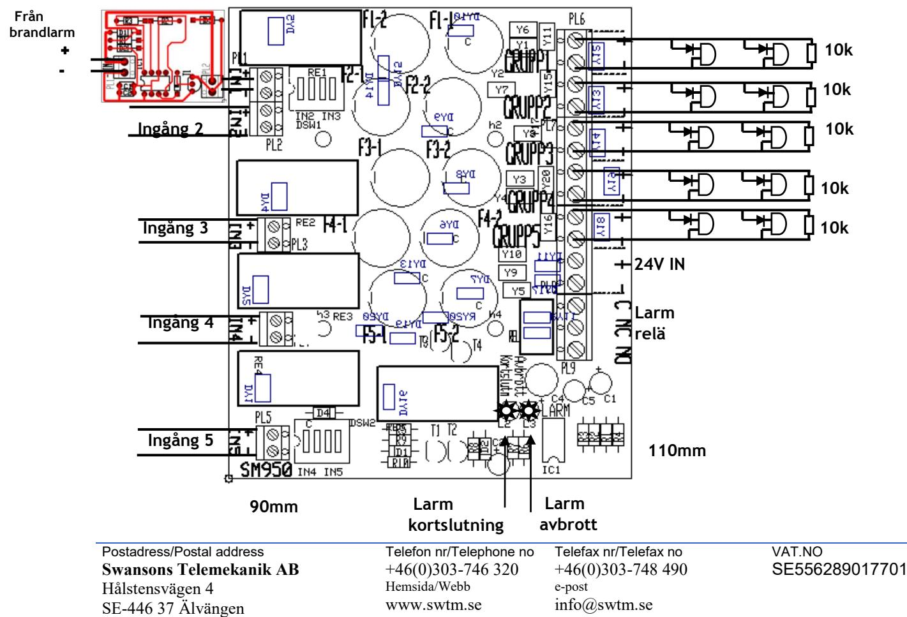
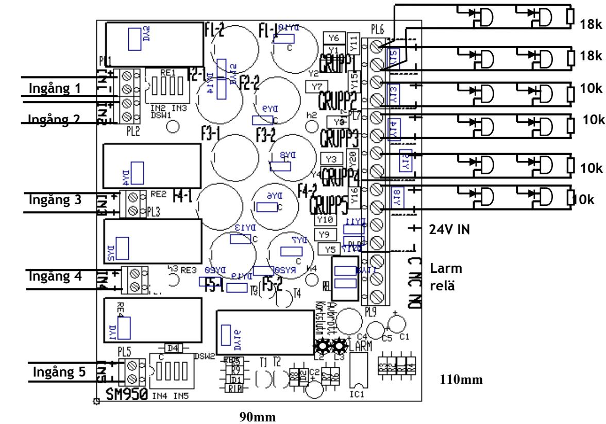
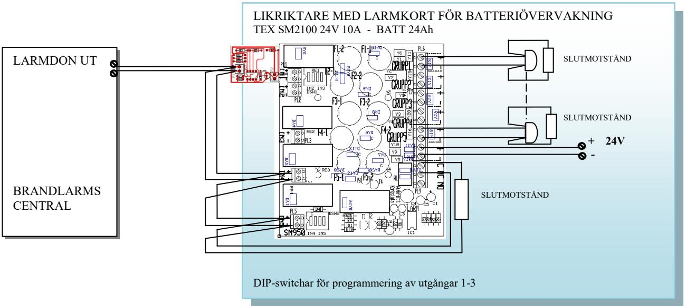
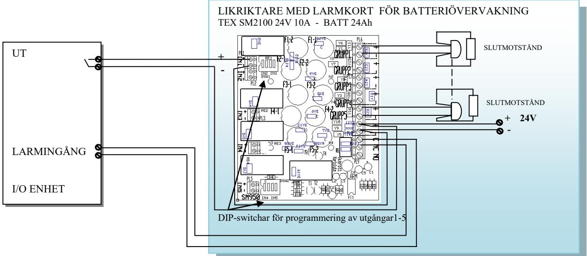
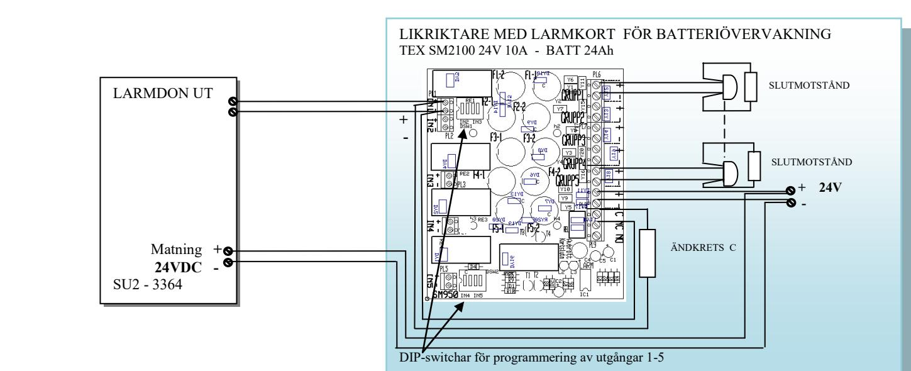

#### **Funktion:**

Utgångarna är slingövervakade och har indikering för avbrott eller kortslutning av slinga. Vid fel släpper ett summalarmrelä med växlande kontakter.

Styrning av reläerna görs med 5st separata ingångar och förses med motstånd för att anpassas till brandlarmcentral slingavkänning. Ingång 1 kan, genom att ställa dipswitchar, även aktivera andra utgångar. Pulskort SM955 kan kopplas i på ingång 1 för att få pulserande styrning av utgångarna som väljs med dipswitchar.

Kan styras med annan spänning eller hämta styrspänning från 24V ingången.

Fel på slingor indikeras med att röd lysdiod, märkt med typ av fellarm, tänds och att ett summalarmrelä med potentialfri växlingskontakt aktiveras.

SM950 har låg egenförbrukning med en tomgångsström på 30mA

Vid aktivering av larmdonsutgång tänds LED-en för den utgången. Utgångar som ej används måste förses med slutmotstånd.

### **BESKRIVNING**

 

Larmdonskort för montage i 19" kassett (SM911), i våra likriktare eller i kapsling för väggmontage. 19" kassetten SM911 kan förses med 4st kort. Det ger upp till 20 utgångar i en 19" enhet. Kapslingen för väggmontage är komplett med hållare och genomförningar och kan förses med ett styrkort för larmdon.  **Strömförsörjning med plats för batteri**

> **SM950 -** kortet har 5st 2-poligt avsäkrade utgångar som vid leverans är försedda med 2AT säkringar. Kan vid behov bytas till max 6,3 AT säkringar, dock får det totala strömuttag på kortet ej överstiga 15A. För varje utgång finns ett kraftigt relä som kan belastas med max 8A. Plint för max 2,5 mm2 kabel.

> **SM955 -** Pulskort som ger pulserande utsignal – 0,8/0,8 sekunders intervall. Används även när brandlarmscentralen inte har pulserande utgångar.

Kopplas in på ingång 1 och sen programmeras vilka ingångar den skall styra. När sedan ingången på kortet får en 24V spänning ger det en pulserande utsignal som styr de programmerade ingångarna i samma takt så länge ingång 1 är aktiverad. Man kan blanda pulserande och fast signal efter eget tycke på kortet**.** 

### **TEKNISKA DATA**

**Inspänning DC 20-30VDC Strömförbrukning vila/larm 30 / 120mA** 

*CE-märkt enligt EN61000-6-3:2001 EN61000-6- 2:2005.* 

| E-Nummer | Typ    |                                                | HxBxD mm   |
|----------|--------|------------------------------------------------|------------|
| 5247057  | 950    | SM950 Larmdonsstyrningskort 5x2-pol 2A grupper | 110x90x50  |
| 5247058  | PCM150 | Väggkapsling med transparant lock              | 180x130x75 |
| 5247059  | 955    | SM955 Pulskort                                 | 40x40x20   |
| 5247046  | 911S   | SM911 19" ram för 4st styrkort                 | 135x480x60 |
| 5247047  | 912S   | SM912 Lock till 19" ram                        | 135x480    |

Postadress/Postal address **Swansons Telemekanik AB** Hålstensvägen 4 SE-446 37 Älvängen

Telefon nr/Telephone no +46(0)303-746 320 Hemsida/Webb www.swtm.se

Telefax nr/Telefax no +46(0)303-748 490 e-post info@swtm.se

# **SM950 E nr: 52 470 57**

 **SM955 E nr: 52 470 59**

### **INKOPPLINGSANVISNING**

- **Anslut först 24V därefter lasten**
- **Utgångar som ej används avslutas med 10k slutmotstånd**
- **Ingång 1 kan, genom att ställ dipswitchar, även aktivera andra utgångar. För att aktivera utgång 1 och 2 så ansluts styrspänning på ingång 1 och på dipswitch DSW1 sätter man de två första kontakterna som är märkta IN2 i läge on. Skall alla utgångar styras av ingång 1 så sätter man alla dipswitcharna på DSW1 och DSW2 i läge on.**
- **När pulskort SM955 används ska det monteras på ingång1. När 24VDC spänning ansluts på pulskortets ingång ger den pulserande spänning till IN1 med frekvens 0,8/0,8Hz. Med DSW1 och DSW2 väljs vilka ingångar som ska följa med. Utgångarna kommer att arbeta synkroniserat så ingen "eko effekt" uppstår.**
- **Vid avbrott eller kortslutning på någon av larmdonsslingorna aktiveras larmreläet och lysdiod indikerar typ av fel.**
- **När någon av styrningarna/ingångarna är aktiverad görs ingen mätning på slingorna och lysdiod som indikerar kortslutning tänds.**
- **Löser säkringarna, kontrollera inkoppling och inkopplade apparater.**
- **Larmnivåer – spänningen är en reverserad spänning, det är – på + utgången och + på – utgången. Vid aktivering av larmdonsutgången försvinner den reverserade spänningen och den normal + och – erhålles.** 
	- **normal drift – 12-13,5VDC**
	- **avbrott >14,5VDC ( 14,5kohm)**
	- **kortslutning < 5VDC ( 3kohm)**

## **SM950 E nr: 52 470 57**

### **INKOPPLINGSANVISNING MED DELADE SLINGOR**

- **Anslut först 24V därefter lasten**
- **Utgångar som ej används avslutas med 10k slutmotstånd**
- **Ingång 1 kan, genom att ställ dipswitchar, även aktivera andra utgångar. För att aktivera utgång 1 och 2 så ansluts styrspänning på ingång 1 och på dipswitch DSW1 sätter man de två första kontakterna som är märkta IN2 i läge on. Skall alla utgångar styras av ingång 1 så sätter man alla dipswitcharna på DSW1 och DSW2 i läge on.**
- **När pulskort SM955 används ska det monteras på ingång1. När 24VDC spänning ansluts på pulskortets ingång ger den pulserande spänning till IN1 med frekvens 0,8/0,8Hz. Med DSW1 och DSW2 väljs vilka ingångar som ska följa med. Utgångarna kommer att arbeta synkroniserat så ingen "eko effekt" uppstår.**
- **Vid avbrott eller kortslutning på någon av larmdonsslingorna aktiveras larmreläet och lysdiod indikerar typ av fel.**
- **När någon av styrningarna/ingångarna är aktiverad görs ingen mätning på slingorna och lysdiod som indikerar kortslutning tänds.**
- **Löser säkringarna, kontrollera inkoppling och inkopplade apparater.**
- **Larmnivåer – spänningen är en reverserad spänning, det är – på + utgången och + på – utgången. Vid aktivering av larmdonsutgången försvinner den reverserade spänningen och den normal + och – erhålles.** 
	- **normal drift – 12-13,5VDC**
	- **avbrott >14,5VDC ( 14,5kohm)**

- **kortslutning < 5VDC ( 3kohm)**
**FUSE1,1-5,2** Sekundärsäkringar 2AT ( Max 6,3AT)

Postadress/Postal address **Swansons Telemekanik AB** Hålstensvägen 4 SE-446 37 Älvängen

Telefon nr/Telephone no +46(0)303-746 320 Hemsida/Webb www.swtm.se

Telefax nr/Telefax no +46(0)303-748 490 e-post info@swtm.se

#### **STYRNING AV SM950 FRÅN BRANDLARMSCENTRALENS LARMDONSUTGÅNG MED PULSKORT SM955 FÖR PULSERANDE UTGÅNGSSIGNAL PÅ UT1-3 OCH FAST PÅ UT4-5. SM40 Strömförsörjning med plats för batteri**

### **STYRNING FRÅN I/O ENHET MED RELÄUTGÅNG**

Postadress/Postal address **Swansons Telemekanik AB** Hålstensvägen 4 SE-446 37 Älvängen

Telefon nr/Telephone no +46(0)303-746 320 Hemsida/Webb www.swtm.se

Telefax nr/Telefax no +46(0)303-748 490 e-post info@swtm.se

### **STYRNING FRÅN UTGÅNGSENHET MED LARMDONSUTGÅNGAR SM40**

Postadress/Postal address **Swansons Telemekanik AB** Hålstensvägen 4 SE-446 37 Älvängen

Telefon nr/Telephone no +46(0)303-746 320 Hemsida/Webb www.swtm.se

Telefax nr/Telefax no +46(0)303-748 490 e-post info@swtm.se