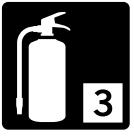
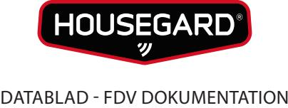
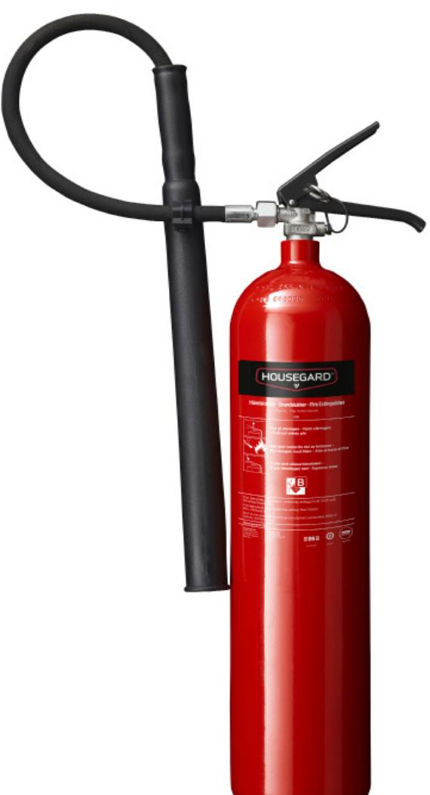
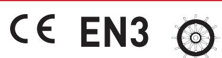

# HOUSEGARD K5TGX

5 kg koldioxid (CO2 ) släckare Effektivitetsklass 89B

CO2 ger en ren släckning med minimala sekundärskador. CO2 släckare är därför särskilt lämpliga för släckning av brand i elektriska utrymmen, datarum etc. Kan också användas för släckning av brand i brandfarliga vätskor. Housegard CO2 släckaren är tillverkad av stål och ventilen är gjord av mässing. Arbetsområde är -30°C/+60°C.

## FUNKTION

CO2 är en färglös, giftfri gas tyngre än luft, kokpunkt -56 C / fryspunkt -78 C. CO2 verkar genom att kväva branden. CO2 -gasen tränger undan syret och lägger sig som en "filt" över brandområdet.

### ANVÄNDNINGSOMRÅDEN

Industri, offentlig sektor, livsmedelsindustrin, storkök, datacenter, laboratorier, sjukhus, färghandel, kemisk industri.

CO2 ger en ren släckning utan restprodukter och är därför lämplig i rum med dyr mekanisk eller elektronisk utrustning eller i offentliga miljöer där släckningsskador i form av pulver eller skum bör undvikas.

Bränder i organiska material t.ex trä, papper, textilier.

Bränder i brandfarliga vätskor t.ex bensin, motorolja, lack, färg.

Gasbränder med t.ex metan, propan, butan.

| Modell:             | K5TGX         | Arbetstryck:                                                      | 220 BAR              |
|---------------------|---------------|-------------------------------------------------------------------|----------------------|
| Licensnummer:       | 126.1060.4-01 | Provtryck:                                                        | 315 BAR              |
| Brandklass:         | B             | Cylindermaterial:                                                 | Stål                 |
| Effektivitetsklass: | 89B           | Vikt:                                                             | 14,8 kg              |
| Temperaturområde:   | -30°C/+60°C   | Mått dia/höjd (mm):                                               | 145 x 700            |
| Drivgas:            | CO2           | Certifiering:                                                     | EN3-7, CE, WheelMark |
| Släckmedel:         | CO2           |                                                                   |                      |
| Mängd:              | 5 kg          | Service/Kontroll skall utföras enligt Svensk Standard SS-3656. |                      |
| Tömningstid:        | 21 sek        |                                                                   |                      |
|                     |               |                                                                   |                      |

# Teknisk data Godkännanden

### Artikelinformation

Artnr: 600010-60 EAN: 7320890010600 Försäljningsenhet: st / EUR Pall 30 st

> HOUSEGARD SWEDISH FIRE SAFETY SINCE 1991