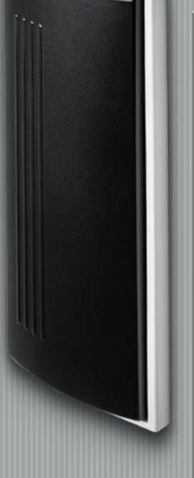
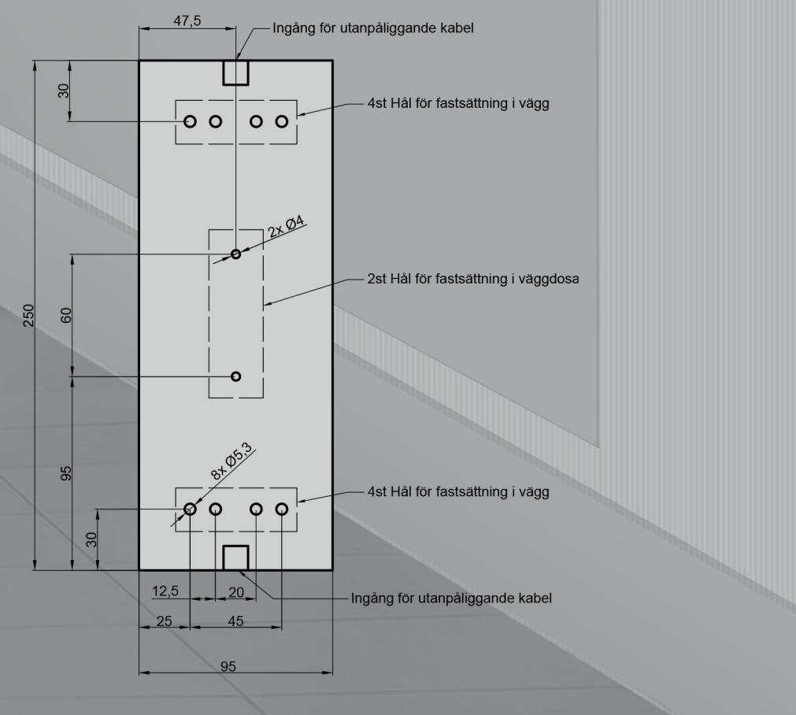
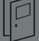

# Tekniskt produktblad JCK209

## Mått

H: 250 mm B: 95 mm D: 25 mm

Mikrobrytare 1 st NO IP klass: IP67 Nominell märkström från: 0,1 A - 10 A/250 V AC Lägsta märkström 1mA/4 V DC

Material: ABS - Plast

#### Rengöring:

Kontakten går att rengöra med alla förekommande rengörningsmedel.

# Hålbildsritning:

### Tillval:

Går att beställa med:

- * 2 Mikrobrytare
- * NO/NC Mikrobrytare
- * Radiostyrning
- * Reläkort med 2 utgångar
- * Universiella symboler:
	- 1. Dörrsymbol

- 2. Rullstolsymbol

3. Hissymbol

