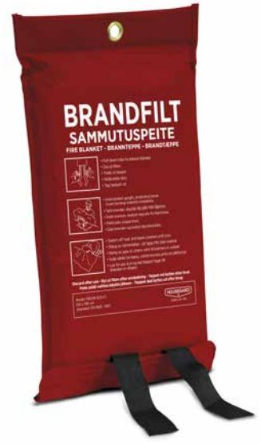
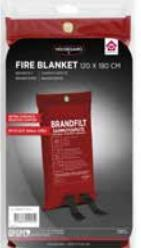
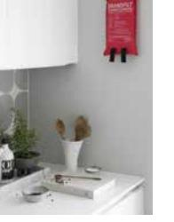
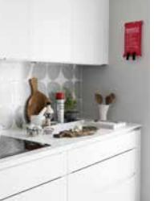

## Housegard brandfilt med silikonbeläggning, 120x180 cm, röd

Standardbrandfilt för placering och användning i hem, kontor, kök och andra offentliga miljöer. 120 x 180 cm är det mått som Brandskyddsföreningen och MSB rekommenderar. 

- Filten består av glasfiberväv med silikonbeläggning
- Påsen är tillverkad av 65% PVC, 35% polyester
- 5 års garanti
- • Certifiering: EN 1869:1997

#### **ARTICLE INFORMATION:**

Art.no: 602025 EAN: 7320896020252 E-nummer: 1693820

# Housegard brandfilt med silikonbeläggning, 120x180 cm, röd

### **Technical specifikation**

| Tillverkningsland  | Kina       |
|--------------------|------------|
| Statistiskt nummer | 7019900085 |
| E-nummer           | 1693820    |
| Nobb-nr            | 53109325   |

### **Packaging information**

|                    | PALL      | EXKRT          | 6-P            | 1-P           | ST      |
|--------------------|-----------|----------------|----------------|---------------|---------|
| EAN kod            |           | 27320896020256 | 17320896020259 | 7320896020252 |         |
| Längd (mm)         | 1200.000  | 452.000        | 253.000        | 35.000        | 32.000  |
| Höjd (mm)          | 970.000   | 273.000        | 216.000        | 380.000       | 285.000 |
| Bredd (mm)         | 800.000   | 412.000        | 392.000        | 215.000       | 190.000 |
| Bruttovikt (kg)    | 200.00000 | 15.00000       | 7.00000        | 1.16000       | 1.25000 |
| Net Weight (kg)    |           | 12.00000       | 6.50000        | 1.00000       | 1.00000 |
| Volym              | 0.00000   | 0.05080        | 0.02140        | 0.00000       | 0.00423 |
| Net Volume         |           | 0.00000        | 0.00000        | 0.00000       | 0.00000 |
| Number LAV         | 2         |                |                |               |         |
| Nr of units on LAV | 6         |                |                |               |         |
| Antal ST           | 144       | 12             | 6              | 1             | 1       |

**Page 2/2**