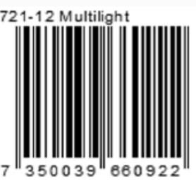

## **SafeE Multilight**

Smart och robust multifunktionell ficklampa med topled och sido-COB list som ger mycket god ljusspridning i vidvinkel. Kombinationen ger en idealisk lampa till många olika sammanhang och miljöer.

Lampan kan hängas i krok, fästas i byxlinning ställas på golv eller på vinklad yta med hjälp av utfällbart vinkelstöd för precis rätt riktad ljusbild, den kan även fästas i magnet på ex. insida av motorhuv. Med extra knapptryckning växlas mellan tänd topled eller COB.

**-Flexibel placering**: clip, krok, magnet samt vinkelstöd. **-Bred sido-COB eller riktad topled. -Helt flexibel**, har ingen begränsande kabel. **-Extra lång brinntid.**

**Användningsområden:** Arbetsbelysning hemmet, bil, båt, camping eller friluftsliv.

## **Teknisk specifikation:**

Mått LxBxH: 122x61x22 mm. Driftstid 3W COB-led: ca 30 tim. 0,5 w topled mer än 50 tim. Drivs av: 3xAAA (ingår ej). Vikt: ca 130 gram, med batterier. COB ca 220 lumen. Topled ca 20 lumen.

*www.SafeE.se*

 *Tillverkad i Kina för SafeE AB*