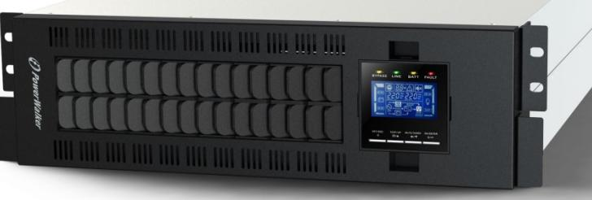
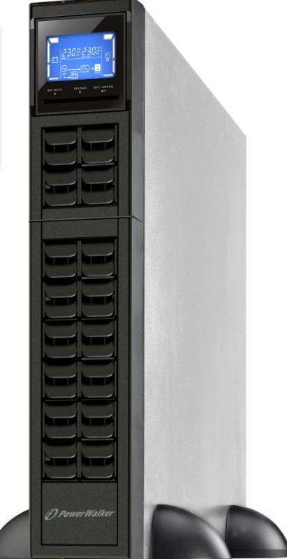
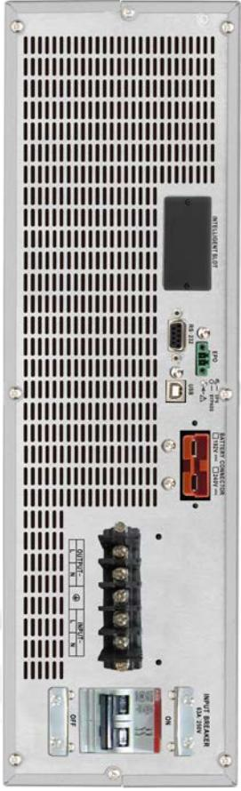
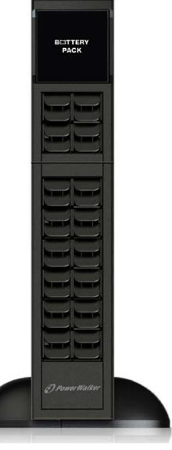

## **PowerWalker VFI 1000-10000 CRM Series PowerWalker VFI 1000-10000 CRS Series**

- Comprehensive display allows easy monitoring and access of UPS status
- Adjustable charging current via LCD or software
- Wide input voltage range for all environments and support for AC generator
- Batteries integrated in external unit
- Discharge Timer

With true double-conversion online UPS design, PowerWalker VFI CRM LCD series and its long-run version VFI CRS LCD series provide powerful and overall protection to your sensitive devices. It can accept wide input voltage for harsh environment. It offers full protection for critical devices such as sensitive servers, network/telephone communication systems as well as for industrial applications. With its slim design it only requires 2U or 3U (in case of 10kVA unit) of valuable space of your rack system. The UPS can be installed in 19" rack systems or used as tower.

## **TECHNICAL SPECIFICATION**

| SERIES                             | VFI 1000-3000 CRM & CRS                                              | VFI 6000-10000 CRM & CRS              |  |  |
|------------------------------------|----------------------------------------------------------------------|---------------------------------------|--|--|
|                                    | INPUT                                                                |                                       |  |  |
|                                    | 110-300 VAC at 50% load                                              | 110-300 VAC at 50% load               |  |  |
| Voltage                            | 160-280 VAC at 100% load                                             | 176-300 VAC at 100% load              |  |  |
| Input PF                           | ≥ 0.99 at full load                                                  |                                       |  |  |
| Frequency Range                    | 40Hz - 70Hz (self-adaptive to 50/60Hz) 46Hz - 54Hz or 56Hz - 64Hz |                                       |  |  |
|                                    | OUTPUT                                                               |                                       |  |  |
| Voltage                            | 200/208/220/230/240 VAC                                              | 208/220/230/240 VAC                   |  |  |
|                                    | ≤3% Full Linear Load;                                                | ≤3% Full Linear Load;                 |  |  |
| THDv                               | ≤6% Non-Linear Load                                                  | ≤5% Non-Linear Load                   |  |  |
| Voltage Regulation (Bat. Mod.)     | ±1%                                                                  |                                       |  |  |
| Frequency (Synchronized Range)     | 47Hz - 53Hz or 57Hz - 63Hz                                           | 46Hz - 54Hz or 56Hz - 64Hz            |  |  |
| Frequency (Battery Mode)           | ±0,3Hz                                                               | ±0,1Hz                                |  |  |
|                                    | TECHNICAL DETAILS                                                    |                                       |  |  |
| Load Crest Ratio                   |                                                                      | 3:1                                   |  |  |
| Transfer Time [AC to Battery]      | 0ms                                                                  | 0ms                                   |  |  |
| Transfer Time [Inverter to Bypass] | 4ms                                                                  | 0ms                                   |  |  |
| Generator support                  |                                                                      | Yes                                   |  |  |
|                                    |                                                                      | AC Mode: 30min @ 100%-110%; 5min @    |  |  |
|                                    |                                                                      | 110% - 130%; 10sec @ >130%            |  |  |
| Overload Capacity                  |                                                                      | Battery Mode: 3min @ 100%-110%; 30sec |  |  |
|                                    |                                                                      | @ 110-130; 10sec @ >130%              |  |  |
| Fan Logic                          | Always ON, automatic speed control                                   |                                       |  |  |
|                                    | COMMUNICATION AND CONNECTIONS                                        |                                       |  |  |
| Software                           | ViewPower or ViewPowerMini                                           |                                       |  |  |
| Communication Ports                | USB, RS-232 and Intelligent Slot                                     |                                       |  |  |
| EPO                                | No                                                                   | Yes                                   |  |  |

## **TECHNICAL DIFFERENCES**

| MODEL               | Item Number | EAN           | Power          | Input       | Output            |
|---------------------|-------------|---------------|----------------|-------------|-------------------|
| VFI 1000 CRM LCD    | 10122000    | 4260074977172 | 1000VA / 800W  | Schuko C14  | 3x IEC            |
| VFI 2000 CRM LCD    | 10122001    | 4260074977189 | 2000VA / 1600W |             | 4x IEC            |
| VFI 3000 CRM LCD    | 10122002    | 4260074977196 | 3000VA / 2400W |             | 4x IEC + Terminal |
| VFI 1000 CRM LCD UK | 10122018    | 4260074977929 | 1000VA / 800W  | UK Plug C14 | 3x IEC            |
| VFI 2000 CRM LCD UK | 10122019    | 4260074977936 | 2000VA / 1600W |             | 4x IEC            |
| VFI 3000 CRM LCD UK | 10122020    | 4260074978360 | 3000VA / 2400W |             | 4x IEC + Terminal |
| VFI 1000 CRS        | 10122038    | 4260074978001 | 1000VA / 800W  | Schuko C14  | 3x IEC            |
| VFI 2000 CRS        | 10122039    | 4260074978018 | 2000VA / 1600W |             | 4x IEC            |
| VFI 3000 CRS        | 10122040    | 4260074978285 | 3000VA / 2400W |             | 4x IEC + Terminal |
| VFI 6000 CRM LCD    | 10122003    | 4260074977202 | 6kVA / 4.8kW   | Terminal    | Terminal          |
| VFI 10000 CRM LCD   | 10122004    | 4260074977219 | 10kVA / 8kW    |             |                   |
| VFI 6000 CRS LCD    | 10122016    | 4260074977394 | 6kVA / 4.8kW   |             |                   |
| VFI 10000 CRS LCD   | 10122017    | 4260074977400 | 10kVA / 8kW    |             |                   |

| MODEL                 | Batteries   | Charging Time | Charger             | Full Load Backup Time | Half Load Backup Time |
|-----------------------|-------------|---------------|---------------------|--------------------------|--------------------------|
| VFI 1000 CRM LCD (UK) | 2x 12V/9Ah  | 9h to 90%     | 1A                  | 4min                     | 11min                    |
| VFI 2000 CRM LCD (UK) | 4x 12V/9Ah  |               |                     | 4min                     | 12min                    |
| VFI 3000 CRM LCD (UK) | 6x 12V/9Ah  |               |                     | 4.5min                   | 13min                    |
| VFI 6000 CRM LCD      | 16x 12V/9Ah | 4h to 90%     | 1A / 2A / [4A] / 6A | 7min                     | 30min                    |
| VFI 10000 CRM LCD     |             |               |                     | 3min                     | 10min                    |
| VFI 1000 CRS          | None @ 24V  | N/A           | 6A                  | N/A                      | N/A                      |
| VFI 2000 CRS          | None @ 48V  |               |                     |                          |                          |
| VFI 3000 CRS          | None @ 72V  |               |                     |                          |                          |
| VFI 6000 CRS LCD      | None @ 192V |               | 1A / 2A / [4A] / 6A |                          |                          |
| VFI 10000 CRS LCD     |             |               |                     |                          |                          |

**ACCESSORIES**

| Name                                                                              | Picture | Name                                                                                      | Picture |            |
|-----------------------------------------------------------------------------------|---------|-------------------------------------------------------------------------------------------|---------|------------|
| SNMP Manager Network Management Item Number: 10120505 EAN: 4260074974034 |         | EMD for SNMP Manager Environment Module Item Number: 10120544 EAN: 4260074974966 |         |            |
| AS400 Card Dry Contacts Item Number: 10120515 EAN: 4260074974300         |         | Modbus Card 2 Modbus Protocol Item Number: 10120565 EAN: 4260074975703           |         |            |
| SNMP Box Network Management Item Number: 10131000 EAN: 4260074977424     |         | ATS Automatic Transfer Switch Item Number: 10120543 EAN: 4260074974959           |         |            |
| BP A24R-4x9Ah Battery Pack Item Number: 10134013 EAN: 4260074977820      |         | BP A48R-8x9Ah Battery Pack Item Number: 10134014 EAN: 4260074977837              |         |            |
| BP A72R-12x9Ah Battery Pack Item Number: 10134015 EAN: 4260074977844     |         | BP A192R-16x9Ah Battery Pack Item Number: 10134007 EAN: 4260074977417            |         | 23/08/2017 |