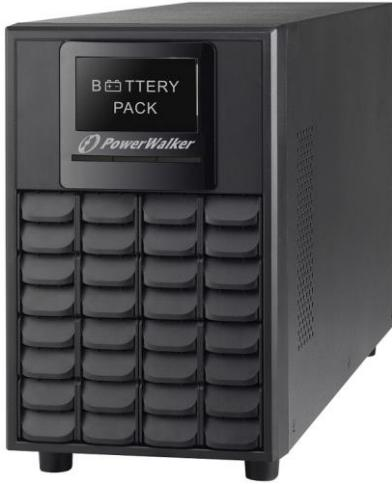
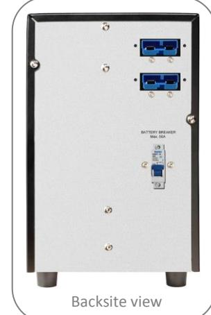
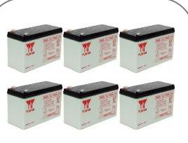
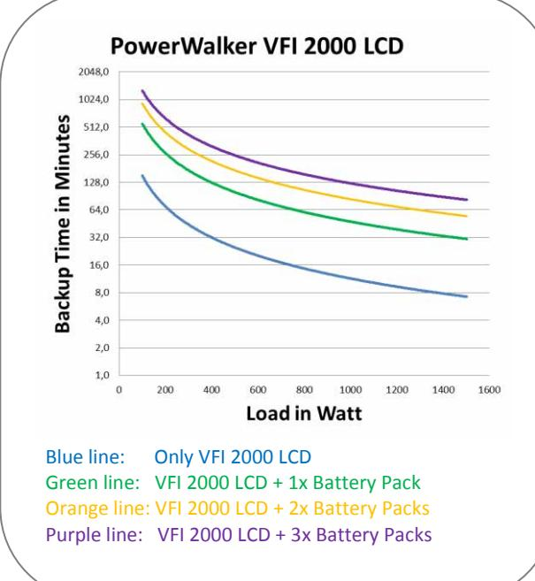
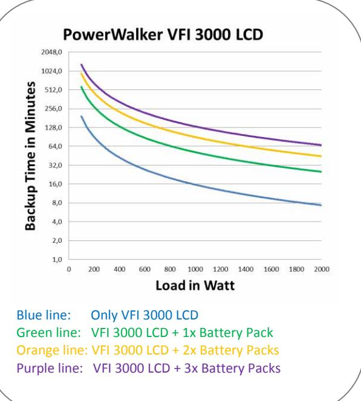

# **Product Information**

### **PowerWalker Battery Pack**

For PowerWalker VFI 2000/3000 LCD

6pcs. of 12V/9Ah batteries inside battery pack

Increase backup time autonomy

Connection cable inside package content

We have also available bigger battery packs for this UPS With inside 12pcs. or 18pcs. of 12V/9Ah batteries

Item-No. 10120511

With this battery pack you can increase backup time for your connected equipment. Connection will be established by just one ANEN cable which is inside package content. If you later see demand to increase again backup time you can connect another battery pack to the second battery connector on rear panel of battery pack.

On 2nd page you will find detailed runtime curve´s

**Supports following models:**

VFI Series: VFI 2000 LCD, VFI 3000 LCD

#### **Product Details**

| Connector type    | ANEN (Anderson)                 |
|-------------------|---------------------------------|
| Battery type/qty. | 6x 12V/9Ah                      |
| String Voltage    | 72V                             |
| Dimensions        | 397 x 126 x 221 mm              |
| Weight            | 20.00kg                         |
| Package Content   |                                 |
| Package Content   | Battery Pack, connection cable, |
|                   | installation guide              |
| Logistic Data     |                                 |
| Dimension/Giftbox | 472x230x325mm                   |
| Weight/Giftbox    | 21.50kg                         |
| Item Number       | 10120511                        |
| EAN               | 4260074974225                   |
| Warranty          | 24 Months                       |
|                   |                                 |

6x Yuasa 12V/9Ah batteries inside Datasheet: Link CSB or Panasonic brand can also be used

## **Product Information**

### **Runtime Curve´s**

#### **Longer backup time**

If you need even longer backup time, please check our bigger battery packs with inside 12x or even 18x of 12V/9Ah batteries inside.

Link to Battery Pack with 12x 12V/9Ah batteries: Link Link to Battery Pack with 18x 12V/9Ah batteries: Link

Version: EN 21/05/2014 We reserve the right for technical changes and mistakes