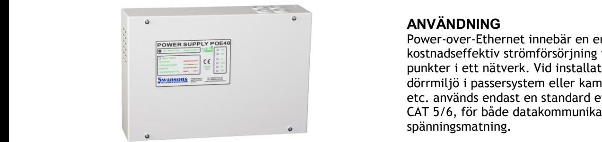
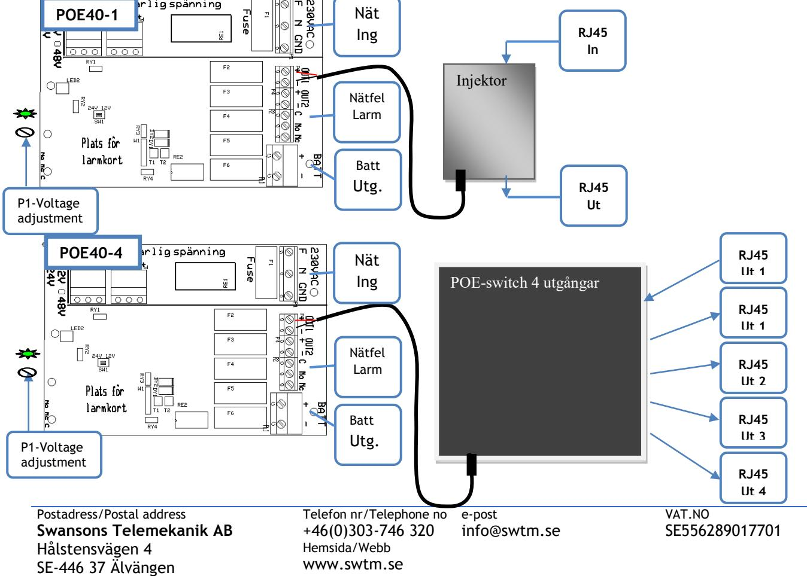
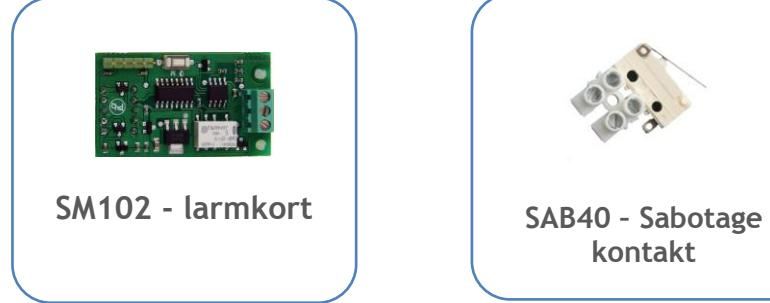
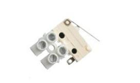
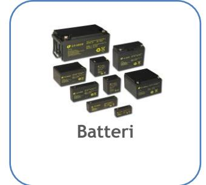
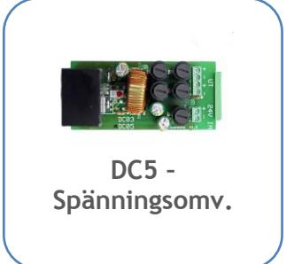

## **POE40 POWER OVER ETHERNET MED BATTERIBACKUP**

**Skydd:** Aggregatet är skyddad mot överbelastning och kortslutning. Inbyggt skydd mot djupurladdning av batterierna. Nät, last och batteri skyddas av säkringar.

**Indikeringar och larm:** Nätspänning indikeras med grön lysdiod på fronten

Är försedd med larmrelä för nätavbrott. Kan kompletteras med larmkort SM102 för laddnlikriktar- och batterifel. Summalarmrelä och larm med röd lysdiod.

### **TEKNISKA DATA**

Inspänning 88-265VAC +/- 15% 1 fas 50-60Hz Reglering max 0,6 % Batterispänn. POE40-1 27,4VDC Batterispänn. POE40-4 54,6VDC Temp.omr- -10 – +30 C

IEEE 802.3at/ IEEE802.3af 100 MBIT/ kanal

### **ANVÄNDNING**

Power-over-Ethernet innebär en enkelt och kostnadseffektiv strömförsörjning till accesspunkter i ett nätverk. Vid installation av en dörrmiljö i passersystem eller kamerautrustning etc. används endast en standard ethernet kabel, CAT 5/6, för både datakommunikation och spänningsmatning.

**Högeffektiv** – 85% vid nätdrift – 98% vid batteridrift **High Power** – 30W/utgång - kontinuerlig drift på alla portar samtidigt.

### **UTFÖRANDE:**

**POE40-1** är en injektor med 24V batterbackup och levereras med två st 12V 2,1 Ah batteri(har plats för max 2x 5Ah), för väggmontage. Injektorn omvandlar 24v till 48V PoE sp. och lägger det på RJ45 utgången.

**POE40-4** är en switch med 48V batterbackup och har plats för fyra 12V 9ah batteri, för väggmontage.

Aggregatet uppfyller både IEEE802.3af och IEEE802.3at. och kan leverera upp till 30W/port. Bestyckad med ett RJ45 8-pol uttag utöver det ordinarie portantalet som är avsett att användas som ingång (utan POE). Övriga portar är RJ45 8-pol som är försedda med led för datatrafik och status.

*CE-märkt enligt EN61000-6-3:2001 EN61000-6- 2:2005.*

| E-Nummer | Typ     | Beskrivning                                               | HxBxD mm        |
|----------|---------|-----------------------------------------------------------|-----------------|
| 5172438  | POE40-1 | POE 24V 25W 1 PORTAR Injektor, inkl 2,1Ah (max 2x 5Ah) | 210 x 310 x 80  |
| 5172439  | POE40-4 | POE 48V 150W 4 PORTAR Switch max 4x 9Ah             | 300 x 360 x 110 |
|          |         |                                                           |                 |
|          |         |                                                           |                 |

Telefon nr/Telephone no +46(0)303-746 320 Hemsida/Webb www.swtm.se e-post info@swtm.se

# **POE40 POWER OVER ETHERNET MED BATTERIBACKUP**

#### **SÄKERHET**

Endast auktoriserad och erfaren personal inom AC och DC får använda, arbeta, serva/underhålla, installera denna enhet.  **SM40** 

Endast isolerade verktyg får användas i enheten. Observera att farliga spänningar och strömmar förekommer i apparaten både när interna säkringarna är av eller på.  **Strömförsörjning med plats för batteri**

Denna instruktion skall läsas igenom grundligt och förstås av all handhavande personal. Vid minsta tveksamhet om systemets uppbyggnad, funktion, komponenter samt säkerhet skall leverantören kontaktas.

Kontrollera att kretskort sitter fast och inte är transportskadade.

Om batterier används är dessa alltid elektrokemiskt aktiva. Kortslut inte batteripolerna.

| Modell  | Säkring F1 Nätsäkring | Säkring F2- F3 OUT 1 | Säkring F4- F5 OUT2 | Säkring F6 Batteri |
|---------|--------------------------|----------------------------|---------------------------|--------------------------|
| POE40-1 | 1AT Cer                  | 2,5AS                      | 2,5AS                     | 3,15AS                   |
| POE40-4 | 2AT Cer                  | 3,15AS                     | 3,15AS                    | 4AS                      |

## **INKOPPLING**

- Montera aggregatet fritt. Minst 100mm på varje sida.
- Anslut först 230V AC.
- Lysdiod för nätspänning tänds. Kontrollera att utspänningen är riktig.
- Spänningsjustering görs direkt på likriktaren.
- Om lysdiod för nätindikering ej tänds kontrollera inspänning och ingångssäkringarna.
- Anslut batterierna och därefter lasten.
- Löser utgångssäkringarna, kontrollera inkoppling och inkopplade apparater**.**

### **TEKNISKA DATA**

| Inspänning                | 88-265VAC +/- 15% |         |
|---------------------------|-------------------|---------|
|                           | 1 fas 50-60Hz     |         |
| Reglering                 | max 0,6 %         |         |
| Batterispänn. POE40-1     |                   | 27.4VDC |
| Batterispänn. POE40-4     |                   | 54,6VDC |
| Temp.omr-                 | -10 – +30 C       |         |
| IEEE 802.3at/ IEEE802.3af |                   |         |
| 100 MBIT/ kanal           |                   |         |
|                           |                   |         |

# **Optional Accessories SM40 Strömförsörjning med plats för batteri**

**kontakt**

Postadress/Postal address **Swansons Telemekanik AB** Hålstensvägen 4 SE-446 37 Älvängen

Telefon nr/Telephone no +46(0)303-746 320 Hemsida/Webb www.swtm.se e-post info@swtm.se VAT.NO SE556289017701