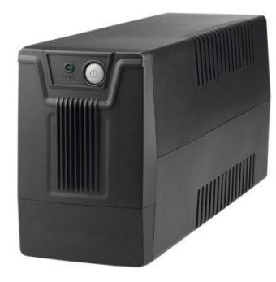
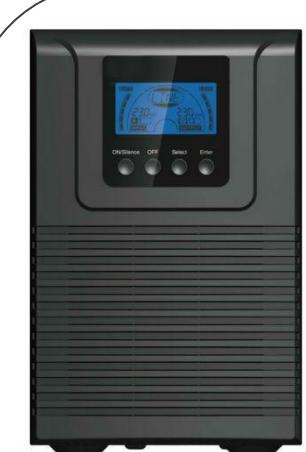
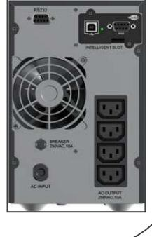
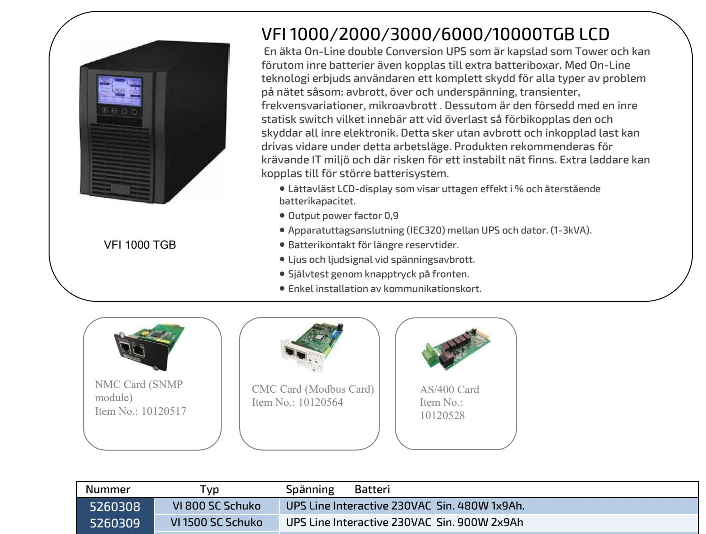

## UPS AVBROTTSFRI KRAFT 800-3000VA

 **SM40** 

VF 800 SC

## VI 800/1500SC  **Strömförsörjning med plats för batteri**

PW VI 800/1500SC är en Line-Interactive UPS med ren sinusvågs ut vid nätdrift och modifierad sinus vid batteridrift. Designad för att uppfylla höga säkerhetskrav.

En HID-kompatibel USB-port som kan övervaka UPS-statusen på Windows, Mac OS, Linux-system utan att installera ytterligare programvara. HID - effekthanteringssystem stöds av datorns interna strömhanterings program, som finns som standard. Med sina kompakta format passar VI modellerna till bankomater, kiosker, små industri- och kontorstillämpningar.

- Simulerad sinusvågs ut vid batteriläge
- Övervakningsprogrammet ingår
- Utrustad med Boost och Buck AVR för att stabilisera utspänningen
- 50/60 Hz frekvensingång (automatisk avkänning)
- Automatisk start vid återställning av AC
- Självövervakning och Feldiagnos
- Lätt batteribyte

VF I 1000 TG

## VFI 1000/2000/3000TG LCD

 En äkta On-Line double Conversion UPS som är kapslad som Tower . Med On-Line teknologi erbjuds användaren ett komplett skydd för alla typer av problem på nätet såsom: avbrott, över och underspänning, transienter, frekvensvariationer, mikroavbrott . Dessutom är den försedd med en inre statisk switch vilket innebär att vid överlast så förbikopplas den och skyddar all inre elektronik. Detta sker utan avbrott och inkopplad last kan drivas vidare under detta arbetsläge. Produkten rekommenderas för krävande IT miljö och där risken för ett instabilt nät finns.

- Lättavläst LCD-display som visar uttagen effekt i % och återstående batterikapacitet.
- Output power factor 0,9
- Apparatuttagsanslutning (IEC320) mellan UPS och dator. (1-3kVA).
- Ljus och ljudsignal vid spänningsavbrott.
- Självtest genom knapptryck på fronten.
- Enkel installation av kommunikationskort.
- ECO funktion för energi spar läge
- Intelligent fläkt kontroll minskar ljudnivån
- Prisvärd

Postadress/Postal address Swansons Telemekanik AB Hålstensvägen 4 SE-446 37 Älvängen

Telefon nr/Telephone no +46(0)303-746 320 Hemsida/Webb swansonstelemekanik.se e-post info@swtm.se

VAT.NO SE556289017701

## UPS AVBROTTSFRI KRAFT 1000-10000VA

| 5260309 | VI 1500 SC Schuko | UPS Line Interactive 230VAC Sin. 900W 2x9Ah             |
|---------|-------------------|---------------------------------------------------------|
| 5260310 | VFI 1000 TG       | UPS 1000VA/900W 2x12V 9Ah                               |
| 5260311 | VFI 2000 TG       | UPS 2000VA/1800W 4x12V 9Ah                              |
| 5260312 | VFI 3000 TG       | UPS 3000VA/2700W 6x12V 9Ah                              |
| 5260313 | VFI 1000 TGB      | UPS 1000VA/900W 2x12V 9Ah + externa batteri             |
| 5260314 | VFI 2000 TGB      | UPS 2000VA/1800W 4x12V 9Ah + externa batteri            |
| 5260315 | VFI 3000 TGB      | UPS 3000VA/2700W 6x12V 9Ah + externa batteri            |
| 5260316 | VFI 6000 TGB      | UPS 6000VA/5400W 16x12V 7Ah + externa batteri           |
| 5260317 | VFI 10000 TGB     | UPS 10000VA/9000W 16x12V 9Ah + externa batteri          |
| 5260318 | BP P36T-6 x 7Ah   | Batteribox till VFI 1000 T. 6 x 7Ah. Inkl batt          |
| 5260319 | BP P96T-16T x 7Ah | Batteribox till VFI 2000 / 3000 T. 16 x 7Ah. Inkl. batt |
| 5260320 | BP P240T-40 x 9Ah | Batteribox till VFI 6000 / 10000T. 40 x 9Ah. Inkl. batt |
| 5260321 | AS/400 Card 3     | Larmkort för T serien (ej TG). Skruvanslutning          |
| 5260322 | NMC Card          | SNMP-kort för T serien (ej TG)                          |
|         |                   |                                                         |

Postadress/Postal address Swansons Telemekanik AB Hålstensvägen 4 SE-446 37 Älvängen

Telefon nr/Telephone no +46(0)303-746 320 Hemsida/Webb swansonstelemekanik.se e-post info@swtm.se VAT.NO SE556289017701