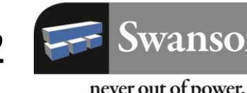
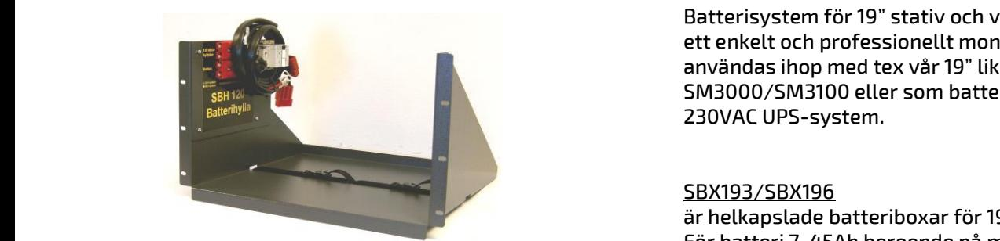
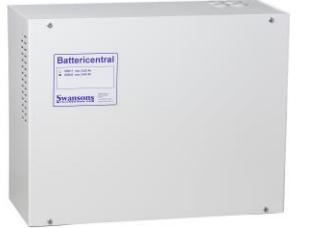
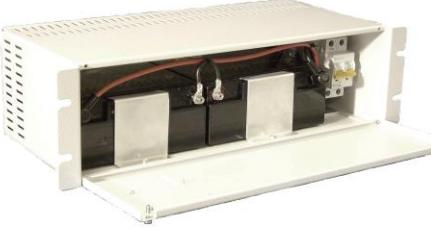

# SBX193/196/70 – BB1/2 - SBH50/152 BATTERISYSTEM

SBH120 batterihylla med säkringscentral och batteri

SBB45 batterihylla med säkringscentral och batteri

SBX193 med 2st 17Ah batterier monterade

# BESKRIVNING

Batterisystem för 19" stativ och vägg som ger ett enkelt och professionellt montage. För att användas ihop med tex vår 19" likriktare SM3000/SM3100 eller som batteribank i 230VAC UPS-system.

## SBX193/SBX196

är helkapslade batteriboxar för 19" stativ. För batteri 7-45Ah beroende på modell. Internkablage och batterisäkring av MCB typ ingår för enkel anslutning till likriktare och batterifästen.

# SBB20-45-100

Helkapslade batteriboxar för vägg. För batteri max 20-45-100Ah beroende på modell. Internt kablage, säkring ingår.

#### SBH50/SBH110/SBH150

är öppna batterihyllor för 19" stativ. Passande batteri är 17-150Ah batterier beroende på modell. Batterierna är avsedda att placeras löst på hyllan.

## SBH52/SBH120/SBH152

Avancerad 19" batterihylla för batterier max 2x45Ah/2x120/2x150Ah. Kablage, spännband och battericentral av MCB-typ ingår samt batterihandske för enkel anslutning till likriktare. Flera batterihyllor kan enkelt kopplas ihop för att få möjlighet till högre batterikapacitet eller högre spänningar. Kablage för sammankoppling medföljer.

| E-nummer | Typ    | Benämning                                          | H x B (Innerbredd) x D mm |
|----------|--------|----------------------------------------------------|------------------------------|
| 5247160  | SBX193 | Batteribox 1 19" max 4x12Ah m säkring o kablage    | 132x480x200                  |
| 5247161  | SBX196 | Batteribox 2 19" max 2x45Ah m säkring o kablage    | 264x480x200                  |
| 5247185  | SBB20  | Batteribox för vägg max 2x20Ah m säkring o kablar  | 300x360x110                  |
| 5247186  | SBB45  | Batteribox för vägg 2x45Ah m säkring o kablar      | 320x420x180                  |
| 5247187  | SBB100 | Batteribox för vägg 2x100Ah m säkring o kablar     | 600x400x220                  |
| 5247163  | SBH110 | Batterihylla 2 19" max 2x120Ah                     | 280x480(420)x400             |
| 5247164  | SBH120 | Batterihylla 3 19" max 2x120Ah m säkring o kablage | 280x480(420)x400             |
| 5247165  | SBH50  | Batterihylla 4 19" max 2x45Ah                      | 280x480(420)x200             |
| 5247166  | SBH52  | Batterihylla 5 19" max 2x45Ah m säkring o kablage  | 280x480(420)x200             |
| 5247197  | SBH150 | Batterihylla 6 19" max 2x150Ah                     | 280x480(420)x500             |
| 5247198  | SBH152 | Batterihylla 7 19" max 2x150Ah m säkring o kablage | 280x480(420)x500             |

Postadress/Postal address Swansons Telemekanik AB Hålstensvägen 4 SE-446 37 Älvängen

Telefon nr/Telephone no +46(0)303-746 320 Hemsida/Webb www.swtm.se Telefax nr/Telefax no +46(0)303-748 490 e-post info@swtm.se

VAT.NO SE556289017701