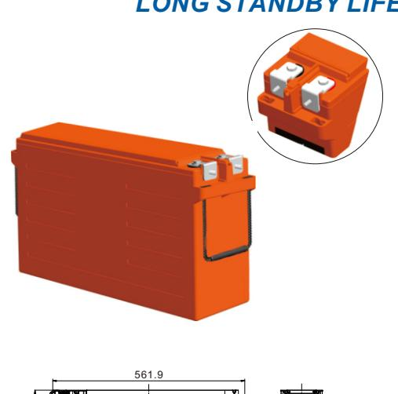
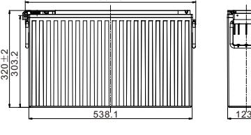
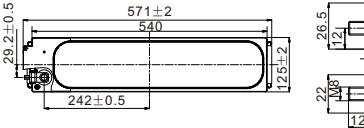
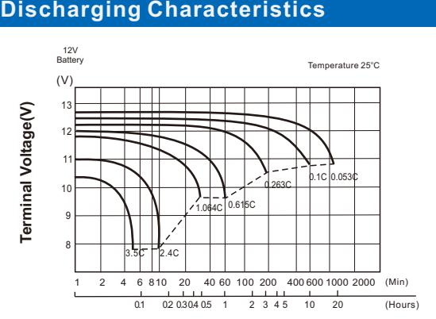
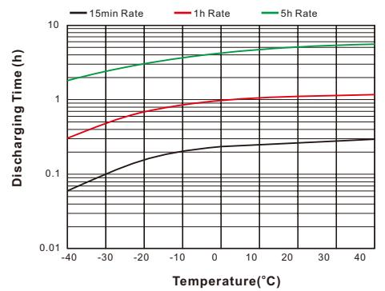
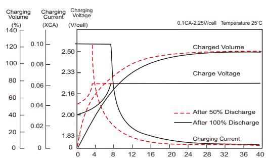
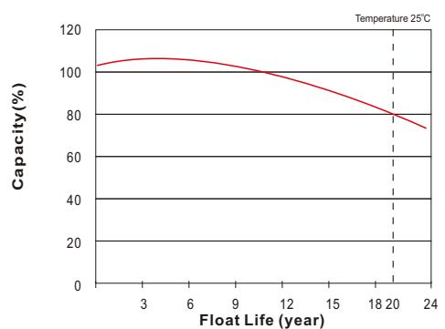

# UPBH190FT (12V190Ah)

## **UPBH SERIES**  *LONG STANDBY LIFE*

| Specification                       |                                                                                                                                                                                                                                                                                                     |                                          |  |  |  |  |  |
|-------------------------------------|-----------------------------------------------------------------------------------------------------------------------------------------------------------------------------------------------------------------------------------------------------------------------------------------------------|------------------------------------------|--|--|--|--|--|
| Nominal Voltage                     | 12V                                                                                                                                                                                                                                                                                                 |                                          |  |  |  |  |  |
|                                     | 190Ah                                                                                                                                                                                                                                                                                               | o (C , 10 1.80V/cel 25 l, C) |  |  |  |  |  |
| Rated Capacity (Ah)                 | 190Ah                                                                                                                                                                                                                                                                                               | o (C , 8 1.75V/cel 25 l, C)  |  |  |  |  |  |
|                                     | Length                                                                                                                                                                                                                                                                                              | 571±2mm (22.48 inches)                   |  |  |  |  |  |
| Dimension                           | Width                                                                                                                                                                                                                                                                                               | 125±1mm ( 4.92 inches)                   |  |  |  |  |  |
|                                     | Height                                                                                                                                                                                                                                                                                              | 320±2mm (12.60 inches)                   |  |  |  |  |  |
|                                     | Total Height (with Terminal)                                                                                                                                                                                                                                                                        | 320±2mm (12.60 inches)                   |  |  |  |  |  |
| Weight                              | 57.8Kg (127.4 Ibs)                                                                                                                                                                                                                                                                                  |                                          |  |  |  |  |  |
| Terminal                            | Threaded M8 (T11) insert with M6 front terminal adaptor                                                                                                                                                                                                                                          |                                          |  |  |  |  |  |
| Container Material                  | PC-ABS flame retardant jar and cover to UL94V-0                                                                                                                                                                                                                                                     |                                          |  |  |  |  |  |
| Max. Discharge Current              | 1500A (5s)                                                                                                                                                                                                                                                                                          |                                          |  |  |  |  |  |
| Internal Resistance                 | Approx 3.0mΩ(Fully charged)                                                                                                                                                                                                                                                                         |                                          |  |  |  |  |  |
|                                     | o o o o Discharge : -40 C~65 C (-40 F~149 F)                                                                                                                                                                                                                                            |                                          |  |  |  |  |  |
| Operating Temp.Range                | o o o o Charge : 0 C~40 C (32 F~104 F)                                                                                                                                                                                                                                            |                                          |  |  |  |  |  |
|                                     | o o o Storage : -20 C~40 C(-4 F~104 F)                                                                                                                                                                                                                                                  | o                                        |  |  |  |  |  |
|                                     | o o 40 C (104 F)                                                                                                                                                                                                                                                                           | 103%                                     |  |  |  |  |  |
| Capacity affected by Temperature | o o 25 C ( 77 F )                                                                                                                                                                                                                                                                          | 100%                                     |  |  |  |  |  |
|                                     | o o 0 C ( 32 F )                                                                                                                                                                                                                                                                           | 86%                                      |  |  |  |  |  |
| Storage                             | UPBH series batteries can be stored up to 24 months at 25°C(77°F), For higher temperatures the time interval will be shorter. Battery needs to be given a freshening charge when the OCV approach 2.10V/cell or when the maximum storage time is reached, whichever occurs first. |                                          |  |  |  |  |  |

Unit: mm

3

| 0 0 Constant Current Discharge (Amperes) at 25 C (77 F ) |       |       |       |       |       |       |      |      |      |      |      |      |      |
|----------------------------------------------------------------|-------|-------|-------|-------|-------|-------|------|------|------|------|------|------|------|
| F.V/Time                                                       | 10min | 15min | 20min | 30min | 45min | 1h    | 2h   | 3h   | 4h   | 5h   | 8h   | 10h  | 20h  |
| 1.85V/cell                                                     | 341.5 | 287.2 | 249.5 | 195.0 | 149.8 | 123.1 | 73.3 | 52.8 | 41.2 | 33.1 | 22.3 | 18.4 | 9.67 |
| 1.80V/cell                                                     | 377.8 | 315.6 | 267.1 | 210.0 | 158.3 | 128.7 | 76.2 | 54.6 | 43.1 | 34.0 | 23.0 | 19.0 | 9.98 |
| 1.75V/cell                                                     | 408.5 | 337.0 | 282.3 | 218.8 | 162.5 | 133.7 | 77.8 | 55.6 | 44.1 | 34.6 | 23.4 | 19.2 | 10.1 |
| 1.70V/cell                                                     | 434.6 | 352.6 | 295.2 | 226.0 | 167.3 | 136.8 | 78.9 | 56.3 | 44.9 | 35.0 | 23.8 | 19.4 | 10.1 |
| 1.67V/cell                                                     | 456.3 | 361.5 | 301.7 | 231.0 | 170.3 | 138.9 | 79.5 | 57.1 | 45.6 | 35.2 | 24.0 | 19.5 | 10.2 |
| 1.60V/cell                                                     | 461.2 | 376.4 | 311.9 | 236.2 | 174.7 | 140.2 | 80.2 | 58.0 | 46.1 | 35.4 | 24.2 | 19.7 | 10.3 |

| 0 0 Constant Power Discharge (Watts/cell) at 25 C (77 F ) |       |       |       |       |       |       |       |       |      |      |      |      |      |
|-----------------------------------------------------------------|-------|-------|-------|-------|-------|-------|-------|-------|------|------|------|------|------|
| F.V/Time                                                        | 10min | 15min | 20min | 30min | 45min | 1h    | 2h    | 3h    | 4h   | 5h   | 8h   | 10h  | 20h  |
| 1.85V/cell                                                      | 645.1 | 563.1 | 457.5 | 374.1 | 292.9 | 243.7 | 146.4 | 107.7 | 84.9 | 69.8 | 44.8 | 37.3 | 20.2 |
| 1.80V/cell                                                      | 706.3 | 604.9 | 491.5 | 396.9 | 307.4 | 254.2 | 151.0 | 109.8 | 86.7 | 71.3 | 45.7 | 37.9 | 20.6 |
| 1.75V/cell                                                      | 759.9 | 642.4 | 519.6 | 414.2 | 317.7 | 261.2 | 153.9 | 111.3 | 87.8 | 72.0 | 46.2 | 38.2 | 20.8 |
| 1.70V/cell                                                      | 803.5 | 675.0 | 542.2 | 428.0 | 326.0 | 266.7 | 156.0 | 112.4 | 88.4 | 72.6 | 46.5 | 38.4 | 21.0 |
| 1.67V/cell                                                      | 825.5 | 690.5 | 553.1 | 434.4 | 329.7 | 269.1 | 156.8 | 112.7 | 88.7 | 72.7 | 46.6 | 38.5 | 21.0 |
| 1.60V/cell                                                      | 860.3 | 712.5 | 568.9 | 442.7 | 333.6 | 271.3 | 157.4 | 113.0 | 88.9 | 72.9 | 46.7 | 38.6 | 21.1 |

Specifications subject to change without notice.

## **Features & Benefits**

- 20 years design life( ) 25o C
- Low internal resistance
- Fast Charging Acceptance
- Premium ABS+ jar & covers
- IATA Approved for Air Freight
- Heat sealed plastic container
- UL Recognized, IEC Certified
- Automated COS & TTP welding
- M6 & M8 Terminal adapter options
- Flame Retardant to UL94V-0
- Long Shelf Life up to 2 years @25°C(77°F)
- High-rate performance, high energy density
- Virgin pure lead plates / copper alloy terminal inserts
- Excellent high rate discharge capability for emergency backup power supply.
- High quality AGM separators minimize electrical resistance to allow high current discharging properties.
- Outstanding high rate charge capability with Thin Plate Pure Lead technology

**Discharging Time**

## **Effect of Temperature on Discharging Time**

#### **Charging Characteristics**

#### **Charging Time(hours)**

#### **Float Life**

