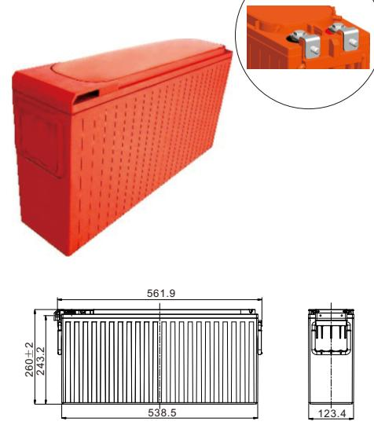
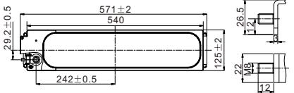
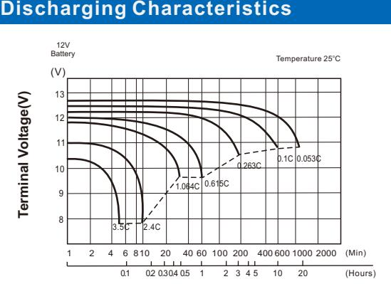
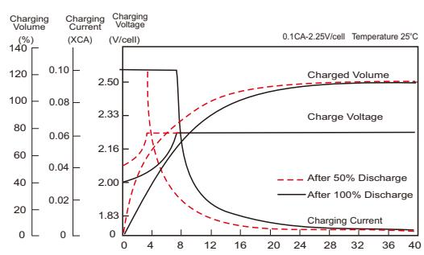
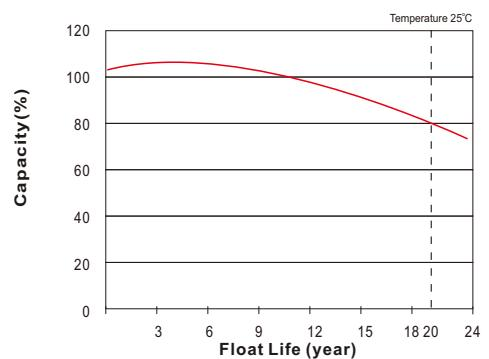

# UPBH150FT (12V150Ah)

# *LONG STANDBY LIFE*

| Specification          |                                                                                                                                             |                                          |  |  |  |  |  |
|------------------------|---------------------------------------------------------------------------------------------------------------------------------------------|------------------------------------------|--|--|--|--|--|
| Nominal Voltage        | 12V                                                                                                                                         |                                          |  |  |  |  |  |
|                        | 150Ah                                                                                                                                       | o (C , 10 1.80V/cel 25 l, C) |  |  |  |  |  |
| Rated Capacity (Ah)    | 150Ah                                                                                                                                       | o (C , 8 1.75V/cel 25 l, C)  |  |  |  |  |  |
|                        | Length                                                                                                                                      | 571±2mm (22.48 inches)                   |  |  |  |  |  |
|                        | Width                                                                                                                                       | 125±2mm (4.92 inches)                    |  |  |  |  |  |
| Dimension              | Height                                                                                                                                      | 260±2mm (10.24 inches)                   |  |  |  |  |  |
|                        | Total Height (with Terminal)                                                                                                                | 260±2mm (10.24 inches)                   |  |  |  |  |  |
| Weight                 | 45.7Kg (100.8 Ibs)                                                                                                                          |                                          |  |  |  |  |  |
| Terminal               | Threaded M8 (T11) insert with M6 front terminal adaptor                                                                                  |                                          |  |  |  |  |  |
| Container Material     | PC-ABS flame retardant jar and cover to UL94V-0                                                                                             |                                          |  |  |  |  |  |
| Max. Discharge Current | 1400 (5s)                                                                                                                                   |                                          |  |  |  |  |  |
| Internal Resistance    | Approx 3.6mΩ(Fully charged)                                                                                                                 |                                          |  |  |  |  |  |
|                        | o o o o Discharge : -40 C~65 C (-40 F~149 F)                                                                                    |                                          |  |  |  |  |  |
| Operating Temp.Range   | o o o o Charge : 0 C~40 C (32 F~104 F)                                                                                    |                                          |  |  |  |  |  |
|                        | o o Storage : -20 C~40 C(-4 F~104 F)                                                                                               | o o 103% 100% 86%            |  |  |  |  |  |
| Capacity affected by   | o o 40 C (104 F)                                                                                                                   |                                          |  |  |  |  |  |
| Temperature            | o o 25 C ( 77 F )                                                                                                                  |                                          |  |  |  |  |  |
|                        | o o 0 C ( 32 F )                                                                                                                   |                                          |  |  |  |  |  |
|                        | UPBH series batteries can be stored up to 24 months at 25°C(77°F), For higher temperatures the time interval will be shorter.         |                                          |  |  |  |  |  |
| Storage                | Battery needs to be given a freshening charge when the OCV approach 2.10V/cell or when the maximum storage time is reached, whichever |                                          |  |  |  |  |  |

occurs first.

# **UPBH SERIES**

Unit: mm

| 0 0 Constant Current Discharge (Amperes) at 25 C (77 F ) |       |       |       |       |       |       |      |      |      |      |      |      |      |
|----------------------------------------------------------------|-------|-------|-------|-------|-------|-------|------|------|------|------|------|------|------|
| F.V/Time                                                       | 10min | 15min | 20min | 30min | 45min | 1h    | 2h   | 3h   | 4h   | 5h   | 8h   | 10h  | 20h  |
| 1.85V/cell                                                     | 268.7 | 230.4 | 198.4 | 152.1 | 113.6 | 90.7  | 51.0 | 37.0 | 29.6 | 24.7 | 17.9 | 14.5 | 7.69 |
| 1.80V/cell                                                     | 300.2 | 250.6 | 212.4 | 160.8 | 119.1 | 94.8  | 53.3 | 38.6 | 30.9 | 25.8 | 18.5 | 15.0 | 7.95 |
| 1.75V/cell                                                     | 323.4 | 266.1 | 224.4 | 166.8 | 123.3 | 97.9  | 54.6 | 39.7 | 31.7 | 26.5 | 18.8 | 15.2 | 8.07 |
| 1.70V/cell                                                     | 347.5 | 280.5 | 233.1 | 172.3 | 126.4 | 99.8  | 55.7 | 40.4 | 32.1 | 26.9 | 18.9 | 15.4 | 8.14 |
| 1.67V/cell                                                     | 369.4 | 293.8 | 240.1 | 175.5 | 128.1 | 101.2 | 56.4 | 41.0 | 32.5 | 27.1 | 19.0 | 15.5 | 8.20 |
| 1.60V/cell                                                     | 393.1 | 305.3 | 247.9 | 180.2 | 130.5 | 103.0 | 57.2 | 41.5 | 32.9 | 27.4 | 19.2 | 15.6 | 8.25 |

| 0 0 Constant Power Discharge (Watts/cell) at 25 C (77 F ) |       |       |       |       |       |       |       |      |      |      |      |      |      |
|-----------------------------------------------------------------|-------|-------|-------|-------|-------|-------|-------|------|------|------|------|------|------|
| F.V/Time                                                        | 10min | 15min | 20min | 30min | 45min | 1h    | 2h    | 3h   | 4h   | 5h   | 8h   | 10h  | 20h  |
| 1.85V/cell                                                      | 509.7 | 440.8 | 381.8 | 296.1 | 224.4 | 179.7 | 102.0 | 74.1 | 59.6 | 49.9 | 34.4 | 29.5 | 15.7 |
| 1.80V/cell                                                      | 560.4 | 473.0 | 404.7 | 311.0 | 233.9 | 187.0 | 105.9 | 77.0 | 61.9 | 51.8 | 35.5 | 30.4 | 16.2 |
| 1.75V/cell                                                      | 597.7 | 497.6 | 423.9 | 320.0 | 240.6 | 191.8 | 108.0 | 78.8 | 63.3 | 53.0 | 36.1 | 30.8 | 16.4 |
| 1.70V/cell                                                      | 632.4 | 518.2 | 436.0 | 327.8 | 245.2 | 194.5 | 109.6 | 79.9 | 64.0 | 53.6 | 36.6 | 30.9 | 16.5 |
| 1.67V/cell                                                      | 665.6 | 537.3 | 445.7 | 332.5 | 247.3 | 196.5 | 110.6 | 80.8 | 64.5 | 54.0 | 36.9 | 31.1 | 16.5 |
| 1.60V/cell                                                      | 696.6 | 550.1 | 455.0 | 338.1 | 250.0 | 198.2 | 111.3 | 81.3 | 64.9 | 54.2 | 37.1 | 31.2 | 16.6 |

Specifications subject to change without notice.

# **Features & Benefits**

- 20 years design life( ) 25o C
- Low internal resistance
- Fast Charging Acceptance
- Premium ABS+ jar & covers
- IATA Approved for Air Freight
- Heat sealed plastic container
- UL Recognized, IEC Certified
- Automated COS & TTP welding
- M6 & M8 Terminal adapter options
- Flame Retardant to UL94V-0
- Long Shelf Life up to 2 years @25°C(77°F)
- High-rate performance, high energy density
- Virgin pure lead plates / copper alloy terminal inserts
- Excellent high rate discharge capability for emergency backup power supply.
- High quality AGM separators minimize electrical resistance to allow high current discharging properties.
- Outstanding high rate charge capability with Thin Plate Pure Lead technology

### **Discharging Time**

## **Effect of Temperature on Discharging Time**

## **Charging Characteristics**

### **Charging Time(hours)**

### **Float Life**

