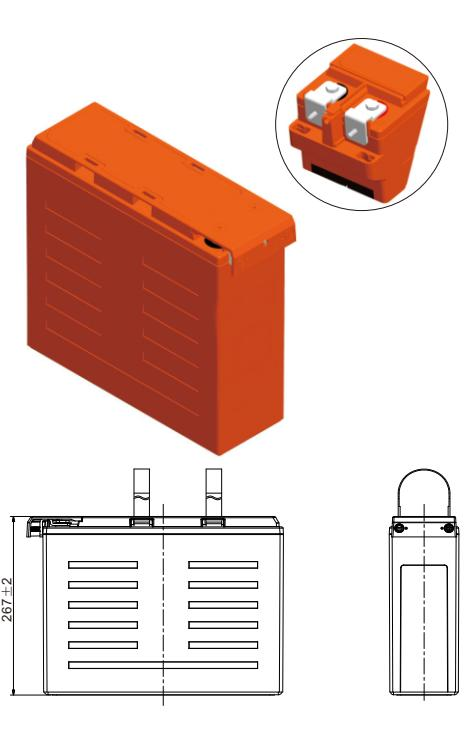
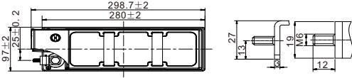
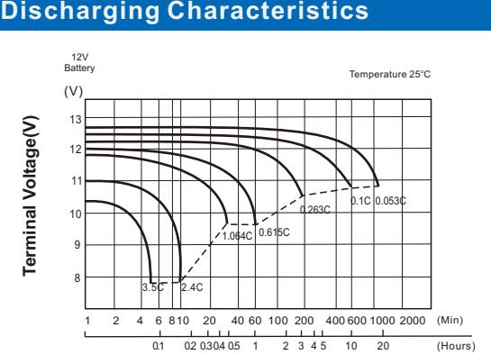
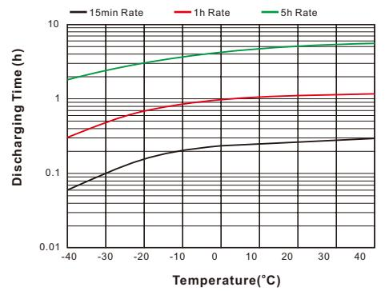
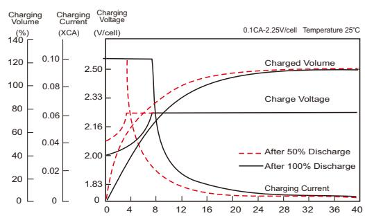
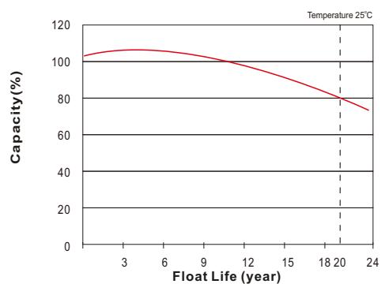

# UPBH62FT (12V62Ah)

## **UPBH SERIES**  *LONG STANDBY LIFE*

| Specification          |                                                                                                                                                                                                                             |                                                     |  |  |  |  |  |  |
|------------------------|-----------------------------------------------------------------------------------------------------------------------------------------------------------------------------------------------------------------------------|-----------------------------------------------------|--|--|--|--|--|--|
| Nominal Voltage        | 12V                                                                                                                                                                                                                         |                                                     |  |  |  |  |  |  |
|                        | 62Ah                                                                                                                                                                                                                        | o (C , 10 1.80V/cel 25 l, C)            |  |  |  |  |  |  |
| Rated Capacity (Ah)    | 62Ah                                                                                                                                                                                                                        | o (C , 8 1.75V/cel 25 l, C)             |  |  |  |  |  |  |
|                        | Length                                                                                                                                                                                                                      | 298.7±2mm (11.76 inches)                            |  |  |  |  |  |  |
|                        | Width                                                                                                                                                                                                                       | 97±2mm ( 3.82 inches)                               |  |  |  |  |  |  |
| Dimension              | Height                                                                                                                                                                                                                      | 267±2mm (10.51 inches)                              |  |  |  |  |  |  |
|                        | Total Height (with Terminal)                                                                                                                                                                                                | 267±2mm (10.51 inches)                              |  |  |  |  |  |  |
| Weight                 | 19.5Kg (42.99 Ibs)                                                                                                                                                                                                          |                                                     |  |  |  |  |  |  |
| Terminal               | Threaded M8 (T11) insert with M6 front terminal adaptor                                                                                                                                                                  |                                                     |  |  |  |  |  |  |
| Container Material     | PC-ABS flame retardant jar and cover to UL94V-0                                                                                                                                                                             |                                                     |  |  |  |  |  |  |
| Max. Discharge Current | 744A (5s)                                                                                                                                                                                                                   |                                                     |  |  |  |  |  |  |
| Internal Resistance    | Approx 4.8mΩ(Fully charged)                                                                                                                                                                                                 |                                                     |  |  |  |  |  |  |
|                        | o o o o Discharge : -40 C~65 C (-40 F~149 F)                                                                                                                                                                    |                                                     |  |  |  |  |  |  |
| Operating Temp.Range   | o o o o Charge : 0 C~40 C (32 F~104 F)                                                                                                                                                                    |                                                     |  |  |  |  |  |  |
|                        | o o o Storage : -20 C~40 C(-4 F~104 F)                                                                                                                                                                          | o                                                   |  |  |  |  |  |  |
| Capacity affected by   | o o 40 C (104 F)                                                                                                                                                                                                   | 103%                                                |  |  |  |  |  |  |
| Temperature            | o o 25 C ( 77 F )                                                                                                                                                                                                  | 100%                                                |  |  |  |  |  |  |
|                        | o o 0 C ( 32 F )                                                                                                                                                                                                   | 86%                                                 |  |  |  |  |  |  |
| Storage                | at 25°C(77°F), For higher temperatures the time interval will be shorter. Battery needs to be given a freshening charge when the OCV approach 2.10V/cell or when the maximum storage time is reached, whichever | UPBH series batteries can be stored up to 24 months |  |  |  |  |  |  |

occurs first.

Unit: mm

| 0 0 Constant Current Discharge (Amperes) at 25 C (77 F ) |       |       |       |       |       |      |      |      |      |      |      |      |      |
|----------------------------------------------------------------|-------|-------|-------|-------|-------|------|------|------|------|------|------|------|------|
| F.V/Time                                                       | 10min | 15min | 20min | 30min | 45min | 1h   | 2h   | 3h   | 4h   | 5h   | 8h   | 10h  | 20h  |
| 1.85V/cell                                                     | 120.4 | 99.4  | 85.4  | 66.2  | 49.2  | 38.3 | 24.6 | 17.4 | 13.5 | 10.3 | 7.45 | 6.08 | 3.22 |
| 1.80V/cell                                                     | 134.3 | 109.2 | 91.5  | 69.4  | 51.0  | 39.7 | 24.9 | 17.5 | 13.6 | 10.5 | 7.62 | 6.20 | 3.29 |
| 1.75V/cell                                                     | 142.4 | 114.3 | 95.4  | 71.6  | 52.4  | 40.8 | 25.2 | 17.6 | 13.6 | 10.8 | 7.75 | 6.29 | 3.33 |
| 1.70V/cell                                                     | 150.0 | 119.1 | 98.4  | 73.7  | 53.5  | 41.5 | 25.4 | 17.7 | 13.7 | 11.0 | 7.83 | 6.30 | 3.36 |
| 1.67V/cell                                                     | 162.6 | 126.5 | 103.0 | 75.6  | 54.3  | 42.2 | 25.6 | 17.8 | 13.7 | 11.2 | 7.94 | 6.44 | 3.39 |
| 1.60V/cell                                                     | 171.4 | 131.9 | 106.9 | 77.7  | 55.4  | 42.9 | 25.7 | 17.9 | 13.8 | 11.3 | 8.04 | 6.48 | 3.50 |

| 0 0 Constant Power Discharge (Watts/cell) at 25 C (77 F ) |       |       |       |       |       |      |      |      |      |      |      |      |      |
|-----------------------------------------------------------------|-------|-------|-------|-------|-------|------|------|------|------|------|------|------|------|
| F.V/Time                                                        | 10min | 15min | 20min | 30min | 45min | 1h   | 2h   | 3h   | 4h   | 5h   | 8h   | 10h  | 20h  |
| 1.85V/cell                                                      | 228.3 | 190.2 | 164.3 | 128.9 | 97.1  | 75.8 | 48.9 | 34.7 | 27.0 | 20.7 | 15.1 | 12.4 | 6.57 |
| 1.80V/cell                                                      | 250.7 | 206.2 | 174.4 | 134.2 | 100.2 | 78.2 | 49.4 | 34.9 | 27.1 | 21.2 | 15.4 | 12.6 | 6.68 |
| 1.75V/cell                                                      | 263.2 | 213.7 | 180.3 | 137.4 | 102.2 | 79.9 | 49.8 | 35.1 | 27.2 | 21.6 | 15.6 | 12.7 | 6.77 |
| 1.70V/cell                                                      | 272.9 | 219.9 | 184.0 | 140.2 | 103.7 | 81.0 | 50.2 | 35.2 | 27.3 | 21.9 | 15.7 | 12.8 | 6.81 |
| 1.67V/cell                                                      | 292.9 | 231.4 | 191.2 | 143.3 | 104.9 | 81.9 | 50.4 | 35.3 | 27.4 | 22.2 | 15.9 | 12.9 | 6.85 |
| 1.60V/cell                                                      | 300.6 | 236.2 | 195.1 | 145.4 | 105.7 | 82.6 | 50.8 | 35.6 | 27.5 | 22.5 | 16.1 | 13.1 | 6.94 |

Specifications subject to change without notice.

## **Features & Benefits**

- 20 years design life( ) 25o C
- Low internal resistance
- Fast Charging Acceptance
- Premium ABS+ jar & covers
- IATA Approved for Air Freight
- Heat sealed plastic container
- UL Recognized, IEC Certified
- Automated COS & TTP welding
- M6 & M8 Terminal adapter options
- Flame Retardant to UL94V-0
- Long Shelf Life up to 2 years @25°C(77°F)
- High-rate performance, high energy density
- Virgin pure lead plates / copper alloy terminal inserts
- Excellent high rate discharge capability for emergency backup power supply.
- High quality AGM separators minimize electrical resistance to allow high current discharging properties.
- Outstanding high rate charge capability with Thin Plate Pure Lead technology

**Discharging Time**

## **Effect of Temperature on Discharging Time**

#### **Charging Characteristics**

#### **Charging Time(hours)**

#### **Float Life**

