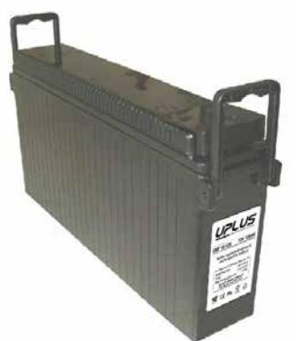
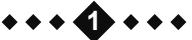
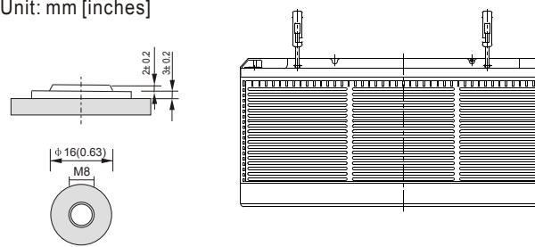
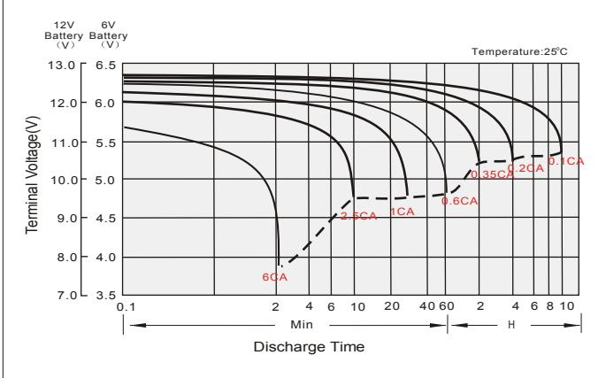
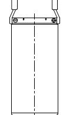
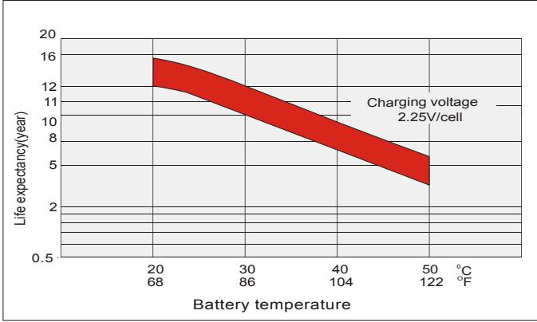
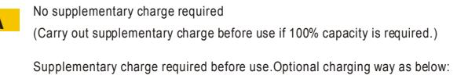

# USF12-150B (12V AH) **USF SERIES** 150

#### **General Features**

- Sealed and maintenance free operation.
- Non-Spillable construction design.
- ABS containers and covers(UL94HB, UL94V-0) optional.
- Safety valve installation for explosion proof.
- High quality and high reliability.
- Exceptional deep discharge recovery performance.
- Low self discharge characteristic.
- Flexibility design for multiple install positions.

| Battery Type         | Valve-Regulated,Absorbed Glass Mat(AGM) Technology   |                                         |                        |                                                           |                             |                       |  |  |  |  |
|----------------------|------------------------------------------------------|-----------------------------------------|------------------------|-----------------------------------------------------------|-----------------------------|-----------------------|--|--|--|--|
| Nomial Voltage       | 12V                                                  |                                         |                        |                                                           |                             |                       |  |  |  |  |
| 0                    | 20HR(8.25A,1.8V/cell)                                |                                         | 10HR(15.57A,1.8V/cell) | 5HR(28.3A,1.75V/cell)                                     |                             | 1HR(106.5A,1.6V/cell) |  |  |  |  |
| Capacity( 25 C)      | 165.0AH                                              | 155.7AH                                 |                        | 141.5AH                                                   |                             | 106.5AH               |  |  |  |  |
|                      | Length                                               | Height Width                         |                        | Total Height                                              |                             |                       |  |  |  |  |
| Dimensions           | 560mm(22.05inches)                                   | 110mm(4.33inches) 280mm(11.02inches) |                        |                                                           |                             | 280mm(11.02inches)    |  |  |  |  |
| Approx Weight        | Approx 43.8 Kg (96.6lbs)                             |                                         |                        |                                                           |                             |                       |  |  |  |  |
| Internal Resistance  | 0 Full Charged at 25 C : Approx 3.0m              |                                         |                        |                                                           |                             |                       |  |  |  |  |
| Self Discharge       | 0 3% of capacity declined per month at 25 C       |                                         |                        |                                                           |                             |                       |  |  |  |  |
| Capacity affected by | 0 40 C                                            | 0 25 C                               |                        | 0 0 C                                                     |                             | 0 -15 C            |  |  |  |  |
| Temperature(10HR)    | 103%                                                 |                                         | 100%                   | 86%                                                       |                             | 65%                   |  |  |  |  |
|                      |                                                      | Cycle use                               |                        | Float use                                                 |                             |                       |  |  |  |  |
| Charging Voltage (V) | 0 14.4V~15.0V at 25 C. Temp. Coefficient -30mV/ C |                                         | 0                      | 0 0 13.5V~13.8V at 25 C. Temp. Coefficient -20mV/ C |                             |                       |  |  |  |  |
|                      | Max. Discharge Current(5s)                           |                                         |                        | Initial Charging Current                                  |                             |                       |  |  |  |  |
| Current              |                                                      | 1200A                                   |                        | Less than 45.0A                                           |                             |                       |  |  |  |  |
|                      | Discharge                                            |                                         | Charging               |                                                           | Storage                     |                       |  |  |  |  |
| Operating Temp.Range | 0 0 -15~50 C(5~122 F)                          |                                         | 0 0~40 C(32~104 F)  | 0                                                         | 0 0 -15~40 C(5~104 F) |                       |  |  |  |  |

#### **0 0 Constant Current Discharge (Amperes) at 25 C** 77 **F )(**

| F.V/Time   | 10min | 15min | 20min | 30min | 45min | 1h    | 2h   | 3h   | 4h   | 5h   | 6h   | 8h    | 10h   | 20h  |
|------------|-------|-------|-------|-------|-------|-------|------|------|------|------|------|-------|-------|------|
| 1.85V/cell | 260.9 | 217.5 | 186.6 | 146.4 | 113.5 | 92.3  | 55.0 | 39.6 | 31.8 | 26.3 | 22.9 | 17.85 | 14.89 | 7.89 |
| 1.80V/cell | 295.8 | 242.4 | 206.6 | 160.2 | 122.1 | 98.5  | 58.0 | 42.2 | 33.5 | 27.7 | 24.1 | 18.75 | 15.57 | 8.25 |
| 1.75V/cell | 324.6 | 262.3 | 220.4 | 168.3 | 126.8 | 102.0 | 59.2 | 42.8 | 34.3 | 28.3 | 24.5 | 18.98 | 15.75 | 8.37 |
| 1.70V/cell | 347.2 | 276.3 | 229.3 | 173.2 | 129.7 | 103.4 | 60.0 | 43.3 | 34.5 | 28.5 | 24.8 | 19.25 | 15.90 | 8.43 |
| 1.67V/cell | 359.3 | 283.1 | 234.1 | 175.4 | 130.2 | 103.8 | 60.2 | 43.5 | 34.8 | 28.8 | 25.1 | 19.50 | 16.05 | 8.48 |
| 1.60V/cell | 377.7 | 294.0 | 244.5 | 179.9 | 133.6 | 106.5 | 61.2 | 44.4 | 35.6 | 29.6 | 25.5 | 19.95 | 16.35 | 8.52 |

### **0 0 Constant Power Discharge (Watts) at 25 C** (77 **F )**

| F.V/Time   | 10min | 15min | 20min | 30min | 45min | 1h    | 2h    | 3h   | 4h   | 5h   | 6h   | 8h   | 10h  | 20h   |
|------------|-------|-------|-------|-------|-------|-------|-------|------|------|------|------|------|------|-------|
| 1.85V/cell | 487.1 | 410.2 | 355.5 | 281.9 | 220.4 | 179.8 | 108.0 | 78.0 | 62.8 | 52.2 | 45.5 | 35.6 | 29.8 | 15.78 |
| 1.80V/cell | 545.8 | 451.0 | 387.8 | 303.8 | 235.3 | 190.9 | 113.1 | 82.6 | 65.8 | 54.6 | 47.6 | 37.3 | 31.1 | 16.48 |
| 1.75V/cell | 589.5 | 482.2 | 409.9 | 316.6 | 242.0 | 196.8 | 114.9 | 83.5 | 67.2 | 55.7 | 48.2 | 37.6 | 31.4 | 16.70 |
| 1.70V/cell | 616.5 | 500.9 | 423.2 | 324.1 | 246.7 | 198.8 | 116.2 | 84.2 | 67.5 | 55.8 | 48.7 | 38.1 | 31.7 | 16.81 |
| 1.67V/cell | 635.4 | 511.2 | 430.2 | 327.6 | 246.8 | 199.2 | 116.4 | 84.5 | 67.9 | 56.4 | 49.2 | 38.6 | 31.9 | 16.88 |
| 1.60V/cell | 649.5 | 520.3 | 443.1 | 331.5 | 250.5 | 202.4 | 117.3 | 85.7 | 69.0 | 57.6 | 49.9 | 39.4 | 32.5 | 16.95 |

#### **Dimensions**

## **Terminal**

**Discharge characteristics Cycle use charging characteristics** 

**Effect of Temperature on Long Term Float Life**

#### **Self Discharge Characteristics**

1.Charged for above 3 days at limted current 0.25CA and constant volatge 2.25V/cell. 2.Charged for above 20hours at limted current 0.25CA and constant volatge 2.45V/cell. 3.Charged for 8~10hours at limted current 0.05CA .

Supplementary charge may often fail to recover the capacity. The battery should never be left standing till this is reached.

**A B C** Storage Time(Months) Remaining Capacity(%) 8 10 12 0 4 6 60 80 100 0 2 20 40 0 25 C 0 40 C0 30 C 0 10 C **A B C**

**2**