# USF12-100A (12V100AH) **USF SERIES**

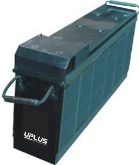

## **General Features**

- Sealed and maintenance free operation.
- Non-Spillable construction design.
- ABS containers and covers(UL94HB, UL94V-0) optional.
- Safety valve installation for explosion proof.
- High quality and high reliability.
- Exceptional deep discharge recovery performance.
- Low self discharge characteristic.
- Flexibility design for multiple install positions.

| Battery Type         | Valve-Regulated,Absorbed Glass Mat(AGM) Technology   |                                          |                       |                                                           |                             |                      |  |  |  |  |
|----------------------|------------------------------------------------------|------------------------------------------|-----------------------|-----------------------------------------------------------|-----------------------------|----------------------|--|--|--|--|
| Nomial Voltage       | 12V                                                  |                                          |                       |                                                           |                             |                      |  |  |  |  |
| 0                    | 20HR(5.5A,1.8V/cell)                                 |                                          | 10HR(10.4A,1.8V/cell) | 5HR(18.9A,1.75V/cell)                                     |                             | 1HR(71.0A,1.6V/cell) |  |  |  |  |
| Capacity( 25 C)      | 110.0AH                                              | 104.0AH                                  |                       | 94.5AH                                                    |                             | 71.0AH               |  |  |  |  |
|                      | Length                                               | Width                                    |                       | Height                                                    |                             | Total Height         |  |  |  |  |
| Dimensions           | 508mm(20.0inches)                                    | 110mm(4.33inches) 238.5mm(9.39inches) |                       |                                                           |                             | 238.5mm(9.39inches)  |  |  |  |  |
| Approx Weight        | Approx 35.0 Kg (77.2lbs)                             |                                          |                       |                                                           |                             |                      |  |  |  |  |
| Internal Resistance  | 0 Full Charged at 25 C : Approx 4.3m              |                                          |                       |                                                           |                             |                      |  |  |  |  |
| Self Discharge       | 0 3% of capacity declined per month at 25 C       |                                          |                       |                                                           |                             |                      |  |  |  |  |
| Capacity affected by | 0 40 C                                            |                                          | 0 0 0 C 25 C    |                                                           |                             | 0 -15 C           |  |  |  |  |
| Temperature(10HR)    | 103%                                                 | 100%                                     |                       | 86%                                                       |                             | 65%                  |  |  |  |  |
|                      |                                                      | Cycle use                                |                       | Float use                                                 |                             |                      |  |  |  |  |
| Charging Voltage (V) | 0 14.4V~15.0V at 25 C. Temp. Coefficient -30mV/ C |                                          | 0                     | 0 0 13.5V~13.8V at 25 C. Temp. Coefficient -20mV/ C |                             |                      |  |  |  |  |
|                      | Max. Discharge Current(5s)                           |                                          |                       | Initial Charging Current                                  |                             |                      |  |  |  |  |
| Current              |                                                      | 1000A                                    |                       | Less than 30A                                             |                             |                      |  |  |  |  |
|                      | Discharge                                            |                                          | Charging              |                                                           | Storage                     |                      |  |  |  |  |
| Operating Temp.Range | 0 0 -15~50 C(5~122 F)                          |                                          | 0 0~40 C(32~104 F) | 0                                                         | 0 0 -15~40 C(5~104 F) |                      |  |  |  |  |

## **0 0 Constant Current Discharge (Amperes) at 25 C** 77 **F )(**

| F.V/Time   | 10min | 15min | 20min | 30min | 45min | 1h   | 2h   | 3h   | 4h   | 5h   | 6h   | 8h   | 10h  | 20h  |
|------------|-------|-------|-------|-------|-------|------|------|------|------|------|------|------|------|------|
| 1.85V/cell | 173.9 | 145.0 | 124.4 | 97.6  | 75.7  | 61.5 | 36.7 | 26.4 | 21.2 | 17.6 | 15.3 | 11.9 | 9.92 | 5.26 |
| 1.80V/cell | 197.2 | 161.6 | 137.7 | 106.8 | 81.4  | 65.7 | 38.7 | 28.1 | 22.3 | 18.5 | 16.1 | 12.5 | 10.4 | 5.50 |
| 1.75V/cell | 216.4 | 174.9 | 146.9 | 112.2 | 84.5  | 68.0 | 39.4 | 28.6 | 22.9 | 18.9 | 16.3 | 12.7 | 10.5 | 5.58 |
| 1.70V/cell | 231.5 | 184.2 | 152.9 | 115.5 | 86.5  | 68.9 | 40.0 | 28.8 | 23.0 | 19.0 | 16.5 | 12.8 | 10.6 | 5.62 |
| 1.67V/cell | 239.5 | 188.8 | 156.0 | 117.0 | 86.8  | 69.2 | 40.1 | 28.9 | 23.1 | 19.1 | 16.6 | 12.9 | 10.7 | 5.65 |
| 1.60V/cell | 251.8 | 196.0 | 163.0 | 119.9 | 89.1  | 71.0 | 40.8 | 29.3 | 23.4 | 19.3 | 16.7 | 13.0 | 10.8 | 5.68 |

# **0 0 Constant Power Discharge (Watts) at 25 C** (77 **F )**

| F.V/Time   | 10min | 15min | 20min | 30min | 45min | 1h    | 2h   | 3h   | 4h   | 5h   | 6h   | 8h   | 10h  | 20h   |
|------------|-------|-------|-------|-------|-------|-------|------|------|------|------|------|------|------|-------|
| 1.85V/cell | 324.8 | 273.4 | 237.0 | 187.9 | 147.0 | 119.9 | 72.0 | 52.0 | 41.9 | 34.8 | 30.3 | 23.7 | 19.8 | 10.52 |
| 1.80V/cell | 363.9 | 300.7 | 258.5 | 202.5 | 156.9 | 127.3 | 75.4 | 55.0 | 43.8 | 36.4 | 31.7 | 24.9 | 20.7 | 10.98 |
| 1.75V/cell | 393.0 | 321.4 | 273.3 | 211.1 | 161.4 | 131.2 | 76.6 | 55.7 | 44.8 | 37.1 | 32.1 | 25.2 | 20.9 | 11.14 |
| 1.70V/cell | 411.0 | 333.9 | 282.2 | 216.1 | 162.5 | 132.5 | 77.5 | 56.1 | 45.0 | 37.2 | 32.5 | 25.4 | 21.0 | 11.21 |
| 1.67V/cell | 423.6 | 340.8 | 286.8 | 218.4 | 164.5 | 132.8 | 77.6 | 56.2 | 45.1 | 37.3 | 32.6 | 25.5 | 21.2 | 11.25 |
| 1.60V/cell | 433.0 | 346.9 | 295.4 | 221.0 | 167.0 | 134.9 | 78.2 | 56.5 | 45.4 | 37.6 | 32.7 | 25.6 | 21.4 | 11.30 |

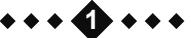

# **Dimensions**

#### **Terminal** Unit: mm [inches]

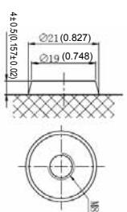

Remaining Capacity(%)

0

20

40

60

80

100

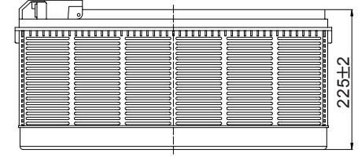

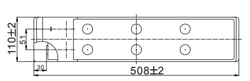

Charge

Charging

Charging

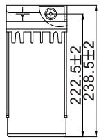

32 36

**Discharge characteristics Cycle use charging characteristics** 

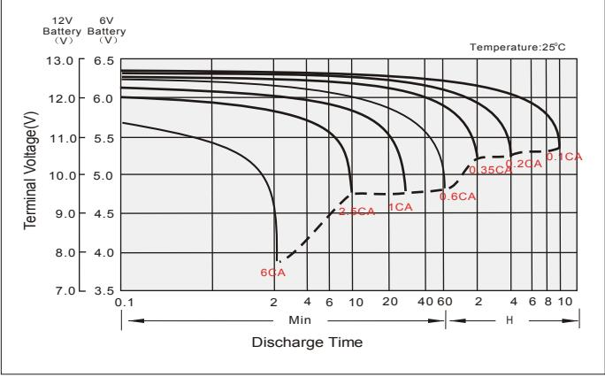

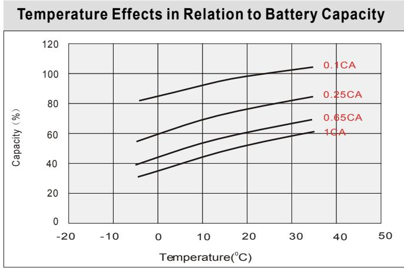

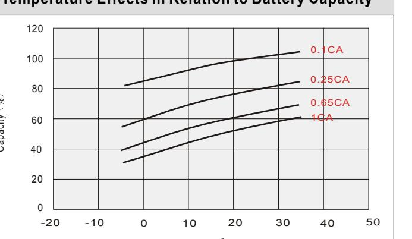

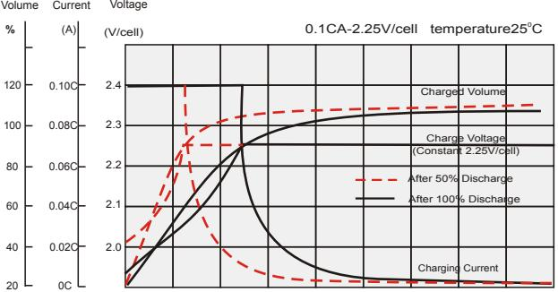

0 4 8 12 16 20 24 28 Charging Time(hours)

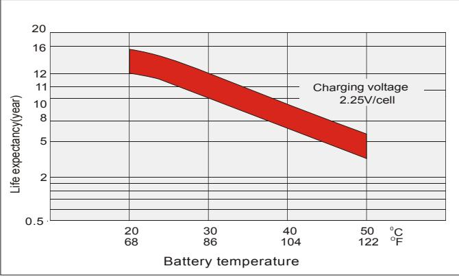

### **Self Discharge Characteristics**

No supplementary charge required (Carry out supplementary charge before use if 100% capacity is required.)

1.Charged for above 3 days at limted current 0.25CA and constant volatge 2.25V/cell. 2.Charged for above 20hours at limted current 0.25CA and constant volatge 2.45V/cell. 3.Charged for 8~10hours at limted current 0.05CA .

Supplementary charge required before use.Optional charging way as below: Supplementary charge may often fail to recover the capacity. The battery should never be left standing till this is reached. **A B C** Storage Time(Months) 8 10 12 4 6 0 2 0 25 C 0 40 C0 30 C **B C**

0 10 C **A**

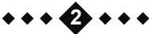