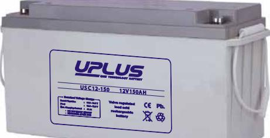
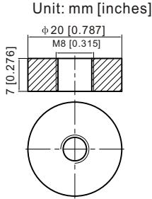
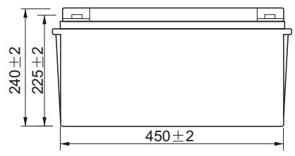
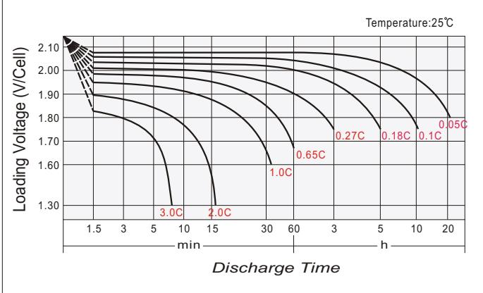
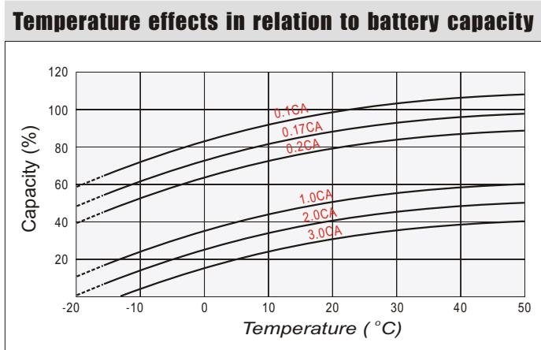
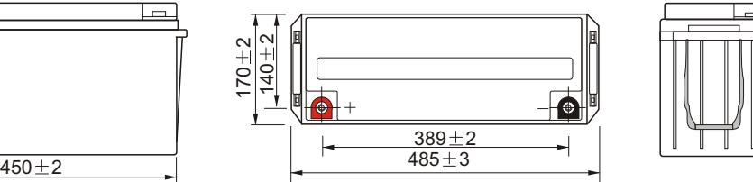
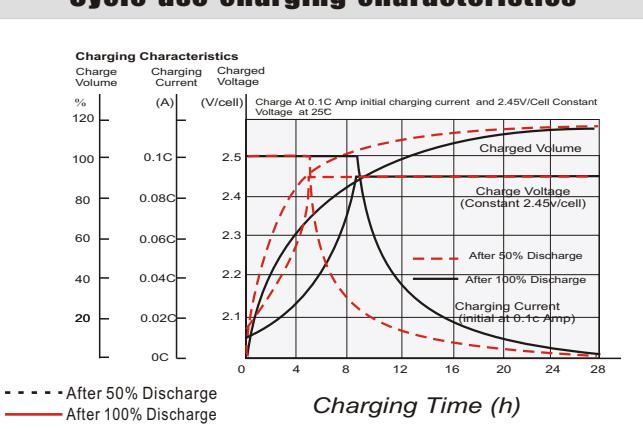
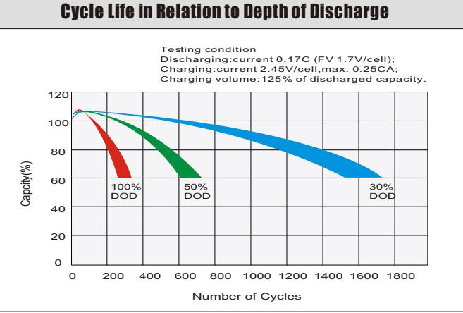
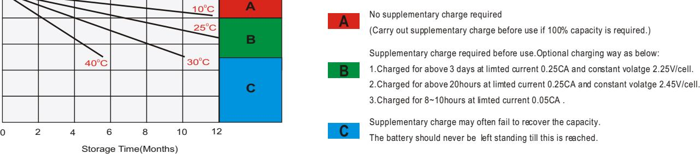

# USC12-150 (12V150AH) USC SERIES-Deep Cycle

#### **General Features**

- Using oxygen recombination technology: maintenance-free
- Special grid alloy: less gassing, less self-discharging
- For longer cycle life: special paste formula, over dimensioned negative plate, optimised manufacturing process , additives for deep discharge
- Thermal management system (optional)
- Special anti-vibration design (optional)
- High quality AGM separator: extend cycle life and prevent micro short circuit
- ABS material: increase the strength of battery container. (Flame-retardant ABS is optional)

| Battery Type          | Valve-Regulated,Absorbed Glass Mat(AGM) Technology |                   |                        |                                                    |                             |                      |  |  |  |  |  |
|-----------------------|----------------------------------------------------------|-------------------|------------------------|----------------------------------------------------|-----------------------------|----------------------|--|--|--|--|--|
| Nomial Voltage        | 12V                                                      |                   |                        |                                                    |                             |                      |  |  |  |  |  |
| 0                     | 20HR(7.80A,1.8V/cell)                                    |                   | 10HR(14.55A,1.8V/cell) | 5HR(25.5A,1.75V/cell)                              |                             | 1HR(87.9A,1.6V/cell) |  |  |  |  |  |
| Capacity( 20 C)    | 156.0AH                                                  |                   | 145.5AH                | 127.6AH                                            |                             | 87.9AH               |  |  |  |  |  |
|                       | Length                                                   | Length            |                        | Length                                             |                             | Length               |  |  |  |  |  |
| Dimensions            | 485mm(19.1inches)                                        | 170mm(6.69inches) |                        | 240mm(9.45inches)                                  |                             | 240mm(9.45inches)    |  |  |  |  |  |
| Approx Weight         | Approx 43.5 kg (95.9lbs)                                 |                   |                        |                                                    |                             |                      |  |  |  |  |  |
| Internal Resistance   | 0 Full Charged at 20 C : Approx 2.5 m                 |                   |                        |                                                    |                             |                      |  |  |  |  |  |
| Self Discharge        | 0 3% of capacity declined per month at 20 C           |                   |                        |                                                    |                             |                      |  |  |  |  |  |
| Capacity aected by    | 0 40 C                                                |                   | 0 25 C              | 0 0 C                                              |                             | 0 -15 C           |  |  |  |  |  |
| Temperature(10HR)     | 103%                                                     |                   | 100%                   | 86%                                                |                             | 65%                  |  |  |  |  |  |
|                       |                                                          | Cycle use         |                        | Float use                                          |                             |                      |  |  |  |  |  |
| Charging Voltage (V)  | 0 14.4V~15.0V at 20 C. T emp. Coecient -30mV/ C       |                   | 0                      | 0 13.5V~13.8V at 20 C. T emp. Coecient -20mV/ C |                             | 0                    |  |  |  |  |  |
| Current               | Max. Discharge Current(5s)                               |                   |                        | Initial Charging Current                           |                             |                      |  |  |  |  |  |
|                       | 1500A                                                    |                   |                        | Less than 45A                                      |                             |                      |  |  |  |  |  |
|                       | Discharge                                                |                   | Charging               |                                                    | Storage                     |                      |  |  |  |  |  |
| Operating T emp.Range | 0 0 -15~50 C(5~122 F)                              |                   | 0 0~40 C(32~104 F)  | 0                                                  | 0 0 -15~40 C(5~104 F) |                      |  |  |  |  |  |

#### **0 0 Co ns ta nt C ur re nt D is ch ar ge (A m pe re s) a t 2 0 C 6 8 F )**

| F.V/ Tim e   | 10 m in | 15 m in | 20 m in | 30 m in | 45 m in | 1h   | 2h   | 3h   | 4h   | 5h   | 6h   | 8h   | 10 h | 20 h |
|--------------|---------|---------|---------|---------|---------|------|------|------|------|------|------|------|------|------|
| 1.8 5V /cell | 171.0   | 151.1   | 133.0   | 106.3   | 82.8    | 69.4 | 45.9 | 35.0 | 28.3 | 24.0 | 21.2 | 17.0 | 14.1 | 7.57 |
| 1.8 0V /cell | 225.1   | 186.1   | 157.3   | 120.6   | 90.6    | 75.1 | 49.0 | 36.6 | 29.4 | 24.9 | 22.0 | 17.5 | 14.6 | 7.80 |
| 1.7 5V /cell | 245.7   | 199.9   | 166.3   | 126.5   | 95.0    | 78.7 | 50.3 | 37.4 | 30.2 | 25.5 | 22.4 | 17.8 | 14.7 | 7.87 |
| 1.7 0V /cell | 267.3   | 210.0   | 174.0   | 132.5   | 98.4    | 81.8 | 52.1 | 38.4 | 30.8 | 26.0 | 22.8 | 18.0 | 14.8 | 7.97 |
| 1.6 5V /cell | 279.9   | 218.5   | 181.0   | 137.7   | 102.8   | 84.6 | 53.6 | 39.6 | 31.5 | 26.6 | 23.2 | 18.3 | 15.0 | 8.02 |
| 1.6 0V /cell | 297.5   | 230.1   | 189.3   | 142.8   | 106.6   | 87.9 | 54.8 | 40.2 | 32.4 | 27.2 | 23.7 | 18.6 | 15.2 | 8.11 |

#### **0 0 Co ns ta nt P ow er D is ch ar ge (W at ts ) a t 2 0 C (6 8 F )**

| F.V/ Tim e   | 10 m in | 15 m in | 20 m in | 30 m in | 45 m in | 1h    | 2h    | 3h   | 4h   | 5h   | 6h   | 8h   | 10 h | 20 h |
|--------------|---------|---------|---------|---------|---------|-------|-------|------|------|------|------|------|------|------|
| 1.8 5V /cell | 320.5   | 285.3   | 252.6   | 203.7   | 159.9   | 134.8 | 89.8  | 68.7 | 55.9 | 47.5 | 42.3 | 33.9 | 28.3 | 15.3 |
| 1.8 0V /cell | 415.3   | 347.3   | 296.6   | 229.5   | 174.0   | 145.2 | 95.2  | 71.6 | 57.8 | 49.2 | 43.6 | 34.9 | 29.2 | 15.7 |
| 1.7 5V /cell | 447.6   | 368.8   | 310.8   | 239.2   | 181.3   | 151.3 | 97.3  | 72.8 | 59.2 | 50.2 | 44.3 | 35.4 | 29.4 | 15.8 |
| 1.7 0V /cell | 479.9   | 383.0   | 322.3   | 248.7   | 186.9   | 156.6 | 100.5 | 74.4 | 60.0 | 50.8 | 44.9 | 35.7 | 29.6 | 16.0 |
| 1.6 5V /cell | 497.2   | 395.6   | 333.3   | 257.0   | 194.3   | 161.5 | 103.0 | 76.5 | 61.3 | 52.0 | 45.7 | 36.2 | 29.9 | 16.1 |
| 1.6 0V /cell | 519.2   | 411.5   | 345.1   | 264.8   | 200.4   | 167.2 | 104.9 | 77.4 | 62.7 | 52.9 | 46.4 | 36.5 | 30.2 | 16.2 |

#### Dimensions

### **T11 Terminal**

Remaining Capacity(%)

0

20 40

60 80 100

## Discharge characteristics

#### Self Discharge Characteristics

Cycle use charging characteristics

*2 2*