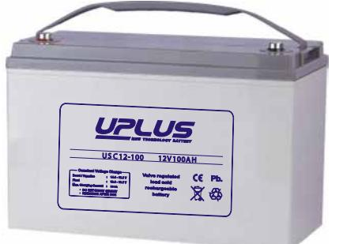
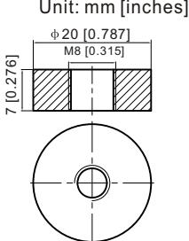
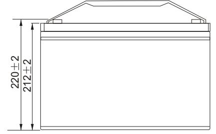
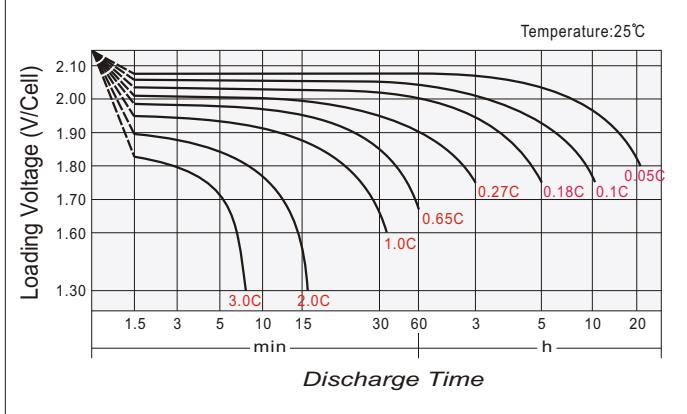
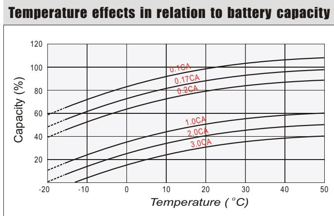
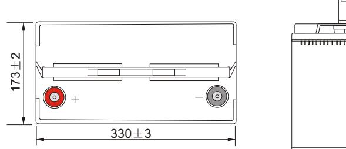
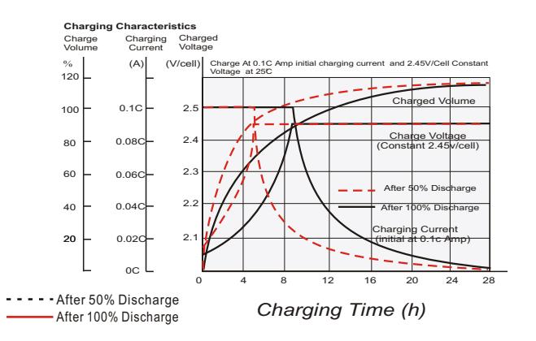
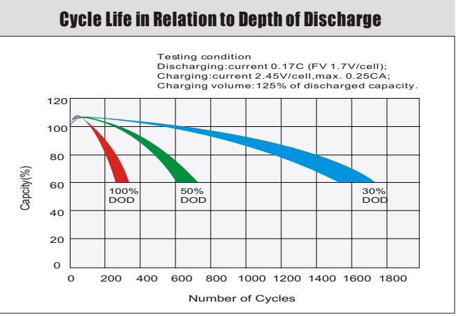
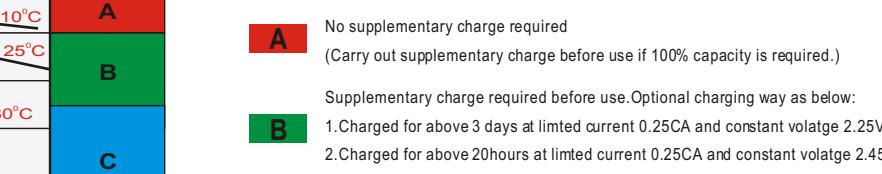
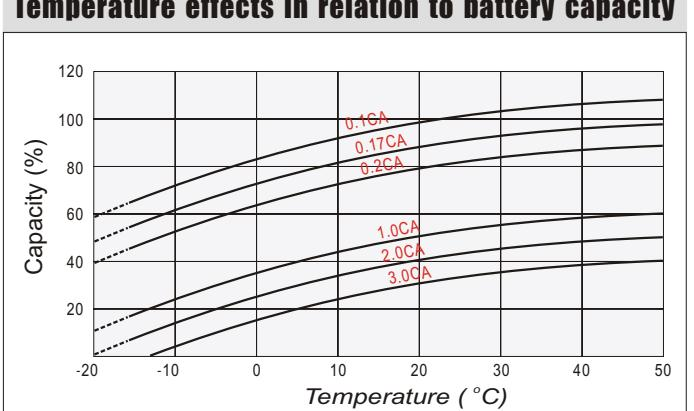

# USC12-100 (12V100AH) USC SERIES-Deep Cycle

#### **General Features**

- Using oxygen recombination technology: maintenance-free
- Special grid alloy: less gassing, less self-discharging
- For longer cycle life: special paste formula, over dimensioned negative plate, optimised manufacturing process , additives for deep discharge
- Thermal management system (optional)
- Special anti-vibration design (optional)
- High quality AGM separator: extend cycle life and prevent micro short circuit
- ABS material: increase the strength of battery container. (Flame-retardant ABS is optional)

| Battery Type          | Valve-Regulated,Absorbed Glass Mat(AGM) Technology |                                                    |                       |                          |                             |                                                    |  |  |  |  |
|-----------------------|----------------------------------------------------------|----------------------------------------------------|-----------------------|--------------------------|-----------------------------|----------------------------------------------------|--|--|--|--|
| Nomial Voltage        | 12V                                                      |                                                    |                       |                          |                             |                                                    |  |  |  |  |
| 0                     | 20HR(5.14A,1.8V/cell)                                    | 10HR(9.71A,1.8V/cell)                              | 5HR(17.5A,1.75V/cell) |                          | 1HR(68.6A,1.6V/cell)        |                                                    |  |  |  |  |
| Capacity( 20 C)    | 102.9AH                                                  |                                                    | 97.1AH                | 87.5AH                   |                             | 68.6AH                                             |  |  |  |  |
|                       | Length                                                   | Length                                             |                       | Length                   |                             | Length                                             |  |  |  |  |
| Dimensions            | 330mm(13.0inches)                                        | 173mm(6.81inches) 212mm(8.35inches)             |                       |                          |                             | 200mm(7.87inches)                                  |  |  |  |  |
| Approx Weight         | Approx 30.0 kg (66.2lbs)                                 |                                                    |                       |                          |                             |                                                    |  |  |  |  |
| Internal Resistance   | 0 Full Charged at 20 C : Approx 4.9 m                 |                                                    |                       |                          |                             |                                                    |  |  |  |  |
| Self Discharge        | 0 3% of capacity declined per month at 20 C           |                                                    |                       |                          |                             |                                                    |  |  |  |  |
| Capacity aected by    | 0 40 C                                                |                                                    | 0 25 C             | 0 0 C                    | 0 -15 C                  |                                                    |  |  |  |  |
| Temperature(10HR)     | 103%                                                     |                                                    | 100%                  | 86%                      |                             | 65%                                                |  |  |  |  |
|                       |                                                          | Cycle use                                          |                       | Float use                |                             |                                                    |  |  |  |  |
| Charging Voltage (V)  | 0                                                        | 0 14.4V~15.0V at 20 C. T emp. Coecient -30mV/ C |                       |                          | 0                           | 0 13.5V~13.8V at 20 C. T emp. Coecient -20mV/ C |  |  |  |  |
|                       | Max. Discharge Current(5s)                               |                                                    |                       | Initial Charging Current |                             |                                                    |  |  |  |  |
| Current               | 1200A                                                    |                                                    |                       | Less than 30A            |                             |                                                    |  |  |  |  |
|                       | Discharge                                                |                                                    | Charging              |                          | Storage                     |                                                    |  |  |  |  |
| Operating T emp.Range | 0 0 -15~50 C(5~122 F)                              |                                                    | 0 0~40 C(32~104 F) | 0                        | 0 0 -15~40 C(5~104 F) |                                                    |  |  |  |  |

#### **0 0 Co ns ta nt C ur re nt D is ch ar ge (A m pe re s) a t 2 0 C 6 8 F )**

| F.V/ Tim e   | 10 m in | 15 m in | 20 m in | 30 m in | 45 m in | 1h   | 2h   | 3h   | 4h   | 5h   | 6h   | 8h   | 10 h | 20 h |
|--------------|---------|---------|---------|---------|---------|------|------|------|------|------|------|------|------|------|
| 1.8 5V /cell | 155.0   | 136.0   | 120.3   | 96.1    | 74.9    | 60.4 | 35.4 | 25.7 | 20.3 | 16.8 | 14.7 | 11.6 | 9.57 | 5.08 |
| 1.8 0V /cell | 170.4   | 146.3   | 127.7   | 101.7   | 77.9    | 62.3 | 36.3 | 26.1 | 20.6 | 17.1 | 14.9 | 11.8 | 9.71 | 5.14 |
| 1.7 5V /cell | 179.6   | 152.0   | 131.7   | 104.3   | 80.1    | 63.6 | 37.1 | 26.8 | 21.2 | 17.5 | 15.1 | 11.9 | 9.80 | 5.19 |
| 1.7 0V /cell | 192.7   | 159.2   | 136.8   | 108.1   | 82.1    | 65.6 | 37.9 | 27.4 | 21.6 | 17.8 | 15.4 | 12.1 | 9.89 | 5.23 |
| 1.6 5V /cell | 205.8   | 167.2   | 141.9   | 111.9   | 84.2    | 67.3 | 38.8 | 28.1 | 22.0 | 18.1 | 15.6 | 12.2 | 10.0 | 5.27 |
| 1.6 0V /cell | 221.2   | 176.7   | 147.6   | 115.0   | 86.4    | 68.6 | 39.5 | 28.5 | 22.3 | 18.4 | 15.9 | 12.4 | 10.1 | 5.30 |

#### **0 0 Co ns ta nt P ow er D is ch ar ge (W at ts ) a t 2 0 C (6 8 F )**

| F.V/ Tim e   | 10 m in | 15 m in | 20 m in | 30 m in | 45 m in | 1h    | 2h   | 3h   | 4h   | 5h   | 6h   | 8h   | 10 h | 20 h  |
|--------------|---------|---------|---------|---------|---------|-------|------|------|------|------|------|------|------|-------|
| 1.8 5V /cell | 290.5   | 256.8   | 228.5   | 184.2   | 144.5   | 117.3 | 69.2 | 50.4 | 40.1 | 33.4 | 29.2 | 23.2 | 19.3 | 10.29 |
| 1.8 0V /cell | 314.4   | 273.0   | 240.7   | 193.5   | 149.6   | 120.5 | 70.7 | 51.1 | 40.5 | 33.8 | 29.5 | 23.5 | 19.5 | 10.39 |
| 1.7 5V /cell | 327.1   | 280.4   | 246.1   | 197.1   | 152.7   | 122.2 | 71.8 | 52.1 | 41.4 | 34.4 | 29.9 | 23.7 | 19.6 | 10.44 |
| 1.7 0V /cell | 345.9   | 290.4   | 253.4   | 202.9   | 155.9   | 125.6 | 73.1 | 53.1 | 42.0 | 34.9 | 30.3 | 23.9 | 19.7 | 10.48 |
| 1.6 5V /cell | 365.5   | 302.7   | 261.4   | 208.9   | 159.2   | 128.3 | 74.7 | 54.3 | 42.7 | 35.3 | 30.8 | 24.1 | 19.9 | 10.53 |
| 1.6 0V /cell | 386.0   | 316.0   | 269.2   | 213.2   | 162.4   | 130.4 | 75.6 | 54.9 | 43.2 | 35.8 | 31.1 | 24.3 | 20.0 | 10.57 |

#### Dimensions

### **T11 Terminal**

## Discharge characteristics

#### Cycle use charging characteristics

#### Self Discharge Characteristics

- 1.Charged for above 3 days at limted current 0.25CA and constant volatge 2.25V/cell.
- 2.Charged for above 20hours at limted current 0.25CA and constant volatge 2.45V/cell. 3.Charged for 8~10hours at limted current 0.05CA .

Supplementary charge may often fail to recover the capacity. The battery should never be left standing till this is reached.

Storage Time(Months)

4 6

0 40 C

8 10 12

0 25 C

0

0 30 C

Remaining Capacity(%)

0

20 40

0 2

60 80 100

> *2 2*

**C**