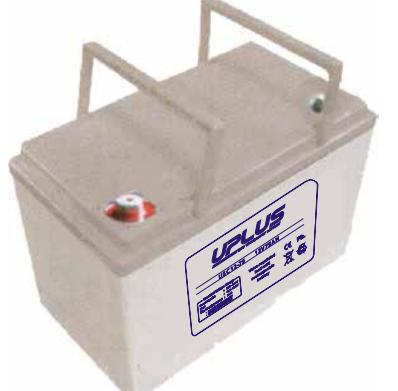
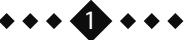
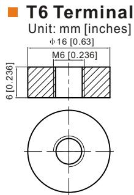
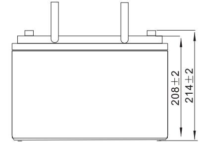
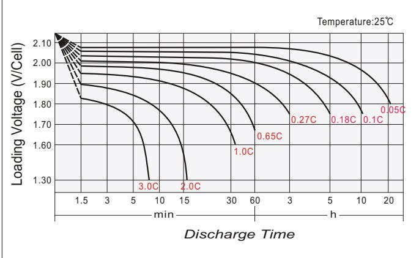
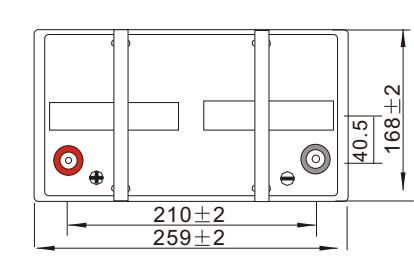
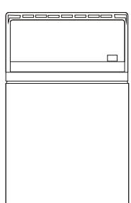
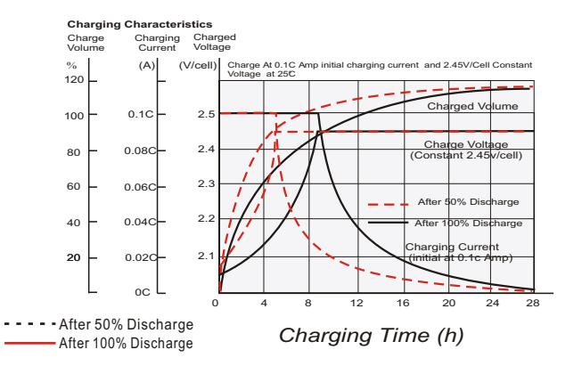
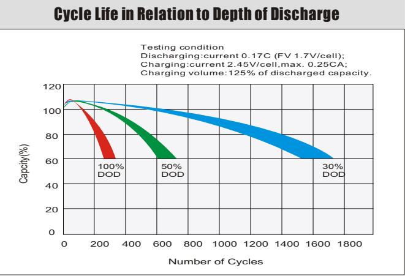

# USC12-75 (12V75AH) USC SERIES-Deep Cycle

#### **General Features**

- Using oxygen recombination technology: maintenance-free
- Special grid alloy: less gassing, less self-discharging
- For longer cycle life: special paste formula, over dimensioned negative plate, optimised manufacturing process , additives for deep discharge
- Thermal management system (optional)
- Special anti-vibration design (optional)
- High quality AGM separator: extend cycle life and prevent micro short circuit
- ABS material: increase the strength of battery container. (Flame-retardant ABS is optional)

| Battery Type          | Valve-Regulated,Absorbed Glass Mat(AGM) Technology |           |                       |                                                    |                             |                      |  |  |  |  |  |
|-----------------------|----------------------------------------------------------|-----------|-----------------------|----------------------------------------------------|-----------------------------|----------------------|--|--|--|--|--|
| Nomial Voltage        | 12V                                                      |           |                       |                                                    |                             |                      |  |  |  |  |  |
| 0                     | 20HR(3.86A,1.8V/cell)                                    |           | 10HR(7.28A,1.8V/cell) | 5HR(13.1A,1.75V/cell)                              |                             | 1HR(51.4A,1.6V/cell) |  |  |  |  |  |
| Capacity( 20 C)    | 77.1AH                                                   |           | 72.8AH                | 65.6AH                                             |                             | 51.4AH               |  |  |  |  |  |
|                       | Length                                                   | Length    |                       | Length                                             |                             | Length               |  |  |  |  |  |
| Dimensions            | 259mm(10.2inches)                                        |           | 168mm(6.61inches)     | 208mm(8.19inches)                                  |                             | 214mm(8.43inches)    |  |  |  |  |  |
| Approx Weight         | Approx 21.0 kg (46.3lbs)                                 |           |                       |                                                    |                             |                      |  |  |  |  |  |
| Internal Resistance   | 0 Full Charged at 20 C : Approx 6.6 m                 |           |                       |                                                    |                             |                      |  |  |  |  |  |
| Self Discharge        | 0 3% of capacity declined per month at 20 C           |           |                       |                                                    |                             |                      |  |  |  |  |  |
| Capacity aected by    | 0 40 C                                                |           | 0 25 C             | 0 0 C                                              |                             | 0 -15 C           |  |  |  |  |  |
| Temperature(10HR)     | 103%                                                     |           | 100%                  | 86%                                                |                             | 65%                  |  |  |  |  |  |
|                       |                                                          | Cycle use |                       | Float use                                          |                             |                      |  |  |  |  |  |
| Charging Voltage (V)  | 0 14.4V~15.0V at 20 C. T emp. Coecient -30mV/ C       |           | 0                     | 0 13.5V~13.8V at 20 C. T emp. Coecient -20mV/ C |                             | 0                    |  |  |  |  |  |
|                       | Max. Discharge Current(5s)                               |           |                       | Initial Charging Current                           |                             |                      |  |  |  |  |  |
| Current               | 900A                                                     |           |                       | Less than 22.5A                                    |                             |                      |  |  |  |  |  |
|                       | Discharge                                                |           | Charging              |                                                    | Storage                     |                      |  |  |  |  |  |
| Operating T emp.Range | 0 0 -15~50 C(5~122 F)                              |           | 0 0~40 C(32~104 F) | 0                                                  | 0 0 -15~40 C(5~104 F) |                      |  |  |  |  |  |

#### **0 0 Co ns ta nt C ur re nt D is ch ar ge (A m pe re s) a t 2 0 C 6 8 F )**

| F.V/ Tim e   | 10 m in | 15 m in | 20 m in | 30 m in | 45 m in | 1h   | 2h   | 3h   | 4h   | 5h   | 6h   | 8h   | 10 h | 20 h |
|--------------|---------|---------|---------|---------|---------|------|------|------|------|------|------|------|------|------|
| 1.8 5V /cell | 116.3   | 102.0   | 90.2    | 72.1    | 56.1    | 45.3 | 26.6 | 19.3 | 15.2 | 12.6 | 11.0 | 8.69 | 7.18 | 3.81 |
| 1.8 0V /cell | 128.3   | 110.0   | 95.1    | 75.2    | 58.4    | 46.7 | 27.3 | 19.6 | 15.5 | 12.9 | 11.2 | 8.83 | 7.28 | 3.86 |
| 1.7 5V /cell | 135.1   | 114.0   | 98.3    | 77.5    | 60.0    | 47.7 | 27.8 | 20.1 | 15.9 | 13.1 | 11.4 | 8.94 | 7.35 | 3.89 |
| 1.7 0V /cell | 145.4   | 119.7   | 102.4   | 79.8    | 61.6    | 49.2 | 28.4 | 20.6 | 16.2 | 13.4 | 11.5 | 9.05 | 7.42 | 3.92 |
| 1.6 5V /cell | 154.3   | 125.4   | 106.0   | 82.1    | 63.2    | 50.4 | 29.1 | 21.0 | 16.5 | 13.6 | 11.7 | 9.16 | 7.50 | 3.95 |
| 1.6 0V /cell | 163.3   | 131.1   | 109.7   | 84.8    | 64.8    | 51.4 | 29.6 | 21.4 | 16.7 | 13.8 | 11.9 | 9.27 | 7.55 | 3.98 |

#### **0 0 Co ns ta nt P ow er D is ch ar ge (W at ts ) a t 2 0 C (6 8 F )**

| F.V/ Tim e   | 10 m in | 15 m in | 20 m in | 30 m in | 45 m in | 1h   | 2h   | 3h   | 4h   | 5h   | 6h   | 8h   | 10 h | 20 h |
|--------------|---------|---------|---------|---------|---------|------|------|------|------|------|------|------|------|------|
| 1.8 5V /cell | 217.9   | 192.6   | 171.4   | 138.2   | 108.4   | 88.0 | 51.9 | 37.8 | 30.1 | 25.0 | 21.9 | 17.4 | 14.5 | 7.72 |
| 1.8 0V /cell | 236.6   | 205.3   | 179.3   | 143.3   | 112.2   | 90.3 | 53.0 | 38.3 | 30.4 | 25.4 | 22.2 | 17.6 | 14.6 | 7.79 |
| 1.7 5V /cell | 246.1   | 210.3   | 183.7   | 146.5   | 114.6   | 91.7 | 53.8 | 39.0 | 31.1 | 25.8 | 22.4 | 17.8 | 14.7 | 7.83 |
| 1.7 0V /cell | 261.0   | 218.3   | 189.7   | 149.8   | 116.9   | 94.2 | 54.8 | 39.8 | 31.5 | 26.1 | 22.7 | 17.9 | 14.8 | 7.86 |
| 1.6 5V /cell | 274.1   | 227.0   | 195.3   | 153.2   | 119.4   | 96.2 | 56.0 | 40.7 | 32.0 | 26.5 | 23.1 | 18.1 | 14.9 | 7.90 |
| 1.6 0V /cell | 285.0   | 234.5   | 199.9   | 157.3   | 121.8   | 97.8 | 56.7 | 41.2 | 32.4 | 26.9 | 23.3 | 18.3 | 15.0 | 7.92 |

#### Dimensions

### Discharge characteristics

## Cycle use charging characteristics

#### Self Discharge Characteristics

Supplementary charge required before use.Optional charging way as below:

- 1.Charged for above 3 days at limted current 0.25CA and constant volatge 2.25V/cell. 2.Charged for above 20hours at limted current 0.25CA and constant volatge 2.45V/cell. 3.Charged for 8~10hours at limted current 0.05CA .
Supplementary charge may often fail to recover the capacity. The battery should never be left standing till this is reached.

Storage Time(Months) Remaining Capacity(%) 8 10 12 0 4 6 60 80 100 0 2 20 40 0 40 C 0 25 C 0 30 C 0 10 C **A B C A B C**

*2 2*