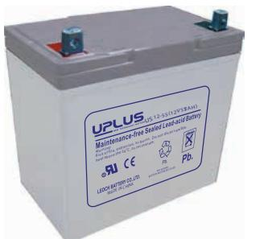
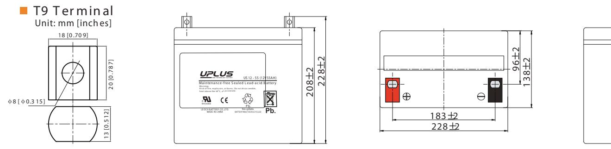
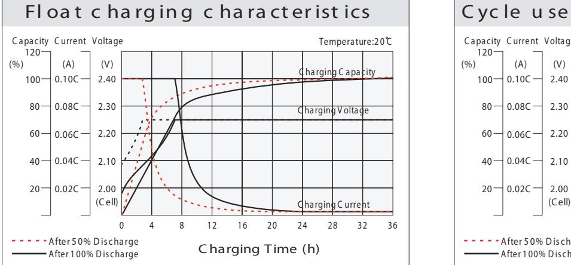
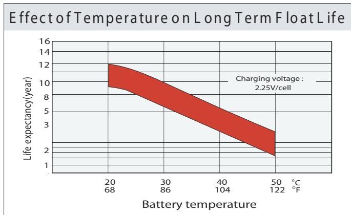
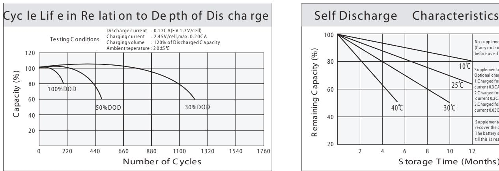
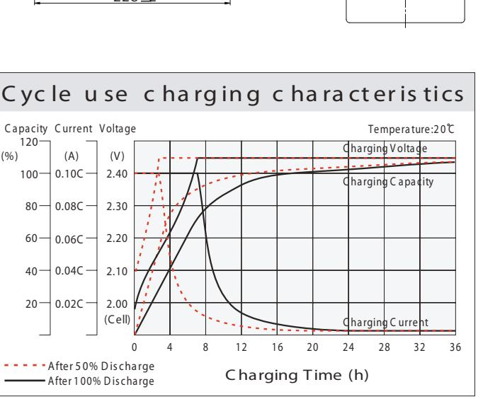
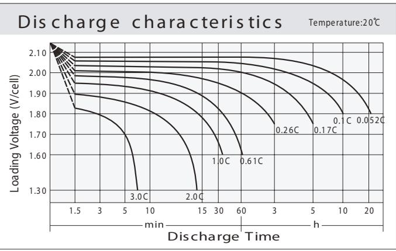
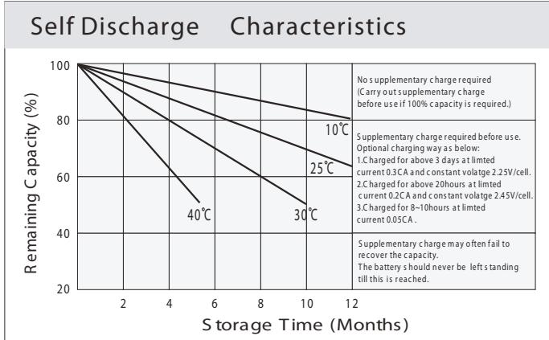

# IS 12- 5 (12V5

## General Features

- ♦ Sealed and maintenance free operation.
- ◆ Non-Spillable construction design.
- ◆ ABS containers and covers(UL94HB, UL94V-0) optional.
- ◆ Safety valve installation for explosion proof.
- ◆ High quality and high reliability.
- ◆ Exceptional deep discharge recovery performance.
- � Low self discharge characteristic.
- ♦ Flexibility design for multiple install positions.

|  | రించిన దివి | Intertek ETL SEMKO | ಿ ಮಾಡಿ MH26866 | (" ISO14001 | e og ISO9001 | C C TER EMC tested in the seat of the may |
|--|-------------|--------------------|-------------------|----------------|-----------------|-------------------------------------------------|
|--|-------------|--------------------|-------------------|----------------|-----------------|-------------------------------------------------|

| Battery Type          | Valve-Requlated,Absorbed Glass Mat(AGM) Technology |                   |        |                                                    |                       |                  |  |  |  |  |
|-----------------------|----------------------------------------------------------|-------------------|--------|----------------------------------------------------|-----------------------|------------------|--|--|--|--|
| Nomial Voltage        | 12V                                                      |                   |        |                                                    |                       |                  |  |  |  |  |
|                       | 20HR(2.77A,1.8V/cell)                                    | 10HR(5.34A,1.80V) |        | 5HR(9.08A,1.75V)                                   |                       | 1HR(31.9A,1.60V) |  |  |  |  |
| Capacity( 20°C)       | 55.4AH                                                   |                   | 53.4AH | 45.4AH                                             |                       | 31.9AH           |  |  |  |  |
|                       | Length                                                   |                   | Width  | Height                                             |                       | Total Height     |  |  |  |  |
| Dimensions            | 228mm(8.98inches)                                        | 138mm(5.43inches) |        | 208mm(8.19inches)                                  |                       | 228mm(8.98inch)  |  |  |  |  |
| Approx Weight         | Approx 17.0 kg (37.5lbs)                                 |                   |        |                                                    |                       |                  |  |  |  |  |
| Internal Resistance   | Full Charged at 20°C : Approx 7.5m U                     |                   |        |                                                    |                       |                  |  |  |  |  |
| Self Discharge        | 20 °C 3%  of capacity declined per month at           |                   |        |                                                    |                       |                  |  |  |  |  |
| Capacity affected by  | 40°C                                                     | 25°C              |        | 0°C                                                |                       | -15°C            |  |  |  |  |
| Temperature (10HR)    | 103%                                                     |                   | 100%   | 86%                                                |                       | 65%              |  |  |  |  |
|                       | Cycle use                                                |                   |        | Float use                                          |                       |                  |  |  |  |  |
| Charging Voltage (V)  | 14.25V~14.85V at 20 C. T emp. Coefficient -30mV/  °C     |                   |        | 13.4V~13.7V at 20 °C.Temp. Coefficient (-20mV/ °C) |                       |                  |  |  |  |  |
|                       | Max. Discharge Current                                   |                   |        | Initial Charging Current                           |                       |                  |  |  |  |  |
| Current               |                                                          | 660A(5s)          |        | Less than 16.5A                                    |                       |                  |  |  |  |  |
|                       | Discharge                                                |                   |        | Charging                                           | Storage               |                  |  |  |  |  |
| Operating T emp.Range | -15 ~~ 50°C (5 ~ 122°F)                                  |                   |        | 0~40°C (32 ~ 104°F)                                | -15 ~40°C (5 ~ 104°F) |                  |  |  |  |  |

# Co ns tant C urrent Dis charge (A mperes) at 20 °C (6 8°F )

| F.V/Tim e    | 5m in | 10 min | 15 min | 20 min | 30 min | 45 min | 1h   | 2h   | 3h   | 4h   | 5h   | 6h   | 8h   | 10 h | 20h  |
|--------------|-------|--------|--------|--------|--------|--------|------|------|------|------|------|------|------|------|------|
| 1.8 5V /cell | 89.4  | 70.3   | 59.8   | 50.0   | 39.7   | 30.1   | 24.6 | 15.9 | 12.5 | 10.2 | 8.25 | 7.26 | 5.90 | 5.04 | 2.75 |
| 1.8 0V /cell | 120.0 | 89.8   | 72.2   | 59.1   | 46.9   | 35.0   | 27.6 | 17.3 | 13.5 | 10.9 | 8.87 | 7.79 | 6.25 | 5.34 | 2.77 |
| 1.7 5V /cell | 135.3 | 98.7   | 78.9   | 63.6   | 48.7   | 36.3   | 28.9 | 17.9 | 13.7 | 11.2 | 9.08 | 8.00 | 6.36 | 5.39 | 2.80 |
| 1.7 0V /cell | 149.0 | 107.6  | 84.2   | 66.8   | 50.7   | 37.8   | 29.8 | 18.7 | 14.1 | 11.5 | 9.32 | 8.17 | 6.45 | 5.44 | 2.85 |
| 1.6 5V /ce   | 164.3 | 116.1  | 89.6   | 71.0   | 53.5 / | 38.7   | 30.8 | 19.2 | 14.7 | 11.9 | 9.58 | 8.35 | 6.55 | 5.55 | 2.89 |
| 1.6 0V /cell | 181.3 | 126.1  | 95.8   | 75.6   | 56.4   | 40.3   | 31.9 | 19.8 | 15.2 | 12.2 | 9.90 | 8.53 | 6.62 | 5.61 | 2.91 |

# Co ns tant P ower Dis ch ar ge (W atts ) a t 20 ℃ (6 8 ℉ )

| F.V/Tim e    | 5m in | 10min | 15 min | 20 min | 30 min | 45 min | 1h   | 2h   | 3h   | 4h   | 5h   | 6h   | 8h   | 10h  | 20h  |
|--------------|-------|-------|--------|--------|--------|--------|------|------|------|------|------|------|------|------|------|
| 1.8 5V /ce   | 163.5 | 129.9 | 111.6  | 94.3   | 75.8   | 57.8   | 47.5 | 30.8 | 24.4 | 20.0 | 16.2 | 14.3 | 11.6 | 9.97 | 5.44 |
| 1.8 0V /cell | 217.1 | 164.0 | 133.0  | 109.8  | 88.0   | 66.7   | 52.9 | 33.4 | 26.1 | 21.3 | 17.3 | 15.3 | 12.3 | 10.5 | 5.49 |
| 1.7 5V /cell | 239.6 | 177.3 | 143.5  | 117.0  | 90.6   | 68.6   | 55.1 | 34.5 | 26.5 | 21.7 | 17.7 | 15.6 | 12.5 | 10.6 | 5.53 |
| 1.7 0V /cell | 256.5 | 188.9 | 151.0  | 122.0  | 93.8   | 71.1   | 56.7 | 35.8 | 27.2 | 22.2 | 18.1 | 15.9 | 12.7 | 10.7 | 5.64 |
| 1.6 5V /cell | 278.9 | 202.0 | 159.4  | 128.7  | 98.1   | 72.2   | 58.2 | 36.6 | 28.2 | 22.9 | 18.5 | 16.2 | 12.8 | 10.9 | 5.70 |
| 1.6 0V /cell | 300.5 | 214.3 | 167.6  | 135.6  | 102.9  | 74.8   | 59.9 | 37.6 | 29.0 | 23.5 | 19.1 | 16.5 | 12.9 | 11.0 | 5.73 |

### **D im en si o n s**

*2*

