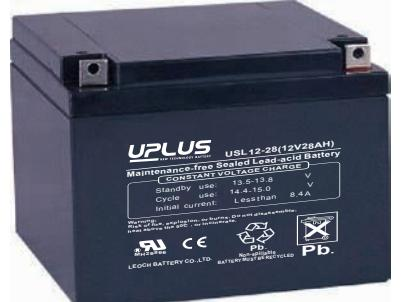
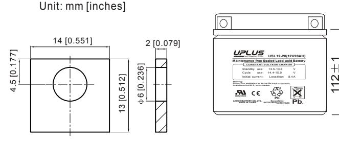
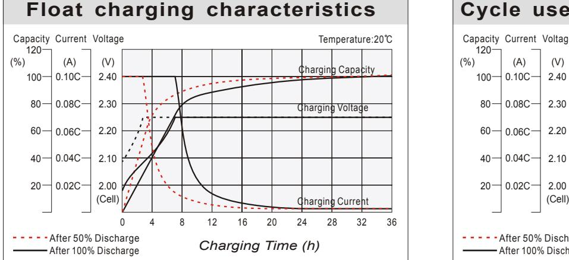
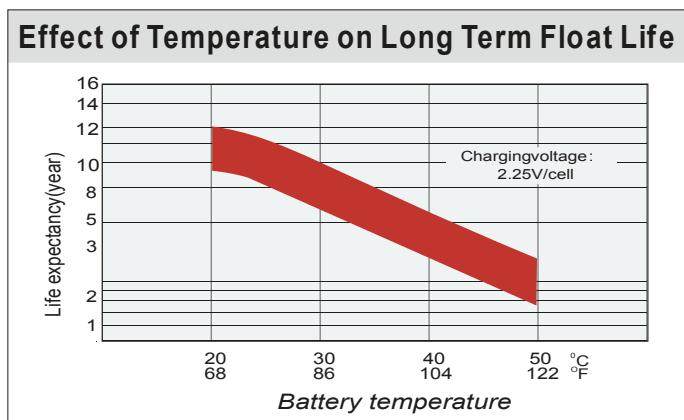
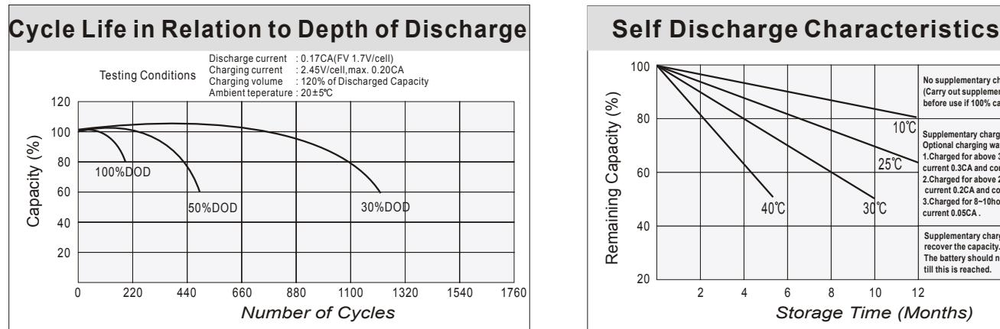
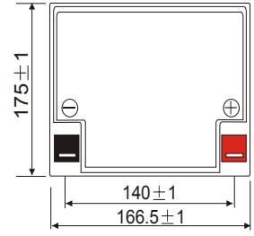
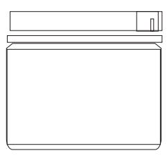
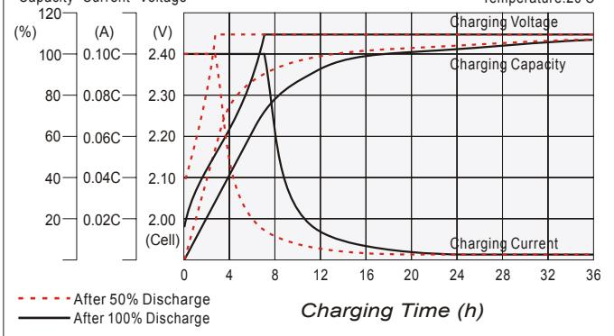
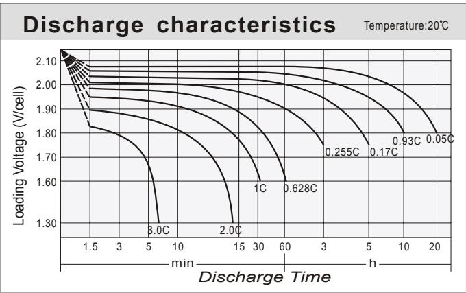
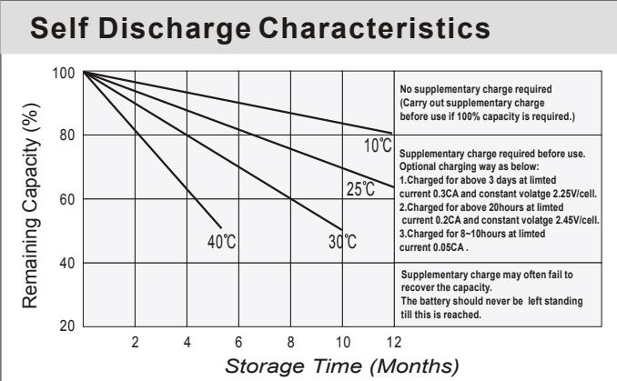

# 12-28 (12V28AH) USL **USL SERIES**

## **General Features**

- Sealed and maintenance free operation.
- Non-Spillable construction design.
- ABS containers and covers(UL94HB, UL94V-0) optional.
- Safety valve installation for explosion proof.
- High quality and high reliability.
- Exceptional deep discharge recovery performance.
- Low self discharge characteristic.
- Flexibility design for multiple install positions.

| Battery Type         | Valve-Regulated,Absorbed Glass Mat(AGM) Technology   |                                        |                    |                                                            |                                    |                   |  |  |  |  |  |
|----------------------|------------------------------------------------------|----------------------------------------|--------------------|------------------------------------------------------------|------------------------------------|-------------------|--|--|--|--|--|
| Nomia l Voltage      | 12V                                                  |                                        |                    |                                                            |                                    |                   |  |  |  |  |  |
| 0 20 C) Capacity( | 20HR(1.36A,1.8V/cell)                                |                                        | 10HR(2.53A,1.80V)  | 5HR(4.57A,1.75V)                                           |                                    | 1HR(16.7A,1.60V)  |  |  |  |  |  |
|                      | 27.2AH                                               |                                        | 25.3AH             | 22.8AH                                                     |                                    | 16.7AH            |  |  |  |  |  |
|                      | Length                                               |                                        | Width              | Height                                                     |                                    | Total Height      |  |  |  |  |  |
| Dimensions           | 166.5mm(6.56inches)                                  | 175mm(6.89inches) 125mm(4.92inches) |                    |                                                            |                                    | 125mm(4.92inches) |  |  |  |  |  |
| Approx Weight        | Approx 8.4 kg (18.5lbs)                              |                                        |                    |                                                            |                                    |                   |  |  |  |  |  |
| Internal Resistance  | 0 Full Charged at 20 C : Approx 14mΩ           |                                        |                    |                                                            |                                    |                   |  |  |  |  |  |
| Self Discharge       | 0 3% of capacity declined per month at 20 C    |                                        |                    |                                                            |                                    |                   |  |  |  |  |  |
| Capacity affected by | o 40 C                                            |                                        | 0 25 C          | 0 0 C                                                   |                                    | 0 -15 C        |  |  |  |  |  |
| Temperature(10HR)    | 103%                                                 |                                        | 100%               | 86%                                                        |                                    | 65%               |  |  |  |  |  |
| Charging Voltage (V) | Cycle use                                            |                                        |                    | Float use                                                  |                                    |                   |  |  |  |  |  |
|                      | 0 14.4V~15.0V at 20 C. Temp. Coefficient -30mV/ C |                                        | 0                  | 0 0 13.5V~13.8V at 20 C.Temp. Coefficient (-20mV/ C) |                                    |                   |  |  |  |  |  |
| Current              | Max. Discharge Current                               |                                        |                    | Initial Charging Current                                   |                                    |                   |  |  |  |  |  |
|                      | 420A                                                 |                                        |                    | Less than 8.4A                                             |                                    |                   |  |  |  |  |  |
|                      | Discharge                                            |                                        |                    | Charging                                                   | Storage                            |                   |  |  |  |  |  |
| Operating Temp.Range | 0 0 -15 50 C (5 122 F)                   |                                        | 0 0 40 C (32 | 0 104 F)                                                | 0 0 -15 40 C (5 104 F) |                   |  |  |  |  |  |

| 0 0 0 (68 Constant Current Discharge (Amperes) at 2 Constant Current Discharge (Amperes) at 2 C C F ) F ) |       |       |       |       |       |       |      |      |      |      |      |      |      |      |      |
|--------------------------------------------------------------------------------------------------------------------------------------|-------|-------|-------|-------|-------|-------|------|------|------|------|------|------|------|------|------|
| F.V/Time                                                                                                                             | 5min  | 10min | 15min | 20min | 30min | 45min | 1h   | 2h   | 3h   | 4h   | 5h   | 6h   | 8h   | 10h  | 20h  |
| 1.85V/cell                                                                                                                           | 50.7  | 38.9  | 32.2  | 27.9  | 21.5  | 15.9  | 13.4 | 7.99 | 6.25 | 5.09 | 4.15 | 3.64 | 2.93 | 2.45 | 1.34 |
| 1.80V/cell                                                                                                                           | 68.0  | 49.7  | 38.9  | 32.9  | 25.4  | 18.5  | 15.0 | 8.73 | 6.73 | 5.43 | 4.45 | 3.90 | 3.11 | 2.53 | 1.36 |
| 1.75V/cell                                                                                                                           | 76.7  | 54.6  | 42.5  | 35.4  | 26.4  | 19.2  | 15.7 | 9.05 | 6.85 | 5.55 | 4.57 | 4.01 | 3.16 | 2.59 | 1.37 |
| 1.70V/cell                                                                                                                           | 84.4  | 59.5  | 45.4  | 37.2  | 27.5  | 19.9  | 16.2 | 9.27 | 7.05 | 5.70 | 4.69 | 4.09 | 3.21 | 2.65 | 1.40 |
| 1.65V/cell                                                                                                                           | 93.1  | 64.2  | 48.3  | 39.6  | 29.0  | 20.4  | 16.5 | 9.41 | 7.35 | 5.89 | 4.81 | 4.18 | 3.26 | 2.70 | 1.42 |
| 1.60V/cell                                                                                                                           | 102.7 | 69.7  | 51.6  | 42.1  | 30.6  | 21.3  | 16.7 | 9.81 | 7.57 | 6.08 | 4.97 | 4.27 | 3.29 | 2.73 | 1.42 |

| 0 0 Constant Power Discharge (Watts) at 20 C (68 F ) |       |       |       |       |       |       |      |      |      |      |      |      |      |      |      |
|---------------------------------------------------------------|-------|-------|-------|-------|-------|-------|------|------|------|------|------|------|------|------|------|
| F.V/Time                                                      | 5min  | 10min | 15min | 20min | 30min | 45min | 1h   | 2h   | 3h   | 4h   | 5h   | 6h   | 8h   | 10h  | 20h  |
| 1.85V/cell                                                    | 92.6  | 71.9  | 60.1  | 52.5  | 41.1  | 30.5  | 25.8 | 15.5 | 12.2 | 9.94 | 8.13 | 7.15 | 5.79 | 4.85 | 2.66 |
| 1.80V/cell                                                    | 123.0 | 90.7  | 71.7  | 61.2  | 47.7  | 35.2  | 28.7 | 16.8 | 13.0 | 10.6 | 8.69 | 7.64 | 6.12 | 4.99 | 2.69 |
| 1.75V/cell                                                    | 135.7 | 98.1  | 77.3  | 65.2  | 49.1  | 36.2  | 29.9 | 17.4 | 13.2 | 10.8 | 8.89 | 7.82 | 6.21 | 5.12 | 2.71 |
| 1.70V/cell                                                    | 145.3 | 104.5 | 81.4  | 68.0  | 50.8  | 37.5  | 30.8 | 17.8 | 13.6 | 11.0 | 9.10 | 7.97 | 6.29 | 5.22 | 2.76 |
| 1.65V/cell                                                    | 158.0 | 111.7 | 85.9  | 71.7  | 53.2  | 38.1  | 31.3 | 17.9 | 14.1 | 11.4 | 9.31 | 8.12 | 6.38 | 5.32 | 2.79 |
| 1.60V/cell                                                    | 170.2 | 118.6 | 90.3  | 75.5  | 55.8  | 39.5  | 31.4 | 18.6 | 14.5 | 11.7 | 9.59 | 8.27 | 6.43 | 5.37 | 2.80 |

#### **Dimensions**

### **T3 Terminal**

125 1

#### **Cycle use charging characteristics**  Capacity Current Voltage Temperature:20 C

