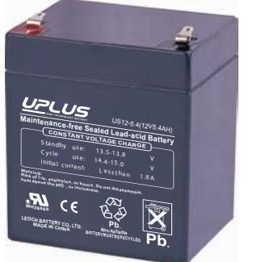
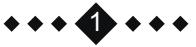
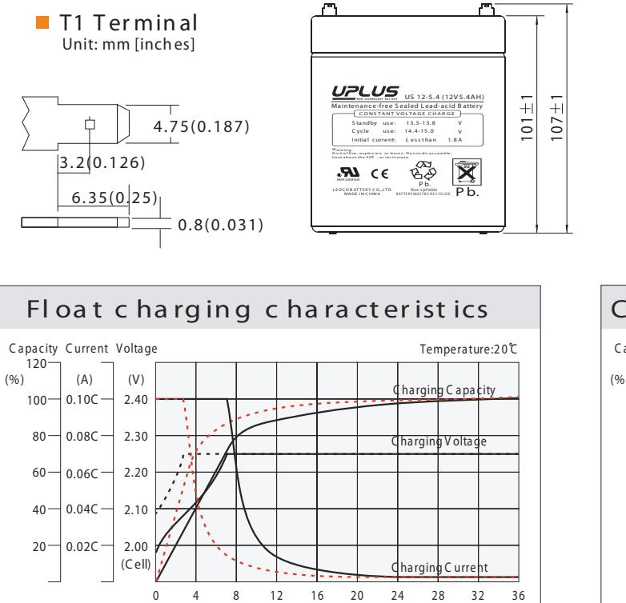
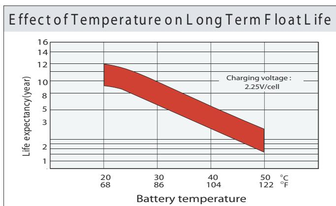
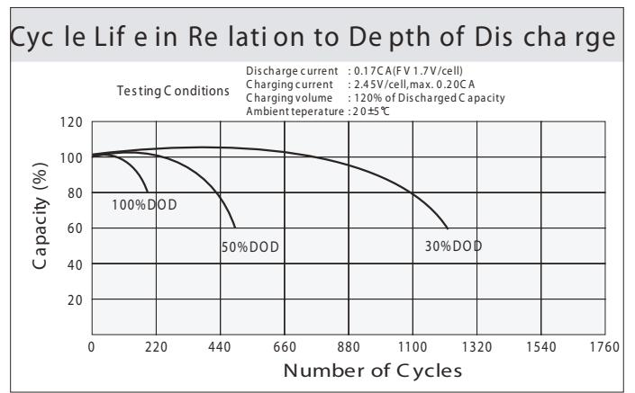
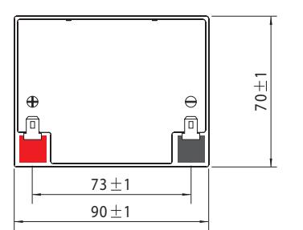
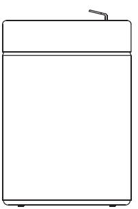
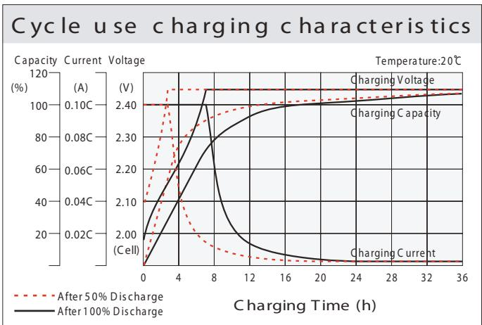
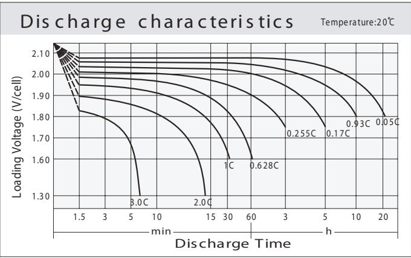
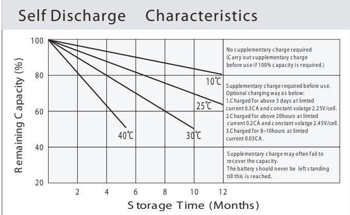

# (12V AH) 12-5.4 5.4 US **US SERIES**

## **General Features**

- Sealed and maintenance free operation.
- Non-Spillable construction design.
- ABS containers and covers(UL94HB, UL94V-0) optional.
- Safety valve installation for explosion proof.
- High quality and high reliability.
	- Exceptional deep discharge recovery performance.
- Low self discharge characteristic.
- Flexibility design for multiple install positions.

|--|

| Battery Type          | Valve-Regulated,Absorbed Glass Mat(AGM) Technology |                   |                    |                                                         |                                    |                   |  |  |  |  |  |
|-----------------------|----------------------------------------------------------|-------------------|--------------------|---------------------------------------------------------|------------------------------------|-------------------|--|--|--|--|--|
| Nomial Voltage        | 12V                                                      |                   |                    |                                                         |                                    |                   |  |  |  |  |  |
| 0 20 C) Capacity(  | 20HR(11.3A,1.8V/cell)                                    | 10HR(21.4A,1.80V) |                    | 5HR(36.0A,1.75V)                                        |                                    | 1HR(127.7A,1.60V) |  |  |  |  |  |
|                       | 226.0AH                                                  |                   | 214.0AH            | 180.0AH                                                 |                                    | 127.7AH           |  |  |  |  |  |
|                       | Length                                                   | Width             |                    | Height                                                  |                                    | Total Height      |  |  |  |  |  |
| Dimensions            | 90mm(3.54inches )                                     | 70mm(2.76inches ) |                    | 101mm(3.98inches)                                       |                                    | 107mm(4.21inch)   |  |  |  |  |  |
| Approx Weight         | Approx 1,82kg (4,0lbs)                                   |                   |                    |                                                         |                                    |                   |  |  |  |  |  |
| Internal Resistance   | 0 Full Charged at 20 C : Approx 1.4m Ω             |                   |                    |                                                         |                                    |                   |  |  |  |  |  |
| Self Discharge        | 0 3% of capacity declined per month at 20 C        |                   |                    |                                                         |                                    |                   |  |  |  |  |  |
| Capacity by        | o 40 C                                                |                   | 0 25 C          | 0 0 C                                                |                                    | 0 -15 C        |  |  |  |  |  |
| Temperature (10HR)    | 103%                                                     |                   | 100%               | 86%                                                     |                                    | 65%               |  |  |  |  |  |
|                       | Cycle use                                                |                   |                    | Float use                                               |                                    |                   |  |  |  |  |  |
| Charging Voltage (V)  | 0 14.4V~15.0V at 20                                   | C. T emp.         | 0 -30mV/ C   | 0 0 13.5V~13.8V at 20 C.Temp. (-20mV/ C) |                                    |                   |  |  |  |  |  |
|                       | Max. Discharge Current                                   |                   |                    | Initial Charging Current                                |                                    |                   |  |  |  |  |  |
| Current               | 2000A                                                    |                   |                    | Less than 60.0A                                         |                                    |                   |  |  |  |  |  |
| Operating T emp.Range | Discharge                                                |                   |                    | Charging                                                | Storage                            |                   |  |  |  |  |  |
|                       | 0 0 -15 50 C (5 122 F)                       |                   | 0 0 40 C (32 | 0 104 F)                                             | 0 0 -15 40 C (5 104 F) |                   |  |  |  |  |  |

### **0 0 Co nstant Current Disch arge (A mperes) at 25 C (7 7 F ) 0 0 Constant Current Discharge (A mperes) at 2 C F ) C nstant isch r e (A mpere ) at 2 C F ) 0 (6 8**

| F.V/ Tim e  | 5min | 10min | 15min | 20min | 30min | 45min | 1h   | 2h   | 3h   | 4h   | 5h   | 6h    | 8h    | 10h   | 20h   |
|-------------|------|-------|-------|-------|-------|-------|------|------|------|------|------|-------|-------|-------|-------|
| 1.8 5V/cell | 10.9 | 8.34  | 6.90  | 5.97  | 4.62  | 3.40  | 2.87 | 1.71 | 1.34 | 1.09 | 0.89 | 0.779 | 0.628 | 0.525 | 0.288 |
| 1.8 0V/cell | 14.6 | 10.7  | 8.34  | 7.06  | 5.45  | 3.96  | 3.21 | 1.87 | 1.44 | 1.16 | 0.95 | 0.836 | 0.667 | 0.541 | 0.291 |
| 1.7 5V/cell | 16.4 | 11.7  | 9.11  | 7.59  | 5.65  | 4.10  | 3.36 | 1.94 | 1.47 | 1.19 | 0.98 | 0.858 | 0.678 | 0.556 | 0.294 |
| 1.7 0V/cell | 18.1 | 12.8  | 9.73  | 7.98  | 5.89  | 4.27  | 3.47 | 1.99 | 1.51 | 1.22 | 1.00 | 0.876 | 0.688 | 0.567 | 0.299 |
| 1.6 5V/cell | 19.9 | 13.8  | 10.3  | 8.48  | 6.21  | 4.38  | 3.55 | 2.02 | 1.57 | 1.26 | 1.03 | 0.896 | 0.698 | 0.579 | 0.303 |
| 1.6 0V/cell | 22.0 | 14.9  | 11.1  | 9.03  | 6.56  | 4.56  | 3.58 | 2.10 | 1.62 | 1.30 | 1.07 | 0.915 | 0.705 | 0.585 | 0.305 |

## **Co nstant Power Disch arge (Watts) at 0 0 20 C (6 8 F )**

| F.V/ Tim e  | 5min | 10min | 15min | 20min | 30min | 45min | 1h   | 2h   | 3h   | 4h   | 5h   | 6h   | 8h   | 10h  | 20h   |
|-------------|------|-------|-------|-------|-------|-------|------|------|------|------|------|------|------|------|-------|
| 1.8 5V/cell | 19.8 | 15.4  | 12.9  | 11.3  | 8.80  | 6.54  | 5.53 | 3.33 | 2.61 | 2.13 | 1.74 | 1.53 | 1.24 | 1.04 | 0.571 |
| 1.8 0V/cell | 26.4 | 19.4  | 15.4  | 13.1  | 10.2  | 7.54  | 6.16 | 3.61 | 2.80 | 2.26 | 1.86 | 1.64 | 1.31 | 1.07 | 0.576 |
| 1.7 5V/cell | 29.1 | 21.0  | 16.6  | 14.0  | 10.5  | 7.75  | 6.42 | 3.73 | 2.84 | 2.31 | 1.90 | 1.68 | 1.33 | 1.10 | 0.581 |
| 1.7 0V/cell | 31.1 | 22.4  | 17.4  | 14.6  | 10.9  | 8.03  | 6.60 | 3.81 | 2.91 | 2.36 | 1.95 | 1.71 | 1.35 | 1.12 | 0.591 |
| 1.6 5V/cell | 33.9 | 23.9  | 18.4  | 15.4  | 11.4  | 8.16  | 6.70 | 3.84 | 3.02 | 2.43 | 2.00 | 1.74 | 1.37 | 1.14 | 0.598 |
| 1.6 0V/cell | 36.5 | 25.4  | 19.4  | 16.2  | 11.9  | 8.46  | 6.73 | 3.99 | 3.10 | 2.50 | 2.05 | 1.77 | 1.38 | 1.15 | 0.600 |

### Dimensi ons

After 50% Discharge

After 100% Discharge

Charging Time (h)

