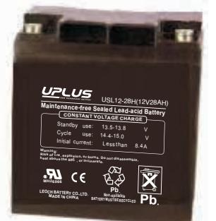
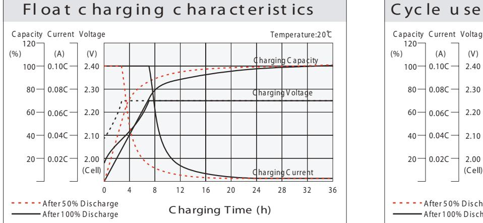
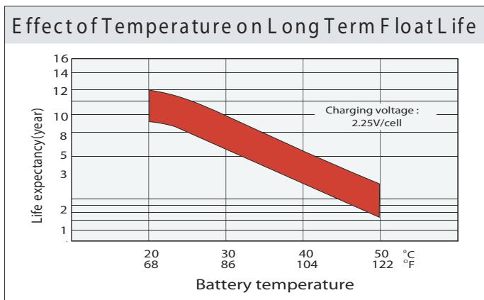
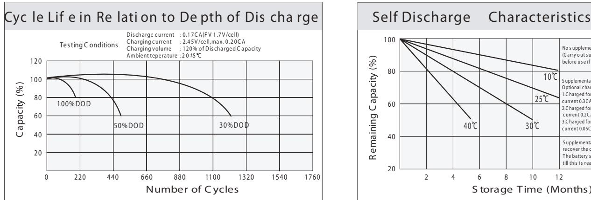
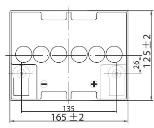
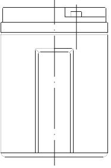
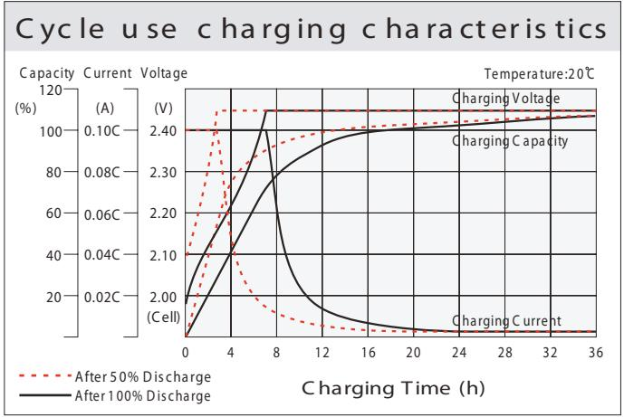
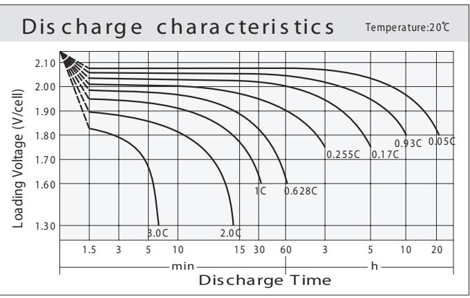
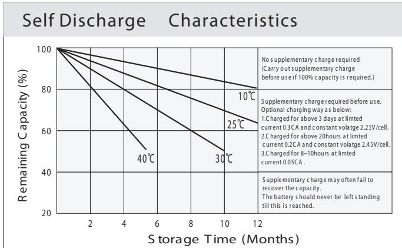

# 12-28H (12V28AH) USL **US SERIES**

## **General Features**

- Sealed and maintenance free operation.
- Non-Spillable construction design.
- ABS containers and covers(UL94HB, UL94V-0) optional.
- Safety valve installation for explosion proof.
- High quality and high reliability.
	- Exceptional deep discharge recovery performance.
- Low self discharge characteristic.
- Flexibility design for multipl e install positions.

| VdS |  | 9 | tested Germ any |
|-----|--|---|--------------------|
|     |  |   |                    |

| Battery Type         | Valve-Regulated,Absorbed GlassMat(AGM) Technology |                   |                                        |                                                     |         |                                    |  |  |  |  |
|----------------------|---------------------------------------------------|-------------------|----------------------------------------|-----------------------------------------------------|---------|------------------------------------|--|--|--|--|
| Nomial Voltage       | 12V                                               |                   |                                        |                                                     |         |                                    |  |  |  |  |
| 0 20 C)              | 20HR(1.44A,1.8V/cell)                             | 10HR(2.72A,1.80V) |                                        | 5HR(4.66A,1.75)V                                    |         | 1HR(16.4A,1.60)V                   |  |  |  |  |
| Capacity(            | 28.8AH                                            |                   | 2.72AH                                 | 23.3AH                                              |         | 16.4AH                             |  |  |  |  |
|                      | Length                                            |                   | Width                                  | Height                                              |         | Total Height                       |  |  |  |  |
| Dimensions           | 165mm(6.50inches)                                 |                   | 125mm(4.92inches) 175mm(6.89inches) |                                                     |         | 175mm(6.89inches)                  |  |  |  |  |
| Approx Weight        | Approx 9.5 kg (20.9lbs)                           |                   |                                        |                                                     |         |                                    |  |  |  |  |
| Internal Resistance  | 0 Full Charged at 20 C : Approx 12 mΩ       |                   |                                        |                                                     |         |                                    |  |  |  |  |
| Self Discharge       |                                                   |                   |                                        |                                                     |         |                                    |  |  |  |  |
| Capacity by       | o 40 C                                         | 0 25 C         |                                        | 0 0 C                                            |         | 0 -15 C                         |  |  |  |  |
| Temperature(10HR)    | 103%                                              |                   | 100%                                   | 86%                                                 |         | 65%                                |  |  |  |  |
|                      | Cycle use                                         |                   |                                        | Float use                                           |         |                                    |  |  |  |  |
| ChargingVoltage (V)  | 0 14.4V~15.0V at 20                            | C. Temp.          | 0 -30mV/ C                       | 0 0 13.5V~13.8V at20 C.Temp. (-20mV/ C) |         |                                    |  |  |  |  |
|                      | Max. Discharge Current                            |                   |                                        | Initial Charging Current                            |         |                                    |  |  |  |  |
| Current              | 420A                                              |                   |                                        | Less than 8.4A                                      |         |                                    |  |  |  |  |
|                      | Discharge                                         |                   |                                        | Charging                                            | Storage |                                    |  |  |  |  |
| Operating Temp.Range | 0 0 -15 50 C (5 122 F)                |                   | 0 0 40 C (32                     | 0 104 F)                                         |         | 0 0 -15 40 C (5 104 F) |  |  |  |  |

#### **0 0 Co nstant Current Disch arge (A mperes) at 20 C 8 F ) (6**

| F.V/ Time   | 10min | 15min | 20min | 30min | 45min | 1h   | 2h   | 3h   | 4h   | 5h   | 6h   | 8h   | 10h  | 20h  |
|-------------|-------|-------|-------|-------|-------|------|------|------|------|------|------|------|------|------|
| 1.8 5V/cell | 34.3  | 28.6  | 24.4  | 19.9  | 15.1  | 12.6 | 8.15 | 6.46 | 5.23 | 4.23 | 3.75 | 3.00 | 2.56 | 1.43 |
| 1.8 0V/cell | 43.8  | 34.6  | 28.8  | 23.5  | 17.5  | 14.2 | 8.90 | 6.95 | 5.59 | 4.54 | 4.03 | 3.19 | 2.72 | 1.44 |
| 1.7 5V/cell | 48.2  | 37.8  | 31.0  | 24.4  | 18.2  | 14.8 | 9.23 | 7.08 | 5.73 | 4.66 | 4.13 | 3.24 | 2.74 | 1.45 |
| 1.7 0V/cell | 52.5  | 40.3  | 32.6  | 25.4  | 18.9  | 15.3 | 9.59 | 7.28 | 5.87 | 4.78 | 4.22 | 3.29 | 2.77 | 1.48 |
| 1.6 5V/cell | 56.7  | 42.9  | 34.6  | 26.8  | 19.4  | 15.8 | 9.86 | 7.59 | 6.07 | 4.91 | 4.31 | 3.34 | 2.83 | 1.50 |
| 1.6 0V/cell | 61.5  | 45.9  | 36.9  | 28.3  | 20.2  | 16.4 | 10.2 | 7.82 | 6.26 | 5.08 | 4.41 | 3.37 | 2.86 | 1.51 |

## **0 0 Co nstant Power Disch arge (Watts) at 20 C (6 8 F )**

| F.V/ Tim e  | 10min | 15min | 20min | 30min | 45min | 1h   | 2h   | 3h   | 4h   | 5h   | 6h   | 8h   | 10h  | 20h  |
|-------------|-------|-------|-------|-------|-------|------|------|------|------|------|------|------|------|------|
| 1.8 5V/cell | 64.6  | 54.4  | 46.9  | 38.7  | 29.5  | 24.8 | 16.1 | 12.8 | 10.4 | 8.44 | 7.51 | 6.03 | 5.16 | 2.87 |
| 1.8 0V/cell | 81.6  | 64.9  | 54.6  | 45.0  | 34.1  | 27.7 | 17.5 | 13.7 | 11.1 | 9.02 | 8.02 | 6.38 | 5.46 | 2.90 |
| 1.7 5V/cell | 88.2  | 70.0  | 58.2  | 46.3  | 35.0  | 28.8 | 18.1 | 13.9 | 11.3 | 9.23 | 8.21 | 6.48 | 5.51 | 2.92 |
| 1.7 0V/cell | 94.0  | 73.7  | 60.7  | 47.9  | 36.3  | 29.6 | 18.7 | 14.3 | 11.6 | 9.45 | 8.37 | 6.56 | 5.56 | 2.97 |
| 1.6 5V/cell | 100.5 | 77.8  | 64.0  | 50.2  | 36.9  | 30.4 | 19.1 | 14.8 | 11.9 | 9.68 | 8.53 | 6.65 | 5.67 | 3.01 |
| 1.6 0V/cell | 106.7 | 81.9  | 67.4  | 52.6  | 38.2  | 31.3 | 19.7 | 15.2 | 12.2 | 9.97 | 8.69 | 6.70 | 5.72 | 3.02 |

#### **D im en si o n s**

#### **T1 2 T er m in al** Unit: mm [inch es] **Main tenanc e-free S eale d L ead-ac id B attery US 12-28H ( 12V 28A H) C O N S TA N T V O L TA G E C H A R G E** S tandby us e : 13.5 -13.8 V C ycle us e : 1 4.4 -15.0 V Initia l c urre nt: L e s s t ha n 8.4 A **P b N on-s pil la ble B AT T E R Y M U S T B E R E C Y C L E D P b**. **MA DE I N C HIN A L E O C H B AT T E R Y C O ., LT D. MH 26866 W ar ni ng : R is k of re , e xp lo si on , o r bu rn s. D o n ot d is as se m bl e, O he at a bo ve th e 50 C , o r in ci ne ra te .** 12 [0.47 2] M5 [0.19 7] 6 [0. 236] Torque: 2.0~3.0N*M

 175 2

 170 2

