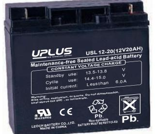
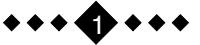
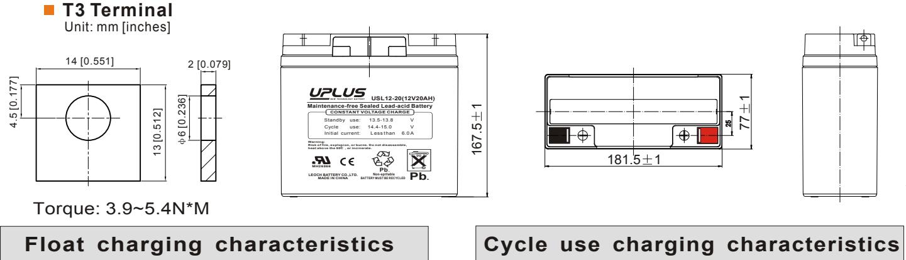
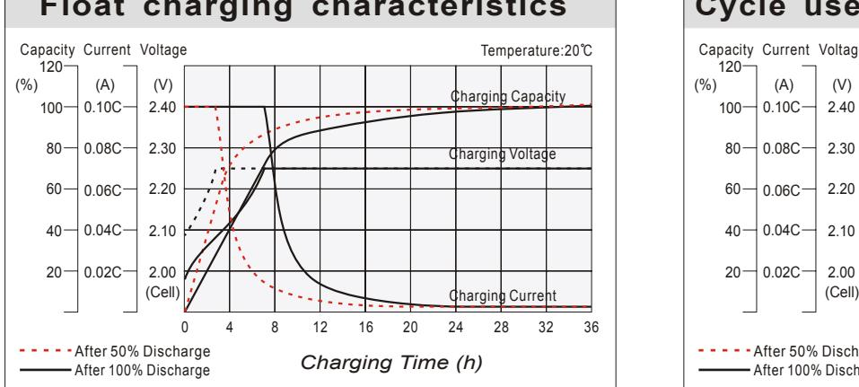
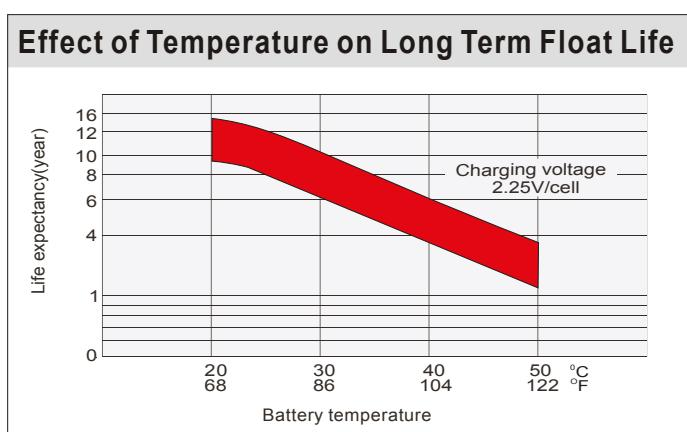
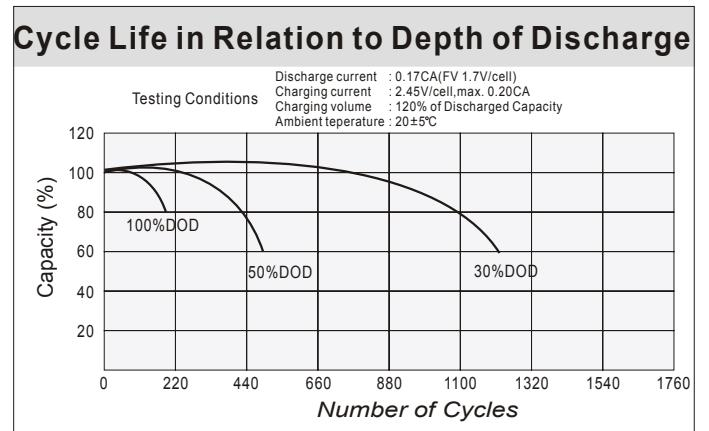
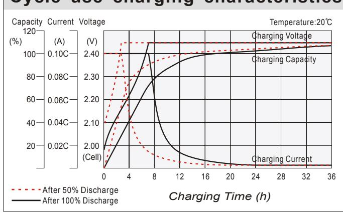
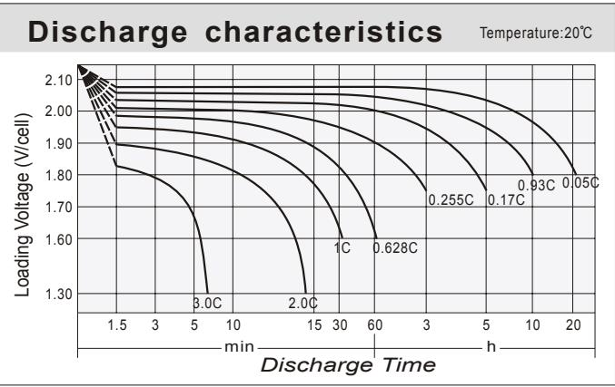
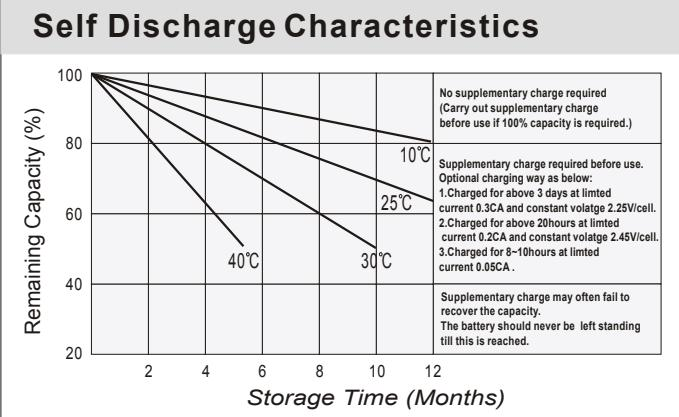

## 12-20 (12V20AH) USL **USL SERIES**

## **General Features**

- Sealed and maintenance free operation.
- Non-Spillable construction design.
- ABS containers and covers(UL94HB, UL94V-0) optional.
- Safety valve installation for explosion proof.
- High quality and high reliability.
- Exceptional deep discharge recovery performance.
- Low self discharge characteristic.
- Flexibility design for multiple install positions.

| Battery Type         | Valve-Regulated,Absorbed Glass Mat(AGM) Technology   |  |                    |                                                            |                                    |                     |  |  |  |  |
|----------------------|------------------------------------------------------|--|--------------------|------------------------------------------------------------|------------------------------------|---------------------|--|--|--|--|
| Nomia l Voltage      | 12V                                                  |  |                    |                                                            |                                    |                     |  |  |  |  |
| 0 20 C)              | 20HR(1.03A,1.8V/cell)                                |  | 10HR(1.94A,1.80V)  | 5HR(3.33A,1.75V)                                           |                                    | 1HR(11.7A,1.60V)    |  |  |  |  |
| Capacity(            | 20.6AH                                               |  | 19.4AH             | 16.6AH                                                     |                                    | 11.7AH              |  |  |  |  |
|                      | Length                                               |  | Width              | Height                                                     |                                    | Total Height        |  |  |  |  |
| Dimensions           | 181.5mm(7.14inches)                                  |  | 77mm(3.03inches)   | 167.5mm(6.59inches)                                        |                                    | 167.5mm(6.59inches) |  |  |  |  |
| Approx Weight        | Approx 6.0 kg (13.2lbs)                              |  |                    |                                                            |                                    |                     |  |  |  |  |
| Internal Resistance  | 0 Full Charged at 20 C : Approx 15m Ù          |  |                    |                                                            |                                    |                     |  |  |  |  |
| Self Discharge       | 0 3% of capacity declined per month at 20 C    |  |                    |                                                            |                                    |                     |  |  |  |  |
| Capacity affected by | o 40 C                                            |  | 0 25 C          | 0 0 C                                                   |                                    | 0 -15 C          |  |  |  |  |
| Temperature(10HR)    | 103%                                                 |  | 100%               | 86%                                                        |                                    | 65%                 |  |  |  |  |
|                      | Cycle use                                            |  |                    | Float use                                                  |                                    |                     |  |  |  |  |
| Charging Voltage (V) | 0 14.4V~15.0V at 20 C. Temp. Coefficient -30mV/ C |  | 0                  | 0 0 13.5V~13.8V at 20 C.Temp. Coefficient (-20mV/ C) |                                    |                     |  |  |  |  |
| Current              | Max. Discharge Current                               |  |                    | Initial Charging Current                                   |                                    |                     |  |  |  |  |
|                      | 300A                                                 |  |                    | Less than 6.0A                                             |                                    |                     |  |  |  |  |
|                      | Discharge                                            |  |                    | Charging                                                   | Storage                            |                     |  |  |  |  |
| Operating Temp.Range | 0 0 -15 50 C (5 122 F)                   |  | 0 0 40 C (32 | 0 104 F)                                                | 0 0 -15 40 C (5 104 F) |                     |  |  |  |  |

## **0 0 Constant Current Discharge (Amperes) at 20 C 8 F ) (6**

| F.V/Time   | 10min | 15min | 20min | 30min | 45min | 1h   | 2h   | 3h   | 4h   | 5h   | 6h   | 8h   | 10h  | 20h  |
|------------|-------|-------|-------|-------|-------|------|------|------|------|------|------|------|------|------|
| 1.85V/cell | 24.5  | 20.4  | 17.4  | 14.2  | 10.8  | 9.03 | 5.82 | 4.61 | 3.74 | 3.02 | 2.68 | 2.14 | 1.83 | 1.02 |
| 1.80V/cell | 31.3  | 24.7  | 20.6  | 16.8  | 12.5  | 10.1 | 6.36 | 4.97 | 3.99 | 3.24 | 2.88 | 2.28 | 1.94 | 1.03 |
| 1.75V/cell | 34.4  | 27.0  | 22.2  | 17.4  | 13.0  | 10.6 | 6.59 | 5.06 | 4.09 | 3.33 | 2.95 | 2.31 | 1.96 | 1.04 |
| 1.70V/cell | 37.5  | 28.8  | 23.3  | 18.2  | 13.5  | 10.9 | 6.85 | 5.20 | 4.19 | 3.41 | 3.01 | 2.35 | 1.98 | 1.06 |
| 1.65V/cell | 40.5  | 30.6  | 24.7  | 19.2  | 13.9  | 11.3 | 7.04 | 5.42 | 4.33 | 3.51 | 3.08 | 2.38 | 2.02 | 1.07 |
| 1.60V/cell | 43.9  | 32.8  | 26.4  | 20.2  | 14.4  | 11.7 | 7.28 | 5.58 | 4.47 | 3.63 | 3.15 | 2.41 | 2.04 | 1.08 |

| 0 0 Constant Power Discharge (Watts) at 20 C (68 F ) |       |       |       |       |       |      |      |      |      |      |      |      |      |      |
|------------------------------------------------------------|-------|-------|-------|-------|-------|------|------|------|------|------|------|------|------|------|
| F.V/Time                                                   | 10min | 15min | 20min | 30min | 45min | 1h   | 2h   | 3h   | 4h   | 5h   | 6h   | 8h   | 10h  | 20h  |
| 1.85V/cell                                                 | 46.1  | 38.9  | 33.5  | 27.6  | 21.1  | 17.7 | 11.5 | 9.16 | 7.44 | 6.03 | 5.36 | 4.31 | 3.69 | 2.05 |
| 1.80V/cell                                                 | 58.3  | 46.3  | 39.0  | 32.1  | 24.3  | 19.8 | 12.5 | 9.80 | 7.90 | 6.45 | 5.73 | 4.56 | 3.90 | 2.07 |
| 1.75V/cell                                                 | 63.0  | 50.0  | 41.5  | 33.1  | 25.0  | 20.6 | 12.9 | 9.94 | 8.07 | 6.59 | 5.87 | 4.63 | 3.94 | 2.09 |
| 1.70V/cell                                                 | 67.1  | 52.7  | 43.3  | 34.2  | 25.9  | 21.2 | 13.4 | 10.2 | 8.25 | 6.75 | 5.98 | 4.69 | 3.97 | 2.12 |
| 1.65V/cell                                                 | 71.8  | 55.6  | 45.7  | 35.8  | 26.3  | 21.7 | 13.7 | 10.6 | 8.50 | 6.91 | 6.09 | 4.75 | 4.05 | 2.15 |
| 1.60V/cell                                                 | 76.2  | 58.5  | 48.2  | 37.6  | 27.3  | 22.4 | 14.1 | 10.9 | 8.74 | 7.12 | 6.21 | 4.79 | 4.08 | 2.16 |

## **Dimensions**

2