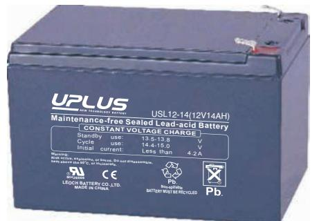
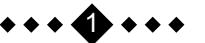
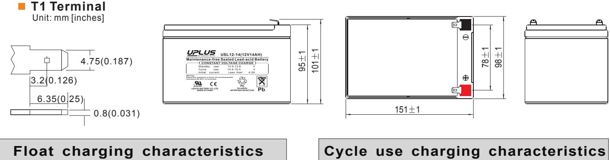
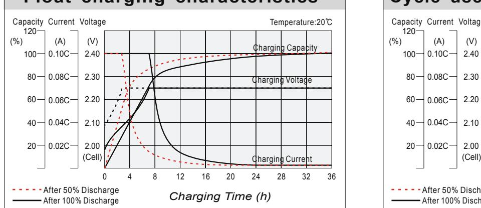
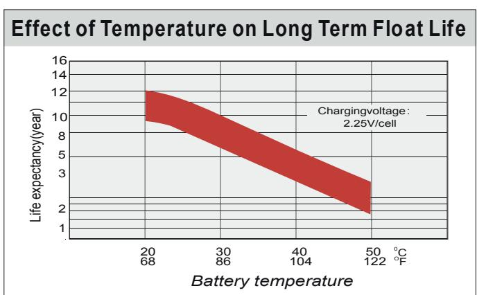
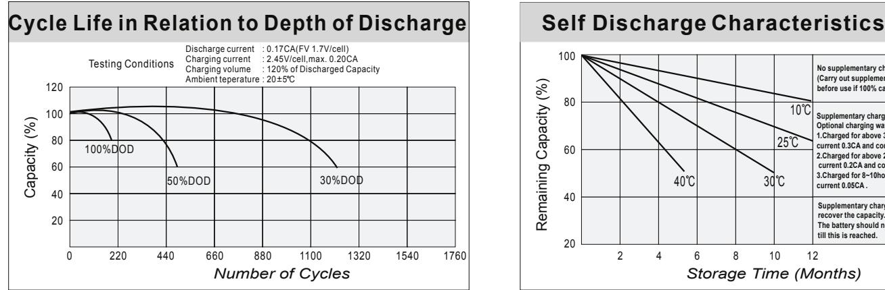
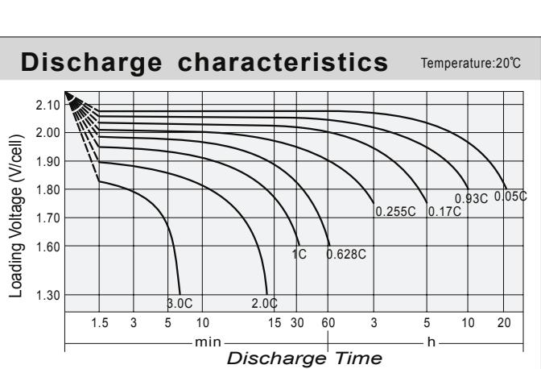
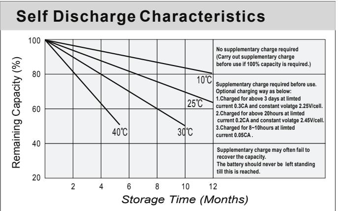

## 12-14 (12V14AH) USL **USL SERIES**

## **General Features**

- Sealed and maintenance free operation.
- Non-Spillable construction design.
- ABS containers and covers(UL94HB, UL94V-0) optional.
- Safety valve installation for explosion proof.
- High quality and high reliability.
- Exceptional deep discharge recovery performance.
- Low self discharge characteristic.
- Flexibility design for multiple install positions.

| Battery Type         | Valve-Regulated,Absorbed Glass Mat(AGM) Technology   |        |                    |                                                            |         |                                    |  |  |  |  |  |
|----------------------|------------------------------------------------------|--------|--------------------|------------------------------------------------------------|---------|------------------------------------|--|--|--|--|--|
| Nomia l Voltage      | 12V                                                  |        |                    |                                                            |         |                                    |  |  |  |  |  |
|                      | 20HR(0.68A,1.8V/cell)                                |        | 10HR(1.26A,1.80V)  | 5HR(2.28A,1.75V)                                           |         | 1HR(8.35A,1.60V)                   |  |  |  |  |  |
| 0 20 C) Capacity( | 13.6AH                                               | 12.6AH |                    | 11.4AH                                                     |         | 8.35AH                             |  |  |  |  |  |
|                      | Length                                               |        | Width              | Height                                                     |         | Total Height                       |  |  |  |  |  |
| Dimensions           | 151mm(5.95inches)                                    |        | 98mm(3.86inches)   | 95mm(3.74inches)                                           |         | 101mm(3.98inches)                  |  |  |  |  |  |
| Approx Weight        | Approx 4.20 kg (9.26lbs)                             |        |                    |                                                            |         |                                    |  |  |  |  |  |
| Internal Resistance  | 0 Full Charged at 20 C : Approx 14mÙ           |        |                    |                                                            |         |                                    |  |  |  |  |  |
| Self Discharge       | 0 3% of capacity declined per month at 20 C    |        |                    |                                                            |         |                                    |  |  |  |  |  |
| Capacity affected by | o 40 C                                            |        | 0 25 C          | 0 0 C                                                   |         | 0 -15 C                         |  |  |  |  |  |
| Temperature(10HR)    | 103%                                                 |        | 100%               | 86%                                                        |         | 65%                                |  |  |  |  |  |
|                      | Cycle use                                            |        |                    | Float use                                                  |         |                                    |  |  |  |  |  |
| Charging Voltage (V) | 0 14.4V~15.0V at 20 C. Temp. Coefficient -30mV/ C |        | 0                  | 0 0 13.5V~13.8V at 20 C.Temp. Coefficient (-20mV/ C) |         |                                    |  |  |  |  |  |
|                      | Max. Discharge Current                               |        |                    | Initial Charging Current                                   |         |                                    |  |  |  |  |  |
| Current              | 210A                                                 |        |                    | Less than 4.2A                                             |         |                                    |  |  |  |  |  |
|                      | Discharge                                            |        |                    | Charging                                                   | Storage |                                    |  |  |  |  |  |
| Operating Temp.Range | 0 0 -15 50 C (5 122 F)                   |        | 0 0 40 C (32 | 0 104 F)                                                |         | 0 0 -15 40 C (5 104 F) |  |  |  |  |  |

## **0 0 Constant Current Discharge (Amperes) at 25 C (77 F ) 0 0 Constant Current Discharge (Amperes) at 2 C F ) Constant Current Discharge (Amperes) at 2 C F ) 0 (68**

| F.V/Time   | 5min | 10min | 15min | 20min | 30min | 45min | 1h   | 2h   | 3h   | 4h   | 5h   | 6h   | 8h   | 10h  | 20h  |
|------------|------|-------|-------|-------|-------|-------|------|------|------|------|------|------|------|------|------|
| 1.85V/cell | 25.3 | 19.4  | 16.1  | 13.9  | 10.8  | 7.93  | 6.69 | 4.00 | 3.13 | 2.54 | 2.07 | 1.82 | 1.47 | 1.22 | 0.67 |
| 1.80V/cell | 34.0 | 24.9  | 19.5  | 16.5  | 12.7  | 9.23  | 7.49 | 4.36 | 3.37 | 2.71 | 2.23 | 1.95 | 1.56 | 1.26 | 0.68 |
| 1.75V/cell | 38.3 | 27.3  | 21.3  | 17.7  | 13.2  | 9.58  | 7.84 | 4.52 | 3.43 | 2.78 | 2.28 | 2.00 | 1.58 | 1.30 | 0.69 |
| 1.70V/cell | 42.2 | 29.8  | 22.7  | 18.6  | 13.7  | 10.0  | 8.09 | 4.64 | 3.52 | 2.85 | 2.34 | 2.05 | 1.60 | 1.32 | 0.70 |
| 1.65V/cell | 46.5 | 32.1  | 24.1  | 19.8  | 14.5  | 10.2  | 8.27 | 4.70 | 3.67 | 2.95 | 2.41 | 2.09 | 1.63 | 1.35 | 0.71 |
| 1.60V/cell | 51.3 | 34.9  | 25.8  | 21.1  | 15.3  | 10.6  | 8.35 | 4.91 | 3.78 | 3.04 | 2.49 | 2.13 | 1.65 | 1.36 | 0.71 |

| 0 0 Constant Power Discharge (Watts) at 20 C (68 F ) |      |       |       |       |       |       |      |      |      |      |      |      |      |      |      |
|---------------------------------------------------------------|------|-------|-------|-------|-------|-------|------|------|------|------|------|------|------|------|------|
| F.V/Time                                                      | 5min | 10min | 15min | 20min | 30min | 45min | 1h   | 2h   | 3h   | 4h   | 5h   | 6h   | 8h   | 10h  | 20h  |
| 1.85V/cell                                                    | 46.3 | 35.9  | 30.1  | 26.3  | 20.5  | 15.3  | 12.9 | 7.76 | 6.10 | 4.97 | 4.07 | 3.57 | 2.89 | 2.42 | 1.33 |
| 1.80V/cell                                                    | 61.5 | 45.4  | 35.8  | 30.6  | 23.9  | 17.6  | 14.4 | 8.42 | 6.52 | 5.28 | 4.34 | 3.82 | 3.06 | 2.50 | 1.34 |
| 1.75V/cell                                                    | 67.9 | 49.1  | 38.7  | 32.6  | 24.6  | 18.1  | 15.0 | 8.69 | 6.62 | 5.38 | 4.44 | 3.91 | 3.11 | 2.56 | 1.35 |
| 1.70V/cell                                                    | 72.7 | 52.3  | 40.7  | 34.0  | 25.4  | 18.7  | 15.4 | 8.89 | 6.79 | 5.51 | 4.55 | 3.99 | 3.15 | 2.61 | 1.38 |
| 1.65V/cell                                                    | 79.0 | 55.9  | 42.9  | 35.8  | 26.6  | 19.0  | 15.6 | 8.97 | 7.05 | 5.68 | 4.66 | 4.06 | 3.19 | 2.66 | 1.40 |
| 1.60V/cell                                                    | 85.1 | 59.3  | 45.2  | 37.8  | 27.9  | 19.7  | 15.7 | 9.31 | 7.23 | 5.84 | 4.79 | 4.14 | 3.21 | 2.68 | 1.40 |

## **Dimensions**

0.02C 0.04C 0.06C 0.08C 0.10C

(%) (A) (V)

Capacity Current Voltage

2.00 2.10 2.20 2.30 2.40

After 50% Discharge After 100% Discharge

*Charging Time (h)* 36322824201612840

Charging Voltage Charging Capacity

Temperature:20 C

Charging Current

