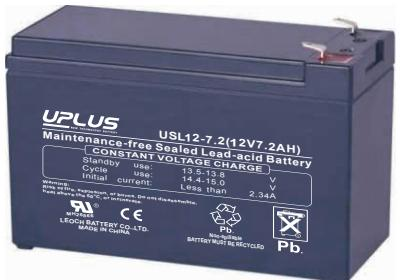
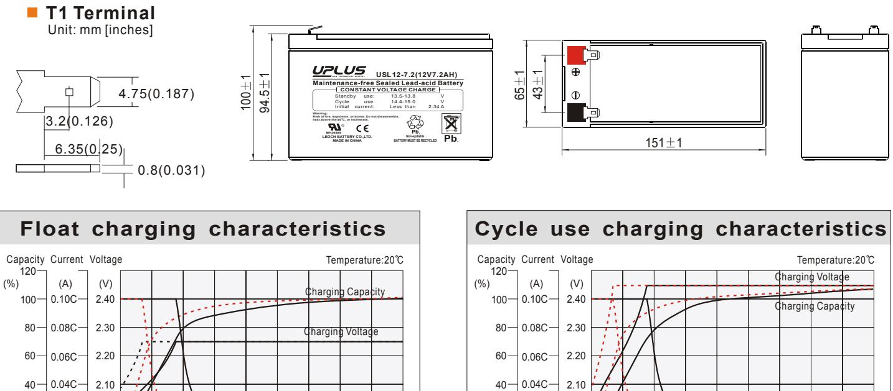
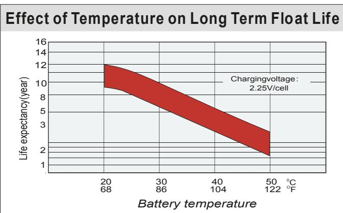
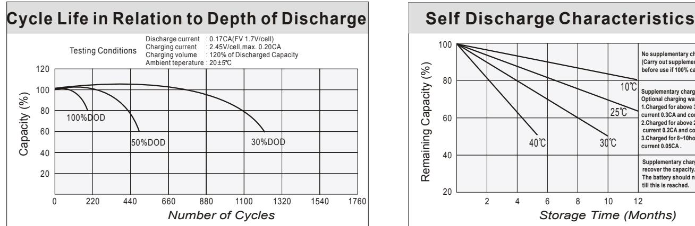
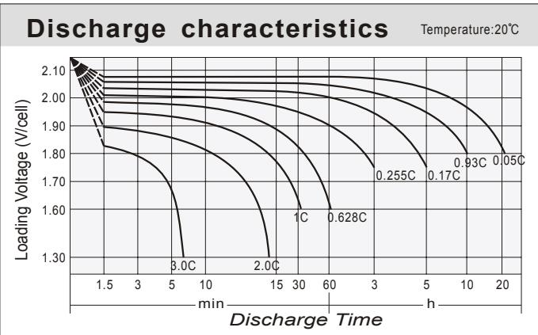
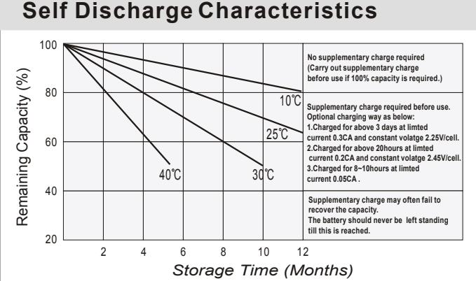

## USL12- (12V AH) **US SERIES** 2 2

## **General Features**

- Sealed and maintenance free operation.
- Non-Spillable construction design.
- ABS containers and covers(UL94HB, UL94V-0) optional.
- Safety valve installation for explosion proof.
- High quality and high reliability.
	- Exceptional deep discharge recovery performance.
- Low self discharge characteristic.
- Flexibility design for multiple install positions.

|--|

| Battery Type         | Valve-Regulated,Absorbed Glass Mat(AGM) Technology   |                          |                    |                                                            |         |                             |  |  |  |  |  |
|----------------------|------------------------------------------------------|--------------------------|--------------------|------------------------------------------------------------|---------|-----------------------------|--|--|--|--|--|
| Nomial Voltage       | 12V                                                  |                          |                    |                                                            |         |                             |  |  |  |  |  |
|                      | 20HR(0.378A,1.8V/cell)                               |                          | 10HR(0.706A,1.80V) | 5HR(1.26A,1.75V)                                           |         | 1HR(4.55A,1.60V)            |  |  |  |  |  |
| 0 20 C) Capacity( | 7.56AH                                               | 7.06AH                   |                    | 6.30AH                                                     |         | 4.55AH                      |  |  |  |  |  |
|                      | Length                                               |                          | Width              | Height                                                     |         | Total Height                |  |  |  |  |  |
| Dimensions           | 151mm(5.95inches)                                    |                          | 65mm(2.56inches)   | 94.5mm(3.72inches)                                         |         | 100mm(3.94inches)           |  |  |  |  |  |
| Approx Weight        |                                                      | Approx 2.45 kg (5.40lbs) |                    |                                                            |         |                             |  |  |  |  |  |
| Internal Resistance  | 0 Full Charged at 20 C : Approx 20mΩ           |                          |                    |                                                            |         |                             |  |  |  |  |  |
| Self Discharge       | 0 3% of capacity declined per month at 20 C    |                          |                    |                                                            |         |                             |  |  |  |  |  |
| Capacity affected by | o 40 C                                            |                          | 0 25 C          | 0 0 C                                                   |         | 0 -15 C                  |  |  |  |  |  |
| Temperature(10HR)    | 103%                                                 |                          | 100%               | 86%                                                        |         | 65%                         |  |  |  |  |  |
|                      | Cycle use                                            |                          |                    | Float use                                                  |         |                             |  |  |  |  |  |
| Charging Voltage (V) | 0 14.4V~15.0V at 20 C. Temp. Coefficient -30mV/ C |                          | 0                  | 0 0 13.5V~13.8V at 20 C.Temp. Coefficient (-20mV/ C) |         |                             |  |  |  |  |  |
|                      | Max. Discharge Current                               |                          |                    | Initial Charging Current                                   |         |                             |  |  |  |  |  |
| Current              | 117A                                                 |                          |                    | Less than 2.34A                                            |         |                             |  |  |  |  |  |
|                      | Discharge                                            |                          |                    | Charging                                                   | Storage |                             |  |  |  |  |  |
| Operating Temp.Range | 0 0 -15 50 C (5 122 F)                   |                          | 0 0 40 C (32 | 0 104 F)                                                | -15     | 0 0 40 C (5 104 F) |  |  |  |  |  |

| 0 0 Constant Current Discharge (Amperes) at 20 C (68 F ) |      |       |       |       |       |       |      |      |      |      |      |      |       |       |       |
|-------------------------------------------------------------------|------|-------|-------|-------|-------|-------|------|------|------|------|------|------|-------|-------|-------|
| F.V/Time                                                          | 5min | 10min | 15min | 20min | 30min | 45min | 1h   | 2h   | 3h   | 4h   | 5h   | 6h   | 8h    | 10h   | 20h   |
| 1.85V/cell                                                        | 17.0 | 12.4  | 10.5  | 8.93  | 6.54  | 4.78  | 3.85 | 2.28 | 1.71 | 1.38 | 1.18 | 1.03 | 0.817 | 0.676 | 0.372 |
| 1.80V/cell                                                        | 20.3 | 14.4  | 11.9  | 9.69  | 7.03  | 5.08  | 4.10 | 2.40 | 1.78 | 1.45 | 1.23 | 1.07 | 0.847 | 0.706 | 0.378 |
| 1.75V/cell                                                        | 22.8 | 15.8  | 12.7  | 10.3  | 7.32  | 5.28  | 4.25 | 2.47 | 1.82 | 1.48 | 1.26 | 1.09 | 0.859 | 0.717 | 0.386 |
| 1.70V/cell                                                        | 24.8 | 16.8  | 13.5  | 10.7  | 7.60  | 5.42  | 4.34 | 2.52 | 1.86 | 1.51 | 1.28 | 1.11 | 0.878 | 0.727 | 0.391 |
| 1.65V/cell                                                        | 27.0 | 17.9  | 14.2  | 11.2  | 7.89  | 5.60  | 4.45 | 2.57 | 1.90 | 1.54 | 1.30 | 1.13 | 0.889 | 0.734 | 0.394 |
| 1.60V/cell                                                        | 28.4 | 18.7  | 14.6  | 11.5  | 8.08  | 5.74  | 4.55 | 2.63 | 1.94 | 1.56 | 1.33 | 1.14 | 0.904 | 0.745 | 0.401 |

| 0 0 Constant Power Discharge (Watts) at 20 C (68 F ) |      |       |       |       |       |       |      |      |      |      |      |      |      |      |       |
|---------------------------------------------------------------|------|-------|-------|-------|-------|-------|------|------|------|------|------|------|------|------|-------|
| F.V/Time                                                      | 5min | 10min | 15min | 20min | 30min | 45min | 1h   | 2h   | 3h   | 4h   | 5h   | 6h   | 8h   | 10h  | 20h   |
| 1.85V/cell                                                    | 32.0 | 23.6  | 20.3  | 17.4  | 12.7  | 9.41  | 7.58 | 4.52 | 3.40 | 2.76 | 2.38 | 2.06 | 1.64 | 1.37 | 0.750 |
| 1.80V/cell                                                    | 38.1 | 27.4  | 22.8  | 18.8  | 13.7  | 9.88  | 8.04 | 4.73 | 3.52 | 2.88 | 2.45 | 2.13 | 1.70 | 1.42 | 0.761 |
| 1.75V/cell                                                    | 42.2 | 29.6  | 24.1  | 19.7  | 14.2  | 10.3  | 8.33 | 4.87 | 3.60 | 2.93 | 2.50 | 2.16 | 1.72 | 1.44 | 0.773 |
| 1.70V/cell                                                    | 45.3 | 31.3  | 25.4  | 20.4  | 14.5  | 10.5  | 8.43 | 4.93 | 3.66 | 2.97 | 2.53 | 2.19 | 1.74 | 1.45 | 0.776 |
| 1.65V/cell                                                    | 48.4 | 32.5  | 26.2  | 21.0  | 14.9  | 10.7  | 8.57 | 4.97 | 3.69 | 3.00 | 2.55 | 2.21 | 1.75 | 1.45 | 0.778 |
| 1.60V/cell                                                    | 49.8 | 33.3  | 26.6  | 21.3  | 15.1  | 10.8  | 8.70 | 5.06 | 3.74 | 3.03 | 2.58 | 2.23 | 1.77 | 1.46 | 0.788 |

## **Dimensions**

0.02C

2.00

After 50% Discharge After 100% Discharge

20

0.02C

2.00

After 50% Discharge After 100% Discharge

20

*Charging Time (h)* 36322824201612840

Charging Current

(Cell) (Cell)

*Charging Time (h)* 36322824201612840

Charging Current

**2**