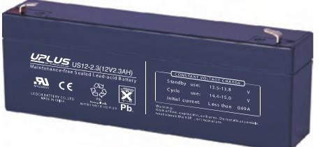
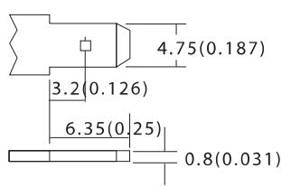
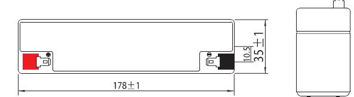
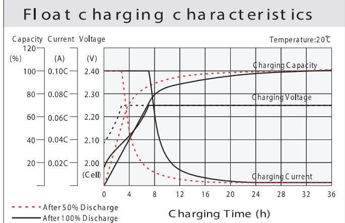
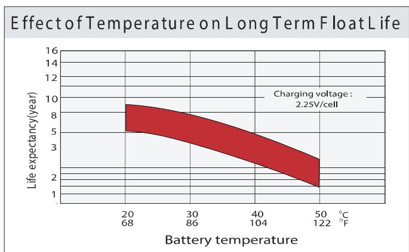
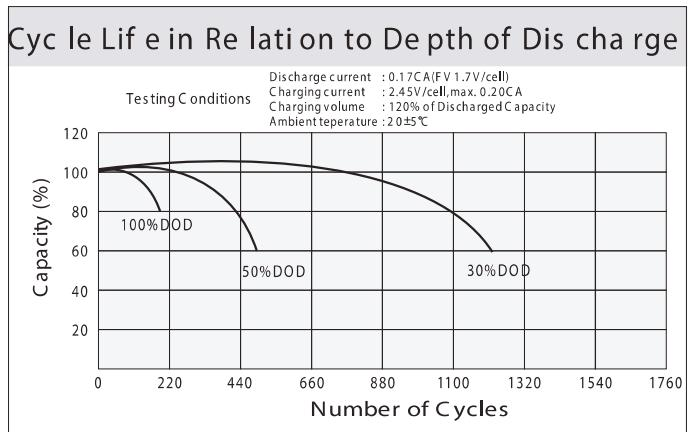
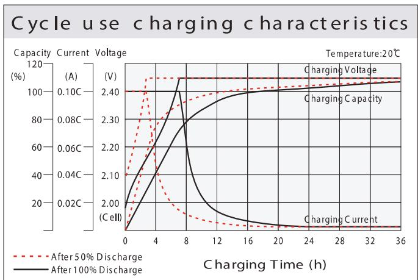
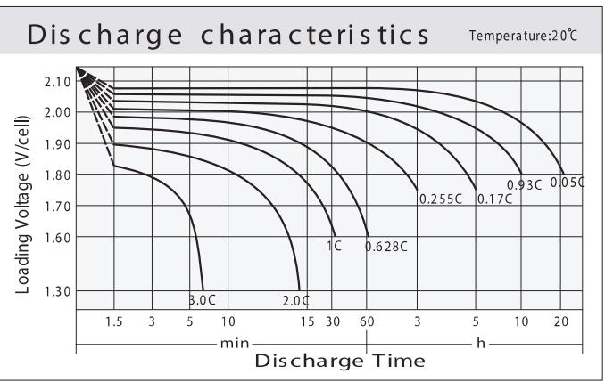
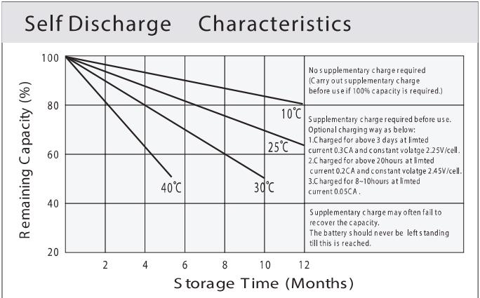

## US SERIES US12-2.3 (12V2.3AH)

## General Features

- ♦ Sealed and maintenance free operation.
- ◆ Non-Spillable construction design.
- ◆ ABS containers and covers(UL94HB, UL94V-0) optional.
- ◆ Safety valve installation for explosion proof.
- ♦ High quality and high reliability.
- ♦ Exceptional deep discharge recovery performance.
- ◆ Low self discharge characteristic.
- ♦ Flexibility design for multiple install positions.

| vds Intertek ETL SEMKO | 9 ISO14001 | ecos ISO9001 | C C 202 tested a Partie |
|---------------------------|---------------|-----------------|----------------------------------|
|---------------------------|---------------|-----------------|----------------------------------|

| Battery Type                                                                                                                                                              |                                                                                                                                                                                                                                      |  | Valve-Requlated,Absorbed |                                                                                                                                                                                                                                                                                                                                                                              |  |                  |  |  |
|---------------------------------------------------------------------------------------------------------------------------------------------------------------------------|--------------------------------------------------------------------------------------------------------------------------------------------------------------------------------------------------------------------------------------|--|--------------------------|------------------------------------------------------------------------------------------------------------------------------------------------------------------------------------------------------------------------------------------------------------------------------------------------------------------------------------------------------------------------------|--|------------------|--|--|
| Nomial Voltage                                                                                                                                                            |                                                                                                                                                                                                                                      |  |                          |                                                                                                                                                                                                                                                                                                                                                                              |  |                  |  |  |
| Capacity( 20 °C) Dimensions Approx Weight Internal Resistance Self Discharge Capacity affected by Temperature (10HR) Charging Voltage (V) Current | 20HR(0.112A,1.8V/cell)                                                                                                                                                                                                               |  |                          | 5HR(0.375A,1.75V)                                                                                                                                                                                                                                                                                                                                                            |  | 1HR(1.36A,1.60V) |  |  |
|                                                                                                                                                                           | 2.24AH                                                                                                                                                                                                                               |  | 2.07AH                   | 1.87AH                                                                                                                                                                                                                                                                                                                                                                       |  | 1.36AH           |  |  |
|                                                                                                                                                                           | Length                                                                                                                                                                                                                               |  | Width                    | Height                                                                                                                                                                                                                                                                                                                                                                       |  | Total Height     |  |  |
|                                                                                                                                                                           | 178mm(7.0inches)                                                                                                                                                                                                                     |  |                          | Glass Mat(AGM) Technology 12V 60mm(2.36inches) 66mm(2.60inches) Approx 1.0 kg (2.21lbs) Full Charged at 20 ℃: Approx 90m U 20 °C 0°C -15°C 86% 65% Float use 13.5V~13.8V at 20 °C.Temp. Coefficient (-20mV/ °C) Initial Charging Current Less than 0.69A Storage Charging 0~40°C (32 ~ 104°F) -15 ~40°C (5 ~ 104°F) |  |                  |  |  |
|                                                                                                                                                                           |                                                                                                                                                                                                                                      |  |                          |                                                                                                                                                                                                                                                                                                                                                                              |  |                  |  |  |
|                                                                                                                                                                           |                                                                                                                                                                                                                                      |  |                          |                                                                                                                                                                                                                                                                                                                                                                              |  |                  |  |  |
|                                                                                                                                                                           |                                                                                                                                                                                                                                      |  |                          |                                                                                                                                                                                                                                                                                                                                                                              |  |                  |  |  |
|                                                                                                                                                                           | 40°C                                                                                                                                                                                                                                 |  | 25°C                     |                                                                                                                                                                                                                                                                                                                                                                              |  |                  |  |  |
|                                                                                                                                                                           | 103%                                                                                                                                                                                                                                 |  | 100%                     |                                                                                                                                                                                                                                                                                                                                                                              |  |                  |  |  |
|                                                                                                                                                                           |                                                                                                                                                                                                                                      |  |                          |                                                                                                                                                                                                                                                                                                                                                                              |  |                  |  |  |
|                                                                                                                                                                           |                                                                                                                                                                                                                                      |  |                          |                                                                                                                                                                                                                                                                                                                                                                              |  |                  |  |  |
|                                                                                                                                                                           |                                                                                                                                                                                                                                      |  |                          |                                                                                                                                                                                                                                                                                                                                                                              |  |                  |  |  |
|                                                                                                                                                                           |                                                                                                                                                                                                                                      |  |                          |                                                                                                                                                                                                                                                                                                                                                                              |  |                  |  |  |
|                                                                                                                                                                           | Discharge                                                                                                                                                                                                                            |  |                          |                                                                                                                                                                                                                                                                                                                                                                              |  |                  |  |  |
|                                                                                                                                                                           | 10HR(0.207A,1.80V) 35mm(1.38inches) 3%  of capacity declined per month at Cycle use 14.4V~15.0V at 20 °C.T emp. Coefficient -30mV/ °C Max. Discharge Current 34.5A Operating T emp.Range -15~50°C (5 ~122°F) |  |                          |                                                                                                                                                                                                                                                                                                                                                                              |  |                  |  |  |

| Cons tant Current Dis charge (A mperes) at 20 °C (6 8 °F ) |  |  |  |  |  |
|------------------------------------------------------------|--|--|--|--|--|
|------------------------------------------------------------|--|--|--|--|--|

| F.V/Tim e    | 5min | 10 min | 15 min | 20 min | 30 min | 45 min | 1 h  | 2h      | 3h    | 4h    | 5h    | 6h    | 8h    | 10h   | 20h   |
|--------------|------|--------|--------|--------|--------|--------|------|---------|-------|-------|-------|-------|-------|-------|-------|
| 1.8 5V /ce   | 4.16 | 3.20   | 2.65   | 2.29   | 1.77   | 1.30   | 1.10 | 0.657   | 0.514 | 0.418 | 0.341 | 0.299 | 0.241 | 0.201 | 0.110 |
| 1.8 0V /ce   | 5.59 | 4.08   | 3.20   | 2.71   | 2.09   | 1.52   | 1.23 | 0.717   | 0.553 | 0.446 | 0.366 | 0.320 | 0.255 | 0.207 | 0.112 |
| 1.7 5V /cell | 6.30 | 4.49   | 3.49   | 2.91   | 2.17   | 1.57   | 1.29 | 0.743   | 0.563 | 0.456 | 0.375 | 0.329 | 0.260 | 0.213 | 0.113 |
| 1.7 0V /cell | 6.93 | 4.89   | 3.73   | 3.06   | 2.26   | 1.64   | 1.33 | 0.762   | 0.579 | 0.468 | 0.385 | 0.336 | 0.264 | 0.217 | 0.115 |
| 1.6 5V /cell | 7.65 | 5.28   | 3.97   | 3.25   | 2.38   | 1.68   | 1.36 | 0.773 / | 0.603 | 0.484 | 0.395 | 0.343 | 0.268 | 0.222 | 0.116 |
| 1.6 0V /ce   | 8.43 | 5.73   | 4.24   | 3.46   | 2.51   | 1.75   | 1.37 | 0.806   | 0.622 | 0.499 | 0.408 | 0.351 | 0.270 | 0.224 | 0.117 |

|               |       |        |         |         |        |        |      |      |      | Co ns tant Power Dis ch ar ge (W atts ) a t 2 0 ℃ (6 8 F ) |       |       |       |       |       |
|---------------|-------|--------|---------|---------|--------|--------|------|------|------|------------------------------------------------------------|-------|-------|-------|-------|-------|
| F.V/Tim e     | 5min  | 10 min | 15 m in | 20 m in | 30 min | 45 min | 1 h  | 2h   | 3h   | 4h                                                         | 5h    | 6h    | 8h    | 10h   | 20h   |
| 1.8 5V /cell  | 7.61  | 5.90   | 4.94    | 4.31    | 3.37   | 2.51   | 2.12 | 1.28 | 1.00 | 0.817                                                      | 0.668 | 0.587 | 0.476 | 0.398 | 0.219 |
| 1.8 0V /ce ll | 10.10 | 7.45   | 5.89    | 5.02    | 3.92   | 2.89   | 2.36 | 1.38 | 1.07 | 0.867                                                      | 0.713 | 0.627 | 0.503 | 0.410 | 0.221 |
| 1.7 5V /cell  | 11.15 | 8.06   | 6.35    | 5.35    | 4.03   | 2.97   | 2.46 | 1.43 | 1.09 | 0.884                                                      | 0.730 | 0.642 | 0.510 | 0.420 | 0.223 |
| 1.7 OV /cell  | 11.94 | 8.58   | 6.69    | 5.58    | 4.18   | 3.08   | 2.53 | 1.46 | 1.12 | 0.905                                                      | 0.747 | 0.655 | 0.517 | 0.429 | 0.226 |
| 1.6 5V /cell  | 12.98 | 9.18   | 7.06    | 5.89    | 4.37   | 3.13   | 2.57 | 1.47 | 1.16 | 0.933                                                      | 0.765 | 0.667 | 0.524 | 0.437 | 0.229 |
| 1.6 OV /cell  | 13.98 | 9.74   | 7.42    | 6.20    | 4.58   | 3.24   | 2.58 | 1.53 | 1.19 | 0.959                                                      | 0.788 | 0.679 | 0.528 | 0.441 | 0.230 |

## Dimen si ons

## ■ T1 Terminal Unit: mm [inches]

| 3(12V2.3AH) aintenance free Sealed L ead acid Battery | CONSTANT VOLTAGE CHARGE Standby 13.5 13.8 450. V Cycle 14.4 15.0 USD: V Initial current: Less than 0.69 A Warning: |  |
|-------------------------------------------------------------|--------------------------------------------------------------------------------------------------------------------------------------------------------|--|
| Chica NAGE NCHWA                                         | Bisk of fire, explosion, or burns. Do not disass emble. heat above the \$0℃, or incinerate.                                                         |  |

