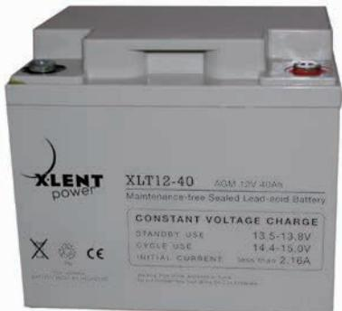
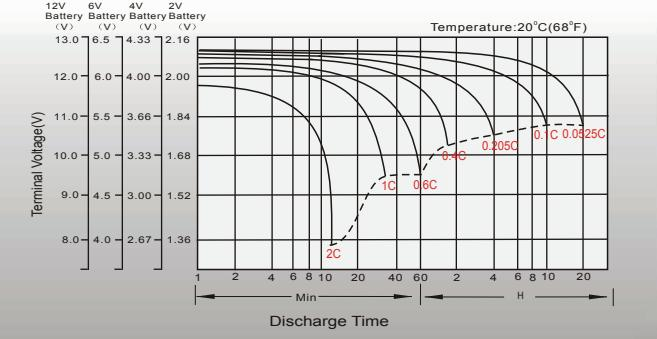
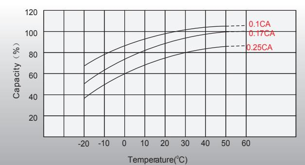
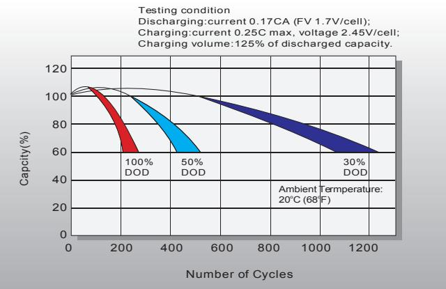
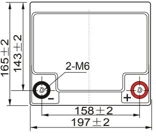
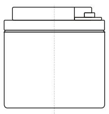
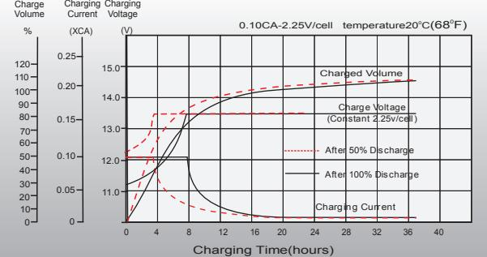
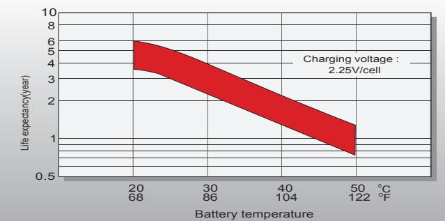
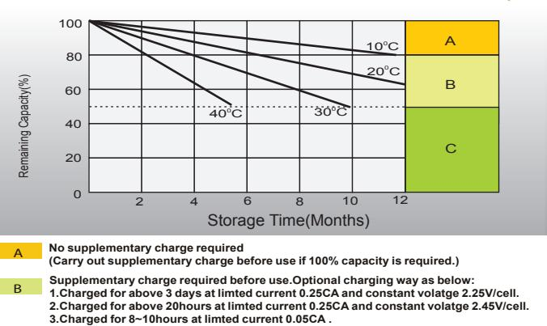

# XLT Series - General Purpose XLT12-40 12V 40.0Ah

| Specifications                |                                                                      |                                                                 |  |  |  |  |  |  |  |
|-------------------------------|----------------------------------------------------------------------|-----------------------------------------------------------------|--|--|--|--|--|--|--|
| Nominal Voltage               | 12V                                                                  |                                                                 |  |  |  |  |  |  |  |
| Nominal Capacity(20HR)        | 40.0AH                                                               |                                                                 |  |  |  |  |  |  |  |
|                               | Length                                                               | 197 2mm (7.76 inches)                                        |  |  |  |  |  |  |  |
|                               | Width                                                                | 165 2mm (6.50 inches)                                        |  |  |  |  |  |  |  |
| Dimension                     | Container Height                                                     | 170 2mm (6.69 inches)                                        |  |  |  |  |  |  |  |
|                               | Total Height (with Terminal)                                         | 170 2mm (6.69 inches)                                        |  |  |  |  |  |  |  |
| Approx Weight                 | Approx 12.2 kg (26.9lbs)                                             |                                                                 |  |  |  |  |  |  |  |
| Terminal                      | T6 / T12                                                             |                                                                 |  |  |  |  |  |  |  |
| Container Material            | ABS                                                                  |                                                                 |  |  |  |  |  |  |  |
|                               | 40.0 AH/1.92A                                                        | 0 0 (20hr ,1.80V/cell,20 C/68 F)                          |  |  |  |  |  |  |  |
|                               | 36.9 AH/3.69A                                                        | 0 0 (10hr,1.80V/cell,20 C/68 F)                           |  |  |  |  |  |  |  |
| Rated Capacity                | 31.3 AH/6.27A                                                        | 0 0 (5hr,1.75V/cell,20 C/68 F)                            |  |  |  |  |  |  |  |
|                               | 28.5 AH/9.49A                                                        | 0 0 (3hr,1.75V/cell,20 C/68 F)                            |  |  |  |  |  |  |  |
|                               | 22.0 AH/22.0A                                                        | 0 0 (1hr,1.60V/cell,20 C/68 F)                            |  |  |  |  |  |  |  |
| Max. Discharge Current        | 456A (5s)                                                            |                                                                 |  |  |  |  |  |  |  |
| Internal Resistance           | Approx 10mÙ                                                          |                                                                 |  |  |  |  |  |  |  |
|                               | 0 Discharge : -15 50 C (5                                      | 0 122 F)                                                     |  |  |  |  |  |  |  |
| Operating Temp.Range          | 0 0 Charge : 0 40 C (32 104 F)                     |                                                                 |  |  |  |  |  |  |  |
|                               | 0 0 Storage : -15 40 C (5 104 F)                      |                                                                 |  |  |  |  |  |  |  |
| Nominal Operating Temp. Range | 0 0 20 3 C (68 5 F )                                     |                                                                 |  |  |  |  |  |  |  |
|                               | Initial Charging Current less than 11.4A.Voltage                     |                                                                 |  |  |  |  |  |  |  |
| Cycle Use                     | 0 0 0 14.25V~14.85V at 20 C(68 F)Temp. Coefficient -30mV/ C |                                                                 |  |  |  |  |  |  |  |
|                               | No limit on Initial Charging Current Voltage                         |                                                                 |  |  |  |  |  |  |  |
| Standby Use                   | 0 0 0 13.4V~13.7V at 20 C(68 F)Temp. Coefficient -20mV/ C   |                                                                 |  |  |  |  |  |  |  |
|                               | o o 40 C (104 F)                                            | 103%                                                            |  |  |  |  |  |  |  |
| Capacity affected by          | o o 25 C ( 77 F)                                            | 100%                                                            |  |  |  |  |  |  |  |
| Temperature                   | o o 0 C ( 32 F)                                             | 86%                                                             |  |  |  |  |  |  |  |
| Self Discharge                | XLNT power XLT series batteries may be stored for up to 6            | months at 20°C (68°F) and then a freshening charge is required. |  |  |  |  |  |  |  |

## Applications

- All purpose
- Uninterruptable Power Supply (UPS)
- Electric Power System (EPS)
- Emergency backup power supply
- Emergency light
- Railway signal
- Aircraft signal
- Alarm and security system
- Electronic apparatus and equipment
- Communication power supply
- DC power supply
- Auto control system

| 0 0 Cons tant Current Dis ch arge (Amperes) at 20 C (68 F ) |       |       |       |       |       |       |      |      |      |      |      |      |      |      |      |
|-------------------------------------------------------------------|-------|-------|-------|-------|-------|-------|------|------|------|------|------|------|------|------|------|
| F.V/Tim e                                                         | 5min  | 10min | 15min | 20min | 30min | 45min | 1h   | 2h   | 3h   | 4h   | 5h   | 6h   | 8h   | 10h  | 20h  |
| 1.85V/cell                                                        | 61.8  | 48.6  | 41.3  | 34.6  | 27.5  | 20.8  | 17.0 | 11.0 | 8.66 | 7.07 | 5.70 | 5.02 | 4.07 | 3.48 | 1.90 |
| 1.80V/cell                                                        | 82.9  | 62.1  | 49.9  | 40.8  | 32.4  | 24.2  | 19.1 | 12.0 | 9.32 | 7.56 | 6.12 | 5.38 | 4.32 | 3.69 | 1.92 |
| 1.75V/cell                                                        | 93.5  | 68.2  | 54.5  | 43.9  | 33.6  | 25.1  | 19.9 | 12.4 | 9.49 | 7.72 | 6.27 | 5.53 | 4.39 | 3.72 | 1.94 |
| 1.70V/cell                                                        | 103.0 | 74.3  | 58.2  | 46.2  | 35.0  | 26.1  | 20.6 | 12.9 | 9.76 | 7.93 | 6.44 | 5.64 | 4.46 | 3.76 | 1.97 |
| 1.65V/cell                                                        | 113.5 | 80.2  | 61.9  | 49.1  | 36.9  | 26.7  | 21.3 | 13.3 | 10.2 | 8.20 | 6.62 | 5.77 | 4.53 | 3.84 | 2.00 |
| 1.60V/cell                                                        | 125.2 | 87.1  | 66.2  | 52.3  | 39.0  | 27.9  | 22.0 | 13.7 | 10.5 | 8.46 | 6.84 | 5.89 | 4.57 | 3.88 | 2.01 |

For higher temperatures the time interval will be shorter.

| 0 0 Cons tant P ower Dis ch arge (Watts ) at 20 C (68 F ) |       |       |       |       |       |       |      |      |      |      |      |      |      |      |      |
|-----------------------------------------------------------------|-------|-------|-------|-------|-------|-------|------|------|------|------|------|------|------|------|------|
| F.V/Tim e                                                       | 5min  | 10min | 15min | 20min | 30min | 45min | 1h   | 2h   | 3h   | 4h   | 5h   | 6h   | 8h   | 10h  | 20h  |
| 1.85V/cell                                                      | 113.0 | 89.7  | 77.1  | 65.1  | 52.3  | 39.9  | 32.8 | 21.3 | 16.9 | 13.8 | 11.2 | 9.86 | 8.04 | 6.89 | 3.76 |
| 1.80V/cell                                                      | 150.0 | 113.3 | 91.9  | 75.9  | 60.8  | 46.1  | 36.6 | 23.1 | 18.1 | 14.7 | 12.0 | 10.5 | 8.50 | 7.28 | 3.79 |
| 1.75V/cell                                                      | 165.5 | 122.5 | 99.1  | 80.8  | 62.6  | 47.4  | 38.1 | 23.8 | 18.3 | 15.0 | 12.2 | 10.8 | 8.63 | 7.35 | 3.82 |
| 1.70V/cell                                                      | 177.2 | 130.5 | 104.4 | 84.3  | 64.8  | 49.1  | 39.2 | 24.7 | 18.8 | 15.3 | 12.5 | 11.0 | 8.74 | 7.41 | 3.89 |
| 1.65V/cell                                                      | 192.7 | 139.5 | 110.1 | 88.9  | 67.8  | 49.9  | 40.2 | 25.3 | 19.5 | 15.8 | 12.8 | 11.2 | 8.86 | 7.56 | 3.94 |
| 1.60V/cell                                                      | 207.6 | 148.0 | 115.8 | 93.7  | 71.1  | 51.7  | 41.4 | 26.0 | 20.0 | 16.2 | 13.2 | 11.4 | 8.93 | 7.62 | 3.96 |

### Dimensi ons

#### T6 Termin al Unit: mm [inches] M6 [0.236] 16 [0.63] 6 [0.236] 170 2 XLT12-40 Maintenance-free Sealed Lead-acid Battery Warning: Risk of fire, explosion or burns. Do not disassemble, heat above 60∞C or incinerate. Non-spillable BATTERY MUST BE RECYCLED Pb. **C O N S TA N T VO LTA G E C H A R G E** S TA N D B Y U S E C Y C L E U S E I N I T I A L C U R R E N T

AGM 12V 40Ah

13.5-13.8V 14.4-15.0V less than 2.16A

Temperatu re E ffects in R elation to B attery Capacity Eff ect of Temperature on L ong T**er m F lo at L if e**

### Cycle Life in Rel atio n to Depth of Dis cha rge Self Discharge Characteristics

#### Discharge Characteristics Float Charging Characteristics

**Supplementary charge may often fail to recover the capacity. The battery should never be left standing till this is reached. C**