# XLT Series - General Purpose XLT12-17 12V 17.5Ah

| Specifications                  |                                                                                                                         |                                                                 |  |  |  |  |  |  |  |
|---------------------------------|-------------------------------------------------------------------------------------------------------------------------|-----------------------------------------------------------------|--|--|--|--|--|--|--|
| Nominal Voltage                 | 12V                                                                                                                     |                                                                 |  |  |  |  |  |  |  |
| Nominal Capacity(20HR)          | 17.5AH                                                                                                                  |                                                                 |  |  |  |  |  |  |  |
|                                 | Length                                                                                                                  | 181.5 1mm (7.14 inches )                                     |  |  |  |  |  |  |  |
|                                 | W idth                                                                                                                  | 77 1mm (3.03 inches )                                        |  |  |  |  |  |  |  |
| Dimens ion                      | C ontainer Height                                                                                                       | 167.5 1mm (6.59 inches )                                     |  |  |  |  |  |  |  |
|                                 | Total Height (with Terminal)                                                                                            | 167.5 1mm (6.59 inches )                                     |  |  |  |  |  |  |  |
| Approx Weight                   | Approx 5.32kg (11.73lbs )                                                                                               |                                                                 |  |  |  |  |  |  |  |
| Terminal                        | T3                                                                                                                      |                                                                 |  |  |  |  |  |  |  |
| Container Ma terial             | ABS                                                                                                                     |                                                                 |  |  |  |  |  |  |  |
|                                 | 17.5 A H/0.873A                                                                                                         | 0 0 (20hr ,1.80V/cell,20 C/68 F)                       |  |  |  |  |  |  |  |
|                                 | 16.2 A H/1.62A                                                                                                          | 0 0 (10hr,1.80V/cell,20 C/68 F)                        |  |  |  |  |  |  |  |
| Rated Cap acity                 | 14.7 A H/2.94A                                                                                                          | 0 0 (5hr,1.75V/cell,20 C/68 F)                         |  |  |  |  |  |  |  |
|                                 | 13.2 A H/4.41A                                                                                                          | 0 0 (3hr,1.75V/cell,20 C/68 F)                         |  |  |  |  |  |  |  |
|                                 | 10.7 A H/10.7A                                                                                                          | 0 0 (1hr,1.60V/cell,20 C/68 F)                         |  |  |  |  |  |  |  |
| Ma x. Dis charge C urrent       | 270A (5s)                                                                                                               |                                                                 |  |  |  |  |  |  |  |
| Internal Re sistance            | Approx 16m Ù                                                                                                            |                                                                 |  |  |  |  |  |  |  |
|                                 | 0 0 Discharge : -15 50 C (5 122 F)                                                                          |                                                                 |  |  |  |  |  |  |  |
| Ope rating Temp. Ra nge         | 0 0 Charge : 0 40 C (32 104 F)                                                                           |                                                                 |  |  |  |  |  |  |  |
|                                 | 0 0 Storage : -15 40 C (5 104 F)                                                                         |                                                                 |  |  |  |  |  |  |  |
| Nominal O perating Temp. R ange | 0 0 20 3 C (68 5 F )                                                                                        |                                                                 |  |  |  |  |  |  |  |
|                                 | Initial C harging C urrent les s than 5 .4A.Voltage                                                                     |                                                                 |  |  |  |  |  |  |  |
| C ycle U s e                    | 0 0 0 14.25V ~14.85V a t 2 0 C (68 F )Temp. C oefficient - 30mV / C                                            |                                                                 |  |  |  |  |  |  |  |
|                                 | No limit on I nitial C harging C urrent V oltage                                                                        |                                                                 |  |  |  |  |  |  |  |
| S tandby U s e                  | 0 0 0 13.4 V ~13.7 V a t 2 0 C (68 F )Temp. C oefcient - 20mV / C                                              |                                                                 |  |  |  |  |  |  |  |
|                                 | o o 40 C (104 F )                                                                                              | 103%                                                            |  |  |  |  |  |  |  |
| C apacity a ffected by          | o o 25 C ( 77 F )                                                                                              | 100%                                                            |  |  |  |  |  |  |  |
| Temperature                     | o o 0 C ( 32 F )                                                                                               | 86%                                                             |  |  |  |  |  |  |  |
| Self Discharge                  | XLNT power XLT series batteries may be stored for up to 6 For higher temperatures the time interval will be shorter. | months at 20°C (68°F) and then a freshening charge is required. |  |  |  |  |  |  |  |

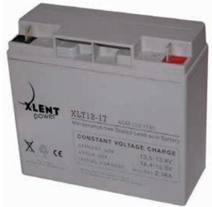

## Applications

- All purpose
- Uninterruptable Power Supply (UPS)
- Electric Power System (EPS)
- Emergency backup power supply
- Emergency light
- Railway signal
- Aircraft signal
- Alarm and security system
- Electronic apparatus and equipment
- Communication power supply
- DC power supply
- Auto control system

| 0 0 Cons tant Current Dis ch arge (Amperes) at 20 C (68 F ) |       |        |        |        |        |        |      |      |      |      |      |      |      |      |       |
|-------------------------------------------------------------------|-------|--------|--------|--------|--------|--------|------|------|------|------|------|------|------|------|-------|
| F.V/ Tim e                                                        | 5m in | 10 min | 15 min | 20 min | 30 min | 45 min | 1h   | 2h   | 3h   | 4h   | 5h   | 6h   | 8h   | 10 h | 20 h  |
| 1.8 5V /ce ll                                                     | 32.6  | 25.0   | 20.7   | 17.9   | 13.8   | 10.2   | 8.60 | 5.14 | 4.02 | 3.27 | 2.67 | 2.34 | 1.88 | 1.57 | 0.864 |
| 1.8 0V /ce ll                                                     | 43.7  | 32.0   | 25.0   | 21.2   | 16.3   | 11.9   | 9.63 | 5.61 | 4.33 | 3.49 | 2.86 | 2.51 | 2.00 | 1.62 | 0.873 |
| 1.7 5V /ce ll                                                     | 49.3  | 35.1   | 27.3   | 22.8   | 17.0   | 12.3   | 10.1 | 5.82 | 4.41 | 3.57 | 2.94 | 2.58 | 2.03 | 1.67 | 0.882 |
| 1.7 0V /ce ll                                                     | 54.3  | 38.3   | 29.2   | 23.9   | 17.7   | 12.8   | 10.4 | 5.96 | 4.53 | 3.66 | 3.01 | 2.63 | 2.06 | 1.70 | 0.897 |
| 1.6 5V /ce ll                                                     | 59.8  | 41.3   | 31.0   | 25.4   | 18.6   | 13.1   | 10.6 | 6.05 | 4.72 | 3.79 | 3.09 | 2.69 | 2.10 | 1.74 | 0.910 |
| 1.6 0V /ce ll                                                     | 66.0  | 44.8   | 33.2   | 27.1   | 19.7   | 13.7   | 10.7 | 6.31 | 4.87 | 3.91 | 3.20 | 2.74 | 2.12 | 1.75 | 0.915 |

| 0 0 Cons tant P ower Dis ch arge (Watts ) at 20 C (68 F ) |       |        |        |        |        |        |      |      |      |      |      |      |      |      |      |
|-----------------------------------------------------------------|-------|--------|--------|--------|--------|--------|------|------|------|------|------|------|------|------|------|
| F.V/ Tim e                                                      | 5m in | 10 min | 15 min | 20 min | 30 min | 45 min | 1h   | 2h   | 3h   | 4h   | 5h   | 6h   | 8h   | 10 h | 20 h |
| 1.8 5V /ce ll                                                   | 59.5  | 46.2   | 38.7   | 33.8   | 26.4   | 19.6   | 16.6 | 10.0 | 7.84 | 6.39 | 5.23 | 4.60 | 3.72 | 3.12 | 1.71 |
| 1.8 0V /ce ll                                                   | 79.1  | 58.3   | 46.1   | 39.3   | 30.7   | 22.6   | 18.5 | 10.8 | 8.39 | 6.79 | 5.58 | 4.91 | 3.94 | 3.21 | 1.73 |
| 1.7 5V /ce ll                                                   | 87.3  | 63.1   | 49.7   | 41.9   | 31.6   | 23.3   | 19.2 | 11.2 | 8.51 | 6.92 | 5.71 | 5.03 | 3.99 | 3.29 | 1.74 |
| 1.7 0V /ce ll                                                   | 93.4  | 67.2   | 52.3   | 43.7   | 32.7   | 24.1   | 19.8 | 11.4 | 8.73 | 7.09 | 5.85 | 5.12 | 4.05 | 3.35 | 1.77 |
| 1.6 5V /ce ll                                                   | 101.6 | 71.8   | 55.2   | 46.1   | 34.2   | 24.5   | 20.1 | 11.5 | 9.06 | 7.30 | 5.99 | 5.22 | 4.10 | 3.42 | 1.79 |
| 1.6 0V /ce ll                                                   | 109.4 | 76.2   | 58.1   | 48.5   | 35.8   | 25.4   | 20.2 | 12.0 | 9.29 | 7.51 | 6.16 | 5.32 | 4.13 | 3.45 | 1.80 |

### Dimensions

# ■ T3 Terminal Unit: mm [inches] 14 [0.55 1]

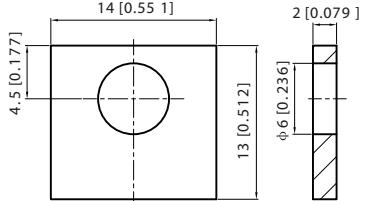

Discharge Characteristics

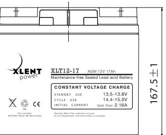

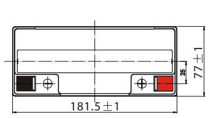

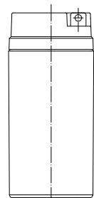

#### Float Charging Characteristics

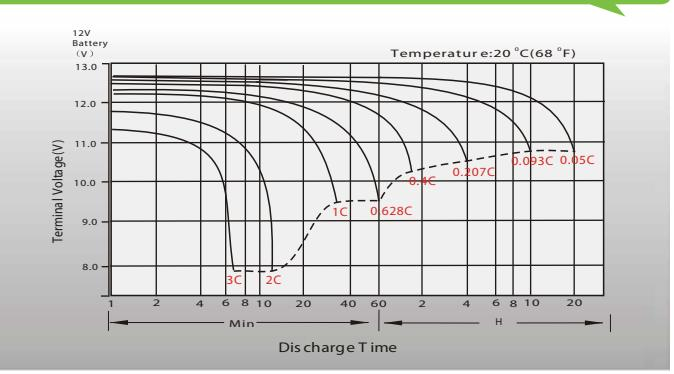

Temperature Effects in Relation to Battery Capacity

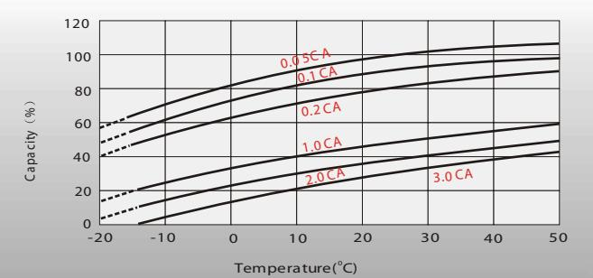

#### Cycle Life in Relation to Depth of Discharge

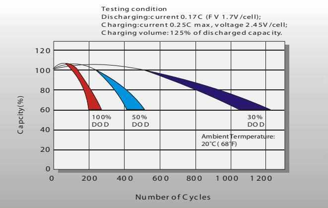

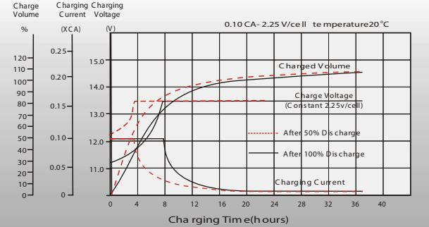

#### Effect of Temperature on Long Term Float L ife

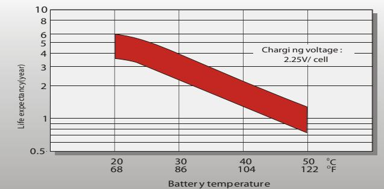

#### Self Discharge Characteristics

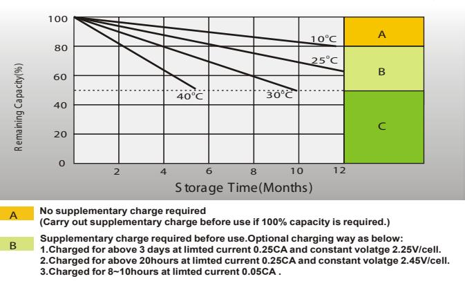

Supplementary charge may often fail to recover the capacity
The battery should never be left standing till this is reached.