# XLT Series - General Purpose XLT12-12 12V 12Ah

| Specifications                |                                                                      |                                                                                                                              |  |  |  |  |  |  |
|-------------------------------|----------------------------------------------------------------------|------------------------------------------------------------------------------------------------------------------------------|--|--|--|--|--|--|
| Nominal Voltage               | 12V                                                                  |                                                                                                                              |  |  |  |  |  |  |
| Nominal Capacity(20HR)        | 12.00AH                                                              |                                                                                                                              |  |  |  |  |  |  |
|                               | Length                                                               | 151 1mm (5.95 inches)                                                                                                     |  |  |  |  |  |  |
|                               | Width                                                                | 98 1mm (3.86 inches)                                                                                                      |  |  |  |  |  |  |
| Dimension                     | Container Height                                                     | 95 1mm (3.74 inches)                                                                                                      |  |  |  |  |  |  |
|                               | Total Height (with Terminal) 101 1mm (3.98 inches)             |                                                                                                                              |  |  |  |  |  |  |
| Approx Weight                 | Approx 3.56 kg (7.85lbs)                                             |                                                                                                                              |  |  |  |  |  |  |
| Terminal                      | T1 / T2                                                              |                                                                                                                              |  |  |  |  |  |  |
| Container Material            | ABS                                                                  |                                                                                                                              |  |  |  |  |  |  |
|                               | 12.00 AH/0.582A                                                      | 0 0 (20hr ,1.80V/cell,20 C/68 F)                                                                                       |  |  |  |  |  |  |
|                               | 10.8 AH/1.08A                                                        | 0 0 (10hr,1.80V/cell,20 C/68 F)                                                                                        |  |  |  |  |  |  |
| Rated Capacity                | 9.80AH/1.96A                                                         | 0 0 (5hr,1.75V/cell,20 C/68 F)                                                                                         |  |  |  |  |  |  |
|                               | 8.82 AH/2.94A                                                        | 0 0 (3hr,1.75V/cell,20 C/68 F)                                                                                         |  |  |  |  |  |  |
|                               | 7.16AH/7.16A                                                         | 0 0 (1hr,1.60V/cell,20                                                                                                 |  |  |  |  |  |  |
| Max. Discharge Current        | 180A (5s)                                                            |                                                                                                                              |  |  |  |  |  |  |
| Internal Resistance           | Approx 14mÙ                                                          |                                                                                                                              |  |  |  |  |  |  |
|                               | 0 Discharge : -15 50 C (5                                      | 0 122 F)                                                                                                                  |  |  |  |  |  |  |
| Operating Temp.Range          | 0 0 Charge : 0 40 C (32 104 F)                     |                                                                                                                              |  |  |  |  |  |  |
|                               | 0 0 Storage : -15 40 C (5 104 F)                      |                                                                                                                              |  |  |  |  |  |  |
| Nominal Operating Temp. Range | 0 0 20 3 C (68 5 F )                                     |                                                                                                                              |  |  |  |  |  |  |
|                               | Initial Charging Current less than 3.6A.Voltage                      |                                                                                                                              |  |  |  |  |  |  |
| Cycle Use                     | 0 0 0 14.25V~14.85V at 20 C(68 F)Temp. Coefficient -30mV/ C |                                                                                                                              |  |  |  |  |  |  |
|                               | No limit on Initial Charging Current Voltage                         |                                                                                                                              |  |  |  |  |  |  |
| Standby Use                   | 0 0 0 13.4V~13.7V at 20 C(68 F)Temp. Coefficient -20mV/ C   |                                                                                                                              |  |  |  |  |  |  |
|                               | o o 40 C (104 F)                                            | 103%                                                                                                                         |  |  |  |  |  |  |
| Capacity affected by          | o o 25 C ( 77 F)                                            | 100%                                                                                                                         |  |  |  |  |  |  |
| Temperature                   | o o 0 C ( 32 F)                                             | 86%                                                                                                                          |  |  |  |  |  |  |
| Self Discharge                |                                                                      | XLNT power XLT series batteries may be stored for up to 6 months at 20°C (68°F) and then a freshening charge is required. |  |  |  |  |  |  |

months at 20°C (68°F) and then a freshening charge is required. For higher temperatures the time interval will be shorter.

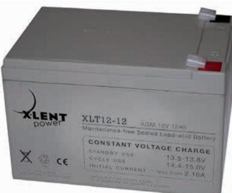

## Applications

- All purpose
- Uninterruptable Power Supply (UPS)
- Electric Power System (EPS)
- Emergency backup power supply
- Emergency light
- Railway signal
- Aircraft signal
- Alarm and security system
- Electronic apparatus and equipment
- Communication power supply
- DC power supply
- Auto control system

| 0 0 Cons tant Current Dis ch arge (Amperes) at 20 C (68 F ) |      |       |       |       |       |       |      |      |      |      |      |      |      |      |       |
|-------------------------------------------------------------------|------|-------|-------|-------|-------|-------|------|------|------|------|------|------|------|------|-------|
| F.V/Tim e                                                         | 5min | 10min | 15min | 20min | 30min | 45min | 1h   | 2h   | 3h   | 4h   | 5h   | 6h   | 8h   | 10h  | 20h   |
| 1.85V/cell                                                        | 21.7 | 16.7  | 13.8  | 11.9  | 9.23  | 6.80  | 5.73 | 3.43 | 2.68 | 2.18 | 1.78 | 1.56 | 1.26 | 1.05 | 0.576 |
| 1.80V/cell                                                        | 29.1 | 21.3  | 16.7  | 14.1  | 10.9  | 7.91  | 6.42 | 3.74 | 2.88 | 2.33 | 1.91 | 1.67 | 1.33 | 1.08 | 0.582 |
| 1.75V/cell                                                        | 32.9 | 23.4  | 18.2  | 15.2  | 11.3  | 8.21  | 6.72 | 3.88 | 2.94 | 2.38 | 1.96 | 1.72 | 1.36 | 1.11 | 0.588 |
| 1.70V/cell                                                        | 36.2 | 25.5  | 19.5  | 16.0  | 11.8  | 8.54  | 6.93 | 3.97 | 3.02 | 2.44 | 2.01 | 1.75 | 1.38 | 1.13 | 0.598 |
| 1.65V/cell                                                        | 39.9 | 27.5  | 20.7  | 17.0  | 12.4  | 8.75  | 7.09 | 4.03 | 3.15 | 2.53 | 2.06 | 1.79 | 1.40 | 1.16 | 0.606 |
| 1.60V/cell                                                        | 44.0 | 29.9  | 22.1  | 18.1  | 13.1  | 9.12  | 7.16 | 4.20 | 3.24 | 2.61 | 2.13 | 1.83 | 1.41 | 1.17 | 0.610 |

| 0 0 Cons tant P ower Dis ch arge (Watts ) at 20 C (68 F ) |      |       |       |       |       |       |      |      |      |      |      |      |      |      |      |
|-----------------------------------------------------------------|------|-------|-------|-------|-------|-------|------|------|------|------|------|------|------|------|------|
| F.V/Tim e                                                       | 5min | 10min | 15min | 20min | 30min | 45min | 1h   | 2h   | 3h   | 4h   | 5h   | 6h   | 8h   | 10h  | 20h  |
| 1.85V/cell                                                      | 39.7 | 30.8  | 25.8  | 22.5  | 17.6  | 13.1  | 11.1 | 6.65 | 5.23 | 4.26 | 3.48 | 3.06 | 2.48 | 2.08 | 1.14 |
| 1.80V/cell                                                      | 52.7 | 38.9  | 30.7  | 26.2  | 20.4  | 15.1  | 12.3 | 7.21 | 5.59 | 4.53 | 3.72 | 3.27 | 2.62 | 2.14 | 1.15 |
| 1.75V/cell                                                      | 58.2 | 42.0  | 33.1  | 27.9  | 21.1  | 15.5  | 12.8 | 7.45 | 5.67 | 4.61 | 3.81 | 3.35 | 2.66 | 2.19 | 1.16 |
| 1.70V/cell                                                      | 62.3 | 44.8  | 34.9  | 29.1  | 21.8  | 16.1  | 13.2 | 7.62 | 5.82 | 4.72 | 3.90 | 3.42 | 2.70 | 2.24 | 1.18 |
| 1.65V/cell                                                      | 67.7 | 47.9  | 36.8  | 30.7  | 22.8  | 16.3  | 13.4 | 7.69 | 6.04 | 4.87 | 3.99 | 3.48 | 2.73 | 2.28 | 1.20 |
| 1.60V/cell                                                      | 72.9 | 50.8  | 38.7  | 32.4  | 23.9  | 16.9  | 13.5 | 7.98 | 6.20 | 5.01 | 4.11 | 3.54 | 2.75 | 2.30 | 1.21 |

### Dimensi ons

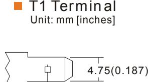

3.2(0.126) 6.35(0.25)

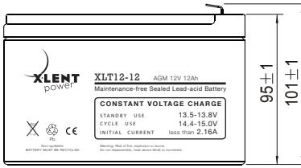

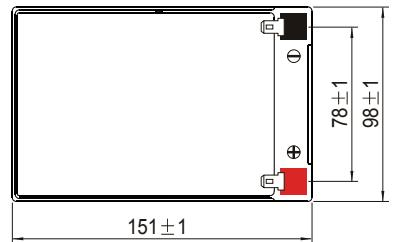

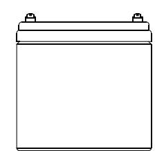

### Discharge Characteristics Float Charging Characteristics

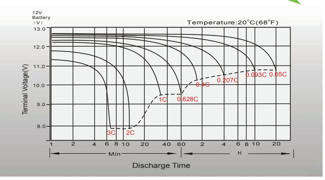

0.8(0.031)

Temperatu re E ffects in R elation to B attery Capacity Eff ect of Temperature on L ong T**er m F lo at L if e**

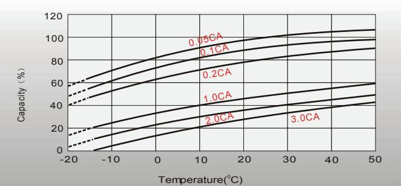

### Cycle Life in Rel atio n to Depth of Dis cha rge Self Discharge Characteristics

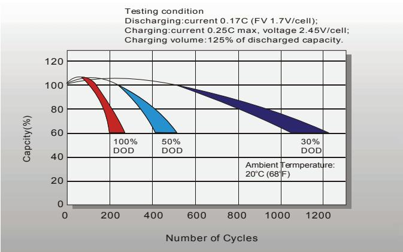

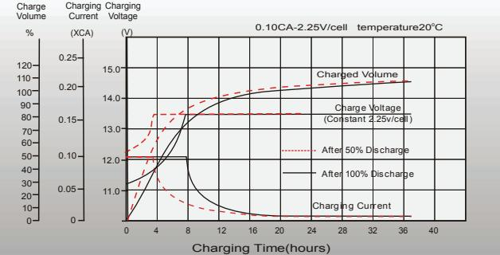

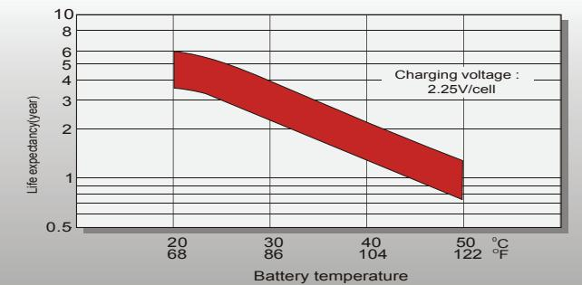

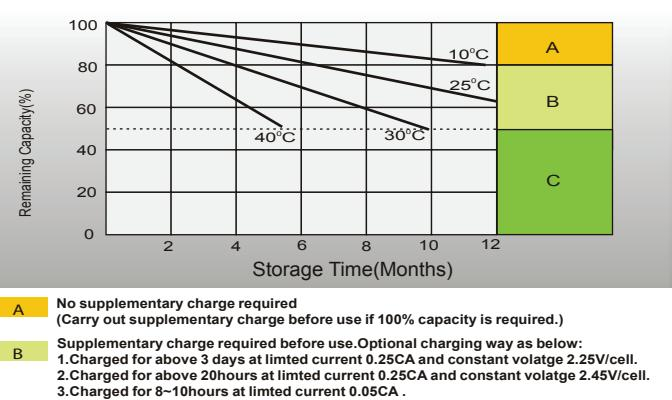

**Supplementary charge may often fail to recover the capacity. C**

**The battery should never be left standing till this is reached.**