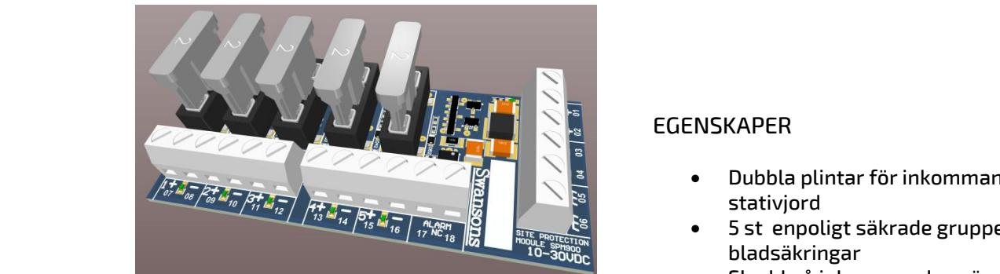
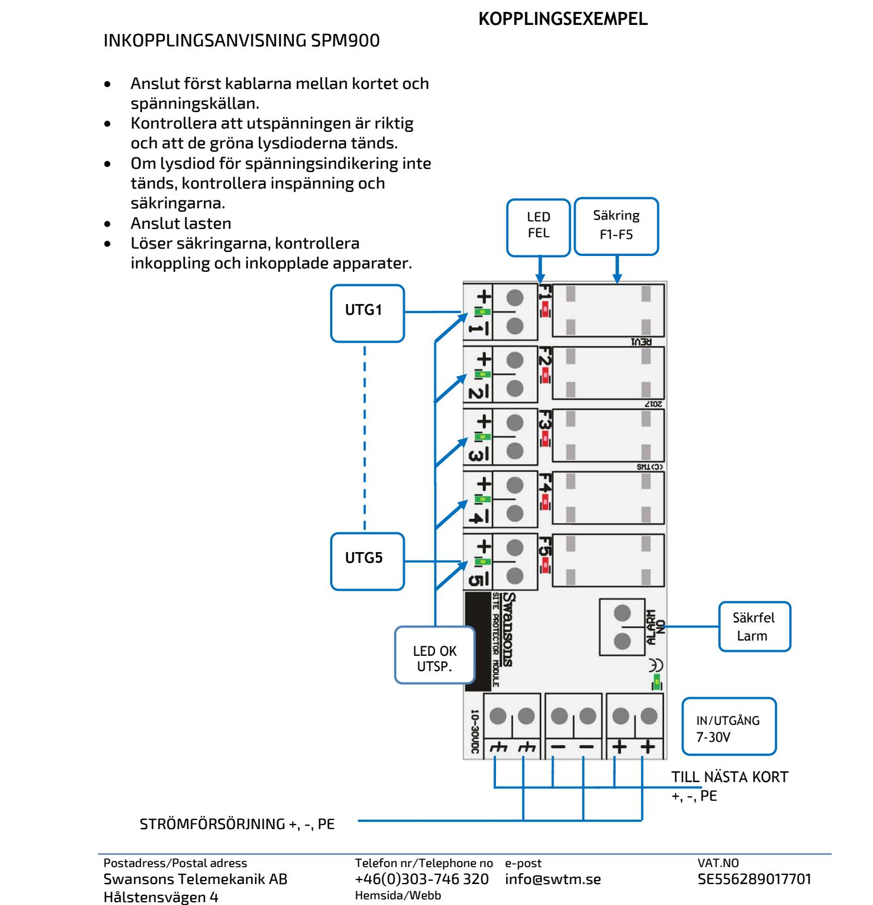
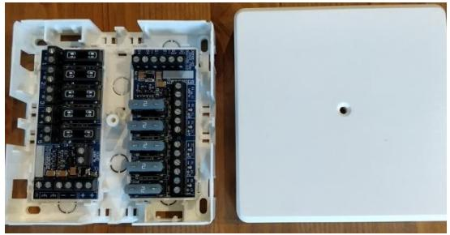
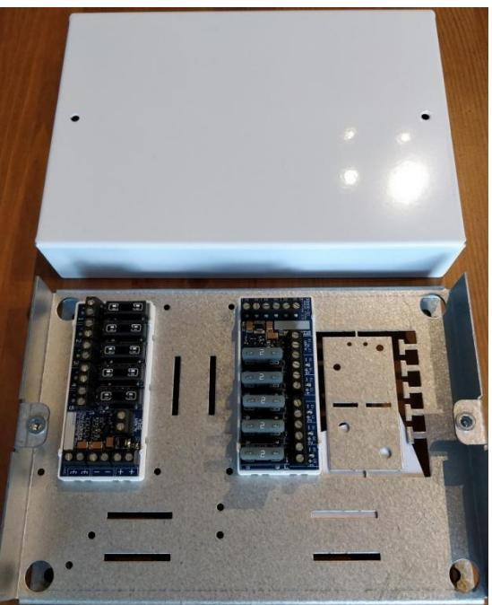

## **SPM - serien SITE PROTECTION MODULE**

 **SM40** 

## BESKRIVNING SPM900

Site Protection Module är ett säkringskort med utökade säkerhetsfunktioner för att säkerställa driften och minimera driftstörningar, på säkerhetsanläggningar.

#### Montage

L-modul eller Din-skena, bara att snäppa in i strömförsörjningsaggregat eller kapslingar med anpassad hålbild. (se blad 3)

#### Funktion

SMP900 har 5st grupper, som är försedda med 2A bladsäkringar. Kan vid behov bytas till max 5A säkringar, dock får det totala strömuttaget på kortet inte överstiga 10A.

Varje säkringsgrupp har separat LED-indikering av utspänningen. Utlöst säkring indikeras med att den gröna lysdioden för gruppen slocknar och den röda tänds, samtidigt som larmreläet sluts.

CE-märkt enligt EN61000-1-2 och EN61000-3-4

## EGENSKAPER

- Dubbla plintar för inkommande +, och stativjord
- 5 st enpoligt säkrade grupper ut, bladsäkringar
- Skydd på inkommande spänning (gnistgap, högspänningskond, varistor)
- Skydd på vidare kopplad spänning (gnistgap)
- Säkringslarm med solidstate relä som är slutet om spänning över 5V och alla säkringar hela, klarar både AC/DC upp till 200mA. Galvaniskt frånkopplat - Nc
- Grön LED vid utgångsplint som lyser om säkring hel.
- Röd LED vid säkring som lyser när säkring är utlöst.
- Märkyta för att kunna skriva position/ID på kort

#### TEKNISKA DATA Inspänning DC 7-30VDC Avsäkring grupp 2A max 5A

Max ström/kort 10A

| E-Nummer | Typ        | Beskrivning                                      | Mått H x B x D (mm) |
|----------|------------|--------------------------------------------------|------------------------|
| 5257223  | SPM900-L   | SITE PROTECTION MODUL 5GRUPP 1-POL 7-30VDC       | 37x86x25               |
| 5257224  | SPM900-DIN | SITE PROTECTION MODUL 5GRUPP 1-POL 7-30VDC       | 37x86x25               |
| 5257243  | SPM900-DS  | Plast kapsling med plats för ett eller två kort. | 120x120x40             |
| 5257244  | SPM900-ENC | Plåt kapsling med plats för ett till fem kort    | 216x155x45             |
|          | SPM900-SAB | Sabotagekontakt för SPM900-DS                    | 120x120x40             |

Postadress/Postal adress Swansons Telemekanik AB Hålstensvägen 4 SE-446 37 Älvängen

Telefon nr/Telephone no +46(0)303-746 320 Hemsida/Webb www.swtm.se e-post info@swtm.se VAT.NO SE556289017701

# **SPM - serien SITE PROTECTION MODULE**

SE-446 37 Älvängen

www.swtm.se

## **SPM - serien SITE PROTECTION MODULE**

## KAPSLINGAR TILL SPM900  **SM40**

Kapslingar anpassade för ett eller flera säkringskort. Ger ett enkelt, säkert och snyggt montage. Färdigstansade hålbilder för Lmoduler, för montage i olika positioner.  **Strömförsörjning med plats för batteri**

## SPM900 DS-DOOR-PLASTIC

Plast kapsling med plats för ett eller två SPM900 kort. Utstansade hål för kabelgenomförningar. (120x120x40)

## SPM900 ENC-METAL

Plåt kapsling med plats för upp till 5 kort. Kan kompletteras med sabotagebrytare. Mycket lämplig till framförallt när det kommer till SSFklassade installationer. Utstansade hål för kabelgenomförningar. (216x155x45):

Postadress/Postal adress Swansons Telemekanik AB Hålstensvägen 4 SE-446 37 Älvängen

Telefon nr/Telephone no +46(0)303-746 320 Hemsida/Webb www.swtm.se e-post info@swtm.se VAT.NO SE556289017701